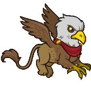
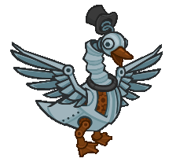
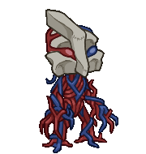
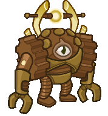
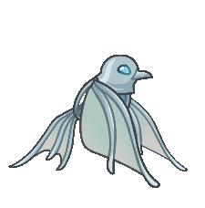

[Back to Main](index.md)

# Familiars

Upcoming familiars that are found in future premiums or simply listed as unavailable at the moment.

    
        
            ID: 238**Skystrike the Baby Griffon**Oh brother, he thinks I'm his mother! I guess I'll have to teach him that Uni isn't food.
        
        
            Skystrike the Baby Griffon
        
        
            Stone Golem Eric Theme Pack
        
        
            3,830p
        
        
            01 Jan 2025
        
    
    
        
            ID: 239**Ganderloo the Clockwork Goose**It can't be bargained with. It can't be reasoned with.
        
        
            Ganderloo the Clockwork Goose
        
        
            Ganderloo the Clockwork Goose Familiar Pack
        
        
            2,380p
        
        
            08 Jan 2025
        
    
    
        
            ID: 242**Mercy the Vein Golem**I used to be an ancient titan's capillaries! Now I'm the cutest little bean!
        
        
            Mercy the Vein Golem
        
        
            Crystal Titan Mehen Theme Pack
        
        
            3,830p
        
        
            08 Jan 2025
        
    
    
        
            ID: 240**Hexton Modron**The march MUST continue!
        
        
            Hexton Modron
        
        
            Hexton Modron Familiar Pack
        
        
            2,380p
        
        
            22 Jan 2025
        
    
    
        
            ID: 241**Aria the Metallic Warbler**Their telepathic bond lets them summon their dragon creators in case of dire need.
        
        
            Aria the Metallic Warbler
        
        
            Aria the Metallic Warbler Familiar Pack
        
        
            1,680p
        
        
            29 Jan 2025
        
    
    
        
            ID: 245**Dendria the Orchid Mantis**
        
        
            Dendria the Orchid Mantis
        
        
            Tuxedo Kalix Theme Pack
        
        
            3,830p
        
        
            05 Feb 2025
        
    
    
        
            ID: 247**Meepo the Kobold**
        
        
            Meepo the Kobold
        
        
            Meepo the Kobold Familiar Pack
        
        
            1,680p
        
        
            12 Feb 2025
        
    
    
        
            ID: 246**Nub-ub the Mouse**This simple mouse, often mistaken for the God Ubtao, is probably just a simple mouse.
        
        
            Nub-ub the Mouse
        
        
            Dashing Ishi Theme Pack
        
        
            3,830p
        
        
            12 Feb 2025
        
    
    
        
            ID: 248**Krynn the Crystal Dragon**
        
        
            Krynn the Crystal Dragon
        
        
            Krynn the Crystal Dragon Familiar Pack
        
        
            2,380p
        
        
            26 Feb 2025
        
    
    
        
            ID: 237**Rumble the Angry Flumph**A flumph glows faintly, reflecting its moods in its color. Crimson means anger. Beware the angry flumph!
        
        
            Rumble the Angry Flumph
        
        
            None
        
        
            ???
        
        
            ???
        
    

[Back to Top](#top)

*Last Modified: {{ site.time }}*