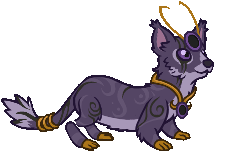
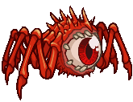
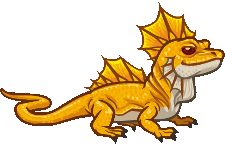
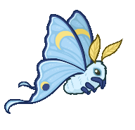

[Back to Main](index.md)

# Familiars

Upcoming familiars that are found in future premiums or simply listed as unavailable at the moment.

    
        
            ID: 232**Armored Owlbear**
        
        
            Armored Owlbear
        
        
            Moonlight Halsin Theme Pack
        
        
            3,830p
        
        
            04 Dec 2024
        
    
    
        
            ID: 235**Sharran Weasel**
        
        
            Sharran Weasel
        
        
            Avatar of Shar Familiar Pack
        
        
            1,680p
        
        
            04 Dec 2024
        
    
    
        
            ID: 244**Arachneye the Spider**
        
        
            Arachneye the Spider
        
        
            3x Choose Your Champion Starter Pack
        
        
            0p
        
        
            11 Dec 2024
        
    
    
        
            ID: 233**Sharran Viper**
        
        
            Sharran Viper
        
        
            Sharran Stoki Theme Pack
        
        
            3,830p
        
        
            11 Dec 2024
        
    
    
        
            ID: 243**Skitters the Lizard**
        
        
            Skitters the Lizard
        
        
            Tanking & Healing Starter Pack
        
        
            0p
        
        
            11 Dec 2024
        
    
    
        
            ID: 236**Crescent the Lunar Moth**
        
        
            Crescent the Lunar Moth
        
        
            Crescent the Lunar Moth Familiar Pack
        
        
            840p
        
        
            26 Dec 2024
        
    
    
        
            ID: 238**Skystrike the Baby Griffon**
        
        
            Skystrike the Baby Griffon
        
        
            Stone Golem Eric Theme Pack
        
        
            3,830p
        
        
            01 Jan 2025
        
    
    
        
            ID: 239**Ganderloo the Clockwork Goose**
        
        
            Ganderloo the Clockwork Goose
        
        
            Ganderloo the Clockwork Goose Familiar Pack
        
        
            2,380p
        
        
            08 Jan 2025
        
    
    
        
            ID: 242**Mercy the Vein Golem**
        
        
            Mercy the Vein Golem
        
        
            Crystal Titan Mehen Theme Pack
        
        
            3,830p
        
        
            08 Jan 2025
        
    
    
        
            ID: 240**Hexton Modron**
        
        
            Hexton Modron
        
        
            Hexton Modron Familiar Pack
        
        
            2,380p
        
        
            22 Jan 2025
        
    
    
        
            ID: 241**Aria the Metallic Warbler**
        
        
            Aria the Metallic Warbler
        
        
            Aria the Metallic Warbler Familiar Pack
        
        
            1,680p
        
        
            29 Jan 2025
        
    
    
        
            ID: 237**Rumble the Angry Flumph**
        
        
            Rumble the Angry Flumph
        
        
            None
        
        
            ???
        
        
            ???
        
    

[Back to Top](#top)

*Last Modified: {{ site.time }}*