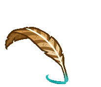
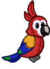
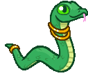
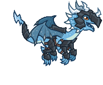
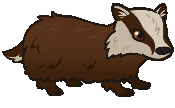
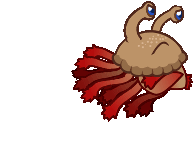

[Back to Main](index.md)

# Familiars

Upcoming familiars that are found in future premiums or simply listed as unavailable at the moment.

    
        
            ID: 250**Volo's Trusty Quill**If there is anything in the world worth knowing, I assure you, I do. ~ Volo
        
        
            Volo's Trusty Quill
        
        
            Privateer Volo Theme Pack
        
        
            3,830p
        
        
            05 Mar 2025
        
    
    
        
            ID: 251**Feathers the Animated Parrot**Uni No! SQUAWK Uni No!
        
        
            Feathers the Animated Parrot
        
        
            Swashbuckler Sheila Theme Pack
        
        
            3,830p
        
        
            12 Mar 2025
        
    
    
        
            ID: 252**Jade the Snake**I snuck back to Sigil in one of Windfall's sackssss.
        
        
            Jade the Snake
        
        
            Jade the Snake Familiar Pack
        
        
            840p
        
        
            26 Mar 2025
        
    
    
        
            ID: 253**Loot the Weasel**Has larceny ever looked this cute?
        
        
            Loot the Weasel
        
        
            Frost Giant Beadle Theme Pack
        
        
            3,830p
        
        
            02 Apr 2025
        
    
    
        
            ID: 254**Tackle the White Wolf**A fierce protector with a healthy appetite.
        
        
            Tackle the White Wolf
        
        
            Frost Giant Grimm Theme Pack
        
        
            3,830p
        
        
            02 Apr 2025
        
    
    
        
            ID: 255**Beacon the Giant Fire Beetle**
        
        
            Beacon the Giant Fire Beetle
        
        
            Beacon the Giant Fire Beetle Familiar Pack
        
        
            1,680p
        
        
            09 Apr 2025
        
    
    
        
            ID: 256**Wazzik the Madcap**
        
        
            Wazzik the Madcap
        
        
            Wazzik the Madcap Familiar Pack
        
        
            2,380p
        
        
            23 Apr 2025
        
    
    
        
            ID: 257**Pepper the Baby Black Dragon**
        
        
            Pepper the Baby Black Dragon
        
        
            Pepper the Baby Black Dragon Familiar Pack
        
        
            1,680p
        
        
            30 Apr 2025
        
    
    
        
            ID: 258**Mango the Hippocamp**
        
        
            Mango the Hippocamp
        
        
            Tempest Noble Vlithryn Theme Pack
        
        
            3,830p
        
        
            07 May 2025
        
    
    
        
            ID: 259**Chase the Spaniel**
        
        
            Chase the Spaniel
        
        
            Nomad Yorven Theme Pack
        
        
            3,830p
        
        
            14 May 2025
        
    
    
        
            ID: 260**Spark the Living Lightning Bolt**
        
        
            Spark the Living Lightning Bolt
        
        
            Spark the Living Lightning Bolt Familiar Pack
        
        
            2,380p
        
        
            14 May 2025
        
    
    
        
            ID: 261**Clawfoot the Dinosaur**
        
        
            Clawfoot the Dinosaur
        
        
            Clawfoot the Dinosaur Familiar Pack
        
        
            1,680p
        
        
            21 May 2025
        
    
    
        
            ID: 262**Virtue the Valenar Foal**
        
        
            Virtue the Valenar Foal
        
        
            Virtue the Valenar Foal Familiar Pack
        
        
            840p
        
        
            28 May 2025
        
    
    
        
            ID: 249**Clove the Badger**He's on the hunt, best leave him alone till he finds that crow.
        
        
            Clove the Badger
        
        
            None
        
        
            ???
        
        
            ???
        
    
    
        
            ID: 237**Rumble the Angry Flumph**A flumph glows faintly, reflecting its moods in its color. Crimson means anger. Beware the angry flumph!
        
        
            Rumble the Angry Flumph
        
        
            None
        
        
            ???
        
        
            ???
        
    

[Back to Top](#top)

*Last Modified: {{ site.time }}*