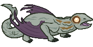
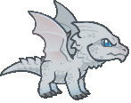
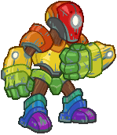
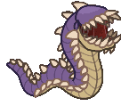
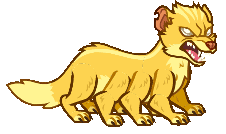
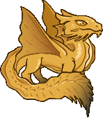
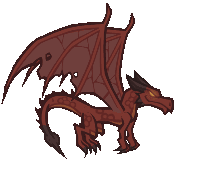
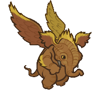

[Back to Main](index.md)

# Familiars

Upcoming familiars that are found in future premiums or simply listed as unavailable at the moment.

    
        
            ID: 249**Clove the Badger**He's on the hunt, best leave him alone till he finds that crow.
        
        
            Clove the Badger
        
        
            Steam Giveaway - Briv's Champions of Renown Pack
        
        
            ???
        
        
            11 Jun 2025
        
    
    
        
            ID: 265**Noctis the Baby Deep Dragon**She barters in secrets.
        
        
            Noctis the Baby Deep Dragon
        
        
            Dragon Rider Krond Theme Pack
        
        
            3,830p
        
        
            11 Jun 2025
        
    
    
        
            ID: 266**Vendetta the Baby White Dragon**Don't even THINK about stepping near her tail!
        
        
            Vendetta the Baby White Dragon
        
        
            Vendetta the Baby White Dragon Familiar Pack
        
        
            1,680p
        
        
            11 Jun 2025
        
    
    
        
            ID: 270**Rainbow Guardian**Directive: Protection.
        
        
            Rainbow Guardian
        
        
            Rainbow Guardian Familiar Pack
        
        
            0p
        
        
            23 Jun 2025
        
    
    
        
            ID: 276**Goldie the Sprite**She valiantly defends the gold hoard of the dragon's lair in her forest.
        
        
            Goldie the Sprite
        
        
            Goldie the Sprite Familiar Pack
        
        
            1,680p
        
        
            30 Jun 2025
        
    
    
        
            ID: 271**Wormy the Baby Purple Worm**I'll bite your ankles until you die!
        
        
            Wormy the Baby Purple Worm
        
        
            Fortune Hunter Tess Theme Pack
        
        
            3,830p
        
        
            02 Jul 2025
        
    
    
        
            ID: 269**Verdigrin the Baby Copper Dragon**Ready for a life full of wonder and possibility.
        
        
            Verdigrin the Baby Copper Dragon
        
        
            Beadle & Grimm Dragon Delves Pack
        
        
            0p
        
        
            08 Jul 2025
        
    
    
        
            ID: 272**Chompers the Aurumvorax**Don't open the chest, or you'll learn why we named him Chompers…
        
        
            Chompers the Aurumvorax
        
        
            Chompers the Aurumvorax Familiar Pack
        
        
            840p
        
        
            09 Jul 2025
        
    
    
        
            ID: 273**Ligotti the Tentacle Familiar**What possible harm could one perpetually ravenous tentacle do?
        
        
            Ligotti the Tentacle Familiar
        
        
            Reincarnated K'thriss Theme Pack
        
        
            3,830p
        
        
            09 Jul 2025
        
    
    
        
            ID: 264**Midas the Baby Gold Dragon**I'm here to eat goblins and collect treasure, and I'm all out of goblins!
        
        
            Midas the Baby Gold Dragon
        
        
            Midas the Baby Gold Dragon Familiar Pack
        
        
            2,380p
        
        
            16 Jul 2025
        
    
    
        
            ID: 275**Knick Knack the Pseudodragon**Watch out, he collects EVERYTHING.
        
        
            Knick Knack the Pseudodragon
        
        
            Knick Knack the Pseudodragon Familiar Pack
        
        
            2,380p
        
        
            23 Jul 2025
        
    
    
        
            ID: 280**Quandary the Sphinx of Wonder**Mystifying even to themselves.
        
        
            Quandary the Sphinx of Wonder
        
        
            Quandary the Sphinx of Wonder Familiar Pack
        
        
            1,680p
        
        
            06 Aug 2025
        
    
    
        
            ID: 279**Uggie the Otyugh**Loves giving hugs and eating trash.
        
        
            Uggie the Otyugh
        
        
            Ascended Baldric Theme Pack
        
        
            3,830p
        
        
            06 Aug 2025
        
    
    
        
            ID: 281**Aurelia the Clockwork Hollyphant**Made by Mechanus' finest artificers.
        
        
            Aurelia the Clockwork Hollyphant
        
        
            Seven Heavens Lazaapz Theme Pack
        
        
            3,830p
        
        
            13 Aug 2025
        
    
    
        
            ID: 282**Radiance the Pegasus Familiar**From the skies of the Seven Heavens.
        
        
            Radiance the Pegasus Familiar
        
        
            Weave Anchor Volo Skin & Feat Pack
        
        
            1,680p
        
        
            27 Aug 2025
        
    

[Back to Top](#top)

*Last Modified: {{ site.time }}*