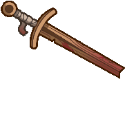
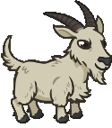

[Back to Main](index.md)

# Familiars

Upcoming familiars that are found in future premiums or simply listed as unavailable at the moment.

    
        
            ID: 298**Fixer the Automaton**Quicker she says. Always quicker!
        
        
            Fixer the Automaton
        
        
            Lazaapz's Fixer the Automaton Familiar & Feat Pack
        
        
            1,680p
        
        
            30 Dec 2025
        
    
    
        
            ID: 302**Sleet the Jackalope**Mysterious cryptid hidden beyond the Spine of the World.
        
        
            Sleet the Jackalope
        
        
            Sleet the Jackalope Familiar Pack
        
        
            2,380p
        
        
            07 Jan 2026
        
    
    
        
            ID: 301**Splinter the Wooden Sword**You never forget your first practice sword.
        
        
            Splinter the Wooden Sword
        
        
            Wintershield Knight Anson Theme Pack
        
        
            3,830p
        
        
            07 Jan 2026
        
    
    
        
            ID: 303**Froth the Pintling**Binwin used magic to make a winter ale and accidentally created a malt-born elemental.
        
        
            Froth the Pintling
        
        
            Cold Brew Binwin Theme Pack
        
        
            3,830p
        
        
            14 Jan 2026
        
    
    
        
            ID: 304**Meek the Kobold**Nobody trods on Meek! Nobody!
        
        
            Meek the Kobold
        
        
            Meek the Kobold Familiar Pack
        
        
            840p
        
        
            21 Jan 2026
        
    
    
        
            ID: 305**Jar of Green Slime**'This is my brother - say hi brother!'~ Spurt
        
        
            Jar of Green Slime
        
        
            Spurt's Jar of Green Slime Familiar & Feat Pack
        
        
            1,680p
        
        
            28 Jan 2026
        
    
    
        
            ID: 306**Soul the Sun Elemental**We are made of star-stuff.
        
        
            Soul the Sun Elemental
        
        
            Ancient Kyre Theme Pack
        
        
            3,830p
        
        
            04 Feb 2026
        
    
    
        
            ID: 307**Clarkemoore the Goat**The greatest of all time, in his own mind.
        
        
            Clarkemoore the Goat
        
        
            Mountain Donaar Theme Pack
        
        
            3,830p
        
        
            11 Feb 2026
        
    
    
        
            ID: 308**Lord Brook the Marid**Beware wishes granted by this little watery lord.
        
        
            Lord Brook the Marid
        
        
            Lord Brook the Marid Familiar Pack
        
        
            1,680p
        
        
            18 Feb 2026
        
    
    
        
            ID: 309**Splash the Water Elemental**The consummate puddle jumper.
        
        
            Splash the Water Elemental
        
        
            Splash the Water Elemental Familiar Pack
        
        
            1,680p
        
        
            25 Feb 2026
        
    
    
        
            ID: 310**Caramon the Rabbit**Dear, good, steadfast, boring Caramon.
        
        
            Caramon the Rabbit
        
        
            Raistlin, Master of Past and Present Theme Pack
        
        
            3,830p
        
        
            04 Mar 2026
        
    
    
        
            ID: 311**Dragon Orb of Istar**
        
        
            Dragon Orb of Istar
        
        
            Dragon Orb of Istar Familiar Pack
        
        
            840p
        
        
            04 Mar 2026
        
    
    
        
            ID: 312**Drone of Dooooom**Bards can't share their stories all alone…
        
        
            Drone of Dooooom
        
        
            Bard of the Dragon Queen Deekin Theme Pack
        
        
            3,830p
        
        
            11 Mar 2026
        
    
    
        
            ID: 314**Seeker the Star Angler**Just watch out when her teeth grow in!
        
        
            Seeker the Star Angler
        
        
            Seeker the Star Angler Familiar Pack
        
        
            2,380p
        
        
            25 Mar 2026
        
    
    
        
            ID: 313**Rocky the Baaz Draconian**
        
        
            Rocky the Baaz Draconian
        
        
            None
        
        
            ???
        
        
            ???
        
    

[Back to Top](#top)

*Last Modified: {{ site.time }}*