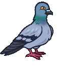
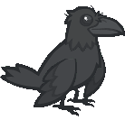

[Back to Main](index.md)

# Familiars

Upcoming familiars that are found in future premiums or simply listed as unavailable at the moment.

    
        
            ID: 289**Wingston the Pigeon**Look at him strutting around!
        
        
            Wingston the Pigeon
        
        
            6x Choose Your Champion Starter Pack
        
        
            0p
        
        
            27 Aug 2025
        
    
    
        
            ID: 284**Keeper the Spellbook**Little secret keepers.
        
        
            Keeper the Spellbook
        
        
            Mythic Cazrin Theme Pack
        
        
            3,830p
        
        
            03 Sept 2025
        
    
    
        
            ID: 274**Lily the Tree Frog**She's just hopping around.
        
        
            Lily the Tree Frog
        
        
            Founder's Pack VIII
        
        
            0p
        
        
            03 Sept 2025
        
    
    
        
            ID: 278**Professor Griff**The judgiest judge to ever judge.
        
        
            Professor Griff
        
        
            Legendkeeper Alyndra Theme Pack
        
        
            3,830p
        
        
            10 Sept 2025
        
    
    
        
            ID: 283**Animated Silver Sword**A gift. A burden. The sacred blade of shadow's bane.
        
        
            Animated Silver Sword
        
        
            Silver Sword of Gith Familiar Pack
        
        
            840p
        
        
            24 Sept 2025
        
    
    
        
            ID: 285**Ebrath the Illefarn Mastiff**Guardian's Best Friend.
        
        
            Ebrath the Illefarn Mastiff
        
        
            King of Shadows Origin Theme Pack
        
        
            0p
        
        
            01 Oct 2025
        
    
    
        
            ID: 286**Ausir the White Raven**The bright messenger of a dark lady.
        
        
            Ausir the White Raven
        
        
            Darklord Farideh Theme Pack
        
        
            3,830p
        
        
            08 Oct 2025
        
    
    
        
            ID: 287**Umbra the Shadow Dragon**Beware her dark breath weapon - you will rise in her service after death.
        
        
            Umbra the Shadow Dragon
        
        
            Umbra the Shadow Dragon Familiar Pack
        
        
            1,680p
        
        
            22 Oct 2025
        
    
    
        
            ID: 288**Form of the Slayer**A form for Bhaal's chosen…
        
        
            Form of the Slayer
        
        
            Dark Urge Slayer Familiar & Feat Pack
        
        
            1,680p
        
        
            29 Oct 2025
        
    

[Back to Top](#top)

*Last Modified: {{ site.time }}*