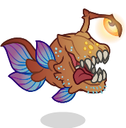

[Back to Main](index.md)

# Familiars

Upcoming familiars that are found in future premiums or simply listed as unavailable at the moment.

    
        
            ID: 312**Drone of Dooooom**Bards can't share their stories all alone…
        
        
            Drone of Dooooom
        
        
            Bard of the Dragon Queen Deekin Theme Pack
        
        
            3,830p
        
        
            11 Mar 2026
        
    
    
        
            ID: 314**Seeker the Star Angler**Just watch out when her teeth grow in!
        
        
            Seeker the Star Angler
        
        
            Seeker the Star Angler Familiar Pack
        
        
            2,380p
        
        
            25 Mar 2026
        
    
    
        
            ID: 315**Animated Armor of Collaboration**Forged from many disciplines and powered by a shared goal, this living armor stands as proof that games and communities are built better together.
        
        
            Animated Armor of Collaboration
        
        
            Animated Armor of Collaboration Familiar Pack
        
        
            0p
        
        
            27 Mar 2026
        
    

[Back to Top](#top)

*Last Modified: {{ site.time }}*