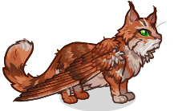
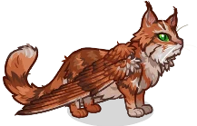
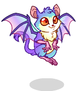
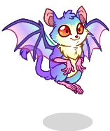

[Back to Main](index.md)

# Familiars

Upcoming familiars that are found in future premiums or simply listed as unavailable at the moment.

    
        
            ID: 325**Root the Korred**Jeweler of the Queen, Queen of the Jewelers.
        
        
            Root the Korred
        
        
            Root the Korred Familiar & Modron Pack
        
        
            2,380p
        
        
            03 Jun 2026
        
    
    
        
            ID: 324**Vex the Tressym**That is not your chair; that is my throne.
        
        
            Vex the Tressym
        
        
            Summer Court Trixie Theme Pack
        
        
            3,830p
        
        
            03 Jun 2026
        
    
    
        
            ID: 326**Iridescent Wynling**Playful and mischievous, wynlings defend mountain heights, alpine vales, and sometimes even summer courts against trespassers.
        
        
            Iridescent Wynling
        
        
            Iridescent Wynling Familiar Pack
        
        
            0p
        
        
            08 Jun 2026
        
    
    
        
            ID: 327**Atchoo the Dahlia**Leaf it to me!
        
        
            Atchoo the Dahlia
        
        
            Fey Touched Brother Uriah Theme Pack
        
        
            3,830p
        
        
            10 Jun 2026
        
    
    
        
            ID: 328**Baby Chardalyn Titan**The test run of the giant mechanized menace proved too cute to recycle.
        
        
            Baby Chardalyn Titan
        
        
            Avatar of Chaos Familiar Pack
        
        
            1,680p
        
        
            24 Jun 2026
        
    
    
        
            ID: 329**Piccolo the Pet Monkey**Pet of Rictavio, friend of Blinsky, master of chaos.
        
        
            Piccolo the Pet Monkey
        
        
            Rictavio Van Richten Theme Pack
        
        
            3,830p
        
        
            01 Jul 2026
        
    
    
        
            ID: 330**Baby Cthulhu**This ageless terror can only exert a fraction of its terrible might in this adorable form.
        
        
            Baby Cthulhu
        
        
            Baby Cthulhu Familiar & Modron Pack
        
        
            2,380p
        
        
            08 Jul 2026
        
    
    
        
            ID: 331**Mist Horror**These vaporous terrors take the shape of their viewers' greatest fears.
        
        
            Mist Horror
        
        
            Mist Horror Familiar Pack
        
        
            1,140p
        
        
            22 Jul 2026
        
    

[Back to Top](#top)

*Last Modified: {{ site.time }}*