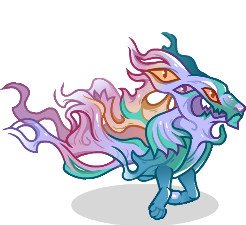
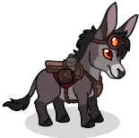
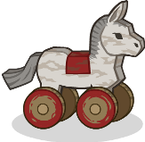
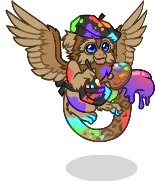

[Back to Main](index.md)

# Familiars

Upcoming familiars that are found in future premiums or simply listed as unavailable at the moment.

    
        
            ID: 331**Mist Horror**These vaporous terrors take the shape of their viewers' greatest fears.
        
        
            Mist Horror
        
        
            Mist Horror Familiar Pack
        
        
            1,140p
        
        
            22 Jul 2026
        
    
    
        
            ID: 332**Fleetfoot the Mule**Steadfast, strong, and better than any horse.
        
        
            Fleetfoot the Mule
        
        
            Master Craftsman Flint Theme Pack
        
        
            3,830p
        
        
            05 Aug 2026
        
    
    
        
            ID: 333**Oak the Donkey Toy**At least it's not a horse…
        
        
            Oak the Donkey Toy
        
        
            Oak the Donkey Toy Familiar Pack
        
        
            1,680p
        
        
            12 Aug 2026
        
    
    
        
            ID: 334**Pigment the Flying Monkey**Maybe a bit more blue…
        
        
            Pigment the Flying Monkey
        
        
            Pigment the Flying Monkey Familiar Pack
        
        
            840p
        
        
            19 Aug 2026
        
    
    
        
            ID: 335**Sentry the Bear**Do not worry, Sentry is watching.
        
        
            Sentry the Bear
        
        
            Caramon, Guardian of the Future Theme Pack
        
        
            3,830p
        
        
            02 Sept 2026
        
    
    
        
            ID: 336**Watson the Treant Sapling**One day, he'll be a real Treant!
        
        
            Watson the Treant Sapling
        
        
            Watson the Treant Sapling Familiar Pack
        
        
            2,380p
        
        
            09 Sept 2026
        
    
    
        
            ID: 337**Cinder Scholar Salamander**Only the best fire resistant parchment for this one!
        
        
            Cinder Scholar Salamander
        
        
            Cinder Scholar Salamander Familiar Pack
        
        
            1,140p
        
        
            16 Sept 2026
        
    

[Back to Top](#top)

*Last Modified: {{ site.time }}*