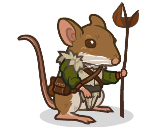

[Back to Main](index.md)

# Familiars

Upcoming familiars that are found in future premiums or simply listed as unavailable at the moment.

    
        
            ID: 314**Seeker the Star Angler**Just watch out when her teeth grow in!
        
        
            Seeker the Star Angler
        
        
            Seeker the Star Angler Familiar Pack
        
        
            2,380p
        
        
            25 Mar 2026
        
    
    
        
            ID: 315**Animated Armor of Collaboration**Forged from many disciplines and powered by a shared goal, this living armor stands as proof that games and communities are built better together.
        
        
            Animated Armor of Collaboration
        
        
            Animated Armor of Collaboration Familiar Pack
        
        
            0p
        
        
            27 Mar 2026
        
    
    
        
            ID: 317**Dragon Orb of Palanthas**Those who try to wield an orb’s magic but lack sufficient force of personality might find themselves under the orb’s control.
        
        
            Dragon Orb of Palanthas
        
        
            Dragon Orb of Palanthas Familiar Pack
        
        
            1,140p
        
        
            01 Apr 2026
        
    
    
        
            ID: 316**Oops the Mouse**Oops!
        
        
            Oops the Mouse
        
        
            Wanderlust Tasslehoff Theme Pack
        
        
            3,830p
        
        
            01 Apr 2026
        
    
    
        
            ID: 318**Birdie the Peacock**"I wish I were a birdie."
        
        
            Birdie the Peacock
        
        
            Strelitzia Lucius Theme Pack
        
        
            3,830p
        
        
            08 Apr 2026
        
    
    
        
            ID: 319**Bloom the Dryad**Likes pretty songs and likes to sing along.
        
        
            Bloom the Dryad
        
        
            Bloom the Dryad Familiar Pack
        
        
            1,680p
        
        
            15 Apr 2026
        
    

[Back to Top](#top)

*Last Modified: {{ site.time }}*