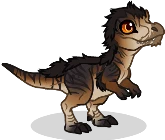

[Back to Main](index.md)

# Familiars

Upcoming familiars that are found in future premiums or simply listed as unavailable at the moment.

    
        
            ID: 321**Clockwork the Faerie Dragon**I may be small but my mischief is huge!  Watch out!
        
        
            Clockwork the Faerie Dragon
        
        
            Pretentious Prestidigitator Melf Theme Pack
        
        
            3,830p
        
        
            13 May 2026
        
    
    
        
            ID: 322**Dragon Orb of Wayreth**An orb is an etched crystal globe about 10 inches in diameter. When used, it grows to about 20 inches in diameter, and mist swirls inside it.
        
        
            Dragon Orb of Wayreth
        
        
            Dragon Orb of Wayreth Familiar Pack
        
        
            1,140p
        
        
            13 May 2026
        
    
    
        
            ID: 323**Baby Tyrannosaurus**Look out for those adorable chompers - he bites!
        
        
            Baby Tyrannosaurus
        
        
            Avatar of Ubtao Familiar Pack
        
        
            1,680p
        
        
            27 May 2026
        
    
    
        
            ID: 325**Root the Korred**Jeweler of the Queen, Queen of the Jewelers.
        
        
            Root the Korred
        
        
            Root the Korred Familiar & Modron Pack
        
        
            2,380p
        
        
            03 Jun 2026
        
    
    
        
            ID: 324**Vex the Tressym**That is not your chair; that is my throne.
        
        
            Vex the Tressym
        
        
            Summer Court Trixie Theme Pack
        
        
            3,830p
        
        
            03 Jun 2026
        
    
    
        
            ID: 326**Iridescent Wynling**Playful and mischievous, wynlings defend mountain heights, alpine vales, and sometimes even summer courts against trespassers.
        
        
            Iridescent Wynling
        
        
            Iridescent Wynling Familiar Pack
        
        
            0p
        
        
            08 Jun 2026
        
    
    
        
            ID: 327**Atchoo the Dahlia**Leaf it to me!
        
        
            Atchoo the Dahlia
        
        
            Fey Touched Brother Uriah Theme Pack
        
        
            3,830p
        
        
            10 Jun 2026
        
    
    
        
            ID: 328**Baby Chardalyn Titan**The test run of the giant mechanized menace proved too cute to recycle.
        
        
            Baby Chardalyn Titan
        
        
            Avatar of Chaos Familiar Pack
        
        
            1,680p
        
        
            24 Jun 2026
        
    

[Back to Top](#top)

*Last Modified: {{ site.time }}*