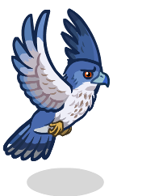
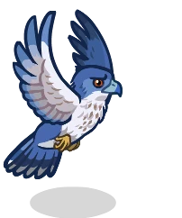
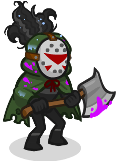
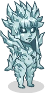

[Back to Main](index.md)

# Familiars

Upcoming familiars that are found in future premiums or simply listed as unavailable at the moment.

    
        
            ID: 338**Scout the Cooper's Hawk**This agile hunter awaits her master's signal. Only then can she strike.
        
        
            Scout the Cooper's Hawk
        
        
            Freeblade Kitiara Theme Pack
        
        
            3,830p
        
        
            07 Oct 2026
        
    
    
        
            ID: 339**Slash the Chwinga**Fear comes in fun size.
        
        
            Slash the Chwinga
        
        
            Slash the Chwinga Familiar Pack
        
        
            840p
        
        
            07 Oct 2026
        
    
    
        
            ID: 340**Gourd the Bat**The only thing scarier than the pumpkin is what's inside!
        
        
            Gourd the Bat
        
        
            Gourd the Bat Familiar Pack
        
        
            1,680p
        
        
            14 Oct 2026
        
    
    
        
            ID: 341**Aurum the Hoard Scarab**Thieves beware! These beetle-like creatures blend in perfectly among piles of gold coins.
        
        
            Aurum the Hoard Scarab
        
        
            Aurum the Hoard Scarab Familiar Pack
        
        
            1,140p
        
        
            21 Oct 2026
        
    
    
        
            ID: 346**Dr. Floof, the Conjured Almiraj**Dr. Floof is a dedicated healer, despite his tendency to prescribe laughter.
        
        
            Dr. Floof, the Conjured Almiraj
        
        
            Dr. Floof, the Conjured Almiraj Familiar Pack
        
        
            $5.99
        
        
            02 Nov 2026
        
    
    
        
            ID: 343**Slick the Dohwar**Who needs to fly when you can glide!
        
        
            Slick the Dohwar
        
        
            Morte on the Rocks Theme Pack
        
        
            3,830p
        
        
            04 Nov 2026
        
    
    
        
            ID: 344**Lady Icekiss**The god of cold indifference who embodies winter's cruelty.
        
        
            Lady Icekiss
        
        
            Avatar of Auril Familiar Pack
        
        
            1,680p
        
        
            11 Nov 2026
        
    
    
        
            ID: 345**Frost the Chwinga**Chwingas prefer to move about unseen, which is even easier in the snow of Icewind Dale.
        
        
            Frost the Chwinga
        
        
            Frost the Chwinga Familiar Pack
        
        
            840p
        
        
            18 Nov 2026
        
    
    
        
            ID: 347**Tanis the Red-Pelted Fox**Tanis had to remind himself that even though squirrels taste as good as rabbits, he probably shouldn't eat squirrel Tasslehoff…
        
        
            Tanis the Red-Pelted Fox
        
        
            Dragon Army Tanis Theme Pack
        
        
            3,830p
        
        
            02 Dec 2026
        
    
    
        
            ID: 348**Avatar of Lolth**One of the most accursed of the Spider Queen’s gifts is transformation into a drider.
        
        
            Avatar of Lolth
        
        
            Avatar of Lolth Familiar Pack
        
        
            1,680p
        
        
            09 Dec 2026
        
    
    
        
            ID: 349**Sage the Elemental Owl**Beware his icicle wingspan!
        
        
            Sage the Elemental Owl
        
        
            Sage the Elemental Owl Familiar Pack
        
        
            1,140p
        
        
            16 Dec 2026
        
    

[Back to Top](#top)

*Last Modified: {{ site.time }}*