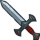

[Back to Main](index.md)

# Feats

Feats that are upcoming.

Feats that are listed as Free will be available immediately the moment they release. Feats with a cost of 50,000 Gems will usually also be available via real money through DLC packs or weekend chest sales. Gold chest feats of course can only come from regular Gold Chests.

*Note: I filter out all feats that are obviously tests or unfinished - such as having a prohibitively high gem cost or excessive too-far-future release date.*

| Icon | Feat Name | Champion | Effect | Source | Date |
|---|---|---|---|---|--:|
|  | Prodigal Leader | Tatyana | 50% All Champion Damage | 50,000 Gems | 26 Jul 2023 |
|  | High Ground | Vin Ursa | 80% Vicious Vantage | 50,000 Gems | 26 Jul 2023 |
|  | Prodigal Leader | Avren | 50% All Champion Damage | 50,000 Gems | 09 Aug 2023 |
|  | Don't Fall Behind | Widdle | 80% Hurry Up Now | 50,000 Gems | 09 Aug 2023 |
|  | Unlimited Potential | Voronika | 80% Ultimate Power | 50,000 Gems | 16 Aug 2023 |
|  | Frugal | Donaar | 10% Gold | ??? | 30 Aug 2023 |
|  | Lucky | Donaar | 25% Gold | ??? | 30 Aug 2023 |
|  | Divesting Gold | K'thriss | 40% Hoardsperson | ??? | 30 Aug 2023 |
|  | Frugal | K'thriss | 10% Gold | ??? | 30 Aug 2023 |
|  | Petty Cash | K'thriss | 20% Hoardsperson | ??? | 30 Aug 2023 |
|  | Evil Party | BBEG | 400% Evil Overlord & Changes to Int <=11 | 50,000 Gems | 30 Aug 2023 |
|  | Taunt | Evandra | 400% Self DPS & 50% Taunt | 50,000 Gems | 30 Aug 2023 |
|  | Taunt | Walnut | 400% Self DPS & 50% Taunt | ??? | 04 Sep 2023 |
|  | The Bard Spittin' Bars | Antrius | 40% Can't be De-Feat-ed | 12,500 Gems | 13 Sep 2023 |
|  | Stronger Sources | BBEG | 40% Sources of Corpses | 12,500 Gems | 13 Sep 2023 |
|  | Entertainer | Evandra | Stat: +2 Charisma | 50,000 Gems | 13 Sep 2023 |
|  | Puntastic | Merilwen | 40% Punishing Puns | 12,500 Gems | 13 Sep 2023 |
|  | Taunt | Nayeli | 400% Self DPS & 50% Taunt | 50,000 Gems | 13 Sep 2023 |
|  | Heavy Lifter | Nixie | Stat: +2 Strength | 50,000 Gems | 13 Sep 2023 |
|  | New Speech Pattern | Nordom | 40% Modron Core Toolbox | 12,500 Gems | 13 Sep 2023 |
|  | Sentinel | Selise | +20 Overwhelm | 50,000 Gems | 13 Sep 2023 |
|  | All Together Now | Deekin | 80% Troubadour Troupe | 50,000 Gems | 20 Sep 2023 |
|  | Fiendish Flames | Farideh | 1s BUD per sec for 5s | 50,000 Gems | 20 Sep 2023 |
|  | King of the Hall | Bruenor | +2 Mithral Hall Stacks | 50,000 Gems | 21 Sep 2023 |
|  | Heavy Lifter | K'thriss | Stat: +2 Strength | 50,000 Gems | 27 Sep 2023 |
|  | Time is Money | Môrgæn | 80% Friends In Wealth | 50,000 Gems | 27 Sep 2023 |

# Placeholder Date Feats

These are the feats that have been filtered out of the list above due to having placeholder dates. By this I mean they have very far future dates that will eventually change when CNE deigns to release them (*IF* they decide to release them). They've been filtered out above purely because there's a possibility some of these might never see the light of day. They're unreliable - far more so than most spoilers usually are. So take that into account when viewing them.

*Note: Test feats / QA feats / TBD feats will remain filtered out. Even from this list.*

| Icon | Feat Name | Champion | Effect | Source | Date |
|---|---|---|---|---|--:|
|  | Vicious Damage | BBEG | 400% Self DPS & Prevent Healing for 10s | ??? | 01 Jan 2032 |
|  | Hall of the Mountain King | Bruenor | +1 Mithral Hall Stacks | ??? | 01 Jan 2032 |
|  | Prodigal Leader | Bruenor | 50% All Champion Damage | 50,000 Gems | 01 Jan 2032 |
|  | Archer's Perception | Catti-brie | 80% Mark for Death | ??? | 01 Jan 2032 |
|  | Master's Precision | Catti-brie | +20% Crit Chance | ??? | 01 Jan 2032 |
|  | Obliterating Blast | Catti-brie | +120% Crit Damage | ??? | 01 Jan 2032 |
|  | Courage in Battle | Drizzt | +1 Mithral Hall Stacks | ??? | 01 Jan 2032 |
|  | Death on Both Sides | Drizzt | 40% Icingdeath | ??? | 01 Jan 2032 |
|  | Durable | Jarlaxle | Stat: +1 Constitution | ??? | 01 Jan 2032 |
|  | Master's Precision | Jarlaxle | +20% Crit Chance | ??? | 01 Jan 2032 |
|  | Obliterating Blast | Jarlaxle | +120% Crit Damage | ??? | 01 Jan 2032 |
|  | Bigger Boat | Krux | All Hands on Deck Now Also Applies to the Column Second from the Back | ??? | 01 Jan 2032 |
|  | Entertainer | Krux | Stat: +2 Charisma | ??? | 01 Jan 2032 |
|  | Keen Eye | Krux | 80% Starfarer's Spyglass | ??? | 01 Jan 2032 |
|  | Scholar | Krux | Stat: +2 Intelligence | ??? | 01 Jan 2032 |
|  | Seahippo | Krux | 80% An Experienced Sailor | ??? | 01 Jan 2032 |
|  | Caged Dreams | Miria | 80% Soul Cage | 50,000 Gems | 01 Jan 2032 |
|  | Vicious Damage | Pwent | 400% Self DPS & Prevent Healing for 10s | ??? | 01 Jan 2032 |
|  | Advisor | Regis | 50% All Champion Damage | ??? | 01 Jan 2032 |
|  | Master's Precision | Regis | +20% Crit Chance | ??? | 01 Jan 2032 |
|  | A Vow Unbroken | Uriah | Stat: +2 Constitution | ??? | 01 Jan 2032 |
|  | Faithful Reward | Uriah | Ezra's Embrace Heals Within 3 Slots | ??? | 01 Jan 2032 |
|  | Very Important Person | Valentine | 80% Socialite | ??? | 01 Jan 2032 |
|  | It's Just Business | Vin Ursa | 40% All Second Specialisations | ??? | 01 Jan 2032 |
|  | This is the Way | Vin Ursa | 40% All First Specialisations | ??? | 01 Jan 2032 |
|  | Battle Expertise | Wulfgar | +10% Crit Chance | Gold Chest | 01 Jan 2032 |
|  | Master's Precision | Wulfgar | +20% Crit Chance | ??? | 01 Jan 2032 |
|  | Inspiring Leader | Asharra | 25% All Champion Damage | 12,500 Gems | 01 Jan 2032 |
|  | Above the Crowd | Binwin | 80% Tallest in Faerûn | 50,000 Gems | 01 Jan 2032 |
|  | Grappler | Binwin | 60% Self DPS | 12,500 Gems | 01 Jan 2032 |
|  | Weapon Master | Black Viper | 120% Self DPS | 50,000 Gems | 01 Jan 2032 |
|  | Prophesied Leader | Deekin | 50% All Champion Damage | 50,000 Gems | 01 Jan 2032 |
|  | Inspiring Leader | Donaar | 25% All Champion Damage | 12,500 Gems | 01 Jan 2032 |
|  | Grappler | Jarlaxle | 60% Self DPS | 12,500 Gems | 01 Jan 2032 |
|  | Fortune's Favor | Krull | 50% Gold | 50,000 Gems | 01 Jan 2032 |
|  | Richly Deserved | Krull | 80% Draconic Plague | 50,000 Gems | 01 Jan 2032 |
|  | Superior Actor | Minsc | Stat: +2 Charisma | 12,500 Gems | 01 Jan 2032 |
|  | Resilient | Nayeli | 30% Health | 12,500 Gems | 01 Jan 2032 |
|  | Fortune's Favor | Stoki | 50% Gold | 50,000 Gems | 01 Jan 2032 |
|  | Prodigal Leader | Tyril | 50% All Champion Damage | 50,000 Gems | 01 Jan 2032 |
|  | I Did My Homework | Alyndra | 80% Brows of Judgement | 50,000 Gems | 17 Mar 2032 |
|  | Seat Shift | Strongheart |  | ??? | 14 Dec 2032 |

# Seat Swap Feats

These icons entered the defines a while ago - and we recently got the first appearance of a feat that uses them. Given that - it seems that these will be handed out sparingly to select champions that specifically allow them to move to one specific seat. I highly doubt they'll be a free-for-all.

| Icon | Icon Name | Raw |
|---|---|---|
|  | Swap Seat 1 | `Icons/Feats/Icon_Feat_SwapSeat1` |
|  | Swap Seat 2 | `Icons/Feats/Icon_Feat_SwapSeat2` |
|  | Swap Seat 3 | `Icons/Feats/Icon_Feat_SwapSeat3` |
|  | Swap Seat 4 | `Icons/Feats/Icon_Feat_SwapSeat4` |
|  | Swap Seat 5 | `Icons/Feats/Icon_Feat_SwapSeat5` |
|  | Swap Seat 6 | `Icons/Feats/Icon_Feat_SwapSeat6` |
|  | Swap Seat 7 | `Icons/Feats/Icon_Feat_SwapSeat7` |
|  | Swap Seat 8 | `Icons/Feats/Icon_Feat_SwapSeat8` |
|  | Swap Seat 9 | `Icons/Feats/Icon_Feat_SwapSeat9` |
|  | Swap Seat 10 | `Icons/Feats/Icon_Feat_SwapSeat10` |
|  | Swap Seat 11 | `Icons/Feats/Icon_Feat_SwapSeat11` |
|  | Swap Seat 12 | `Icons/Feats/Icon_Feat_SwapSeat12` |

[Back to Top](#top)

*Last Modified: {{ site.time }}*