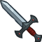

[Back to Main](index.md)

# Feats

Feats that are upcoming.

Feats that are listed as Free will be available immediately the moment they release. Feats with a cost of 50,000 Gems will usually also be available via real money through DLC packs or weekend chest sales. Gold chest feats of course can only come from regular Gold Chests.

For feats that were available in the season pass of prior seasons - please see the [Prior Season Reward Availabilities](postseason.html) page for when we will likely see them for gems.

*Note: I filter out all feats that are obviously tests or unfinished - such as having a prohibitively high gem cost or excessive too-far-future release date.*

    
        
            **Champion**
        
        
            **Feat**
        
        
            **Effect**
        
        
            **Source**
        
        
            **Date**
        
    
    
        
            Antrius
        
        
            The Bard Spittin' Bars
        
        
            40% Can't be De-Feat-ed
        
        
            12,500 Gems
        
        
            13 Sep 2023
        
    
    
        
            BBEG
        
        
            Stronger Sources
        
        
            40% Sources of Corpses
        
        
            12,500 Gems
        
        
            13 Sep 2023
        
    
    
        
            Evandra
        
        
            Entertainer
        
        
            Stat: +2 Charisma
        
        
            50,000 Gems
        
        
            13 Sep 2023
        
    
    
        
            Merilwen
        
        
            Puntastic
        
        
            40% Punishing Puns
        
        
            12,500 Gems
        
        
            13 Sep 2023
        
    
    
        
            Nayeli
        
        
            Taunt
        
        
            400% Self DPS & 50% Taunt
        
        
            50,000 Gems
        
        
            13 Sep 2023
        
    
    
        
            Nixie
        
        
            Heavy Lifter
        
        
            Stat: +2 Strength
        
        
            50,000 Gems
        
        
            13 Sep 2023
        
    
    
        
            Nordom
        
        
            New Speech Pattern
        
        
            40% Modron Core Toolbox
        
        
            12,500 Gems
        
        
            13 Sep 2023
        
    
    
        
            Selise
        
        
            Sentinel
        
        
            +20 Overwhelm
        
        
            50,000 Gems
        
        
            13 Sep 2023
        
    
    
        
            Evelyn
        
        
            Taunt
        
        
            400% Self DPS & 50% Taunt
        
        
            [Weekend](weekends.md)
        
        
            15 Sep 2023
        
    
    
        
            Jim
        
        
            Heavy Lifter
        
        
            Stat: +2 Strength
        
        
            [Weekend](weekends.md)
        
        
            15 Sep 2023
        
    
    
        
            Deekin
        
        
            All Together Now
        
        
            80% Troubadour Troupe
        
        
            50,000 Gems
        
        
            20 Sep 2023
        
    
    
        
            Farideh
        
        
            Fiendish Flames
        
        
            1s BUD per sec for 5s
        
        
            50,000 Gems
        
        
            20 Sep 2023
        
    
    
        
            Bruenor
        
        
            King of the Hall
        
        
            +2 Mithral Hall Stacks
        
        
            50,000 Gems
        
        
            21 Sep 2023
        
    
    
        
            Certainty
        
        
            New Me
        
        
            Best And The Brightest +2 & Smooth Negotiators +2
        
        
            50,000 Gems
        
        
            27 Sep 2023
        
    
    
        
            K'thriss
        
        
            Heavy Lifter
        
        
            Stat: +2 Strength
        
        
            50,000 Gems
        
        
            27 Sep 2023
        
    
    
        
            Môrgæn
        
        
            Time is Money
        
        
            80% Friends In Wealth
        
        
            50,000 Gems
        
        
            27 Sep 2023
        
    
    
        
            Briv
        
        
            Prodigal Leader
        
        
            50% All Champion Damage
        
        
            50,000 Gems
        
        
            06 Oct 2023
        
    
    
        
            Hew Maan
        
        
            Yaaaas
        
        
            80% Teamwork
        
        
            50,000 Gems
        
        
            06 Oct 2023
        
    
    
        
            Jim
        
        
            Prodigal Leader
        
        
            50% All Champion Damage
        
        
            50,000 Gems
        
        
            06 Oct 2023
        
    
    
        
            Nahara
        
        
            Eventful Night
        
        
            80% To Amuse or Avenge
        
        
            50,000 Gems
        
        
            06 Oct 2023
        
    
    
        
            Uriah
        
        
            Faithful Reward
        
        
            Ezra's Embrace Heals Within 3 Slots
        
        
            50,000 Gems
        
        
            06 Oct 2023
        
    
    
        
            Donaar
        
        
            Prodigal Leader
        
        
            50% All Champion Damage
        
        
            50,000 Gems
        
        
            11 Oct 2023
        
    
    
        
            Widdle
        
        
            Prodigal Leader
        
        
            50% All Champion Damage
        
        
            50,000 Gems
        
        
            11 Oct 2023
        
    
    
        
            Kent
        
        
            Weapon Master
        
        
            120% Self DPS
        
        
            50,000 Gems
        
        
            18 Oct 2023
        
    
    
        
            Celeste
        
        
            Immolation
        
        
            1s BUD per sec for 5s
        
        
            50,000 Gems
        
        
            01 Nov 2023
        
    
    
        
            Virgil
        
        
            Immolation
        
        
            1s BUD per sec for 5s
        
        
            50,000 Gems
        
        
            08 Nov 2023
        
    
    
        
            DM
        
        
            Lucky
        
        
            25% Gold
        
        
            ???
        
        
            15 Nov 2023
        
    
    
        
            Artemis
        
        
            Master's Precision
        
        
            +20% Crit Chance
        
        
            50,000 Gems
        
        
            29 Nov 2023
        
    
    
        
            Warduke
        
        
            Taunt
        
        
            400% Self DPS & 50% Taunt
        
        
            50,000 Gems
        
        
            29 Nov 2023
        
    

# Placeholder Date Feats

These are the feats that have been filtered out of the list above due to having placeholder dates. By this I mean they have very far future dates that will eventually change when CNE deigns to release them (*IF* they decide to release them). They've been filtered out above purely because there's a possibility some of these might never see the light of day. They're unreliable - far more so than most spoilers usually are. So take that into account when viewing them.

*Note: Test feats / QA feats / TBD feats will remain filtered out. Even from this list.*

    
        
            **Champion**
        
        
            **Feat**
        
        
            **Effect**
        
        
            **Source**
        
        
            **Date**
        
    
    
        
            BBEG
        
        
            Vicious Damage
        
        
            400% Self DPS & Prevent Healing for 10s
        
        
            ???
        
        
            01 Jan 2032
        
    
    
        
            Bruenor
        
        
            Hall of the Mountain King
        
        
            +1 Mithral Hall Stacks
        
        
            ???
        
        
            01 Jan 2032
        
    
    
        
            Bruenor
        
        
            Prodigal Leader
        
        
            50% All Champion Damage
        
        
            50,000 Gems
        
        
            01 Jan 2032
        
    
    
        
            Catti-brie
        
        
            Archer's Perception
        
        
            80% Mark for Death
        
        
            ???
        
        
            01 Jan 2032
        
    
    
        
            Catti-brie
        
        
            Master's Precision
        
        
            +20% Crit Chance
        
        
            ???
        
        
            01 Jan 2032
        
    
    
        
            Catti-brie
        
        
            Obliterating Blast
        
        
            +120% Crit Damage
        
        
            ???
        
        
            01 Jan 2032
        
    
    
        
            Certainty
        
        
            Tenacious
        
        
            Stat: +2 Constitution
        
        
            ???
        
        
            01 Jan 2032
        
    
    
        
            Drizzt
        
        
            Courage in Battle
        
        
            +1 Mithral Hall Stacks
        
        
            ???
        
        
            01 Jan 2032
        
    
    
        
            Drizzt
        
        
            Death on Both Sides
        
        
            40% Icingdeath
        
        
            ???
        
        
            01 Jan 2032
        
    
    
        
            Evelyn
        
        
            Quick Friends
        
        
            80% Conduit of the Light
        
        
            ???
        
        
            01 Jan 2032
        
    
    
        
            Evelyn
        
        
            Under Pressure
        
        
            80% Steadfast Might
        
        
            ???
        
        
            01 Jan 2032
        
    
    
        
            Jarlaxle
        
        
            Durable
        
        
            Stat: +1 Constitution
        
        
            ???
        
        
            01 Jan 2032
        
    
    
        
            Jarlaxle
        
        
            Master's Precision
        
        
            +20% Crit Chance
        
        
            ???
        
        
            01 Jan 2032
        
    
    
        
            Jarlaxle
        
        
            Obliterating Blast
        
        
            +120% Crit Damage
        
        
            ???
        
        
            01 Jan 2032
        
    
    
        
            Krux
        
        
            Bigger Boat
        
        
            All Hands on Deck +2nd Rear Column
        
        
            ???
        
        
            01 Jan 2032
        
    
    
        
            Krux
        
        
            Entertainer
        
        
            Stat: +2 Charisma
        
        
            ???
        
        
            01 Jan 2032
        
    
    
        
            Krux
        
        
            Keen Eye
        
        
            80% Starfarer's Spyglass
        
        
            ???
        
        
            01 Jan 2032
        
    
    
        
            Krux
        
        
            Scholar
        
        
            Stat: +2 Intelligence
        
        
            ???
        
        
            01 Jan 2032
        
    
    
        
            Krux
        
        
            Seahippo
        
        
            80% An Experienced Sailor
        
        
            ???
        
        
            01 Jan 2032
        
    
    
        
            Lae'zel
        
        
            Scholar
        
        
            Stat: +2 Intelligence
        
        
            ???
        
        
            01 Jan 2032
        
    
    
        
            Miria
        
        
            Caged Dreams
        
        
            80% Soul Cage
        
        
            50,000 Gems
        
        
            01 Jan 2032
        
    
    
        
            Nrakk
        
        
            Illithid Tadpole
        
        
            25% All Champion Damage & +1 Ceremorphosis Stack
        
        
            Emergence 3
        
        
            01 Jan 2032
        
    
    
        
            Pwent
        
        
            Vicious Damage
        
        
            400% Self DPS & Prevent Healing for 10s
        
        
            ???
        
        
            01 Jan 2032
        
    
    
        
            Regis
        
        
            Advisor
        
        
            50% All Champion Damage
        
        
            ???
        
        
            01 Jan 2032
        
    
    
        
            Regis
        
        
            Master's Precision
        
        
            +20% Crit Chance
        
        
            ???
        
        
            01 Jan 2032
        
    
    
        
            Uriah
        
        
            A Vow Unbroken
        
        
            Stat: +2 Constitution
        
        
            ???
        
        
            01 Jan 2032
        
    
    
        
            Valentine
        
        
            Very Important Person
        
        
            80% Socialite
        
        
            Emergence 3
        
        
            01 Jan 2032
        
    
    
        
            Vin Ursa
        
        
            It's Just Business
        
        
            40% All Second Specialisations
        
        
            ???
        
        
            01 Jan 2032
        
    
    
        
            Vin Ursa
        
        
            This is the Way
        
        
            40% All First Specialisations
        
        
            ???
        
        
            01 Jan 2032
        
    
    
        
            Wulfgar
        
        
            Battle Expertise
        
        
            +10% Crit Chance
        
        
            Gold Chest
        
        
            01 Jan 2032
        
    
    
        
            Wulfgar
        
        
            Master's Precision
        
        
            +20% Crit Chance
        
        
            ???
        
        
            01 Jan 2032
        
    
    
        
            Asharra
        
        
            Inspiring Leader
        
        
            25% All Champion Damage
        
        
            12,500 Gems
        
        
            01 Jan 2032
        
    
    
        
            Binwin
        
        
            Above the Crowd
        
        
            80% Tallest in Faerûn
        
        
            50,000 Gems
        
        
            01 Jan 2032
        
    
    
        
            Binwin
        
        
            Grappler
        
        
            60% Self DPS
        
        
            12,500 Gems
        
        
            01 Jan 2032
        
    
    
        
            Black Viper
        
        
            Weapon Master
        
        
            120% Self DPS
        
        
            50,000 Gems
        
        
            01 Jan 2032
        
    
    
        
            Deekin
        
        
            Prophesied Leader
        
        
            50% All Champion Damage
        
        
            50,000 Gems
        
        
            01 Jan 2032
        
    
    
        
            Donaar
        
        
            Inspiring Leader
        
        
            25% All Champion Damage
        
        
            12,500 Gems
        
        
            01 Jan 2032
        
    
    
        
            Jarlaxle
        
        
            Grappler
        
        
            60% Self DPS
        
        
            12,500 Gems
        
        
            01 Jan 2032
        
    
    
        
            Krull
        
        
            Fortune's Favor
        
        
            50% Gold
        
        
            50,000 Gems
        
        
            01 Jan 2032
        
    
    
        
            Krull
        
        
            Richly Deserved
        
        
            80% Draconic Plague
        
        
            50,000 Gems
        
        
            01 Jan 2032
        
    
    
        
            Minsc
        
        
            Superior Actor
        
        
            Stat: +2 Charisma
        
        
            12,500 Gems
        
        
            01 Jan 2032
        
    
    
        
            Nayeli
        
        
            Resilient
        
        
            30% Health
        
        
            12,500 Gems
        
        
            01 Jan 2032
        
    
    
        
            Stoki
        
        
            Fortune's Favor
        
        
            50% Gold
        
        
            50,000 Gems
        
        
            01 Jan 2032
        
    
    
        
            Tyril
        
        
            Prodigal Leader
        
        
            50% All Champion Damage
        
        
            50,000 Gems
        
        
            01 Jan 2032
        
    
    
        
            Alyndra
        
        
            I Did My Homework
        
        
            80% Brows of Judgement
        
        
            50,000 Gems
        
        
            17 Mar 2032
        
    
    
        
            Strongheart
        
        
            Seat Shift
        
        
            &nbsp;
        
        
            ???
        
        
            14 Dec 2032
        
    

# Seat Swap Feats

**Update**: According to Dev Insights (and remember - what they say doesn't always match what they do) - these seat swap feats have been mothballed because they were too `technically complicated` to implement. So just be aware that they might never come to fruition.  
Source: [Developer Insights Ep89 07:13-09:00](https://www.youtube.com/watch?v=NwqQh1LKczM&t=433s)

These icons entered the defines a while ago - and we recently got the first appearance of a feat that uses them. Given that - it seems that these will be handed out sparingly to select champions that specifically allow them to move to one specific seat. I highly doubt they'll be a free-for-all.

| Icon | Icon Name | Raw |
|---|---|---|
|  | Swap Seat 1 | `Icons/Feats/Icon_Feat_SwapSeat1` |
|  | Swap Seat 2 | `Icons/Feats/Icon_Feat_SwapSeat2` |
|  | Swap Seat 3 | `Icons/Feats/Icon_Feat_SwapSeat3` |
|  | Swap Seat 4 | `Icons/Feats/Icon_Feat_SwapSeat4` |
|  | Swap Seat 5 | `Icons/Feats/Icon_Feat_SwapSeat5` |
|  | Swap Seat 6 | `Icons/Feats/Icon_Feat_SwapSeat6` |
|  | Swap Seat 7 | `Icons/Feats/Icon_Feat_SwapSeat7` |
|  | Swap Seat 8 | `Icons/Feats/Icon_Feat_SwapSeat8` |
|  | Swap Seat 9 | `Icons/Feats/Icon_Feat_SwapSeat9` |
|  | Swap Seat 10 | `Icons/Feats/Icon_Feat_SwapSeat10` |
|  | Swap Seat 11 | `Icons/Feats/Icon_Feat_SwapSeat11` |
|  | Swap Seat 12 | `Icons/Feats/Icon_Feat_SwapSeat12` |

[Back to Top](#top)

*Last Modified: {{ site.time }}*