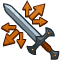

[Back to Main](index.md)

# Feats

Feats that are upcoming.

Feats that are listed as Free will be available immediately the moment they release. Feats with a cost of 50,000 Gems will usually also be available via real money through DLC packs or weekend chest sales. Gold chest feats of course can only come from regular Gold Chests.

*Note: I filter out all feats that are obviously tests or unfinished - such as having a prohibitively high gem cost or excessive too-far-future release date.*

| Icon | Feat Name | Champion | Effect | Source | Date |
|---|---|---|---|---|--:|
|  | Rally of the Protectors | Sgt. Knox | 80% Rallying Cry | 50,000 Gems | 28 Jun 2023 |
|  | Seasoned Warrior | Strongheart | 100% Seasoned Knight | 50,000 Gems | 28 Jun 2023 |
|  | Fortune's Favor | Freely | 50% Gold | 50,000 Gems | 12 Jul 2023 |
|  | Guardian of the Hall | Drizzt | +2 Mithral Hall Stacks | 50,000 Gems | 19 Jul 2023 |
|  | Slice and Dice | Pwent | 100% Bleed | 50,000 Gems | 19 Jul 2023 |
|  | Breaking It Down | Wulfgar | 80% Smash 'n Grab | 50,000 Gems | 19 Jul 2023 |
|  | Prodigal Leader | Tatyana | 50% All Champion Damage | 50,000 Gems | 26 Jul 2023 |
|  | The Bard Spittin' Bars | Antrius | 40% Can't be De-Feat-ed | 12,500 Gems | 13 Sep 2023 |
|  | Stronger Sources | BBEG | 40% Sources of Corpses | 12,500 Gems | 13 Sep 2023 |
|  | Entertainer | Evandra | Stat: +2 Charisma | 50,000 Gems | 13 Sep 2023 |
|  | Taunt | Evandra | 400% Self DPS & 50% Taunt | 50,000 Gems | 13 Sep 2023 |
|  | Puntastic | Merilwen | 40% Punishing Puns | 12,500 Gems | 13 Sep 2023 |
|  | Taunt | Nayeli | 400% Self DPS & 50% Taunt | 50,000 Gems | 13 Sep 2023 |
|  | Heavy Lifter | Nixie | Stat: +2 Strength | 50,000 Gems | 13 Sep 2023 |
|  | New Speech Pattern | Nordom | 40% Modron Core Toolbox | 12,500 Gems | 13 Sep 2023 |
|  | Sentinel | Selise | +20 Overwhelm | 50,000 Gems | 13 Sep 2023 |
|  | King of the Hall | Bruenor | +2 Mithral Hall Stacks | 50,000 Gems | 21 Sep 2023 |

# Seat Swap Feats

These icons entered the defines a while ago - and we recently got the first appearance of a feat that uses them. Given that - it seems that these will be handed out sparingly to select champions that specifically allow them to move to one specific seat. I highly doubt they'll be a free-for-all.

| Icon | Icon Name | Raw |
|---|---|---|
|  | Swap Seat 1 | `Icons/Feats/Icon_Feat_SwapSeat1` |
|  | Swap Seat 2 | `Icons/Feats/Icon_Feat_SwapSeat2` |
|  | Swap Seat 3 | `Icons/Feats/Icon_Feat_SwapSeat3` |
|  | Swap Seat 4 | `Icons/Feats/Icon_Feat_SwapSeat4` |
|  | Swap Seat 5 | `Icons/Feats/Icon_Feat_SwapSeat5` |
|  | Swap Seat 6 | `Icons/Feats/Icon_Feat_SwapSeat6` |
|  | Swap Seat 7 | `Icons/Feats/Icon_Feat_SwapSeat7` |
|  | Swap Seat 8 | `Icons/Feats/Icon_Feat_SwapSeat8` |
|  | Swap Seat 9 | `Icons/Feats/Icon_Feat_SwapSeat9` |
|  | Swap Seat 10 | `Icons/Feats/Icon_Feat_SwapSeat10` |
|  | Swap Seat 11 | `Icons/Feats/Icon_Feat_SwapSeat11` |
|  | Swap Seat 12 | `Icons/Feats/Icon_Feat_SwapSeat12` |

As for the feat that uses these icons:

*Note: Dates on or around 2032 are common in spoiler data and are placeholders. This just means that CNE haven't decided on a real date for them yet. It also means there's a chance they might never go live at all.*

| Seat | Feat Name | Champion | Date |
|---|---|---|---|
|  | Seat Shift | Strongheart | 14 December 2032 |

[Back to Top](#top)

*Last Modified: {{ site.time }}*