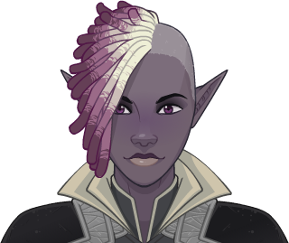

[Back to Main](index.md)

# Fen

Fen is a Drow Dhampir Warlock with a touch of mischief and sneakiness. She's loyal to those she cares for, a fearsome opponent for those who have earned her hate. Above all else, everything she's done has been for Isolde's freedom. Now she needs a new purpose to fight for, and maybe she can find it among the Society.

# Basic Information

Fen will be the new champion in the Midwinter event on 11 January 2023.

* Seat: 6
* Race: Dhampir Drow
* Class: Warlock / Rogue
* Roles: DPS / Support
* Gender: Female
* Alignment: Chaotic Evil
* Affiliation: Black Dice Society

| Stat | Value | Day 1 Trials | Patrons |
|---|---|---|---|
| Strength | 14 | Yes | Mirt |
| Dexterity | 14 | Yes | Vajra |
| Constitution | 16 | Yes | Strahd |
| Intelligence | 13 | Yes | Zariel |
| Wisdom | 12 | Yes | |
| Charisma | 14 | Yes | |

# Formation

# Abilities

**Base Attack: Pact Blade** (Melee)
> Fen darts out to the closest enemy and slashes with her longsword, hitting all nearby enemies.

<em>Raw Data</em>

<pre>
{
    "description": "Fen darts out to the closest enemy and slashes with her longsword, hitting all nearby enemies.",
    "long_description": "",
    "damage_modifier": 1,
    "damage_types": ["melee"],
    "graphic_id": 0,
    "target": "front",
    "aoe_radius": 150,
    "tags": [
        "melee",
        "aoe"
    ],
    "num_targets": 1,
    "animations": [{
        "damage_frame": 4,
        "jump_sound": 30,
        "sound_frames": {"2": 154},
        "target_offset_x": -34,
        "type": "melee_attack"
    }],
    "name": "Pact Blade",
    "cooldown": 6.5,
    "id": 582
}
</pre>

 

**Ultimate Attack: Form of Dread** (Level: 200)
> Fen transforms into her dread form. She sprouts wings, leaps into the air, and charges directly across the area, dealing one hit of ultimate damage to all enemies she passes and knocking them back a short distance.

<em>Raw Data</em>

<pre>
{
    "description": "Fen sprouts wings and charges, dealing damage to all enemies and knocking them back.",
    "long_description": "Fen transforms into her dread form. She sprouts wings, leaps into the air, and charges directly across the area, dealing one hit of ultimate damage to all enemies she passes and knocking them back a short distance.",
    "damage_modifier": 0.029999999999999999,
    "damage_types": ["melee"],
    "graphic_id": 17463,
    "target": "all",
    "aoe_radius": 0,
    "tags": [
        "ultimate",
        "melee"
    ],
    "num_targets": 1,
    "animations": [{
        "pushback": 150,
        "seqs": {
            "attack": 4,
            "start": 7,
            "finish": 8
        },
        "ultimate": "fen",
        "type": "ultimate_attack"
    }],
    "name": "Form of Dread",
    "cooldown": 60,
    "id": 583
}
</pre>

 

**Mischievous, but Dangerous** (Level: 40)
> Fen increases the damage of all Champions in her column by `$(amount)%`.

<em>Raw Data</em>

<pre>
{
    "static_dps_mult": null,
    "required_level": 40,
    "effect": "effect_def,1363",
    "tip_text": "Fen increases the damage of Champions in her column.",
    "name": "Mischievous, but Dangerous",
    "id": 9757,
    "hero_id": 118,
    "upgrade_type": "unlock_ability",
    "default_enabled": 1,
    "required_upgrade_id": 0
}
{
    "effect_keys": [{
        "effect_string": "hero_dps_multiplier_mult,100",
        "targets": ["col"]
    }],
    "requirements": "",
    "description": {"desc": "$(source_hero) increases the damage of all Champions in her column by $(amount)%."},
    "id": 1363,
    "flavour_text": "",
    "graphic_id": 17458,
    "properties": {
        "is_formation_ability": true,
        "owner_use_outgoing_description": true
    }
}
</pre>

 

**Patron's Oath** (Level: 60)
> While Fen is in the formation and you are in a patron variant or free play, patron challenge progress made by her party is increased by `$(amount)%`.

<em>Raw Data</em>

<pre>
{
    "static_dps_mult": null,
    "required_level": 60,
    "effect": "effect_def,1366",
    "tip_text": "Fen increases the amount of progress credited in Patron Challenges in the party she is in.",
    "name": "Patron's Oath",
    "id": 9760,
    "hero_id": 118,
    "upgrade_type": "unlock_ability",
    "default_enabled": 1,
    "required_upgrade_id": 0
}
{
    "effect_keys": [{
        "off_when_benched": true,
        "effect_string": "buff_patron_challenge_progress,100"
    }],
    "requirements": "",
    "description": {"desc": "While $(source_hero) is in the formation and you are in a patron variant or free play, patron challenge progress made by her party is increased by $(amount)%."},
    "id": 1366,
    "flavour_text": "",
    "graphic_id": 17459,
    "properties": {
        "is_formation_ability": true,
        "owner_use_outgoing_description": true
    }
}
</pre>

 

**Warlock Pact** (Level: 80)
> Fen reduces the normal attack speed of all Warlocks in the formation by `$(seconds_plural amount)` for each point of Wisdom an adjacent Champion has above `$(subtract_from_stat___2)`.

<em>Raw Data</em>

<pre>
{
    "static_dps_mult": null,
    "required_level": 80,
    "effect": "effect_def,1364",
    "name": "Warlock Pact",
    "id": 9758,
    "hero_id": 118,
    "upgrade_type": "unlock_ability",
    "default_enabled": 1,
    "required_upgrade_id": 0
}
{
    "effect_keys": [
        {
            "manual_stacking": true,
            "stacks_multiply": false,
            "formation_arrows_for_effected_only": true,
            "off_when_benched": true,
            "show_bonus": true,
            "effect_string": "reduce_attack_cooldown,0.1",
            "filter_targets": [{
                "type": "by_tags",
                "tags": "warlock"
            }],
            "targets": ["all"]
        },
        {
            "overlay": {
                "manual_graphic": "fen_warlock_pack",
                "y": -65
            },
            "stats": ["wis"],
            "subtract_from_stat": 10,
            "effect_string": "fen_warlock_pack",
            "count_on": "adj"
        }
    ],
    "requirements": "",
    "description": {"desc": "$(source_hero) reduces the normal attack speed of all Warlocks in the formation by $(seconds_plural amount) for each point of Wisdom an adjacent Champion has above $(subtract_from_stat___2)."},
    "id": 1364,
    "flavour_text": "",
    "graphic_id": 17460,
    "properties": {
        "indexed_effect_properties": true,
        "is_formation_ability": true,
        "default_bonus_index": 0,
        "owner_use_outgoing_description": true,
        "per_effect_index_bonuses": true
    }
}
</pre>

 

**I've Got You, Friends** (Level: 160)
> Fen increases the effect of Mischievous, but Dangerous by `$(amount)%` for each Champion in the formation that is either a Black Dice Society affiliation member or has a WIS of 15+, stacking multiplicatively.

<em>Raw Data</em>

<pre>
{
    "static_dps_mult": null,
    "required_level": 160,
    "effect": "effect_def,1365",
    "name": "I've Got You, Friends",
    "id": 9759,
    "hero_id": 118,
    "upgrade_type": "unlock_ability",
    "default_enabled": 1,
    "required_upgrade_id": 0
}
{
    "effect_keys": [{
        "stack_title": "Relevant Champions",
        "amount_updated_listeners": ["slot_changed"],
        "off_when_benched": true,
        "show_bonus": true,
        "amount_func": "mult",
        "stack_func": "per_crusader",
        "effect_string": "buff_upgrade,100,9757,0",
        "stack_func_data": {"target_filters_or": [
            {
                "stat": "wis",
                "comparison": "gte",
                "check": 15,
                "type": "stat"
            },
            {
                "type": "tags",
                "tags": "blackdicesociety"
            }
        ]}
    }],
    "requirements": "",
    "description": {"desc": "$(source_hero) increases the effect of Mischievous, but Dangerous by $(amount)% for each Champion in the formation that is either a Black Dice Society affiliation member or has a WIS of 15+, stacking multiplicatively."},
    "id": 1365,
    "flavour_text": "",
    "graphic_id": 17457,
    "properties": {
        "is_formation_ability": true,
        "owner_use_outgoing_description": true
    }
}
</pre>

 

# Specialisations

**Curse of the Dhampir** (Level: 140)
> Fen embraces her Dhampir heritage and increases her damage by `$(amount)%`.

<em>Raw Data</em>

<pre>
{
    "static_dps_mult": null,
    "specialization_name": "Curse of the Dhampir",
    "required_level": 140,
    "effect": "effect_def,1368",
    "name": "Curse of the Dhampir",
    "specialization_graphic_id": 17461,
    "id": 9762,
    "hero_id": 118,
    "upgrade_type": "unlock_ability",
    "default_enabled": 1,
    "required_upgrade_id": 0,
    "specialization_description": "Fen focuses on her Dhampir heritage, dealing much more damage."
}
{
    "effect_keys": [
        {"effect_string": "hero_dps_multiplier_mult,1000"},
        {
            "skin_property_prefix": "spec_2_overlay",
            "effect_string": "animation_synced_overlay,17498"
        }
    ],
    "requirements": "",
    "description": {"desc": "$(source_hero) embraces her Dhampir heritage and increases her damage by $(amount)%."},
    "id": 1368,
    "flavour_text": "",
    "graphic_id": 0,
    "properties": {
        "indexed_effect_properties": true,
        "is_formation_ability": true,
        "default_bonus_index": 0,
        "owner_use_outgoing_description": true,
        "type": "upgrade",
        "formation_circle_icon": false,
        "per_effect_index_bonuses": true
    }
}
</pre>

 

**Shadows of the Underdark** (Level: 140)
> Fen imbues her blade with eldritch energy, increasing the effect of Mischievous, but Dangerous by `$(amount)%` and causing her normal attack to deal an additional 5 seconds of BUD based damage with each hit.

<em>Raw Data</em>

<pre>
{
    "static_dps_mult": null,
    "specialization_name": "Shadows of the Underdark",
    "required_level": 140,
    "effect": "effect_def,1367",
    "name": "Shadows of the Underdark",
    "specialization_graphic_id": 17462,
    "id": 9761,
    "hero_id": 118,
    "upgrade_type": "unlock_ability",
    "default_enabled": 1,
    "required_upgrade_id": 0,
    "specialization_description": "Fen focuses on her eldritch blade, increasing her support and dealing additional damage."
}
{
    "effect_keys": [
        {"effect_string": "buff_upgrade,100,9757"},
        {
            "skin_property_prefix": "spec_1_overlay",
            "effect_string": "animation_synced_overlay,17499"
        },
        {"effect_string": "change_base_attack,584"}
    ],
    "requirements": "",
    "description": {"desc": "$(source_hero) imbues her blade with eldritch energy, increasing the effect of $(upgrade_name id) by $(amount)% and causing her normal attack to deal an additional 5 seconds of BUD based damage with each hit."},
    "id": 1367,
    "flavour_text": "",
    "graphic_id": 0,
    "properties": {
        "indexed_effect_properties": true,
        "is_formation_ability": true,
        "default_bonus_index": 0,
        "owner_use_outgoing_description": true,
        "type": "upgrade",
        "formation_circle_icon": false,
        "per_effect_index_bonuses": true
    }
}
</pre>

 

# Items

| Slot | Epic Name | Type |
|---|---|---|
| 1 | `Shared Tattoo` | Self DPS |
| 2 | `Feywild Duster` | All Champion Damage |
| 3 | `Armored Layer` | Mischievous, but Dangerous |
| 4 | `Dire Devices` | I've Got You, Friends |
| 5 | `Nepenthe` | All Specialisations |
| 6 | `Feywild Candy` | Ultimate Cooldown Reduction |

# Feats

This list will only show feats that are going to be available on the release of this champion. The separate [Feats](feats.md) page may show others that could be available later if they exist.

| Feat | Effect | Source |
|---|---|---|
| `Selflessness` | 10% All Champion Damage | Free |
| `Inspiring Leader` | 25% All Champion Damage | Gold Chest |
| `Tavern Brawler` | 30% Self DPS | Free |
| `Grappler` | 60% Self DPS | 12,500 Gems |
| `Never See it Coming` | 20% Mischievous, but Dangerous | Free |
| `I Know What I Am` | 40% I've Got You, Friends | Gold Chest |
| `Loyal Friend` | 40% All Specialisations | 12,500 Gems |
| `I Don't Trust This` | 200% Patron's Oath | 50,000 Gems |

# Legendaries

* Increases the damage of all Champions by 100%.
* Increases the damage of all Champions by 20% for each Female Champion in the formation.
* Increases the damage of all Champions by 100%.
* Increases the damage of all Champions by 20% for each Champion with a WIS score of 11 or higher in the formation.
* Increases the damage of all Champions with a STR score of 11 or higher by 100%.
* Increases the damage of all Evil Champions by 150%.

# Console Portrait

[Back to Top](#top)

*Last Modified: {{ site.time }}*