[Back to Main](index.md)

    
        
            
        
        
            Portrait
        
    
    
        
            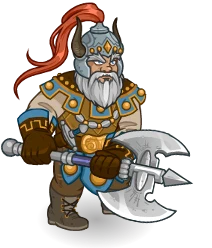
        
        
            Model
        
    

# Flint Fireforge

[Flint Fireforge - Dragonlace Fandom Wiki](https://dragonlance.fandom.com/wiki/Flint_Fireforge){:target="_blank"}

# Basic Information

Flint Fireforge will be a new champion in the Ahghairon's Day event on 5 August 2026.

    
        
            **Seat**:
        
        
            Unknown
        
    
    
        
            **Species**:
        
        
            Dwarf (Guess)
        
    
    
        
            **Class**:
        
        
            Fighter (Guess)
        
    
    
        
            **Roles**:
        
        
            DPS / Support / Gold / Control (Guess)
        
    
    
        
            **Age**:
        
        
            Unknown
        
    
    
        
            **Gender**:
        
        
            Male (Guess)
        
    
    
        
            **Alignment**:
        
        
            Unknown
        
    
    
        
            **Affiliation**:
        
        
            Heroes of the Lance (Guess)
        
    

# Formation

    <svg xmlns="http://www.w3.org/2000/svg" id="Flint" fill="#aaa" data-formationName="Flint" data-campaignName="Ahghairon's Day" width="364" height="140"><circle cx="215" cy="65" r="15"/><circle cx="215" cy="105" r="15"/><circle cx="175" cy="45" r="15"/><circle cx="175" cy="85" r="15"/><circle cx="175" cy="125" r="15"/><circle cx="135" cy="25" r="15"/><circle cx="135" cy="65" r="15"/><circle cx="95" cy="85" r="15"/><circle cx="55" cy="105" r="15"/><circle cx="15" cy="125" r="15"/><text x="245" y="25" fill="#dcdcdc" font-size="25" font-family="Arial" font-weight="bold">Flint</text><text x="245" y="65" fill="#dcdcdc" font-size="15" font-family="Arial" font-weight="bold">Ahghairon's Day</text></svg>

# Attacks

**Base Attack: Battleaxe** (Melee)
> Flint attacks the nearest enemy with his trusty battleaxe.  
> Cooldown: 4s (Cap 1s)

<em>Raw Data</em>

<pre>
{
    "id": 987,
    "name": "Battleaxe",
    "description": "Flint hits anything that gets too close with his axe.",
    "long_description": "Flint attacks the nearest enemy with his trusty battleaxe.",
    "graphic_id": 0,
    "target": "front",
    "num_targets": 1,
    "aoe_radius": 0,
    "damage_modifier": 1,
    "cooldown": 4,
    "animations": [
        {
            "type": "melee_attack",
            "target_offset_x": -34,
            "damage_frame": 2,
            "jump_sound": 30,
            "sound_frames": {
                "2": 154
            }
        }
    ],
    "tags": [
        "melee"
    ],
    "damage_types": [
        "melee"
    ]
}
</pre>

**Base Attack: Cleaving Strike** (Melee)
> Flint cleaves the nearest enemies with his trusty battleaxe.  
> Cooldown: 4s (Cap 1s)

<em>Raw Data</em>

<pre>
{
    "id": 988,
    "name": "Cleaving Strike",
    "description": "Flint cleaves anything that gets too close with his axe.",
    "long_description": "Flint cleaves the nearest enemies with his trusty battleaxe.",
    "graphic_id": 0,
    "target": "front",
    "num_targets": 1,
    "aoe_radius": 150,
    "damage_modifier": 1,
    "cooldown": 4,
    "animations": [
        {
            "type": "melee_attack",
            "attack_seq": "attack_b",
            "target_offset_x": -34,
            "damage_frame": 13,
            "jump_sound": 30,
            "sound_frames": {
                "2": 194
            }
        }
    ],
    "tags": [
        "melee"
    ],
    "damage_types": [
        "melee"
    ]
}
</pre>

**Ultimate Attack: Hammer of Reorx** (Guess)
> Flint deals one ultimate hit to a small group of nearby enemies, knocking them far away and stunning them.  
> Cooldown: 400s (Cap 100s)

<em>Raw Data</em>

<pre>
{
    "id": 989,
    "name": "Hammer of Reorx",
    "description": "Flint deals one ultimate hit to a small group of nearby enemies and knocks them back.",
    "long_description": "Flint deals one ultimate hit to a small group of nearby enemies, knocking them far away and stunning them.",
    "graphic_id": 29611,
    "target": "front_retaliate_if_possible",
    "num_targets": 1,
    "aoe_radius": 200,
    "damage_modifier": 0.03,
    "cooldown": 400,
    "animations": [
        {
            "type": "melee_attack",
            "power_up_sequence": {
                "start_frame": 0,
                "end_frame": 13
            },
            "sequences": [
                {
                    "start_frame": 22,
                    "end_frame": 62,
                    "damage_frame": 25,
                    "target_offset_x": -34,
                    "effects_on_monsters": [
                        {
                            "effect_string": "push_back_monster,1000",
                            "animation": "hit",
                            "after_damage": true,
                            "push_speed": 800
                        }
                    ]
                }
            ]
        }
    ],
    "tags": [
        "melee",
        "ultimate"
    ],
    "damage_types": [
        "melee"
    ]
}
</pre>

# Abilities

**Unknown** (Guess)
> Despite how annoyed and frustrated Flint can be when it comes to Tasslehoff, the two are inseparable. If Tasslehoff qualifies for an adventure restriction based on his tags, age, ability scores, etc., Flint may be used as well.

<em>Raw Data</em>

<pre>
{
    "id": 2796,
    "flavour_text": "",
    "description": {
        "desc": "Despite how annoyed and frustrated Flint can be when it comes to Tasslehoff, the two are inseparable. If Tasslehoff qualifies for an adventure restriction based on his tags, age, ability scores, etc., Flint may be used as well."
    },
    "effect_keys": [
        {
            "effect_string": "do_nothing"
        }
    ],
    "requirements": "",
    "graphic_id": 0,
    "large_graphic_id": 0,
    "properties": {
        "is_formation_ability": true,
        "formation_circle_icon": false,
        "owner_use_outgoing_description": true
    }
}
</pre>

**Forged Bonds** (Guess)
> Flint gains a Forged Bonds stack for each Champion adjacent to him. Flint buffs all Champions in his column and the column behind him by 100% for each Forged Bonds stack, stacking multiplicatively.

ⓘ *Note: This ability is prestack.*

<em>Raw Data</em>

<pre>
{
    "id": 2797,
    "flavour_text": "",
    "description": {
        "desc": "Flint gains a Forged Bonds stack for each Champion adjacent to him. Flint buffs all Champions in his column and the column behind him by $amount% for each Forged Bonds stack, stacking multiplicatively."
    },
    "effect_keys": [
        {
            "effect_string": "pre_stack_amount,100"
        },
        {
            "effect_string": "hero_dps_multiplier_mult,100",
            "use_computed_amount_for_description": true,
            "targets": [
                "col_and_prev_col"
            ],
            "amount_expr": "upgrade_amount(20130,0)",
            "amount_func": "mult",
            "stack_func": "per_hero_attribute",
            "per_hero_targets": [
                "adj"
            ],
            "post_process_expr": "as_int(GetFeatEquipped(2712)) + as_int(GetFeatEquipped(2713))*2 + as_int(GetFeatEquipped(2714))*as_int(GetUpgradeStacks(20130,2)) + as_int(GetFeatEquipped(2711))*as_int(IsHeroInFormation(174))*3 + input",
            "per_hero_expr": "true",
            "show_bonus": true,
            "stack_title": "Forged Bonds Stacks",
            "amount_updated_listeners": [
                "upgrade_unlocked",
                "slot_changed",
                "feat_changed",
                "hero_tags_changed"
            ]
        },
        {
            "effect_string": "forged_bonds_dwarf_extra_stacks",
            "stack_func": "per_hero_attribute",
            "per_hero_targets": [
                "adj"
            ],
            "per_hero_expr": "HasTag(`dwarf`)",
            "show_bonus": false,
            "show_stacks": false,
            "amount_updated_listeners": [
                "upgrade_unlocked",
                "slot_changed",
                "feat_changed",
                "hero_tags_changed"
            ]
        }
    ],
    "requirements": "",
    "graphic_id": 29596,
    "large_graphic_id": 29592,
    "properties": {
        "is_formation_ability": true,
        "formation_circle_icon": false,
        "owner_use_outgoing_description": true,
        "indexed_effect_properties": true,
        "per_effect_index_bonuses": true,
        "default_bonus_index": 0,
        "retain_on_slot_changed": true
    }
}
</pre>

**Stubborn Determination** (Guess)
> Flint reduces the damage taken by all Champions by 10% for each Forged Bonds stack he currently has, stacking additively and capping at 90%.

<em>Raw Data</em>

<pre>
{
    "id": 2798,
    "flavour_text": "",
    "description": {
        "desc": "Flint reduces the damage taken by all Champions by $(amount)% for each Forged Bonds stack he currently has, stacking additively and capping at $(max_resistance_for_description)%."
    },
    "effect_keys": [
        {
            "effect_string": "reduce_incoming_damage_percent,10",
            "targets": [
                "all"
            ],
            "off_when_benched": true,
            "amount_func": "add",
            "stack_func": "per_hero_attribute",
            "post_process_expr": "as_int(GetUpgradeStacks(20130, 1))",
            "stacks_multiply": false,
            "show_bonus": true,
            "max_stacks": 9,
            "amount_updated_listeners": [
                "slot_changed",
                "hero_tags_changed"
            ],
            "max_resistance_for_description": 90,
            "retarget_when_any_hero_slot_changed": true,
            "use_computed_amount_for_description": true
        }
    ],
    "requirements": "",
    "graphic_id": 29598,
    "large_graphic_id": 29594,
    "properties": {
        "is_formation_ability": true,
        "owner_use_outgoing_description": true,
        "formation_circle_icon": false,
        "indexed_effect_properties": true,
        "per_effect_index_bonuses": true,
        "default_bonus_index": 0
    }
}
</pre>

**Stone Cunning** (Guess)
> The effect of Forged Bonds is increased by 10% for each completed area in the current adventure that was Underground.

<em>Raw Data</em>

<pre>
{
    "id": 2799,
    "flavour_text": "",
    "description": {
        "desc": {
            "pre": "The effect of Forged Bonds is increased by $amount% for each completed area in the current adventure that was Underground.",
            "post": {
                "conditions": [
                    {
                        "condition": "not static_desc",
                        "desc": "^^This adventure is underground in $(flint_stonecunning_percent)% of areas."
                    }
                ]
            }
        }
    },
    "effect_keys": [
        {
            "effect_string": "buff_upgrade,10,20130,1",
            "off_when_benched": true,
            "stacks_on_trigger": "will_stack_manually",
            "stacks_multiply": true,
            "show_bonus": true
        },
        {
            "effect_string": "flint_stonecunning_handler",
            "off_when_benched": true,
            "buff_index": 0
        }
    ],
    "requirements": "",
    "graphic_id": 29597,
    "large_graphic_id": 29593,
    "properties": {
        "is_formation_ability": true,
        "formation_circle_icon": false,
        "use_outgoing_description": true
    }
}
</pre>

**Take the Initiative** (Guess)
> Until he takes damage in an area, Flint gains an Initiative stack whenever he attacks an enemy. Once he has taken damage, Flint gains Follow-Through stacks when he attacks instead. The damage of Forged Bonds is increased by 100% for each Follow-Through stack he has, stacking multiplicatively. The number of Follow-Through stacks can not exceed the number of Initiative stacks he has gained, and Initiative caps at 100 stacks. Both stacks reset when changing areas or when Flint is moved in the formation or removed from it.

<em>Raw Data</em>

<pre>
{
    "id": 2800,
    "flavour_text": "",
    "description": {
        "desc": "Until he takes damage in an area, Flint gains $(if feat_assigned 2717)$stacks_per_hit Initiative stacks$(else)an Initiative stack$(fi) whenever he attacks an enemy. Once he has taken damage, Flint gains Follow-Through stacks when he attacks instead. The damage of Forged Bonds is increased by $(not_buffed amount___3)% for each Follow-Through stack he has, stacking multiplicatively. The number of Follow-Through stacks can not exceed the number of Initiative stacks he has gained, and Initiative caps at $max_stacks___2 stacks. Both stacks reset when changing areas or when Flint is moved in the formation or removed from it."
    },
    "effect_keys": [
        {
            "effect_string": "flint_take_the_initiative_handler",
            "initiative_index": 1,
            "follow_through_index": 2,
            "stacks_per_hit": 1
        },
        {
            "effect_string": "do_nothing,0",
            "stacks_on_trigger": "will_stack_manually",
            "stacks_multiply": false,
            "show_stacks": true,
            "max_stacks": 100,
            "stack_title": "Initiative Stacks"
        },
        {
            "effect_string": "buff_upgrade,100,20130,1",
            "stacks_on_trigger": "will_stack_manually",
            "stacks_multiply": true,
            "show_bonus": true,
            "stack_title": "Follow-Through Stacks"
        }
    ],
    "requirements": "",
    "graphic_id": 29599,
    "large_graphic_id": 29595,
    "properties": {
        "is_formation_ability": true,
        "formation_circle_icon": false,
        "owner_use_outgoing_description": true,
        "indexed_effect_properties": true,
        "per_effect_index_bonuses": true,
        "default_bonus_index": 2,
        "retain_on_slot_changed": true
    }
}
</pre>

# Specialisations

**Fatherly Advice** (Guess)
> Increase the effect of Flint's Forged Bonds by 100% for each Champion in the formation who is 40 years old or younger, stacking multiplicatively.

ⓘ *Note: This ability is prestack.*

<em>Raw Data</em>

<pre>
{
    "id": 2801,
    "flavour_text": "",
    "description": {
        "desc": "Increase the effect of Flint's Forged Bonds by $amount% for each Champion in the formation who is 40 years old or younger, stacking multiplicatively."
    },
    "effect_keys": [
        {
            "effect_string": "pre_stack,100",
            "off_when_benched": true
        },
        {
            "effect_string": "buff_upgrade,0,20130,1",
            "off_when_benched": true,
            "amount_expr": "upgrade_amount(20134,0)",
            "amount_func": "mult",
            "stack_func": "per_hero_attribute",
            "per_hero_expr": "age<=40 && hero_id != 146",
            "show_bonus": true,
            "amount_updated_listeners": [
                "slot_changed",
                "feat_changed"
            ]
        }
    ],
    "requirements": "",
    "graphic_id": 29602,
    "large_graphic_id": 29602,
    "properties": {
        "is_formation_ability": true,
        "formation_circle_icon": false,
        "owner_use_outgoing_description": true,
        "indexed_effect_properties": true,
        "per_effect_index_bonuses": true,
        "default_bonus_index": 0,
        "retain_on_slot_changed": true,
        "spec_option_post_apply_info": "Young Champions: $num_stacks___2"
    }
}
</pre>

**Forged in War** (Guess)
> Increase the effect of Flint's Forged Bonds by 150% for each Heroes of the Lance Champion in the formation, stacking multiplicatively.

ⓘ *Note: This ability is prestack.*

<em>Raw Data</em>

<pre>
{
    "id": 2802,
    "flavour_text": "",
    "description": {
        "desc": "Increase the effect of Flint's Forged Bonds by $amount% for each Heroes of the Lance Champion in the formation, stacking multiplicatively."
    },
    "effect_keys": [
        {
            "effect_string": "pre_stack,150",
            "off_when_benched": true
        },
        {
            "effect_string": "buff_upgrade,0,20130,1",
            "off_when_benched": true,
            "amount_expr": "upgrade_amount(20135,0)",
            "amount_func": "mult",
            "stack_func": "per_hero_attribute",
            "per_hero_expr": "HasTag(`heroeslance`)",
            "show_bonus": true,
            "amount_updated_listeners": [
                "slot_changed",
                "hero_tags_changed"
            ]
        }
    ],
    "requirements": "",
    "graphic_id": 29604,
    "large_graphic_id": 29604,
    "properties": {
        "is_formation_ability": true,
        "formation_circle_icon": false,
        "owner_use_outgoing_description": true,
        "indexed_effect_properties": true,
        "per_effect_index_bonuses": true,
        "default_bonus_index": 0,
        "retain_on_slot_changed": true,
        "spec_option_post_apply_info": "Heroes of the Lance Champions: $num_stacks___2"
    }
}
</pre>

**Blood of Reorx** (Guess)
> Increase the effect of Flint's Forged Bonds by 200% for each dwarf in the formation, stacking multiplicatively.

ⓘ *Note: This ability is prestack.*

<em>Raw Data</em>

<pre>
{
    "id": 2803,
    "flavour_text": "",
    "description": {
        "desc": "Increase the effect of Flint's Forged Bonds by $amount% for each dwarf in the formation, stacking multiplicatively."
    },
    "effect_keys": [
        {
            "effect_string": "pre_stack,200",
            "off_when_benched": true
        },
        {
            "effect_string": "buff_upgrade,0,20130,1",
            "off_when_benched": true,
            "amount_expr": "upgrade_amount(20136,0)",
            "amount_func": "mult",
            "stack_func": "per_hero_attribute",
            "per_hero_expr": "HasTag(`dwarf`)",
            "show_bonus": true,
            "amount_updated_listeners": [
                "slot_changed",
                "hero_tags_changed"
            ]
        }
    ],
    "requirements": "",
    "graphic_id": 29600,
    "large_graphic_id": 29600,
    "properties": {
        "is_formation_ability": true,
        "formation_circle_icon": false,
        "owner_use_outgoing_description": true,
        "indexed_effect_properties": true,
        "per_effect_index_bonuses": true,
        "default_bonus_index": 0,
        "retain_on_slot_changed": true,
        "spec_option_post_apply_info": "Dwarf Champions: $num_stacks___2"
    }
}
</pre>

**Craft Maker** (Guess)
> Flint gains the Gold role and the party's Gold Find is increased proportionally based upon the max health of enemies in the current area. For each order of magnitude of max health the enemies have, the party's Gold Find is increased by 15%, stacking multiplicatively.

<em>Raw Data</em>

<pre>
{
    "id": 2804,
    "flavour_text": "",
    "description": {
        "desc": "Flint gains the Gold role and the party's Gold Find is increased proportionally based upon the max health of enemies in the current area. For each order of magnitude of max health the enemies have, the party's Gold Find is increased by $amount%, stacking multiplicatively."
    },
    "effect_keys": [
        {
            "off_when_benched": true,
            "effect_string": "gold_multiplier_mult,15",
            "stack_title": "Enemy Health Order of Magnitude",
            "amount_func": "mult",
            "stack_func": "per_monster_health_order_of_magnitude",
            "stacks_multiply": true,
            "show_bonus": true,
            "amount_updated_listeners": [
                "area_changed"
            ]
        },
        {
            "effect_string": "add_hero_tags,0,gold"
        }
    ],
    "requirements": "",
    "graphic_id": 29601,
    "large_graphic_id": 29601,
    "properties": {
        "is_formation_ability": true,
        "owner_use_outgoing_description": true,
        "indexed_effect_properties": true,
        "per_effect_index_bonuses": true,
        "default_bonus_index": 0
    }
}
</pre>

**Foe Breaker** (Guess)
> Flint gains the Breaker role. Attacks from Champions who are affected by Flint's Forged Bonds ability (including himself) remove an extra segment from enemies with segmented, armored, or critical health.

<em>Raw Data</em>

<pre>
{
    "id": 2805,
    "flavour_text": "",
    "description": {
        "desc": "Flint gains the Breaker role. Attacks from Champions who are affected by Flint's Forged Bonds ability (including himself) remove an extra segment from enemies with segmented, armored, or critical health."
    },
    "effect_keys": [
        {
            "effect_string": "add_hero_tags,0,breaking",
            "off_when_benched": true,
            "skip_effect_key_desc": true
        },
        {
            "off_when_benched": true,
            "effect_string": "increase_damage_against_monster_armor_and_hits,1",
            "override_key_desc": "$(target)'s attacks removes an extra segment from enemies with segmented, armored, or critical health.",
            "targets": [
                "all"
            ],
            "filter_targets": [
                {
                    "type": "hero_expr",
                    "hero_expr": "HasEffectByID(2797)"
                }
            ]
        }
    ],
    "requirements": "",
    "graphic_id": 29603,
    "large_graphic_id": 29603,
    "properties": {
        "is_formation_ability": true,
        "owner_use_outgoing_description": true
    }
}
</pre>

**Life Taker** (Guess)
> Flint gains the DPS role and increases his own damage by 10000% for each Forged Bonds stack he has, stacking multiplicatively. His base attack also gains a small cleave.

<em>Raw Data</em>

<pre>
{
    "id": 2806,
    "flavour_text": "",
    "description": {
        "desc": "Flint gains the DPS role and increases his own damage by $amount% for each Forged Bonds stack he has, stacking multiplicatively. His base attack also gains a small cleave."
    },
    "effect_keys": [
        {
            "effect_string": "hero_dps_multiplier_mult,10000",
            "off_when_benched": true,
            "amount_func": "mult",
            "stack_func": "per_hero_attribute",
            "post_process_expr": "as_int(GetUpgradeStacks(20130, 1))",
            "stacks_multiply": true,
            "show_bonus": true,
            "amount_updated_listeners": [
                "slot_changed",
                "hero_tags_changed"
            ],
            "use_computed_amount_for_description": true
        },
        {
            "effect_string": "add_hero_tags,0,dps",
            "skip_effect_key_desc": true
        },
        {
            "effect_string": "change_base_attack,988",
            "skip_effect_key_desc": true
        }
    ],
    "requirements": "",
    "graphic_id": 29605,
    "large_graphic_id": 29605,
    "properties": {
        "is_formation_ability": true,
        "owner_use_outgoing_description": true,
        "formation_circle_icon": false,
        "indexed_effect_properties": true,
        "per_effect_index_bonuses": true,
        "default_bonus_index": 0
    }
}
</pre>

# Items

    
        
            **Icons**
        
        
            **Name**
        
    
    
        
            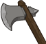
        
        
            Battle Axe
        
    
    
        
            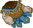
        
        
            Clothing
        
    
    
        
            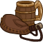
        
        
            Comforts
        
    
    
        
            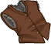
        
        
            Dragonriding
        
    
    
        
            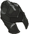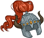
        
        
            Helm
        
    
    
        
            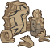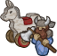
        
        
            Woodcarving
        
    

# Feats

Unknown.

# Legendaries

Unknown.

# Adventures and Variants

**Unlock Adventure: Reclaiming the Past (Flint)** (Complete Area 50)
> Help Laeral Silverhand track down a retired Open Lord.

 **Variant 1: Forging Ahead** (Complete Area 75)
> Flint starts in the formation. He can be moved, but not removed.   
> Only champions in Flint's column and the column behind him can deal damage.   
> Some pesky draconians spawn with each wave. They don't drop gold nor count towards quest progress.  
> <b>Getting to Know Flint:</b> Flint's Forged Bonds ability only applies to Champions in his column and the one behind him. Put your main damage dealer in either of those columns!

 **Variant 2: Road to Qualinesti** (Complete Area 125)
> Flint starts in the formation. He can be moved, but not removed.   
> An elf bard interested in securing Flint's service as a master craftsman joins the formation. If Flint is ever not adjacent to this elf, all Champion damage is set to 0.   
> Only Champions who are dwarves, members of the Heroes of the Lance affiliation, and those of age 40 or younger may be used.  
> <b>Getting to Know Flint:</b> Flint's first specialization lets you choose a group of Champions to further enhance his Forged Bonds ability. Which group best suits your needs?

 **Variant 3: First Strike** (Complete Area 175)
> Flint starts in the formation. He cannot be moved, nor removed.   
> Other than Flint, only Tasslehoff and Champions with the Control role may be used.   
> Enemies move twice as fast, but the effect of knockbacks are increased by 200%.   
> If Tasslehoff is in the formation, Flint's Ultimate cooldown is reduced by 50%.   
> In each boss area, a young blue dragon spawns as part of the first wave. It must also be defeated to progress.  
> <b>Getting to Know Flint:</b> Flint's Take the Initiative ability grows stronger as he attacks enemies until he takes damage, then empowers his Forged Bonds ability with each subsequent attack he makes . Use Champions who can disrupt the enemy's advance to help Flint reach his full potential!

# Other Champion Images

    
        
            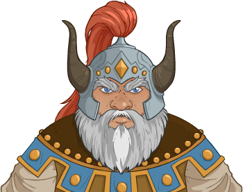Console Portrait
        
    
    
        
            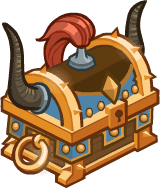Gold Chest Icon
        
        
            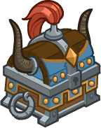Silver Chest Icon
        
    

[Back to Top](#top)

*Last Modified: {{ site.time }}*