[Back to Main](index.md)

    
        Portait
    
    
        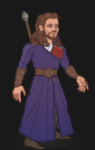Model
    

# Gale

Gale of Waterdeep was a prodigious archmage, his talents earning him the attention of Mystra, the goddess of magic. At her side, he learned all that mortals might accomplish with the Weave, in time earning his place as her lover, and her Chosen. And yet, he was not satisfied. In an attempt to prove he was ready for even greater power, he accidentally unleashed 'the orb' - a highly volatile fragment of pure Weave, corrupted by Netherese magic, which buried itself in his chest. Cast out by Mystra, humbled by his downfall, he does all he can to prevent the orb's cataclysmic detonation, watching for his chance to get back everything he lost, and more.

# Basic Information

Gale will be the new champion in the Greengrass event on 3 April 2024.

    
        
            **Seat**:
        
        
            1
        
        
            **Stat**
        
        
            **Value**
        
        
            **Day 1 Trials**
        
        
            **Patrons**
        
    
    
        
            **Race**:
        
        
            Human
        
        
            **Strength**:
        
        
            8
        
        
            -
        
        
            Mirt (with Feat)
        
    
    
        
            **Class**:
        
        
            Wizard
        
        
            **Dexterity**:
        
        
            13
        
        
            Yes
        
        
            Vajra
        
    
    
        
            **Roles**:
        
        
            Support
        
        
            **Constitution**:
        
        
            15
        
        
            Yes
        
        
            Strahd
        
    
    
        
            **Age**:
        
        
            35
        
        
            **Intelligence**:
        
        
            17
        
        
            Yes
        
        
            -
        
    
    
        
            **Gender**:
        
        
            Male
        
        
            **Wisdom**:
        
        
            10
        
        
            Yes
        
        
            Elminster (Ability)
        
    
    
        
            **Alignment**:
        
        
            Neutral
        
        
            **Charisma**:
        
        
            12
        
        
            Yes
        
        
            &nbsp;
        
    
    
        
            **Affiliation**:
        
        
            Absolute Adversaries
        
        
            **Total**:
        
        
            75
        
        
            Champion ID:
        
        
            147
        
    

# Formation

    <svg xmlns="http://www.w3.org/2000/svg" id="Gale" fill="#aaa" data-formationName="Gale" data-campaignName="Greengrass" width="294" height="160"><circle cx="175" cy="45" r="15"/><circle cx="135" cy="25" r="15"/><circle cx="135" cy="65" r="15"/><circle cx="135" cy="105" r="15"/><circle cx="135" cy="145" r="15"/><circle cx="95" cy="85" r="15"/><circle cx="95" cy="125" r="15"/><circle cx="55" cy="65" r="15"/><circle cx="55" cy="145" r="15"/><circle cx="15" cy="45" r="15"/><text x="205" y="25" fill="#dcdcdc" font-size="25" font-family="Arial" font-weight="bold">Gale</text><text x="205" y="65" fill="#dcdcdc" font-size="15" font-family="Arial" font-weight="bold">Greengrass</text></svg>

# Abilities

 **Base Attack: Fire Bolt** (Magic)
> Gale deals 1 hit to a random enemy, prioritizing enemies he hasn't hit yet.  
> Cooldown: 4.5s (Cap 1.125s)

<em>Raw Data</em>

<pre>
{
    "id": 743,
    "name": "Fire Bolt",
    "description": "Gale deals 1 hit to a random enemy, prioritizing enemies he hasn't hit yet.",
    "long_description": "",
    "graphic_id": 0,
    "target": "gale_random_prefer_non_debuffed",
    "num_targets": 1,
    "aoe_radius": 0,
    "damage_modifier": 1,
    "cooldown": 4.5,
    "animations": [
        {
            "type": "ranged_attack",
            "projectile": "pd_generic_projectile",
            "shoot_offset_y": -25,
            "shoot_offset_x": 30,
            "shoot_frame": 13,
            "shoot_sound": 149,
            "hit_sound": 133,
            "projectile_details": {
                "hash": "dhadius_firebolt",
                "projectile_hit_graphic_id": 1318,
                "projectile_speed": 1600,
                "projectile_graphic_id": 22787,
                "trail": {
                    "particle_graphic_ids": [
                        "22787"
                    ],
                    "lifespan": 0.2,
                    "spawn_rate": 100,
                    "initial_velocity": {
                        "x": 0,
                        "y": 0
                    },
                    "velocity_jitter": {
                        "x": 30,
                        "y": 30
                    },
                    "rotation_jitter": 30,
                    "alpha_lerp": {
                        "0": 0,
                        "0.1": 0.75,
                        "0.5": 0.3,
                        "1": 0
                    },
                    "scale_lerp": [
                        {
                            "x": 0.65,
                            "y": 0.65
                        },
                        {
                            "x": 1.5,
                            "y": 1.5
                        }
                    ],
                    "tint_lerp": {
                        "0": "#FFFF00",
                        "0.3": "#FF0000",
                        "0.6": "#000000"
                    }
                },
                "percent_height_offset": 5,
                "use_auto_rotation": true
            }
        }
    ],
    "tags": [
        "ranged"
    ],
    "damage_types": [
        "magic"
    ]
}
</pre>

 **Base Attack: Fire Bolt - Evocation** (Magic)
> Gale deals 1 hit to a random enemy and those nearby, prioritizing enemies he hasn't hit yet.  
> Cooldown: 4.5s (Cap 1.125s)

<em>Raw Data</em>

<pre>
{
    "id": 744,
    "name": "Fire Bolt - Evocation",
    "description": "Gale deals 1 hit to a random enemy and those nearby, prioritizing enemies he hasn't hit yet.",
    "long_description": "",
    "graphic_id": 0,
    "target": "gale_random_prefer_non_debuffed",
    "num_targets": 1,
    "aoe_radius": 100,
    "damage_modifier": 1,
    "cooldown": 4.5,
    "animations": [
        {
            "type": "ranged_attack",
            "projectile": "pd_generic_projectile",
            "shoot_offset_y": -25,
            "shoot_offset_x": 30,
            "shoot_frame": 13,
            "shoot_sound": 149,
            "hit_sound": 133,
            "projectile_details": {
                "hash": "dhadius_firebolt",
                "projectile_hit_graphic_id": 1318,
                "projectile_speed": 1600,
                "projectile_graphic_id": 22787,
                "trail": {
                    "particle_graphic_ids": [
                        "22787"
                    ],
                    "lifespan": 0.2,
                    "spawn_rate": 100,
                    "initial_velocity": {
                        "x": 0,
                        "y": 0
                    },
                    "velocity_jitter": {
                        "x": 30,
                        "y": 30
                    },
                    "rotation_jitter": 30,
                    "alpha_lerp": {
                        "0": 0,
                        "0.1": 0.75,
                        "0.5": 0.3,
                        "1": 0
                    },
                    "scale_lerp": [
                        {
                            "x": 0.65,
                            "y": 0.65
                        },
                        {
                            "x": 1.5,
                            "y": 1.5
                        }
                    ],
                    "tint_lerp": {
                        "0": "#FFFF00",
                        "0.3": "#FF0000",
                        "0.6": "#000000"
                    }
                },
                "percent_height_offset": 5,
                "use_auto_rotation": true
            }
        }
    ],
    "tags": [
        "ranged",
        "aoe"
    ],
    "damage_types": [
        "magic"
    ]
}
</pre>

 **Ultimate Attack: Gale's Gale** (Level: 170)
> Gale casts Gust of Wind, knocking back all enemies, dealing ultimate damage and slowing them for 15 seconds.  
> Cooldown: 330s (Cap 82.5s)

<em>Raw Data</em>

<pre>
{
    "id": 745,
    "name": "Gale's Gale",
    "description": "Gale knocks back all enemies, dealing ultimate damage and slowing them for 15 seconds.",
    "long_description": "Gale casts Gust of Wind, knocking back all enemies, dealing ultimate damage and slowing them for 15 seconds.",
    "graphic_id": 22837,
    "target": "all",
    "num_targets": 1,
    "aoe_radius": 0,
    "damage_modifier": 0.03,
    "cooldown": 330,
    "animations": [
        {
            "type": "ultimate_attack",
            "ultimate": "gale",
            "push_back_amount": 300,
            "projectile_details": {
                "hash": "gale_ult",
                "projectile_speed": 1500,
                "tween_func": "strong_in_out",
                "reset_defaults": true,
                "target_offset_y": 0,
                "trail": {
                    "particle_graphic_ids": [
                        "22786"
                    ],
                    "lifespan": 0.7,
                    "spawn_rate": 100,
                    "spawn_shape_scale": {
                        "x": 200,
                        "y": 200
                    },
                    "initial_velocity": {
                        "x": 0,
                        "y": 0
                    },
                    "velocity_jitter": {
                        "x": 30,
                        "y": 30
                    },
                    "rotation_jitter": 0,
                    "alpha_lerp": [
                        1
                    ],
                    "scale_lerp": [
                        {
                            "x": 2.5,
                            "y": 2.5
                        }
                    ],
                    "tint_lerp": {
                        "0": "#FFFFFF",
                        "0.1": "#ddf2fe",
                        "0.4": "#d3fbfb",
                        "0.6": "#ddf2fe",
                        "0.75": "#c3c3c3"
                    }
                }
            }
        }
    ],
    "tags": [
        "ranged",
        "aoe",
        "ultimate"
    ],
    "damage_types": [
        "magic"
    ]
}
</pre>

 **Ally of Elminster** (Level: 0)
> As an Ally of Elminster, Gale can be used in any Elminster Patron adventure or variant, even if he would not normally be available to be used due to variant or patron restrictions.

<em>Raw Data</em>

<pre>
{
    "id": 14570,
    "hero_id": 147,
    "required_level": 0,
    "required_upgrade_id": 0,
    "upgrade_type": "unlock_ability",
    "effect": "effect_def,1891",
    "static_dps_mult": null,
    "default_enabled": 1,
    "name": "Ally of Elminster"
}
{
    "id": 1891,
    "flavour_text": "",
    "description": {
        "desc": "As an Ally of Elminster, Gale can be used in any Elminster Patron adventure or variant, even if he would not normally be available to be used due to variant or patron restrictions."
    },
    "effect_keys": [
        {
            "effect_string": "do_nothing"
        }
    ],
    "requirements": "",
    "graphic_id": 22827,
    "large_graphic_id": 22824,
    "properties": {
        "is_formation_ability": true,
        "type": "upgrade",
        "formation_circle_icon": false,
        "owner_use_outgoing_description": true,
        "retain_on_slot_changed": true
    }
}
</pre>

 **Archmage's Insight** (Level: 50)
> Gale increases the damage of Champions in the two columns in front of him by 100%.

<em>Upgrade Data</em>

<pre>
Upgrades:
      200: 100%
      280: 100%
      400: 100%
      500: 100%
      600: 100%
      700: 100%
      820: 100%
      940: 100%
    1,050: 100%
    1,170: 100%
    1,280: 100%
    1,400: 100%
    1,500: 100%
    1,620: 100%
    1,730: 100%
    1,850: 100%
    1,960: 100%
    2,070: 100%
    2,190: 100%
    2,270: 100%
    2,350: 100%

    Total Upgrade Bonus: 2.10e08%
</pre>

<em>Raw Data</em>

<pre>
{
    "id": 14571,
    "hero_id": 147,
    "required_level": 50,
    "required_upgrade_id": 0,
    "upgrade_type": "unlock_ability",
    "effect": "effect_def,1892",
    "static_dps_mult": null,
    "default_enabled": 1,
    "name": "Archmage's Insight",
    "tip_text": "Gale increases the damage of Champions in the two columns in front of him."
}
{
    "id": 1892,
    "flavour_text": "",
    "description": {
        "conditions": [
            {
                "condition": "upgrade_purchased 14576",
                "desc": "Gale increases the damage of Champions in the three columns in front of him by $(amount)%."
            },
            {
                "condition": "upgrade_purchased 14577",
                "desc": "Gale increases the damage of Champions in his column and the column behind him by $(amount)%."
            },
            {
                "desc": "Gale increases the damage of Champions in the two columns in front of him by $(amount)%."
            }
        ]
    },
    "effect_keys": [
        {
            "effect_string": "hero_dps_multiplier_mult,100",
            "targets": [
                "next_two_col"
            ]
        }
    ],
    "requirements": "",
    "graphic_id": 22828,
    "large_graphic_id": 22825,
    "properties": {
        "is_formation_ability": true,
        "owner_use_outgoing_description": true
    }
}
</pre>

 **Netherese Orb** (Level: 100)
> The first time Gale damages any enemy, they take 1000% additional damage from all subsequent attacks.

<em>Raw Data</em>

<pre>
{
    "id": 14572,
    "hero_id": 147,
    "required_level": 100,
    "required_upgrade_id": 0,
    "upgrade_type": "unlock_ability",
    "effect": "effect_def,1893",
    "static_dps_mult": null,
    "default_enabled": 1,
    "name": "Netherese Orb",
    "tip_text": "The power of the Netherese Orb leaves enemies that Gale damages vulnerable to all subsequent attacks."
}
{
    "id": 1893,
    "flavour_text": "",
    "description": {
        "desc": "The first time Gale damages any enemy, they take $(amount)% additional damage from all subsequent attacks."
    },
    "effect_keys": [
        {
            "off_when_benched": true,
            "effect_string": "gale_netherese_orb,1000",
            "debuffing_attack_ids": [
                743,
                744,
                745
            ],
            "debuff_effects": [
                {
                    "effect_string": "gale_netherese_orb_debuff"
                },
                {
                    "effect_string": "increase_monster_damage,$amount",
                    "active_graphic_id": 22872,
                    "active_graphic_x": 0,
                    "active_graphic_y": -60,
                    "stacks_on_reapply": true,
                    "manual_stacking": true,
                    "default_stacks": 1,
                    "max_stacks": 1,
                    "stacks_multiply": false,
                    "use_collection_source": true
                }
            ]
        }
    ],
    "requirements": "",
    "graphic_id": 22829,
    "large_graphic_id": 22826,
    "properties": {
        "is_formation_ability": true,
        "owner_use_outgoing_description": true
    }
}
</pre>

 **Gale's Gale** (Level: 170)
> Unknown Effect.

<em>Raw Data</em>

<pre>
{
    "id": 14581,
    "hero_id": 147,
    "required_level": 170,
    "required_upgrade_id": 0,
    "upgrade_type": "unlock_ultimate",
    "effect": "set_ultimate_attack",
    "static_dps_mult": null,
    "default_enabled": 1,
    "name": "Gale's Gale"
}
</pre>

 **An Experienced Sage** (Level: 430)
> Gale increases the effect of Archmage's Insight by 10% for each Elminster Patron variant you have completed, stacking multiplicatively.

<em>Raw Data</em>

<pre>
{
    "id": 14573,
    "hero_id": 147,
    "required_level": 430,
    "required_upgrade_id": 0,
    "upgrade_type": "unlock_ability",
    "effect": "effect_def,1894",
    "static_dps_mult": null,
    "default_enabled": 1,
    "name": "An Experienced Sage"
}
{
    "id": 1894,
    "flavour_text": "",
    "description": {
        "desc": "Gale increases the effect of Archmage's Insight by $(not_buffed amount)% for each Elminster Patron variant you have completed, stacking multiplicatively."
    },
    "effect_keys": [
        {
            "effect_string": "buff_upgrade,10,14571",
            "show_bonus": true,
            "amount_func": "mult",
            "stack_func": "per_patron_variant_complete",
            "patron_id": 5,
            "stack_title": "Elminster Patron Variants Complete"
        }
    ],
    "requirements": "",
    "graphic_id": 22827,
    "large_graphic_id": 22824,
    "properties": {
        "is_formation_ability": true
    }
}
</pre>

# Specialisations

 **Abjuration** (Level: 140)
> Attacks against Champions miss 50% of the time.

<em>Raw Data</em>

<pre>
{
    "id": 14575,
    "hero_id": 147,
    "required_level": 140,
    "required_upgrade_id": 0,
    "upgrade_type": "unlock_ability",
    "effect": "effect_def,1896",
    "static_dps_mult": null,
    "default_enabled": 1,
    "name": "Abjuration",
    "specialization_name": "Abjuration",
    "specialization_description": "Gale focuses on the protective school of Abjuration.",
    "specialization_graphic_id": 22830
}
{
    "id": 1896,
    "flavour_text": "",
    "description": {
        "desc": "Attacks against Champions miss $(amount)% of the time."
    },
    "effect_keys": [
        {
            "effect_string": "evade_damage_change,50",
            "targets": [
                "all"
            ]
        }
    ],
    "requirements": "",
    "graphic_id": 0,
    "large_graphic_id": 0,
    "properties": {
        "is_formation_ability": true,
        "type": "upgrade",
        "formation_circle_icon": false
    }
}
</pre>

 **Enchantment** (Level: 140)
> Increases Archmage's Insight's number of columns by one.

<em>Raw Data</em>

<pre>
{
    "id": 14576,
    "hero_id": 147,
    "required_level": 140,
    "required_upgrade_id": 0,
    "upgrade_type": "unlock_ability",
    "effect": "effect_def,1897",
    "static_dps_mult": null,
    "default_enabled": 1,
    "name": "Enchantment",
    "specialization_name": "Enchantment",
    "specialization_description": "Gale immerses himself in the captivating school of Enchantment.",
    "specialization_graphic_id": 22832
}
{
    "id": 1897,
    "flavour_text": "",
    "description": {
        "desc": "Increases Archmage's Insight's number of columns by one."
    },
    "effect_keys": [
        {
            "effect_string": "change_upgrade_targets,14571",
            "effect_index": 0,
            "new_targets": "next_three_col"
        }
    ],
    "requirements": "",
    "graphic_id": 0,
    "large_graphic_id": 0,
    "properties": {
        "is_formation_ability": true,
        "type": "upgrade",
        "formation_circle_icon": false,
        "owner_use_outgoing_description": true
    }
}
</pre>

 **Evocation** (Level: 140)
> Gale's Fire Bolt deals damage to all enemies in a small area.

<em>Raw Data</em>

<pre>
{
    "id": 14574,
    "hero_id": 147,
    "required_level": 140,
    "required_upgrade_id": 0,
    "upgrade_type": "unlock_ability",
    "effect": "effect_def,1895",
    "static_dps_mult": null,
    "default_enabled": 1,
    "name": "Evocation",
    "specialization_name": "Evocation",
    "specialization_description": "Gale embraces the explosive school of Evocation.",
    "specialization_graphic_id": 22833
}
{
    "id": 1895,
    "flavour_text": "",
    "description": {
        "desc": "Gale's Fire Bolt deals damage to all enemies in a small area."
    },
    "effect_keys": [
        {
            "effect_string": "change_base_attack,744"
        }
    ],
    "requirements": "",
    "graphic_id": 0,
    "large_graphic_id": 0,
    "properties": {
        "is_formation_ability": true,
        "type": "upgrade",
        "formation_circle_icon": false,
        "owner_use_outgoing_description": true
    }
}
</pre>

 **Illusion** (Level: 140)
> Archmage's Insight now affects his column and the column behind, and enemies that attempt to choose Gale as a target instead choose to attack another Champion, assuming another valid target exists.

<em>Raw Data</em>

<pre>
{
    "id": 14577,
    "hero_id": 147,
    "required_level": 140,
    "required_upgrade_id": 0,
    "upgrade_type": "unlock_ability",
    "effect": "effect_def,1898",
    "static_dps_mult": null,
    "default_enabled": 1,
    "name": "Illusion",
    "specialization_name": "Illusion",
    "specialization_description": "Gale envelops himself in the deceptive school of Illusion.",
    "specialization_graphic_id": 22835
}
{
    "id": 1898,
    "flavour_text": "",
    "description": {
        "desc": "Archmage's Insight now affects his column and the column behind, and enemies that attempt to choose Gale as a target instead choose to attack another Champion, assuming another valid target exists."
    },
    "effect_keys": [
        {
            "effect_string": "change_upgrade_targets,14571",
            "effect_index": 0,
            "new_targets": "col_and_prev_col"
        },
        {
            "effect_string": "reverse_taunt"
        }
    ],
    "requirements": "",
    "graphic_id": 0,
    "large_graphic_id": 0,
    "properties": {
        "is_formation_ability": true,
        "type": "upgrade",
        "formation_circle_icon": false,
        "owner_use_outgoing_description": true
    }
}
</pre>

 **Ceremorphosis** (Level: 250)
> Your formation gains one Ceremorphosis stack due to the mind flayer tadpole in Gale's brain. Gale increases the damage of Netherese Orb by 100% for each Ceremorphosis stack, stacking multiplicatively.

<em>Raw Data</em>

<pre>
{
    "id": 14578,
    "hero_id": 147,
    "required_level": 250,
    "required_upgrade_id": 0,
    "upgrade_type": "unlock_ability",
    "effect": "effect_def,1899",
    "static_dps_mult": null,
    "default_enabled": 1,
    "name": "Ceremorphosis",
    "specialization_name": "Ceremorphosis",
    "specialization_description": "Gale seeks out other companions suffering from the fate of Ceremorphosis.",
    "specialization_graphic_id": 22831
}
{
    "id": 1899,
    "flavour_text": "",
    "description": {
        "desc": "Your formation gains one Ceremorphosis stack due to the mind flayer tadpole in Gale's brain. Gale increases the damage of Netherese Orb by 100% for each Ceremorphosis stack, stacking multiplicatively."
    },
    "effect_keys": [
        {
            "off_when_benched": true,
            "effect_string": "buff_upgrade,100,14572",
            "stack_func": "per_ceremorphosis_stacks",
            "amount_func": "mult",
            "stacks_multiply": true,
            "show_bonus": true,
            "stack_title": "Total Ceremorphosis Stacks",
            "total_title": "Total Bonus",
            "desc_forced_order": 2,
            "amount_updated_listeners": [
                "upgrade_unlocked",
                "slot_changed",
                "feat_changed"
            ]
        },
        {
            "off_when_benched": true,
            "outgoing_buffs": false,
            "effect_string": "gale_ceremorphosis_stacks,1",
            "manual_stacking": true,
            "stacks_multiply": false,
            "show_stacks": true,
            "stack_title": "Gale Ceremorphosis Stacks",
            "desc_forced_order": 1
        }
    ],
    "requirements": "",
    "graphic_id": 0,
    "large_graphic_id": 0,
    "properties": {
        "is_formation_ability": true,
        "type": "upgrade",
        "formation_circle_icon": false,
        "owner_use_outgoing_description": true,
        "indexed_effect_properties": true,
        "per_effect_index_bonuses": true,
        "default_bonus_index": 0,
        "retain_on_slot_changed": true,
        "spec_option_post_apply_info": "Current Ceremorphosis Stacks: $num_stacks"
    }
}
</pre>

 **Finite Fellowship** (Level: 250)
> Gale increases the effect of Netherese Orb by 7.5% for each Champion you have unlocked that is not eligible for the current adventure, stacking multiplicatively.

<em>Raw Data</em>

<pre>
{
    "id": 14580,
    "hero_id": 147,
    "required_level": 250,
    "required_upgrade_id": 0,
    "upgrade_type": "unlock_ability",
    "effect": "effect_def,1901",
    "static_dps_mult": null,
    "default_enabled": 1,
    "name": "Finite Fellowship",
    "specialization_name": "Finite Fellowship",
    "specialization_description": "Gale seeks out the limited number of allies that can complete the adventure.",
    "specialization_graphic_id": 22834
}
{
    "id": 1901,
    "flavour_text": "",
    "description": {
        "desc": "Gale increases the effect of Netherese Orb by $(amount)% for each Champion you have unlocked that is not eligible for the current adventure, stacking multiplicatively."
    },
    "effect_keys": [
        {
            "effect_string": "buff_upgrade,7.5,14572",
            "amount_func": "mult",
            "stack_func": "per_hero_attribute",
            "post_process_expr": "num_unavailable_owned_heroes",
            "show_bonus": true,
            "amount_updated_listeners": [
                "upgrade_unlocked",
                "slot_changed",
                "feat_changed"
            ]
        }
    ],
    "requirements": "",
    "graphic_id": 0,
    "large_graphic_id": 0,
    "properties": {
        "is_formation_ability": true,
        "type": "upgrade",
        "formation_circle_icon": false,
        "owner_use_outgoing_description": true,
        "retain_on_slot_changed": true,
        "spec_option_post_apply_info": "Ineligible Champions: $num_stacks"
    }
}
</pre>

 **Mystical Mentor** (Level: 250)
> Gale increases the effect of Netherese Orb by 100% for each Champion in the formation with an Intelligence of 13 or higher, stacking multiplicatively.

<em>Raw Data</em>

<pre>
{
    "id": 14579,
    "hero_id": 147,
    "required_level": 250,
    "required_upgrade_id": 0,
    "upgrade_type": "unlock_ability",
    "effect": "effect_def,1900",
    "static_dps_mult": null,
    "default_enabled": 1,
    "name": "Mystical Mentor",
    "specialization_name": "Mystical Mentor",
    "specialization_description": "Gale teaches intelligent companions the secrets of the Weave.",
    "specialization_graphic_id": 22836
}
{
    "id": 1900,
    "flavour_text": "",
    "description": {
        "desc": "Gale increases the effect of Netherese Orb by $(amount)% for each Champion in the formation with an Intelligence of $(min_stat_value) or higher, stacking multiplicatively."
    },
    "effect_keys": [
        {
            "effect_string": "buff_upgrade,100,14572",
            "amount_func": "mult",
            "stack_func": "per_hero_attribute",
            "min_stat_value": 13,
            "per_hero_expr": "as_int(GetStat(`int`) >= min_stat_value)",
            "show_bonus": true,
            "amount_updated_listeners": [
                "upgrade_unlocked",
                "slot_changed",
                "feat_changed"
            ]
        }
    ],
    "requirements": "",
    "graphic_id": 0,
    "large_graphic_id": 0,
    "properties": {
        "is_formation_ability": true,
        "type": "upgrade",
        "formation_circle_icon": false,
        "owner_use_outgoing_description": true,
        "retain_on_slot_changed": true,
        "spec_option_post_apply_info": "Int 13+ Champions in Formation: $num_stacks"
    }
}
</pre>

# Items

    
        
            **Icons**
        
        
            **Slot**
        
        
            **Epic Name**
        
        
            **Effect**
        
    
    
        
            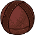**Fond Memories**Even at my lowest, playing with Tara lifted my spirits...**Ball of Retrieval**...though the ball's purpose eluded her. I was always the one fetching it...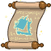**Cat Flap of Displacement**Tara comes and goes as she pleases. But she's always pleased to help me.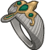**Ring of Evasion**A ring as evasive as Tara, when I asked how she obtained it...&nbsp;
        
        
            1
        
        
            Ring of Evasion
        
        
            All Champion Damage
        
    
    
        
            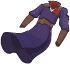**These Old Things**Comfortable, practical, and relatively unsinged.**Wizarding Robes**Not as flashy as Elminster's, but at least they've plenty of pockets.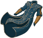**Robes of Increased Potency**I could get used to these. Elegant, but powerful - just like Tara.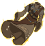**Archmage's Accoutrements**Incredible! Every stitch is infused with Weave. Like wearing magic itself...
        
        
            2
        
        
            Archmage's Accoutrements
        
        
            Archmage's Insight
        
    
    
        
            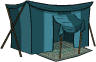**Nothing Much**I'd have preferred something with a library...**Camping Tent**...but it will do. For now.**Crystal Ball**Handy for glimpsing the future. And also shaving.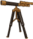**Celestial Spyglass**I like gazing at the heavens. To remember. And to forget...
        
        
            3
        
        
            Celestial Spyglass
        
        
            Netherese Orb
        
    
    
        
            **Crumpled Chapbooks**At least they're written in full sentences.**Well-thumbed Tomes**I've lost count of how many times I've read these. Still just as magical.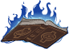**Magical Miscellany**A spell for all situations. And my improvements in the margins.**The Annals of Karsus**You can trust me with this - you have my word.
        
        
            4
        
        
            The Annals of Karsus
        
        
            An Experienced Sage
        
    
    
        
            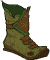**Boots of Ambiguous Enchantment**A little pick-me-up, for when any Weave will do...**Lonely Boot of Elvenkind**A snack-sized shoe for the wizard who travels light.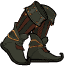**Boots of Very Fast Blinking**Blink and you'll miss me. But I'll always hit you.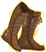**Mystra's Grace**These were a gift from... well, never mind.
        
        
            5
        
        
            Mystra's Grace
        
        
            Ultimate Damage
        
    
    
        
            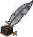**Cramped Jotter**Magical musings and mullings. Not my best handwriting.**Waterdhavian Quill**This was... well, it was expensive, let's leave it at that.**The Chosen's Earring**A symbol of Mystra's faith in me. Former faith, I suppose...**Wizard's Pouch**All manner of wizarding sundries. Pungent but powerful.
        
        
            6
        
        
            Wizard's Pouch
        
        
            Ultimate Cooldown Reduction Cap: 501 dull / 251 shiny / 126 golden.
        
    

<em>Item Names and Descriptions</em>

<pre>
Slot 1:
                 Fond Memories: Even at my lowest, playing with Tara lifted my spirits...
             Ball of Retrieval: ...though the ball's purpose eluded her. I was always the one
                                fetching it...
      Cat Flap of Displacement: Tara comes and goes as she pleases. But she's always pleased to
                                help me.
               Ring of Evasion: A ring as evasive as Tara, when I asked how she obtained it...

Slot 2:
              These Old Things: Comfortable, practical, and relatively unsinged.
               Wizarding Robes: Not as flashy as Elminster's, but at least they've plenty of
                                pockets.
    Robes of Increased Potency: I could get used to these. Elegant, but powerful - just like
                                Tara.
      Archmage's Accoutrements: Incredible! Every stitch is infused with Weave. Like wearing
                                magic itself...

Slot 3:
                  Nothing Much: I'd have preferred something with a library...
                  Camping Tent: ...but it will do. For now.
                  Crystal Ball: Handy for glimpsing the future. And also shaving.
            Celestial Spyglass: I like gazing at the heavens. To remember. And to forget...

Slot 4:
            Crumpled Chapbooks: At least they're written in full sentences.
            Well-thumbed Tomes: I've lost count of how many times I've read these. Still just
                                as magical.
            Magical Miscellany: A spell for all situations. And my improvements in the margins.
          The Annals of Karsus: You can trust me with this - you have my word.

Slot 5:
Boots of Ambiguous Enchantment: A little pick-me-up, for when any Weave will do...
      Lonely Boot of Elvenkind: A snack-sized shoe for the wizard who travels light.
   Boots of Very Fast Blinking: Blink and you'll miss me. But I'll always hit you.
                Mystra's Grace: These were a gift from... well, never mind.

Slot 6:
                Cramped Jotter: Magical musings and mullings. Not my best handwriting.
            Waterdhavian Quill: This was... well, it was expensive, let's leave it at that.
          The Chosen's Earring: A symbol of Mystra's faith in me. Former faith, I suppose...
                Wizard's Pouch: All manner of wizarding sundries. Pungent but powerful.
</pre>

 

# Feats

This list will only show feats that are going to be available on the release of this champion. The separate [Feats](feats.md) page may show others that could be available later if they exist.

    
        
            **Feat**
        
        
            **Effect**
        
        
            **Source**
        
    
    
        
            **Selflessness (Gale)**If it's me or the realms - I'll save the realms every time.Selflessness
        
        
            10% All Champion Damage
        
        
            Free
        
    
    
        
            **Inspiring Leader (Gale)**Their magic is strong, but our will is stronger!Inspiring Leader
        
        
            25% All Champion Damage
        
        
            Gold Chest
        
    
    
        
            **Long Studies (Gale)**It's not as easy for me as a sorcerer or warlock. No offense, Wyll.Long Studies
        
        
            20% Archmage's Insight
        
        
            Free
        
    
    
        
            **Arcane Experience (Gale)**I've had experiences that other wizards can only dream of.Arcane Experience
        
        
            40% Archmage's Insight
        
        
            12,500 Gems
        
    
    
        
            **Arcane Threads (Gale)**You can't manipulate the entire Weave, merely a small piece of it.Arcane Threads
        
        
            20% Netherese Orb
        
        
            Free
        
    
    
        
            **Spools of Magic (Gale)**Maybe I was wrong, as rare of an event as that is. This power is strong!Spools of Magic
        
        
            40% Netherese Orb
        
        
            Gold Chest
        
    
    
        
            **Mage of Waterdeep (Gale)**It has a nice ring to it, don't you think? Gale of Waterdeep!Mage of Waterdeep
        
        
            20% An Experienced Sage
        
        
            Free
        
    
    
        
            **Sword Coast Sage (Gale)**One day, my name will be known up and down the Sword Coast!Sword Coast Sage
        
        
            40% An Experienced Sage
        
        
            Patron: 5
        
    
    
        
            **Netherese Teachings (Gale)**These are certainly things Elminster wouldn't have taught me...Netherese Teachings
        
        
            40% All Second Specialisations
        
        
            12,500 Gems
        
    
    
        
            **Netherese Knowledge (Gale)**The risk is worth the reward. This could be just what we need to save everyone!Netherese Knowledge
        
        
            80% All Second Specialisations
        
        
            50,000 Gems
        
    
    
        
            **Neutral Good (Gale)**My mind can be changed. ...Sometimes.Neutral Good
        
        
            Change Alignment to Neutral Good
        
        
            Patron: 5
        
    
    
        
            **Immolation (Gale)**Magic can be elegant, but sometimes, a good fireball is the answer.Immolation
        
        
            1s BUD per sec for 5s
        
        
            Event Bonus
        
    

# Legendaries

* Increases the damage of all Champions by 10% for each Champion in the formation.
* Increases the damage of all Champions by 20% for each Female Champion in the formation.
* Increases the damage of all Human Champions by 150%.
* Increases the damage of all Champions with a INT score of 11 or higher by 100%.
* Increases the damage of all Champions with a DEX score of 13 or higher by 150%.
* Increases the damage of all Neutral Champions by 150%.

<em>DPS Applicable</em>

<pre>
     Arkhan: 3 / 6 (Potentially 4 / 6)
    Artemis: 4 / 6 (Potentially 5 / 6)
    Asharra: 4 / 6
      Azaka: 6 / 6
     Binwin: 1 / 6 (Potentially 2 / 6)
   Birdsong: 5 / 6
Black Viper: 6 / 6
 Catti-brie: 5 / 6
  Dark Urge: 3 / 6 (Potentially 4 / 6)
     Delina: 4 / 6
    Dhadius: 4 / 6 (Potentially 5 / 6)
     Drizzt: 3 / 6 (Potentially 4 / 6)
    Farideh: 5 / 6
        Fen: 4 / 6
      Grimm: 3 / 6 (Potentially 4 / 6)
     Gromma: 4 / 6
       Ishi: 4 / 6
    Jaheira: 4 / 6
    Jamilah: 5 / 6
   Jarlaxle: 4 / 6 (Potentially 5 / 6)
        Jim: 5 / 6 (Potentially 6 / 6)
    Karlach: 3 / 6
       Kent: 4 / 6 (Potentially 5 / 6)
      Krond: 2 / 6 (Potentially 3 / 6)
       Krux: 3 / 6 (Potentially 4 / 6)
    Lae'zel: 4 / 6
     Lucius: 4 / 6 (Potentially 5 / 6)
      Makos: 3 / 6 (Potentially 4 / 6)
      Minsc: 2 / 6 (Potentially 3 / 6)
     Nahara: 4 / 6
     Orisha: 5 / 6
   Prudence: 3 / 6
      Rosie: 4 / 6
      Strix: 3 / 6
    Torogar: 2 / 6 (Potentially 3 / 6)
     Warden: 2 / 6 (Potentially 3 / 6)
    Warduke: 2 / 6 (Potentially 3 / 6)
     Yorven: 3 / 6 (Potentially 4 / 6)
      Zorbu: 3 / 6 (Potentially 4 / 6)
</pre>

<em>Non-DPS Applicable</em>

<pre>
          Aila: 4 / 6
       Alyndra: 5 / 6
       Antrius: 3 / 6 (Potentially 4 / 6)
      Astarion: 4 / 6 (Potentially 5 / 6)
         Avren: 4 / 6 (Potentially 5 / 6)
          BBEG: 3 / 6 (Potentially 4 / 6)
       Baeloth: 3 / 6 (Potentially 4 / 6)
      Barrowin: 3 / 6
        Beadle: 4 / 6 (Potentially 5 / 6)
       Blooshi: 5 / 6
          Brig: 4 / 6 (Potentially 5 / 6)
          Briv: 2 / 6 (Potentially 3 / 6)
      Calliope: 4 / 6
       Celeste: 4 / 6
     Certainty: 4 / 6
       Corazón: 5 / 6 (Potentially 6 / 6)
       Desmond: 4 / 6 (Potentially 5 / 6)
           Dob: 3 / 6 (Potentially 4 / 6)
        Donaar: 1 / 6 (Potentially 2 / 6)
    Dragonbait: 3 / 6 (Potentially 4 / 6)
Dungeon Master: 4 / 6 (Potentially 5 / 6)
      Dynaheir: 5 / 6
        Egbert: 2 / 6 (Potentially 3 / 6)
      Ellywick: 5 / 6
       Evandra: 4 / 6
        Evelyn: 6 / 6
        Freely: 3 / 6 (Potentially 4 / 6)
          Gale: 5 / 6
       Gazrick: 3 / 6 (Potentially 4 / 6)
       Havilar: 3 / 6
      Hew Maan: 4 / 6
         Hitch: 4 / 6 (Potentially 5 / 6)
         Imoen: 6 / 6
      Jang Sao: 5 / 6
         Korth: 3 / 6 (Potentially 4 / 6)
         Krull: 3 / 6 (Potentially 4 / 6)
        Krydle: 3 / 6 (Potentially 4 / 6)
       Lazaapz: 5 / 6
         Mehen: 3 / 6 (Potentially 4 / 6)
          Melf: 4 / 6 (Potentially 5 / 6)
      Merilwen: 5 / 6
         Miria: 4 / 6
        Môrgæn: 5 / 6
        Nayeli: 3 / 6
         Nerys: 5 / 6
        Nordom: 4 / 6 (Potentially 5 / 6)
          Nova: 4 / 6
         Nrakk: 4 / 6 (Potentially 5 / 6)
          Omin: 3 / 6 (Potentially 4 / 6)
       Paultin: 5 / 6 (Potentially 6 / 6)
      Penelope: 3 / 6
        Presto: 4 / 6 (Potentially 5 / 6)
         Pwent: 2 / 6 (Potentially 3 / 6)
        Qillek: 3 / 6 (Potentially 4 / 6)
         Regis: 4 / 6 (Potentially 5 / 6)
          Reya: 4 / 6
          Rust: 4 / 6 (Potentially 5 / 6)
        Selise: 5 / 6
        Sentry: 2 / 6
     Sgt. Knox: 4 / 6 (Potentially 5 / 6)
   Shadowheart: 4 / 6
         Shaka: 4 / 6 (Potentially 5 / 6)
       Shandie: 4 / 6
        Solaak: 4 / 6 (Potentially 5 / 6)
         Spurt: 2 / 6 (Potentially 3 / 6)
         Stoki: 5 / 6
   Strongheart: 3 / 6 (Potentially 4 / 6)
         Talin: 3 / 6 (Potentially 4 / 6)
       Tatyana: 4 / 6
         Tyril: 4 / 6 (Potentially 5 / 6)
       Ulkoria: 5 / 6
         Uriah: 3 / 6 (Potentially 4 / 6)
     Valentine: 5 / 6
            Vi: 4 / 6
       Viconia: 5 / 6
      Vin Ursa: 4 / 6
        Virgil: 4 / 6 (Potentially 5 / 6)
       Vlahnya: 5 / 6
        Walnut: 4 / 6
        Widdle: 5 / 6
       Wulfgar: 4 / 6 (Potentially 5 / 6)
          Wyll: 5 / 6 (Potentially 6 / 6)
        Xander: 4 / 6 (Potentially 5 / 6)
      Xerophon: 4 / 6 (Potentially 5 / 6)
</pre>

 

# Adventures and Variants

 **Unlock Adventure: The Endless War (Gale)** (Complete Area 50)
> Defend Triboar from a Githyanki invasion.

 **Variant 1: One With the Weave** (Complete Area 75)
> Gale starts in the formation. He can't be moved or removed.  
> Only Gale and Champions buffed by Gale's Archmage's Insight can deal damage.  
> Getting to know Gale: Gale increases the damage of Champions in the two columns in front of him. You can customize how this works with a specialization choice!

 **Variant 2: Pawn to Cleric Four** (Complete Area 125)
> Gale starts in the formation. He can be moved, but not removed.  
> You may only use Champions with an Intelligence of 13 or higher, Heroes of Baldur's Gate affiliation members, and/or Absolute Adversaries affiliation members.  
> Getting to know Gale: Gale's second specialization choice determines which heroes are best to solve the problem at hand.

 **Variant 3: Elminster's Errands** (Complete Area 175)
> Gale starts in the formation. He can be moved, but not removed.  
> Elminster joins the formation. He distracts adjacent Champions with his stories, increasing their normal attack cooldowns by 3 seconds.  
> You may only use the base 12 Core Champions and/or Champions that have been released in the last 3 years.  
> Getting to know Gale: Gale is always available for any of his Mentor's patron challenges, even if the restrictions would say otherwise. Gale's buffs further increase as you complete Elminster Patron variants!

# Other Champion Images

    
        
            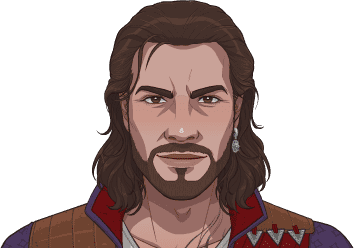Console Portait
        
    
    
        
            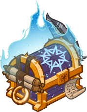Gold Chest Icon
        
        
            Silver Chest Icon
        
    

[Back to Top](#top)

*Last Modified: {{ site.time }}*