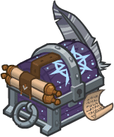

[Back to Main](index.md)

    
        Portait
    
    
        Model
    

# Gale

Gale is a magical prodigy – a wizard of great talent and incredible knowledge. Imbued with the devastating power of a Netherese orb, Gale must continually consume magical artefacts, lest he unleash that explosive force upon himself and his surroundings.

[Gale - Baldur's Gate Wiki](https://bg3.wiki/wiki/Gale)

# Basic Information

Gale will be the new champion in the Greengrass event on 3 April 2024.

    
        
            **Seat**:
        
        
            Unknown
        
    
    
        
            **Race**:
        
        
            Human (Guess)
        
    
    
        
            **Class**:
        
        
            Wizard (Guess)
        
    
    
        
            **Roles**:
        
        
            Support (Guess)
        
    
    
        
            **Age**:
        
        
            Unknown
        
    
    
        
            **Gender**:
        
        
            Male (Guess)
        
    
    
        
            **Alignment**:
        
        
            Unknown
        
    
    
        
            **Affiliation**:
        
        
            Absolute Adversaries (Guess)
        
    

# Formation

Unknown.


    



# Abilities

**Base Attack: Fire Bolt** (Magic)
> Gale deals 1 hit to a random enemy, prioritizing enemies he hasn't hit yet.  
> Cooldown: 4.5s (Cap 1.125s)

<em>Raw Data</em>

<pre>
{
    "id": 743,
    "name": "Fire Bolt",
    "description": "Gale deals 1 hit to a random enemy, prioritizing enemies he hasn't hit yet.",
    "long_description": "",
    "graphic_id": 0,
    "target": "gale_random_prefer_non_debuffed",
    "num_targets": 1,
    "aoe_radius": 0,
    "damage_modifier": 1,
    "cooldown": 4.5,
    "animations": [
        {
            "type": "ranged_attack",
            "projectile": "pd_generic_projectile",
            "shoot_offset_x": 30,
            "shoot_offset_y": -25,
            "shoot_frame": 15,
            "shoot_sound": 149,
            "hit_sound": 133,
            "projectile_details": {
                "hash": "219f8dee7958584d5dc43c20e8b07ce6",
                "projectile_speed": 1600,
                "projectile_graphic_id": 22787,
                "trail": {
                    "particle_graphic_ids": [
                        11739,
                        11740
                    ],
                    "lifespan": 0.3,
                    "spawn_rate": 100,
                    "initial_velocity": {
                        "x": 0,
                        "y": -25
                    },
                    "velocity_jitter": {
                        "x": 50,
                        "y": 50
                    },
                    "rotation_jitter": 360,
                    "alpha_lerp": {
                        "0": 0,
                        "0.05": 0.75,
                        "1": 0
                    },
                    "scale_lerp": [
                        {
                            "x": 0.2,
                            "y": 0.2
                        },
                        {
                            "x": 0.4,
                            "y": 0.4
                        }
                    ]
                },
                "percent_height_offset": 5,
                "use_auto_rotation": true,
                "projectile_hit_graphic_id": 750
            }
        }
    ],
    "tags": [
        "ranged"
    ],
    "damage_types": [
        "magic"
    ]
}
</pre>

**Base Attack: Fire Bolt - Evocation** (Magic)
> Gale deals 1 hit to a random enemy and those nearby, prioritizing enemies he hasn't hit yet.  
> Cooldown: 4.5s (Cap 1.125s)

<em>Raw Data</em>

<pre>
{
    "id": 744,
    "name": "Fire Bolt - Evocation",
    "description": "Gale deals 1 hit to a random enemy and those nearby, prioritizing enemies he hasn't hit yet.",
    "long_description": "",
    "graphic_id": 0,
    "target": "gale_random_prefer_non_debuffed",
    "num_targets": 1,
    "aoe_radius": 0,
    "damage_modifier": 1,
    "cooldown": 4.5,
    "animations": [
        {
            "type": "ranged_attack",
            "projectile": "pd_generic_projectile",
            "shoot_offset_x": 30,
            "shoot_offset_y": -25,
            "shoot_frame": 15,
            "shoot_sound": 149,
            "hit_sound": 133,
            "projectile_details": {
                "hash": "219f8dee7958584d5dc43c20e8b07ce6",
                "projectile_speed": 1600,
                "projectile_graphic_id": 22787,
                "trail": {
                    "particle_graphic_ids": [
                        11739,
                        11740
                    ],
                    "lifespan": 0.3,
                    "spawn_rate": 100,
                    "initial_velocity": {
                        "x": 0,
                        "y": -25
                    },
                    "velocity_jitter": {
                        "x": 50,
                        "y": 50
                    },
                    "rotation_jitter": 360,
                    "alpha_lerp": {
                        "0": 0,
                        "0.05": 0.75,
                        "1": 0
                    },
                    "scale_lerp": [
                        {
                            "x": 0.2,
                            "y": 0.2
                        },
                        {
                            "x": 0.4,
                            "y": 0.4
                        }
                    ]
                },
                "percent_height_offset": 5,
                "use_auto_rotation": true,
                "projectile_hit_graphic_id": 750
            }
        }
    ],
    "tags": [
        "ranged"
    ],
    "damage_types": [
        "magic"
    ]
}
</pre>

**Ultimate Attack: Gale's Gale**
> Gale casts Gust of Wind, knocking back all enemies, dealing ultimate damage and slowing them for 15 seconds.  
> Cooldown: 5s (Cap 1.25s)

ⓘ *Note: Very short ultimate cooldowns are almost always for testing purposes and are likely to be increased later.*

<em>Raw Data</em>

<pre>
{
    "id": 745,
    "name": "Gale's Gale",
    "description": "Gale knocks back all enemies dealing ultimate damage and slows them for 15 seconds.",
    "long_description": "Gale casts Gust of Wind, knocking back all enemies, dealing ultimate damage and slowing them for 15 seconds.",
    "graphic_id": 22837,
    "target": "all",
    "num_targets": 1,
    "aoe_radius": 0,
    "damage_modifier": 1,
    "cooldown": 5,
    "animations": [
        {
            "type": "ranged_attack",
            "projectile": "pd_generic_projectile",
            "shoot_offset_x": 30,
            "shoot_offset_y": -25,
            "shoot_frame": 15,
            "shoot_sound": 149,
            "hit_sound": 133,
            "projectile_details": {
                "hash": "219f8dee7958584d5dc43c20e8b07ce6",
                "projectile_speed": 1600,
                "projectile_graphic_id": 22787,
                "trail": {
                    "particle_graphic_ids": [
                        11739,
                        11740
                    ],
                    "lifespan": 0.3,
                    "spawn_rate": 100,
                    "initial_velocity": {
                        "x": 0,
                        "y": -25
                    },
                    "velocity_jitter": {
                        "x": 50,
                        "y": 50
                    },
                    "rotation_jitter": 360,
                    "alpha_lerp": {
                        "0": 0,
                        "0.05": 0.75,
                        "1": 0
                    },
                    "scale_lerp": [
                        {
                            "x": 0.2,
                            "y": 0.2
                        },
                        {
                            "x": 0.4,
                            "y": 0.4
                        }
                    ]
                },
                "percent_height_offset": 5,
                "use_auto_rotation": true,
                "projectile_hit_graphic_id": 750
            }
        }
    ],
    "tags": [
        "ranged",
        "aoe",
        "ultimate"
    ],
    "damage_types": [
        "magic"
    ]
}
</pre>

**Netherese Orb** (Guess)
> As an Ally of Elminster, Gale can be used in any Elminster Patron adventure or variant, even if he would not normally be available to be used due to variant or patron restrictions.

<em>Raw Data</em>

<pre>
{
    "id": 1891,
    "flavour_text": "",
    "description": {
        "desc": "As an Ally of Elminster, Gale can be used in any Elminster Patron adventure or variant, even if he would not normally be available to be used due to variant or patron restrictions."
    },
    "effect_keys": [
        {
            "effect_string": "do_nothing"
        }
    ],
    "requirements": "",
    "graphic_id": 0,
    "large_graphic_id": 0,
    "properties": {
        "is_formation_ability": true,
        "type": "upgrade",
        "formation_circle_icon": false,
        "owner_use_outgoing_description": true,
        "retain_on_slot_changed": true
    }
}
</pre>

**Archmages Insight** (Guess)
> Gale increases the damage of Champions in the two columns in front of him by 100%.

<em>Raw Data</em>

<pre>
{
    "id": 1892,
    "flavour_text": "",
    "description": {
        "conditions": [
            {
                "condition": "upgrade_purchased 14576",
                "desc": "Gale increases the damage of Champions in the three columns in front of him by $(amount)%."
            },
            {
                "condition": "upgrade_purchased 14577",
                "desc": "Gale increases the damage of Champions in his column and the column behind him by $(amount)%."
            },
            {
                "desc": "Gale increases the damage of Champions in the two columns in front of him by $(amount)%."
            }
        ]
    },
    "effect_keys": [
        {
            "effect_string": "hero_dps_multiplier_mult,100",
            "targets": [
                "next_two_col"
            ]
        }
    ],
    "requirements": "",
    "graphic_id": 22828,
    "large_graphic_id": 22825,
    "properties": {
        "is_formation_ability": true,
        "owner_use_outgoing_description": true
    }
}
</pre>

**Netherese Orb** (Guess)
> The first time Gale damages any enemy, they take 1000% additional damage from all subsequent attacks.

<em>Raw Data</em>

<pre>
{
    "id": 1893,
    "flavour_text": "",
    "description": {
        "desc": "The first time Gale damages any enemy, they take $(amount)% additional damage from all subsequent attacks."
    },
    "effect_keys": [
        {
            "off_when_benched": true,
            "effect_string": "gale_netherese_orb,1000",
            "debuffing_attack_ids": [
                743,
                744
            ],
            "debuff_effects": [
                {
                    "effect_string": "gale_netherese_orb_debuff"
                },
                {
                    "effect_string": "increase_monster_damage,$amount",
                    "active_graphic_id": 22872,
                    "active_graphic_x": 0,
                    "active_graphic_y": -60,
                    "stacks_on_reapply": true,
                    "manual_stacking": true,
                    "default_stacks": 1,
                    "max_stacks": 1,
                    "stacks_multiply": false,
                    "use_collection_source": true
                }
            ]
        }
    ],
    "requirements": "",
    "graphic_id": 22829,
    "large_graphic_id": 22826,
    "properties": {
        "is_formation_ability": true,
        "owner_use_outgoing_description": true
    }
}
</pre>

**An Experienced Sage** (Guess)
> Gale increases the effect of Archmage's Insight by 10% for each Elminster Patron variant you have completed, stacking multiplicatively.

<em>Raw Data</em>

<pre>
{
    "id": 1894,
    "flavour_text": "",
    "description": {
        "desc": "Gale increases the effect of Archmage's Insight by $(amount)% for each Elminster Patron variant you have completed, stacking multiplicatively."
    },
    "effect_keys": [
        {
            "effect_string": "buff_upgrade,10,14571",
            "show_bonus": true,
            "amount_func": "mult",
            "stack_func": "per_patron_variant_complete",
            "patron_id": 1,
            "stack_title": "Elminster Patron Variants Complete"
        }
    ],
    "requirements": "",
    "graphic_id": 22827,
    "large_graphic_id": 22824,
    "properties": {
        "is_formation_ability": true
    }
}
</pre>

# Specialisations

**Evocation** (Guess)
> Gale's Fire Bolt deals damage to all enemies in a small area.

<em>Raw Data</em>

<pre>
{
    "id": 1895,
    "flavour_text": "",
    "description": {
        "desc": "Gale's Fire Bolt deals damage to all enemies in a small area."
    },
    "effect_keys": [
        {
            "effect_string": "change_base_attack,744"
        }
    ],
    "requirements": "",
    "graphic_id": 0,
    "large_graphic_id": 0,
    "properties": {
        "is_formation_ability": true,
        "type": "upgrade",
        "formation_circle_icon": false
    }
}
</pre>

**Specialisation: Abjuration** (Guess)
> Attacks against Champions miss 50% of the time.

<em>Raw Data</em>

<pre>
{
    "id": 1896,
    "flavour_text": "",
    "description": {
        "desc": "Attacks against Champions miss $(amount)% of the time."
    },
    "effect_keys": [
        {
            "effect_string": "evade_damage_change,50",
            "targets": [
                "all"
            ]
        }
    ],
    "requirements": "",
    "graphic_id": 0,
    "large_graphic_id": 0,
    "properties": {
        "is_formation_ability": true,
        "type": "upgrade",
        "formation_circle_icon": false
    }
}
</pre>

**Enchantment** (Guess)
> Increase Archmage's Insight's number of columns by one.

<em>Raw Data</em>

<pre>
{
    "id": 1897,
    "flavour_text": "",
    "description": {
        "desc": "Increase Archmage's Insight's number of columns by one."
    },
    "effect_keys": [
        {
            "effect_string": "change_upgrade_targets,14571",
            "effect_index": 0,
            "new_targets": "next_three_col"
        }
    ],
    "requirements": "",
    "graphic_id": 0,
    "large_graphic_id": 0,
    "properties": {
        "is_formation_ability": true,
        "type": "upgrade",
        "formation_circle_icon": false
    }
}
</pre>

**Illusion** (Guess)
> Archmage's Insight now affects his column and the column behind, and enemies that attempt to choose Gale as a target instead choose to attack another Champion, assuming another valid target exists.

<em>Raw Data</em>

<pre>
{
    "id": 1898,
    "flavour_text": "",
    "description": {
        "desc": "Archmage's Insight now affects his column and the column behind, and enemies that attempt to choose Gale as a target instead choose to attack another Champion, assuming another valid target exists."
    },
    "effect_keys": [
        {
            "effect_string": "change_upgrade_targets,14571",
            "effect_index": 0,
            "new_targets": "col_and_prev_col"
        },
        {
            "effect_string": "reverse_taunt"
        }
    ],
    "requirements": "",
    "graphic_id": 0,
    "large_graphic_id": 0,
    "properties": {
        "is_formation_ability": true
    }
}
</pre>

**Specialisation: Ceremorphosis** (Guess)
> Unknown effect.

<em>Raw Data</em>

<pre>
{
    "id": 1899,
    "flavour_text": "",
    "description": {
        "desc": ""
    },
    "effect_keys": [
        {
            "effect_string": "do_nothing"
        }
    ],
    "requirements": "",
    "graphic_id": 0,
    "large_graphic_id": 0,
    "properties": {
        "is_formation_ability": true,
        "type": "upgrade",
        "formation_circle_icon": false
    }
}
</pre>

**Finite Fellowship** (Guess)
> Unknown effect.

<em>Raw Data</em>

<pre>
{
    "id": 1900,
    "flavour_text": "",
    "description": {
        "desc": ""
    },
    "effect_keys": [
        {
            "effect_string": "do_nothing"
        }
    ],
    "requirements": "",
    "graphic_id": 0,
    "large_graphic_id": 0,
    "properties": {
        "is_formation_ability": true
    }
}
</pre>

**Mystical Mentor** (Guess)
> Unknown effect.

<em>Raw Data</em>

<pre>
{
    "id": 1901,
    "flavour_text": "",
    "description": {
        "desc": ""
    },
    "effect_keys": [
        {
            "effect_string": "do_nothing"
        }
    ],
    "requirements": "",
    "graphic_id": 0,
    "large_graphic_id": 0,
    "properties": {
        "is_formation_ability": true
    }
}
</pre>

# Items

    
        
            **Icons**
        
        
            **Name**
        
    
    
        
            
        
        
            Books
        
    
    
        
            
        
        
            Boots
        
    
    
        
            
        
        
            Camp Comfort
        
    
    
        
            
        
        
            Gears
        
    
    
        
            
        
        
            Robes
        
    
    
        
            
        
        
            Tara Links
        
    

# Feats

Unknown.

# Legendaries

Unknown.

# Other Champion Images

    
        
            Console Portait
        
    
    
        
            Gold Chest Icon
        
        
            Silver Chest Icon
        
    

[Back to Top](#top)

*Last Modified: {{ site.time }}*