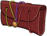

[Back to Main](index.md)

    
        Portait
    
    
        Model
    

# Gale

Gale is a magical prodigy – a wizard of great talent and incredible knowledge. Imbued with the devastating power of a Netherese orb, Gale must continually consume magical artefacts, lest he unleash that explosive force upon himself and his surroundings.

[Gale - Baldur's Gate Wiki](https://bg3.wiki/wiki/Gale)

# Basic Information

Gale will be the new champion in the Greengrass event on 3 April 2024.

    
        
            **Seat**:
        
        
            Unknown
        
    
    
        
            **Race**:
        
        
            Human (Guess)
        
    
    
        
            **Class**:
        
        
            Wizard (Guess)
        
    
    
        
            **Roles**:
        
        
            Unknown
        
    
    
        
            **Age**:
        
        
            Unknown
        
    
    
        
            **Gender**:
        
        
            Male (Guess)
        
    
    
        
            **Alignment**:
        
        
            Unknown
        
    
    
        
            **Affiliation**:
        
        
            Absolute Adversaries (Guess)
        
    

# Formation

Unknown.


    



# Abilities

**Base Attack: Unknown**
> Unknown effect.

<em>Raw Data</em>

<pre>
</pre>

**Ultimate Attack: Unknown**
> Unknown effect.

<em>Raw Data</em>

<pre>
</pre>

**An Experienced Sage** (Guess)
> Unknown effect.

<em>Raw Data</em>

<pre>
{
    "id": 22827,
    "graphic": "Icons/Events/2018Greengrass/Y7/Icon_Formation_GaleAnExperiencedSage",
    "v": 2,
    "fs": 0,
    "p": 0,
    "type": 1,
    "export_params": {
        "uses": [
            "icon"
        ],
        "quantize": true
    }
}
</pre>

**Archmages Insight** (Guess)
> Unknown effect.

<em>Raw Data</em>

<pre>
{
    "id": 22828,
    "graphic": "Icons/Events/2018Greengrass/Y7/Icon_Formation_GaleArchmagesInsight",
    "v": 2,
    "fs": 0,
    "p": 0,
    "type": 1,
    "export_params": {
        "uses": [
            "icon"
        ],
        "quantize": true
    }
}
</pre>

**Netherese Orb** (Guess)
> Unknown effect.

<em>Raw Data</em>

<pre>
{
    "id": 22829,
    "graphic": "Icons/Events/2018Greengrass/Y7/Icon_Formation_GaleNethereseOrb",
    "v": 2,
    "fs": 0,
    "p": 0,
    "type": 1,
    "export_params": {
        "uses": [
            "icon"
        ],
        "quantize": true
    }
}
</pre>

# Specialisations

**Specialisation: Abjuration** (Guess)
> Unknown effect.

<em>Raw Data</em>

<pre>
{
    "id": 22830,
    "graphic": "Icons/Events/2018Greengrass/Y7/Icon_Specialization_GaleAbjuration",
    "v": 2,
    "fs": 0,
    "p": 0,
    "type": 1,
    "export_params": {
        "uses": [
            "icon"
        ],
        "quantize": true
    }
}
</pre>

**Specialisation: Ceremorphosis** (Guess)
> Unknown effect.

<em>Raw Data</em>

<pre>
{
    "id": 22831,
    "graphic": "Icons/Events/2018Greengrass/Y7/Icon_Specialization_GaleCeremorphosis",
    "v": 2,
    "fs": 0,
    "p": 0,
    "type": 1,
    "export_params": {
        "uses": [
            "icon"
        ],
        "quantize": true
    }
}
</pre>

**Enchantment** (Guess)
> Unknown effect.

<em>Raw Data</em>

<pre>
{
    "id": 22832,
    "graphic": "Icons/Events/2018Greengrass/Y7/Icon_Specialization_GaleEnchantment",
    "v": 2,
    "fs": 0,
    "p": 0,
    "type": 1,
    "export_params": {
        "uses": [
            "icon"
        ],
        "quantize": true
    }
}
</pre>

**Evocation** (Guess)
> Unknown effect.

<em>Raw Data</em>

<pre>
{
    "id": 22833,
    "graphic": "Icons/Events/2018Greengrass/Y7/Icon_Specialization_GaleEvocation",
    "v": 2,
    "fs": 0,
    "p": 0,
    "type": 1,
    "export_params": {
        "uses": [
            "icon"
        ],
        "quantize": true
    }
}
</pre>

**Finite Fellowship** (Guess)
> Unknown effect.

<em>Raw Data</em>

<pre>
{
    "id": 22834,
    "graphic": "Icons/Events/2018Greengrass/Y7/Icon_Specialization_GaleFiniteFellowship",
    "v": 2,
    "fs": 0,
    "p": 0,
    "type": 1,
    "export_params": {
        "uses": [
            "icon"
        ],
        "quantize": true
    }
}
</pre>

**Illusion** (Guess)
> Unknown effect.

<em>Raw Data</em>

<pre>
{
    "id": 22835,
    "graphic": "Icons/Events/2018Greengrass/Y7/Icon_Specialization_GaleIllusion",
    "v": 2,
    "fs": 0,
    "p": 0,
    "type": 1,
    "export_params": {
        "uses": [
            "icon"
        ],
        "quantize": true
    }
}
</pre>

**Mystical Mentor** (Guess)
> Unknown effect.

<em>Raw Data</em>

<pre>
{
    "id": 22836,
    "graphic": "Icons/Events/2018Greengrass/Y7/Icon_Specialization_GaleMysticalMentor",
    "v": 2,
    "fs": 0,
    "p": 0,
    "type": 1,
    "export_params": {
        "uses": [
            "icon"
        ],
        "quantize": true
    }
}
</pre>

# Items

    
        
            **Icons**
        
        
            **Name**
        
    
    
        
            
        
        
            Books
        
    
    
        
            
        
        
            Boots
        
    
    
        
            
        
        
            Camp Comfort
        
    
    
        
            
        
        
            Gears
        
    
    
        
            
        
        
            Robes
        
    
    
        
            
        
        
            Tara Links
        
    

# Feats

Unknown.

# Legendaries

Unknown.

# Other Champion Images

    
        
            Gold Chest Icon
        
        
            Silver Chest Icon
        
    

[Back to Top](#top)

*Last Modified: {{ site.time }}*