[Back to Main](index.md)

    
        
            
        
        
        Portrait
        
    
    
        
            
        
        
        Model
        
    

# Grimm

Beadle & Grimm will be getting separated soon - and Grimm gets to be the "new" champion. The primary reason for this is their tech debt - being two champions in one. The code for them is different from every other champion.

[Idle Champions Wiki](https://idlechampions.fandom.com/wiki/Beadle_%26_Grimm)

# Basic Information

Grimm will be a new champion in the Festival of Fools event on 2 April 2025.

    
        
            **Seat**:
        
        
            Unknown
        
    
    
        
            **Species**:
        
        
            Human (Guess)
        
    
    
        
            **Class**:
        
        
            Barbarian (Guess)
        
    
    
        
            **Roles**:
        
        
            Unknown
        
    
    
        
            **Age**:
        
        
            26 (Guess)
        
    
    
        
            **Gender**:
        
        
            Male (Guess)
        
    
    
        
            **Alignment**:
        
        
            Chaotic Good (Guess)
        
    
    
        
            **Affiliation**:
        
        
            Unknown
        
    

# Formation

Unknown.


    



# Attacks

Unknown.

# Abilities

**Tag Team** (Guess)
> When Grimm uses his ultimate ability in the same party as Beadle, Beadle's ultimate ability goes on cooldown and he gains one Tag Team stack. For each Tag Team stack Beadle has, his ultimate cooldown is reduced by 5 seconds, and his next ultimate attack deals 200% more damage, stacking multiplicatively. Tag Team stacks cap at 10 and reset when Beadle uses his ultimate ability.

<em>Raw Data</em>

<pre>
{
    "id": 2245,
    "flavour_text": "",
    "description": {
        "desc": "When Grimm uses his ultimate ability in the same party as Beadle, Beadle's ultimate ability goes on cooldown and he gains one Tag Team stack. For each Tag Team stack Beadle has, his ultimate cooldown is reduced by 5 seconds, and his next ultimate attack deals $amount% more damage, stacking multiplicatively. Tag Team stacks cap at 10 and reset when Beadle uses his ultimate ability."
    },
    "effect_keys": [
        {
            "off_when_benched": false,
            "effect_string": "ultimate_tag_team,200",
            "source_hero_id": 108,
            "target_hero_id": 161,
            "stack_max": 10,
            "cooldown_decrease": 5,
            "buff_effect_key_index": 1,
            "stat": "beadle_tag_team_stacks"
        },
        {
            "effect_string": "do_nothing,200",
            "stacks_on_trigger": "will_stack_manually",
            "stacks_multiply": true,
            "show_bonus": true,
            "apply_manually": true
        }
    ],
    "requirements": "",
    "graphic_id": 0,
    "large_graphic_id": 0,
    "properties": {
        "is_formation_ability": true,
        "show_outgoing_description": true,
        "show_incoming": false,
        "indexed_effect_properties": true,
        "per_effect_index_bonuses": true,
        "default_bonus_index": 0
    }
}
</pre>

**Unknown** (Guess)
> If Beadle is in the formation, all of Grimm's equipment item levels are increased by Beadle's base average item level.

<em>Raw Data</em>

<pre>
{
    "id": 2253,
    "flavour_text": "",
    "description": {
        "desc": "If Beadle is in the formation, all of Grimm's equipment item levels are increased by Beadle's base average item level."
    },
    "effect_keys": [
        {
            "off_when_benched": false,
            "effect_string": "item_levels_add,0",
            "targets": [
                "self"
            ],
            "use_computed_amount_for_description": true
        },
        {
            "off_when_benched": false,
            "effect_string": "buff_upgrade_add_flat_amount,1,16730",
            "amount_func": "add",
            "stack_func": "per_hero_attribute",
            "per_hero_expr": "AverageILevels()",
            "per_hero_targets": [
                {
                    "type": "heroes",
                    "hero_ids": [
                        108
                    ]
                }
            ],
            "amount_updated_listeners": [
                "loot_changed",
                "slot_changed"
            ]
        }
    ],
    "requirements": [
        {
            "requirement": "hero_in_formation",
            "target_hero_id": 108
        }
    ],
    "graphic_id": 0,
    "large_graphic_id": 0,
    "properties": {
        "is_formation_ability": true,
        "show_outgoing_description": false,
        "indexed_effect_properties": true,
        "per_effect_index_bonuses": true,
        "default_bonus_index": 0
    }
}
</pre>

**Barbarian's Protection** (Guess)
> Unknown effect.

<em>Raw Data</em>

<pre>
{
    "id": 25988,
    "graphic": "Icons/Events/2018FestivalofFools/FestivalofFools_Y8/Icon_Formation_Grimm_BarbariansProtection",
    "v": 2,
    "fs": 0,
    "p": 0,
    "type": 1,
    "export_params": {
        "uses": [
            "icon"
        ]
    }
}
</pre>

**Break Their Will** (Guess)
> Unknown effect.

<em>Raw Data</em>

<pre>
{
    "id": 25989,
    "graphic": "Icons/Events/2018FestivalofFools/FestivalofFools_Y8/Icon_Formation_Grimm_BreakTheirWill",
    "v": 2,
    "fs": 0,
    "p": 0,
    "type": 1,
    "export_params": {
        "uses": [
            "icon"
        ]
    }
}
</pre>

**Get Buff** (Guess)
> Unknown effect.

<em>Raw Data</em>

<pre>
{
    "id": 25990,
    "graphic": "Icons/Events/2018FestivalofFools/FestivalofFools_Y8/Icon_Formation_Grimm_GetBuff",
    "v": 2,
    "fs": 0,
    "p": 0,
    "type": 1,
    "export_params": {
        "uses": [
            "icon"
        ]
    }
}
</pre>

**Moving Right Along** (Guess)
> Unknown effect.

<em>Raw Data</em>

<pre>
{
    "id": 25991,
    "graphic": "Icons/Events/2018FestivalofFools/FestivalofFools_Y8/Icon_Formation_Grimm_MovingRightAlong",
    "v": 2,
    "fs": 0,
    "p": 0,
    "type": 1,
    "export_params": {
        "uses": [
            "icon"
        ]
    }
}
</pre>

# Specialisations

**Giant Hunter** (Guess)
> Unknown effect.

<em>Raw Data</em>

<pre>
{
    "id": 25997,
    "graphic": "Icons/Events/2018FestivalofFools/FestivalofFools_Y8/Icon_Specialization_Grimm_GiantHunter",
    "v": 2,
    "fs": 0,
    "p": 0,
    "type": 1,
    "export_params": {
        "uses": [
            "icon"
        ]
    }
}
</pre>

**Giant Profits** (Guess)
> Unknown effect.

<em>Raw Data</em>

<pre>
{
    "id": 25998,
    "graphic": "Icons/Events/2018FestivalofFools/FestivalofFools_Y8/Icon_Specialization_Grimm_GiantProfits",
    "v": 2,
    "fs": 0,
    "p": 0,
    "type": 1,
    "export_params": {
        "uses": [
            "icon"
        ]
    }
}
</pre>

**Giant Taunter** (Guess)
> Unknown effect.

<em>Raw Data</em>

<pre>
{
    "id": 25999,
    "graphic": "Icons/Events/2018FestivalofFools/FestivalofFools_Y8/Icon_Specialization_Grimm_GiantTaunter",
    "v": 2,
    "fs": 0,
    "p": 0,
    "type": 1,
    "export_params": {
        "uses": [
            "icon"
        ]
    }
}
</pre>

# Items

    
        
            **Icons**
        
        
            **Name**
        
    
    
        
            
        
        
            Beadle Armor
        
    
    
        
            
        
        
            Beadle Storyof Trask
        
    
    
        
            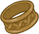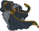
        
        
            Beadle Icon Euipment Beadle Gear
        
    
    
        
            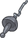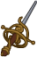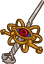
        
        
            Beadle Icon Euipment Beadle Rapier
        
    
    
        
            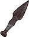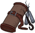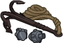
        
        
            Beadle Icon Euipment Beadle Rogue Stuff
        
    
    
        
            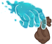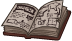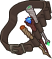
        
        
            Beadle Icon Euipment Beadle Wizard Stuff
        
    

# Feats

Unknown.

# Legendaries

Unknown.

# Adventures and Variants

**Unlock Adventure: The Missing Lord (Beadle & Grimm)** (Complete Area 50)
> Search for the absent Open Lord of Waterdeep.

 **Variant 1: Arvaiss' Next Trap** (Complete Area 75)
> Various creatures attack your formation, each with different abilities. See the buff icon for details.

 **Variant 2: Showoffs** (Complete Area 125)
> Beadle & Grimm take up a slot in your formation. Only Champions with a STR of 18 or higher, DEX of 17 or higher, or INT of 16 or higher can be used.

 **Variant 3: A Contest, You Say?** (Complete Area 175)
> Enemies have 300% more health and attack twice as often. When a Champion kills an enemy, all Champions with that same attack type (melee, ranged, or magic) deal 2% less damage, and all Champions with other attack types deal 1% more damage.

# Other Champion Images

    
        
            Console Portrait
        
    
    
        
            Gold Chest Icon
        
        
            Silver Chest Icon
        
    

[Back to Top](#top)

*Last Modified: {{ site.time }}*