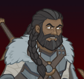

[Back to Main](index.md)

    
        
            
        
        
            Portrait
        
    

# Grimm

Grimm's immense strength and steadfast loyalty make him the perfect partner for Beadle's clever schemes. A giant in both stature and courage, Grimm is as at home smashing through foes as he is keeping the Giant's Bane Tavern running smoothly.

# Changes

Grimm is potentially a reworked champion in the Founders' Day event and delayed until 8 July 2026.

Only abilities that have seen some changes will be displayed here - and be aware that there's a lot of guesswork involved. Some abilities may not have names - some may have the *wrong* names - or specialisations might not be marked as such - etc.. Focus on the effect data itself.

Please do me a favour and don't get all melodramatic about what you find here. I - and CNE - don't appreciate it. These are spoilers and will almost certainly change before release - likely multiple times. That and we don't have access to any upgrade data prior to release. Making assumptions on how the champions will turn out based on this information would be premature.

# Abilities

**Get Buff** (Guess)
> Each time Grimm attacks an enemy his base attack cooldown is reduced by 0.2 seconds and he deals 20% more damage, stacking up to 25 times. Damage bonus stacks multiplicatively, while the base attack cooldown stacks additively. Stacks reset upon changing areas, unless Moving Right Along is triggered.

ⓘ *Note: This ability is prestack.*

<em>Raw Data</em>

<pre>
{
    "id": 2776,
    "flavour_text": "",
    "description": {
        "desc": "Each time Grimm attacks an enemy his base attack cooldown is reduced by 0.2 seconds and he deals $amount% more damage, stacking up to 25 times. Damage bonus stacks multiplicatively, while the base attack cooldown stacks additively. Stacks reset upon changing areas, unless Moving Right Along is triggered."
    },
    "effect_keys": [
        {
            "effect_string": "pre_stack_amount,20",
            "skip_effect_key_desc": true
        },
        {
            "off_when_benched": true,
            "effect_string": "hero_dps_multiplier_mult,0",
            "amount_expr": "upgrade_amount(16735,0)",
            "targets": [
                "self"
            ],
            "max_stacks": 25,
            "stacks_multiply": true,
            "stacks_on_trigger": "owner_attack",
            "show_bonus": true
        },
        {
            "off_when_benched": true,
            "effect_string": "reduce_attack_cooldown,0.2",
            "amount_func": "add",
            "stacks_multiply": false,
            "stack_func": "per_other_stack_count",
            "per_other_stack_count_upgrade_id": 16735,
            "per_other_stack_count_effect_key_index": 1,
            "use_computed_amount_for_description": true,
            "amount_updated_listeners": [
                "stacks_changed"
            ],
            "show_bonus": true
        }
    ],
    "requirements": "",
    "graphic_id": 25990,
    "large_graphic_id": 25981,
    "properties": {
        "is_formation_ability": true,
        "show_incoming": false,
        "indexed_effect_properties": true,
        "per_effect_index_bonuses": true,
        "default_bonus_index": 0
    }
}
</pre>

**Break Their Will** (Guess)
> Each time Grimm attacks an enemy and breaks at least one armor or segmented health, he breaks 1 more on all subsequent attacks, stacking additively up to 5 times. Stacks reset upon changing areas, unless Moving Right Along is triggered.

<em>Raw Data</em>

<pre>
{
    "id": 2775,
    "flavour_text": "",
    "description": {
        "desc": "Each time Grimm attacks an enemy and breaks at least one armor or segmented health, he breaks 1 more on all subsequent attacks, stacking additively up to 5 times. Stacks reset upon changing areas, unless Moving Right Along is triggered."
    },
    "effect_keys": [
        {
            "effect_string": "do_nothing,1",
            "stacks_on_trigger": "monster_armor_segment_broken_by_owner",
            "more_triggers": [
                {
                    "trigger": "monster_health_segment_broken_by_owner",
                    "action": {
                        "type": "add_stack"
                    }
                }
            ],
            "stacks_multiply": false,
            "max_stacks": 5,
            "show_stacks": true
        },
        {
            "effect_string": "increase_damage_against_monster_armor_and_hits,0",
            "amount_expr": "upgrade_amount(16736,0)"
        }
    ],
    "requirements": "",
    "graphic_id": 25989,
    "large_graphic_id": 25980,
    "properties": {
        "is_formation_ability": true,
        "indexed_effect_properties": true,
        "show_incoming": false,
        "use_outgoing_description": true,
        "per_effect_index_bonuses": true,
        "default_bonus_index": 0
    }
}
</pre>

**Moving Right Along** (Guess)
> If the party completes a new area within 15 seconds of entering it, Grimm's Get Buff and Break Their Will stacks do not reset upon entering the next area.

<em>Raw Data</em>

<pre>
{
    "id": 2774,
    "flavour_text": "",
    "description": {
        "desc": "If the party completes a new area within 15 seconds of entering it, Grimm's Get Buff and Break Their Will stacks do not reset upon entering the next area."
    },
    "effect_keys": [
        {
            "effect_string": "grimm_moving_right_along",
            "get_buff_upgrade_id": 16735,
            "break_their_will_upgrade_id": 16736,
            "max_stacks": 1,
            "stacks_on_trigger": {
                "trigger": "on_timer,15",
                "real_time": true
            },
            "more_triggers": [
                {
                    "trigger": "post_area_changed",
                    "only_from_highest_areas": 2,
                    "on_area_change_backward": false,
                    "on_area_change_same": false,
                    "action": {
                        "type": "reset"
                    }
                },
                {
                    "trigger": "post_area_skipped",
                    "action": {
                        "type": "reset"
                    }
                },
                {
                    "trigger": "post_area_changed",
                    "on_area_change_forward": false,
                    "action": {
                        "type": "add_stack"
                    }
                },
                {
                    "trigger": "post_area_changed",
                    "action": {
                        "type": "reset_timer"
                    }
                }
            ]
        }
    ],
    "requirements": "",
    "graphic_id": 25991,
    "large_graphic_id": 25982,
    "properties": {
        "is_formation_ability": true,
        "show_outgoing_description": true,
        "use_outgoing_description": true,
        "show_incoming": false
    }
}
</pre>

# Adventures and Variants

**Unlock Adventure: A Fool's Errand (Grimm)** (Complete Area 50)
> Save the village from a foolish prank gone wrong.

 **Variant 1: Grimm Consequences** (Complete Area 75)
> Grimm starts in the formation with his Get Buff and Moving Right Along abilities unlocked. He can be moved, but not removed.  
> All Champions' base attack cooldowns are increased by 2 seconds, but Grimm's Get Buff stack limit is increased by 15.  
> Getting to Know Grimm: Grimm's Get Buff ability will let him attack faster. Use ways to complete areas in less than 15 seconds to have him maintain these fast attack stacks!

 **Variant 2: Grimm's Strength Test** (Complete Area 125)
> Grimm starts in the formation. He can be moved, but not removed.   
> You may only use Champions with a Strength of 14 or higher.  
> Getting to Know Grimm (& Beadle!): While Beadle wouldn't normally be eligible for this adventure due to his low Strength, he can still be added to the formation due to the two of them being Inseparable.

 **Variant 3: Grimm's Icebreaker** (Complete Area 175)
> Grimm starts in the formation with his Break Their Will ability unlocked. He can be moved, but not removed.  
> A Frost Giant spawns with each wave. They don't drop gold nor count towards quest progress. No other enemies can be damaged until all the Frost Giants are defeated.  
> All Boss monsters have at least 25 armored health.  
> Getting to know Grimm: Grimm can quickly defeat foes with armored or segmented health. Use him and other breakers to cut through these enemies!

# Formation

    <svg xmlns="http://www.w3.org/2000/svg" id="Grimm" fill="#aaa" data-formationName="Grimm" data-campaignName="Festival of Fools" width="287" height="160"><circle cx="135" cy="45" r="15"/><circle cx="135" cy="85" r="15"/><circle cx="95" cy="25" r="15"/><circle cx="95" cy="65" r="15"/><circle cx="95" cy="105" r="15"/><circle cx="95" cy="145" r="15"/><circle cx="55" cy="85" r="15"/><circle cx="55" cy="125" r="15"/><circle cx="15" cy="65" r="15"/><circle cx="15" cy="105" r="15"/><text x="165" y="25" fill="#dcdcdc" font-size="25" font-family="Arial" font-weight="bold">Grimm</text><text x="165" y="65" fill="#dcdcdc" font-size="15" font-family="Arial" font-weight="bold">Festival of Fools</text></svg>

[Back to Top](#top)

*Last Modified: {{ site.time }}*