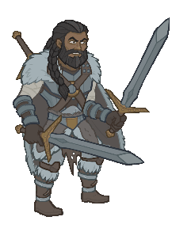

[Back to Main](index.md)

    
        
            
        
        
        Portrait
        
    
    
        
            
        
        
        Model
        
    

# Grimm

Grimm’s immense strength and steadfast loyalty make him the perfect partner for Beadle’s clever schemes. A giant in both stature and courage, Grimm is as at home smashing through foes as he is keeping the Giant’s Bane Tavern running smoothly.

# Basic Information

Grimm will be a new champion in the Festival of Fools event on 2 April 2025.

    
        
            **Seat**:
        
        
            2
        
        
            **Stat**
        
        
            **Value**
        
        
            **Day 1 Trials**
        
        
            **Patrons**
        
    
    
        
            **Species**:
        
        
            Human
        
        
            **Strength**:
        
        
            18
        
        
            Yes
        
        
            Mirt
        
    
    
        
            **Class**:
        
        
            Barbarian
        
        
            **Dexterity**:
        
        
            12
        
        
            Yes
        
        
            Vajra
        
    
    
        
            **Roles**:
        
        
            DPS / Tanking
        
        
            **Constitution**:
        
        
            16
        
        
            Yes
        
        
            -
        
    
    
        
            **Age**:
        
        
            26
        
        
            **Intelligence**:
        
        
            12
        
        
            Yes
        
        
            Zariel
        
    
    
        
            **Gender**:
        
        
            Male
        
        
            **Wisdom**:
        
        
            9
        
        
            Yes (Ability)
        
        
            Elminster
        
    
    
        
            **Alignment**:
        
        
            Chaotic Good
        
        
            **Charisma**:
        
        
            14
        
        
            Yes
        
        
            &nbsp;
        
    
    
        
            **Affiliation**:
        
        
            -
        
        
            **Total**:
        
        
            81
        
        
            Champion ID:
        
        
            161
        
    

# Formation

Unknown.


    



# Attacks

 **Base Attack: Giant's Bane** (Melee)
> Grimm cleaves through the nearest enemies with his two enormous greatswords.  
> Cooldown: 6.5s (Cap 1.625s)

<em>Raw Data</em>

<pre>
{
    "id": 305,
    "name": "Giant's Bane",
    "description": "Grimm cleaves through the nearest enemies with his two enormous greatswords.",
    "long_description": "",
    "graphic_id": 0,
    "target": "front",
    "num_targets": 1,
    "aoe_radius": 150,
    "damage_modifier": 1,
    "cooldown": 6.5,
    "animations": [
        {
            "type": "melee_attack",
            "damage_frame": 5
        }
    ],
    "tags": [
        "melee"
    ],
    "damage_types": [
        "melee"
    ]
}
</pre>

 **Ultimate Attack: One-on-One** (Level: 0)
> Grimm attacks the enemy with the most health and knocks back other enemies in a small area. In non boss areas, a Frost Giant spawns in revenge.  
> Cooldown: 300s (Cap 75s)

<em>Raw Data</em>

<pre>
{
    "id": 842,
    "name": "One-on-One",
    "description": "Grimm leaps into the fray, brutally slashing the enemy with the most health and knocking back all other enemies in a small area. Afterwards, if you're not in a boss area, a Frost Giant spawns in revenge.",
    "long_description": "Grimm attacks the enemy with the most health and knocks back other enemies in a small area. In non boss areas, a Frost Giant spawns in revenge.",
    "graphic_id": 8182,
    "target": "highest_health",
    "num_targets": 1,
    "aoe_radius": 200,
    "damage_modifier": 0.03,
    "cooldown": 300,
    "animations": [
        {
            "type": "grimm_ultimate_v2",
            "damage_frame": 8,
            "aoe_radius": 500,
            "monster_ids": [
                1266,
                1267,
                1268
            ]
        }
    ],
    "tags": [
        "ultimate"
    ],
    "damage_types": [
        "melee"
    ]
}
</pre>

# Abilities

**Inseparable** (Level: 0)
> Beadle & Grimm are so inseparable that if either one qualifies for an adventure restriction based on their tags, ages, ability scores, etc., then both can be used.

<em>Raw Data</em>

<pre>
{
    "id": 16734,
    "hero_id": 161,
    "required_level": 0,
    "required_upgrade_id": 0,
    "upgrade_type": "unlock_ability",
    "effect": "effect_def,2240",
    "static_dps_mult": null,
    "default_enabled": 1,
    "name": "Inseparable"
}
{
    "id": 2240,
    "flavour_text": "",
    "description": {
        "desc": "Beadle & Grimm are so inseparable that if either one qualifies for an adventure restriction based on their tags, ages, ability scores, etc., then both can be used."
    },
    "effect_keys": [
        {
            "effect_string": "do_nothing"
        }
    ],
    "requirements": "",
    "graphic_id": 0,
    "large_graphic_id": 0,
    "properties": []
}
</pre>

**Brothers In Armors** (Level: 1)
> If Beadle is in the formation, all of Grimm's equipment item levels are increased by Beadle's base average item level.

<em>Raw Data</em>

<pre>
{
    "id": 16730,
    "hero_id": 161,
    "required_level": 1,
    "required_upgrade_id": 0,
    "upgrade_type": "upgrade_ability",
    "effect": "effect_def,2253",
    "static_dps_mult": null,
    "default_enabled": 1,
    "name": "Brothers In Armors"
}
{
    "id": 2253,
    "flavour_text": "",
    "description": {
        "desc": "If Beadle is in the formation, all of Grimm's equipment item levels are increased by Beadle's base average item level."
    },
    "effect_keys": [
        {
            "off_when_benched": false,
            "effect_string": "item_levels_add,0",
            "targets": [
                "self"
            ],
            "use_computed_amount_for_description": true
        },
        {
            "off_when_benched": false,
            "effect_string": "buff_upgrade_add_flat_amount,1,16730",
            "amount_func": "add",
            "stack_func": "per_hero_attribute",
            "per_hero_expr": "AverageILevels()",
            "per_hero_targets": [
                {
                    "type": "heroes",
                    "hero_ids": [
                        108
                    ]
                }
            ],
            "amount_updated_listeners": [
                "loot_changed",
                "slot_changed"
            ]
        }
    ],
    "requirements": [
        {
            "requirement": "hero_in_formation",
            "target_hero_id": 108
        }
    ],
    "graphic_id": 0,
    "large_graphic_id": 0,
    "properties": {
        "is_formation_ability": true,
        "show_outgoing_description": false,
        "indexed_effect_properties": true,
        "per_effect_index_bonuses": true,
        "default_bonus_index": 0
    }
}
</pre>

**Get Buff** (Level: 10)
> Each time Grimm attacks an enemy his base attack cooldown is reduced by 0.2sec and he deals 25% more damage, stacking up to 25 times. Damage bonus stacks multiplicatively, while the base attack cooldown stacks additively. Stacks reset upon changing areas, unless Moving Right Along is triggered.

<em>Raw Data</em>

<pre>
{
    "id": 16735,
    "hero_id": 161,
    "required_level": 10,
    "required_upgrade_id": 0,
    "upgrade_type": "unlock_ability",
    "effect": "effect_def,2257",
    "static_dps_mult": null,
    "default_enabled": 1,
    "name": "Get Buff",
    "tip_text": "Each time Grimm strikes, his attacks quicken and his damage intensifies, lasting until he moves to a new area."
}
{
    "id": 2257,
    "flavour_text": "",
    "description": {
        "desc": "Each time Grimm attacks an enemy his base attack cooldown is reduced by 0.2sec and he deals $amount% more damage, stacking up to 25 times. Damage bonus stacks multiplicatively, while the base attack cooldown stacks additively. Stacks reset upon changing areas, unless Moving Right Along is triggered."
    },
    "effect_keys": [
        {
            "effect_string": "pre_stack_amount,25",
            "skip_effect_key_desc": true
        },
        {
            "off_when_benched": true,
            "effect_string": "hero_dps_multiplier_mult,0",
            "amount_expr": "upgrade_amount(16735,0)",
            "targets": [
                "self"
            ],
            "max_stacks": 25,
            "stacks_multiply": true,
            "stacks_on_trigger": "owner_attack",
            "more_triggers": [
                {
                    "trigger": "post_area_changed",
                    "action": {
                        "type": "reset"
                    }
                }
            ],
            "show_bonus": true
        },
        {
            "off_when_benched": true,
            "effect_string": "reduce_attack_cooldown,0.2",
            "amount_func": "add",
            "stacks_multiply": false,
            "stack_func": "per_other_stack_count",
            "per_other_stack_count_upgrade_id": 16735,
            "per_other_stack_count_effect_key_index": 1,
            "use_computed_amount_for_description": true,
            "amount_updated_listeners": [
                "stacks_changed"
            ],
            "show_bonus": true
        }
    ],
    "requirements": "",
    "graphic_id": 0,
    "large_graphic_id": 0,
    "properties": {
        "is_formation_ability": true,
        "indexed_effect_properties": true,
        "per_effect_index_bonuses": true,
        "default_bonus_index": 1
    }
}
</pre>

**TestUlt** (Level: 15)
> .

<em>Raw Data</em>

<pre>
{
    "id": 16731,
    "hero_id": 161,
    "required_level": 15,
    "required_upgrade_id": 0,
    "upgrade_type": "unlock_ultimate",
    "effect": "effect_def,2255",
    "static_dps_mult": null,
    "default_enabled": 1,
    "name": "TestUlt"
}
{
    "id": 2255,
    "flavour_text": "",
    "description": {
        "desc": ""
    },
    "effect_keys": [
        {
            "effect_string": "set_ultimate_attack,842"
        }
    ],
    "requirements": "",
    "graphic_id": 0,
    "large_graphic_id": 0,
    "properties": []
}
</pre>

**Break Their Will** (Level: 20)
> Each time Grimm attacks an enemy and breaks at least one armor or segmented health, he breaks 1 more on all subsequent attacks, stacking additively up to 5 times. Stacks reset upon changing areas, unless Moving Right Along is triggered.

<em>Raw Data</em>

<pre>
{
    "id": 16736,
    "hero_id": 161,
    "required_level": 20,
    "required_upgrade_id": 0,
    "upgrade_type": "unlock_ability",
    "effect": "effect_def,2258",
    "static_dps_mult": null,
    "default_enabled": 1,
    "name": "Break Their Will",
    "tip_text": "Grimm's attacks progressively break through more armor or segmented health. His bonuses last until changing areas, or may persist longer if the party advances quickly."
}
{
    "id": 2258,
    "flavour_text": "",
    "description": {
        "desc": "Each time Grimm attacks an enemy and breaks at least one armor or segmented health, he breaks 1 more on all subsequent attacks, stacking additively up to 5 times. Stacks reset upon changing areas, unless Moving Right Along is triggered."
    },
    "effect_keys": [
        {
            "effect_string": "do_nothing,1",
            "stacks_on_trigger": "monster_armor_segment_broken",
            "more_triggers": [
                {
                    "trigger": "monster_health_segment_broken",
                    "action": {
                        "type": "add_stack"
                    }
                },
                {
                    "trigger": "area_changed",
                    "action": {
                        "type": "reset"
                    }
                }
            ],
            "stacks_multiply": false,
            "max_stacks": 5,
            "show_stacks": true
        },
        {
            "effect_string": "armor_break_add,0",
            "amount_expr": "upgrade_amount(16736,0)"
        },
        {
            "effect_string": "health_seg_break_add,0",
            "amount_expr": "upgrade_amount(16736,0)"
        }
    ],
    "requirements": "",
    "graphic_id": 0,
    "large_graphic_id": 0,
    "properties": {
        "is_formation_ability": true,
        "indexed_effect_properties": true,
        "per_effect_index_bonuses": true,
        "default_bonus_index": 0
    }
}
</pre>

**Moving Right Along** (Level: 30)
> If the party completes a new area within 15 seconds of entering it, Grimm's Get Buff and Break Their Will stacks do not reset upon entering the next area.

<em>Raw Data</em>

<pre>
{
    "id": 16737,
    "hero_id": 161,
    "required_level": 30,
    "required_upgrade_id": 0,
    "upgrade_type": "unlock_ability",
    "effect": "effect_def,2259",
    "static_dps_mult": null,
    "default_enabled": 1,
    "name": "Moving Right Along"
}
{
    "id": 2259,
    "flavour_text": "",
    "description": {
        "desc": "If the party completes a new area within 15 seconds of entering it, Grimm's Get Buff and Break Their Will stacks do not reset upon entering the next area."
    },
    "effect_keys": [
        {
            "effect_string": "apply_effects_at_stacks",
            "show_description": false,
            "apply_effect_stack_amounts": [
                0,
                1,
                0,
                1
            ],
            "max_stacks": 1,
            "stacks_on_trigger": "on_timer,15",
            "more_triggers": [
                {
                    "trigger": "post_area_changed",
                    "action": {
                        "type": "reset"
                    }
                }
            ]
        },
        {
            "effect_string": "change_upgrade_data,16736,0",
            "apply_manually": true,
            "data": {
                "more_triggers": [
                    {
                        "trigger": "monster_health_segment_broken",
                        "action": {
                            "type": "add_stack"
                        }
                    }
                ]
            }
        },
        {
            "effect_string": "change_upgrade_data,16736,0",
            "apply_manually": true,
            "data": {
                "more_triggers": [
                    {
                        "trigger": "monster_health_segment_broken",
                        "action": {
                            "type": "add_stack"
                        }
                    },
                    {
                        "trigger": "area_changed",
                        "action": {
                            "type": "reset"
                        }
                    }
                ]
            }
        },
        {
            "effect_string": "change_upgrade_data,16735,1",
            "apply_manually": true,
            "data": {
                "more_triggers": []
            }
        },
        {
            "effect_string": "change_upgrade_data,16735,1",
            "apply_manually": true,
            "data": {
                "more_triggers": [
                    {
                        "trigger": "area_changed",
                        "action": {
                            "type": "reset"
                        }
                    }
                ]
            }
        }
    ],
    "requirements": "",
    "graphic_id": 0,
    "large_graphic_id": 0,
    "properties": {
        "is_formation_ability": false
    }
}
</pre>

**Barbarian's Protection** (Level: 40)
> Grimm increases the health of all other Champions by 25% of his max health and any healing effect on those Champions is increased by 25%.

<em>Raw Data</em>

<pre>
{
    "id": 16738,
    "hero_id": 161,
    "required_level": 40,
    "required_upgrade_id": 0,
    "upgrade_type": "unlock_ability",
    "effect": "effect_def,2260",
    "static_dps_mult": null,
    "default_enabled": 1,
    "name": "Barbarian's Protection"
}
{
    "id": 2260,
    "flavour_text": "",
    "description": {
        "desc": "Grimm increases the health of all other Champions by 25% of his max health and any healing effect on those Champions is increased by 25%."
    },
    "effect_keys": [
        {
            "off_when_benched": true,
            "effect_string": "increase_health_by_source_percent,25",
            "targets": [
                "other"
            ]
        },
        {
            "off_when_benched": true,
            "effect_string": "healing_add_mult,25",
            "targets": [
                "all"
            ]
        }
    ],
    "requirements": "",
    "graphic_id": 0,
    "large_graphic_id": 0,
    "properties": {
        "is_formation_ability": true,
        "owner_use_outgoing_description": true,
        "indexed_effect_properties": true,
        "per_effect_index_bonuses": true,
        "default_bonus_index": 0
    }
}
</pre>

**Ultimate Tag Team** (Level: 90)
> When Beadle uses his ultimate ability in the same party as Grimm, Grimm's ultimate ability goes on cooldown and he gains one Tag Team stack. For each Tag Team stack Grimm has, his ultimate cooldown is reduced by 5 seconds, and his next ultimate attack deals 200% more damage, stacking multiplicatively. Tag Team stacks cap at 10 and reset when Grimm uses his ultimate ability.

<em>Raw Data</em>

<pre>
{
    "id": 16732,
    "hero_id": 161,
    "required_level": 90,
    "required_upgrade_id": 0,
    "upgrade_type": "unlock_ability",
    "effect": "effect_def,2254",
    "static_dps_mult": null,
    "default_enabled": 1,
    "name": "Ultimate Tag Team"
}
{
    "id": 2254,
    "flavour_text": "",
    "description": {
        "desc": "When Beadle uses his ultimate ability in the same party as Grimm, Grimm's ultimate ability goes on cooldown and he gains one Tag Team stack. For each Tag Team stack Grimm has, his ultimate cooldown is reduced by 5 seconds, and his next ultimate attack deals $amount% more damage, stacking multiplicatively. Tag Team stacks cap at 10 and reset when Grimm uses his ultimate ability."
    },
    "effect_keys": [
        {
            "off_when_benched": false,
            "effect_string": "ultimate_tag_team,200",
            "source_hero_id": 161,
            "target_hero_id": 108,
            "stack_max": 10,
            "cooldown_decrease": 5,
            "buff_effect_key_index": 1,
            "stat": "grimm_tag_team_stacks",
            "achievement_stat_name": "grimm_tag_team_max"
        },
        {
            "effect_string": "do_nothing,200",
            "stacks_on_trigger": "will_stack_manually",
            "stacks_multiply": true,
            "show_bonus": true,
            "apply_manually": true
        }
    ],
    "requirements": "",
    "graphic_id": 0,
    "large_graphic_id": 0,
    "properties": {
        "is_formation_ability": true,
        "show_outgoing_description": true,
        "show_incoming": false,
        "indexed_effect_properties": true,
        "per_effect_index_bonuses": true,
        "default_bonus_index": 0
    }
}
</pre>

# Specialisations

**Giant Hunter** (Level: 50)
> Grimm gains the Hunter role, and Giants become his Favored Foe. Grimm deals 10000% more damage against his Favored Foe, and all boss enemies also count as Giants for the purposes of all abilities that care about such things.

<em>Raw Data</em>

<pre>
{
    "id": 16890,
    "hero_id": 161,
    "required_level": 50,
    "required_upgrade_id": 0,
    "upgrade_type": "unlock_ability",
    "effect": "effect_def,2261",
    "static_dps_mult": null,
    "default_enabled": 1,
    "name": "Giant Hunter",
    "specialization_name": "Giant Hunter",
    "specialization_description": "Giant Hunter",
    "specialization_graphic_id": 1
}
{
    "id": 2261,
    "flavour_text": "",
    "description": {
        "desc": "Grimm gains the Hunter role, and Giants become his Favored Foe. Grimm deals $amount% more damage against his Favored Foe, and all boss enemies also count as Giants for the purposes of all abilities that care about such things"
    },
    "effect_keys": [
        {
            "effect_string": "increase_damage_against_monster,10000",
            "monster_is_favored_foe_of_effect_owner": true,
            "targets": [
                "self"
            ],
            "off_when_benched": true
        },
        {
            "effect_string": "monster_add_tags,0,1,giant"
        },
        {
            "effect_string": "add_hero_tags,0,hunter"
        },
        {
            "off_when_benched": true,
            "effect_string": "favored_foe,giant"
        }
    ],
    "requirements": "",
    "graphic_id": 0,
    "large_graphic_id": 0,
    "properties": {
        "is_formation_ability": true,
        "owner_use_outgoing_description": true,
        "indexed_effect_properties": true,
        "per_effect_index_bonuses": true,
        "default_bonus_index": 0
    }
}
</pre>

**Giant Taunter** (Level: 50)
> Grimm taunts all enemies he attacks, causing them to switch targets and attack him. For each enemy that has attacked him in the current area, his damage is increased by 25%, stacking multiplicatively up to 100 times.

<em>Raw Data</em>

<pre>
{
    "id": 16891,
    "hero_id": 161,
    "required_level": 50,
    "required_upgrade_id": 0,
    "upgrade_type": "unlock_ability",
    "effect": "effect_def,2262",
    "static_dps_mult": null,
    "default_enabled": 1,
    "name": "Giant Taunter",
    "specialization_name": "Giant Taunter",
    "specialization_description": "Giant Taunter",
    "specialization_graphic_id": 1
}
{
    "id": 2262,
    "flavour_text": "",
    "description": {
        "desc": "Grimm taunts all enemies he attacks, causing them to switch targets and attack him. For each enemy that has attacked him in the current area, his damage is increased by $amount%, stacking multiplicatively up to 100 times."
    },
    "effect_keys": [
        {
            "effect_string": "hero_dps_multiplier_mult,25",
            "stacks_on_trigger": "hero_targeted_by_effect_attacked",
            "more_triggers": [
                {
                    "trigger": "area_changed",
                    "action": {
                        "type": "reset"
                    }
                }
            ],
            "stacks_multiply": true,
            "stack_max": 100,
            "show_bonus": true
        },
        {
            "effect_string": "taunt,0",
            "base_attack_taunts": true,
            "base_attack_always_taunts": true
        }
    ],
    "requirements": "",
    "graphic_id": 0,
    "large_graphic_id": 0,
    "properties": {
        "is_formation_ability": true,
        "owner_use_outgoing_description": true,
        "indexed_effect_properties": true,
        "per_effect_index_bonuses": true,
        "default_bonus_index": 0
    }
}
</pre>

**Giant Profits** (Level: 50)
> Grimm gains the Gold Find role. Enemies that Grimm defeats drop amount% additional gold for each enemy he has defeated in the current area, stacking multiplicatively and capping at 20.

<em>Raw Data</em>

<pre>
{
    "id": 16892,
    "hero_id": 161,
    "required_level": 50,
    "required_upgrade_id": 0,
    "upgrade_type": "unlock_ability",
    "effect": "effect_def,2263",
    "static_dps_mult": null,
    "default_enabled": 1,
    "name": "Giant Profits",
    "specialization_name": "Giant Profits",
    "specialization_description": "Giant Profits",
    "specialization_graphic_id": 1
}
{
    "id": 2263,
    "flavour_text": "",
    "description": {
        "desc": "Grimm gains the Gold Find role. Enemies that Grimm defeats drop amount% additional gold for each enemy he has defeated in the current area, stacking multiplicatively and capping at 20."
    },
    "effect_keys": [
        {
            "effect_string": "add_monster_hit_effects,100",
            "monster_effect": {
                "effect_string": "chance_monster_extra_gold,$amount,100",
                "one_per_hero": true
            }
        },
        {
            "effect_string": "buff_upgrade,100,16892",
            "stacks_on_trigger": "monster_killed",
            "stacks_multiply": true,
            "more_triggers": [
                {
                    "trigger": "area_changed",
                    "action": {
                        "type": "reset"
                    }
                }
            ],
            "stack_max": 20,
            "show_bonus": true
        },
        {
            "effect_string": "add_hero_tags,0,gold"
        }
    ],
    "requirements": "",
    "graphic_id": 0,
    "large_graphic_id": 0,
    "properties": {
        "is_formation_ability": true,
        "owner_use_outgoing_description": true,
        "indexed_effect_properties": true,
        "per_effect_index_bonuses": true,
        "default_bonus_index": 0
    }
}
</pre>

# Items

    
        
            **Icons**
        
        
            **Slot**
        
        
            **Epic Name**
        
        
            **Effect**
        
    
    
        
            ID: 3818**Lost and Found Sword**If it's sharp, then IT'LL DO! ~Grimm<code>hero_dps_multiplier_mult,50 allow_ge:true</code>ID: 3819**Silvered Sword**What do you mean it might not be silver!? ~Grimm<code>hero_dps_multiplier_mult,125 allow_ge:true</code>ID: 3820**Grimm's Blade**Every blade is unique. This one is my blade. No touching. ~Grimm<code>hero_dps_multiplier_mult,200 allow_ge:true</code>ID: 3821**Sword of Redemption**I'll make up for my past mistakes. ~Grimm<code>hero_dps_multiplier_mult,350 allow_ge:true</code>&nbsp;
        
        
            1
        
        
            Sword of Redemption
        
        
            Self DPS
        
    
    
        
            ID: 3822**Proof of a Duel**There he was, steel brandished! His terrible foe towered over him! ~Beadle<code>buff_upgrade,25,16735 allow_ge:false</code>ID: 3823**Taste of Victory**The frost giant fell, and Grimm the Giant Slayer's legend had been born! ~Beadle<code>buff_upgrade,50,16735 allow_ge:false</code>ID: 3824**Crude Mockery**But the giants would soon have their revenge! They left a dire warning. ~Beadle<code>buff_upgrade,75,16735 allow_ge:false</code>ID: 3825**Memory of Trask**They will be remembered, and I will never forget. ~Grimm<code>buff_upgrade,100,16735 allow_ge:false</code>
        
        
            2
        
        
            Memory of Trask
        
        
            Get Buff
        
    
    
        
            ID: 3826**Spare Helmet**Wear in case of emergency. Or if you're too drunk. ~Beadle<code>buff_upgrades,25,16890,16891,16892 allow_ge:false</code>ID: 3827**Frost Giant Helmet**We needed to build a new dining room for all of our giant trophies! ~Beadle<code>buff_upgrades,87.5,16890,16891,16892 allow_ge:false</code>ID: 3828**Frost Giant's Ear**Beadle keeps it out back. He brings it out during the 'Tale of the Giant Slayer.' ~Grimm<code>buff_upgrades,150,16890,16891,16892 allow_ge:false</code>ID: 3829**Carving of the Slain Giant**This... is a reminder of my hubris. My biggest mistake. ~Grimm<code>buff_upgrades,275,16890,16891,16892 allow_ge:false</code>
        
        
            3
        
        
            Carving of the Slain Giant
        
        
            All Specialisations
        
    
    
        
            ID: 3830**Makeshift Leather Armor**Found this in the back room, gathering dust. It'll do, yeah? ~Beadle<code>health_mult,10 allow_ge:false</code>ID: 3831**Mammoth Hide Armor**Of course he slew the beast himself! ~Beadle<code>health_mult,30 allow_ge:false</code>ID: 3832**Sturdy Iron Breastplate**It's lined with chardalyn, for a little extra protection. ~Beadle<code>health_mult,50 allow_ge:false</code>ID: 3833**White Wyrm Scale Mail**Not even old Iceclaws could stop me now! ~Grimm<code>health_mult,100 allow_ge:false</code>
        
        
            4
        
        
            White Wyrm Scale Mail
        
        
            Health
        
    
    
        
            ID: 3834**Blizzard Ruined Furs**I ended up doing more damage to the cloak than the bugbear! ~Grimm<code>buff_ultimate,25 allow_ge:false</code>ID: 3835**Icky Furs**Do you remember the gelatinous cube you RAN into!? ~Grimm<code>buff_ultimate,87.5 allow_ge:false</code>ID: 3836**Frozen North Furs**Leave your cloaks at the door, friends. You're in the Giant's Bane Tavern, now. ~Beadle<code>buff_ultimate,150 allow_ge:false</code>ID: 3837**Elegant Snow Cloak**Now THIS is a fashion statement! ~Grimm<code>buff_ultimate,275 allow_ge:false</code>
        
        
            5
        
        
            Elegant Snow Cloak
        
        
            Ultimate Damage
        
    
    
        
            ID: 3838**Dueling Boots**Beadle uses them when he wants to perform a dueling scene. ~Grimm<code>reduce_ultimate_cooldown,2 allow_ge:false</code>ID: 3839**Trash Boots**Grimm uses them when he needs to take out the trash. ~Beadle<code>reduce_ultimate_cooldown,3 allow_ge:false</code>ID: 3840**Mithral Toed Boots**It's all fun and games till Grimm tosses his cleaver across the room. ~Beadle<code>reduce_ultimate_cooldown,6 allow_ge:false</code>ID: 3841**Boots of the Giant Slayer**They make me look awesome, right?! Can I borrow them? ~Beadle<code>reduce_ultimate_cooldown,15 allow_ge:false</code>
        
        
            6
        
        
            Boots of the Giant Slayer
        
        
            Ultimate Cooldown Reduction Cap: 501 dull / 251 shiny / 126 golden.
        
    

<em>Item Names and Descriptions</em>

<pre>
Slot 1:
      Lost and Found Sword: If it's sharp, then IT'LL DO! ~Grimm
            Silvered Sword: What do you mean it might not be silver!? ~Grimm
             Grimm's Blade: Every blade is unique. This one is my blade. No touching. ~Grimm
       Sword of Redemption: I'll make up for my past mistakes. ~Grimm

Slot 2:
           Proof of a Duel: There he was, steel brandished! His terrible foe towered over him!
                            ~Beadle
          Taste of Victory: The frost giant fell, and Grimm the Giant Slayer's legend had been
                            born! ~Beadle
             Crude Mockery: But the giants would soon have their revenge! They left a dire
                            warning. ~Beadle
           Memory of Trask: They will be remembered, and I will never forget. ~Grimm

Slot 3:
              Spare Helmet: Wear in case of emergency. Or if you're too drunk. ~Beadle
        Frost Giant Helmet: We needed to build a new dining room for all of our giant trophies!
                            ~Beadle
         Frost Giant's Ear: Beadle keeps it out back. He brings it out during the 'Tale of the
                            Giant Slayer.' ~Grimm
Carving of the Slain Giant: This... is a reminder of my hubris. My biggest mistake. ~Grimm

Slot 4:
   Makeshift Leather Armor: Found this in the back room, gathering dust. It'll do, yeah?
                            ~Beadle
        Mammoth Hide Armor: Of course he slew the beast himself! ~Beadle
   Sturdy Iron Breastplate: It's lined with chardalyn, for a little extra protection. ~Beadle
     White Wyrm Scale Mail: Not even old Iceclaws could stop me now! ~Grimm

Slot 5:
      Blizzard Ruined Furs: I ended up doing more damage to the cloak than the bugbear! ~Grimm
                 Icky Furs: Do you remember the gelatinous cube you RAN into!? ~Grimm
         Frozen North Furs: Leave your cloaks at the door, friends. You're in the Giant's Bane
                            Tavern, now. ~Beadle
        Elegant Snow Cloak: Now THIS is a fashion statement! ~Grimm

Slot 6:
             Dueling Boots: Beadle uses them when he wants to perform a dueling scene. ~Grimm
               Trash Boots: Grimm uses them when he needs to take out the trash. ~Beadle
        Mithral Toed Boots: It's all fun and games till Grimm tosses his cleaver across the
                            room. ~Beadle
 Boots of the Giant Slayer: They make me look awesome, right?! Can I borrow them? ~Beadle
</pre>

 

# Feats

This list will only show feats that are going to be available on the release of this champion. The separate [Feats](feats.md) page may show others that could be available later if they exist.

    
        
            **Feat**
        
        
            **Effect**
        
        
            **Source**
        
    
    
        
            ID: 2142**Tavern Brawler (Grimm)**Trust me, friend. You do not want to test me. ~Grimm<code>hero_dps_multiplier_mult,30</code>Tavern Brawler
        
        
            30% Self DPS
        
        
            Free
        
    
    
        
            ID: 2143**Grappler (Grimm)**Grimm! I got one! ~Beadle<code>hero_dps_multiplier_mult,60</code>Grappler
        
        
            60% Self DPS
        
        
            12,500 Gems
        
    
    
        
            ID: 2144**Defensive Duelist (Grimm)**You're no frost giant. This will be easy. ~Grimm<code>overwhelm_start_increase,5</code>Defensive Duelist
        
        
            +5 Overwhelm
        
        
            Free
        
    
    
        
            ID: 2145**Calm Under Pressure (Grimm)**A hundred of you and just one of me? I like those odds. ~Grimm<code>overwhelm_start_increase,10</code>Calm Under Pressure
        
        
            +10 Overwhelm
        
        
            12,500 Gems
        
    
    
        
            ID: 2146**Tough (Grimm)**This is nothing! Beadle's steaks are tougher than this! ~Grimm<code>health_mult,15</code>Tough
        
        
            15% Health
        
        
            Free
        
    
    
        
            ID: 2147**Resilient (Grimm)**I didn't give up after Trask, and I won't give up now. ~Grimm<code>health_mult,30</code>Resilient
        
        
            30% Health
        
        
            Gold Chest
        
    
    
        
            ID: 2148**Warm Up (Grimm)**Let me make a few practice swings before we get down to business. ~Grimm<code>buff_upgrade,20,16735</code>Warm Up
        
        
            20% Get Buff
        
        
            Free
        
    
    
        
            ID: 2149**Fired Up (Grimm)**Start counting, Beadle. I want to know how many swings they can take. ~Grimm<code>buff_upgrade,40,16735</code>Fired Up
        
        
            40% Get Buff
        
        
            Gold Chest
        
    
    
        
            ID: 2150**Friend in Deed (Grimm)**Beadle! Need you over here! No, it can't wait! ~Grimm<code>buff_upgrade,40,16732</code>Friend in Deed
        
        
            40% Ultimate Tag Team
        
        
            Gold Chest
        
    
    
        
            ID: 2151**Beadle's Partner in Crime (Grimm)**If you have a problem with him, you'll have to go through me. ~Grimm<code>buff_upgrade,80,16732</code>Beadle's Partner in Crime
        
        
            80% Ultimate Tag Team
        
        
            Event Bonus
        
    
    
        
            ID: 2152**Giant Ego (Grimm)**Grimm's one of the best warriors around. Don't worry. He'll remind you. ~Beadle<code>buff_upgrades,40,16890,16891,16892</code>Giant Ego
        
        
            40% All Specialisations
        
        
            12,500 Gems
        
    
    
        
            ID: 2153**Muscle Club (Grimm)**I'm huge. You're huge. We should hang out. ~Grimm<code>hero_dps_multiplier_mult,40</code>Muscle Club
        
        
            40% Self DPS
        
        
            Event Bonus
        
    
    
        
            ID: 2154**Gloves Off (Grimm)**Let's settle this, one on one. No potions, blades only, neutral ground. ~Grimm<code>buff_ultimate,100 disallow_roaming_familiar_ult_trigger</code>Gloves Off
        
        
            100% Ultimate Damage & Blocks Roaming Ultimate Bar Familiars
        
        
            3,830 Platinum 50,000 Gems
        
    

# Legendaries

Unknown.

# Adventures and Variants

**Unlock Adventure: A Fool's Errand (???)** (Complete Area 50)
> Save the village from a foolish prank gone wrong.

**Variant 1: TBD** (Complete Area 75)
> 

**Variant 2: TBD** (Complete Area 125)
> 

**Variant 3: TBD** (Complete Area 175)
> 

# Other Champion Images

    
        
            Console Portrait
        
    
    
        
            Gold Chest Icon
        
        
            Silver Chest Icon
        
    

[Back to Top](#top)

*Last Modified: {{ site.time }}*