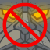
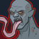
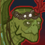

[Back to Main](index.md)

    
        Portait
    

# Gromma

Extremely elderly for a Tortle, Gromma Nander grew discontent with her secluded life after giving birth to her offspring. Once they were old enough to fend for themselves, she ventured back out into the world to learn as much as she could about the strange creatures that inhabit it. Gromma is a wise and inquisitive Tortle who is quick to friendship but slow to trust. She carries a pouch of smooth colored stones that she has collected on her journey and walks with the aid of a battle-worn spear.

# Changes

Gromma is potentially a reworked champion in the The Great Modron March event on 1 May 2024.

Only abilities that have seen some changes will be displayed here - and be aware that there's a lot of guesswork involved. Some abilities may not have names - some may have the *wrong* names - or specialisations might not be marked as such - etc.. Focus on the effect data itself.

Please do me a favour and don't get all melodramatic about what you find here. I - and CNE - don't appreciate it. These are spoilers and will almost certainly change before release - likely multiple times. That and we don't have access to any upgrade data prior to release. Making assumptions on how the champions will turn out based on this information would be premature.

# Abilities

**Running With The Youngins** (Guess)
> Unknown.

<em>Raw Data</em>

<pre>
{
    "id": 22981,
    "graphic": "Icons/Champions/Rebalance/Gromma/Icon_Formation_GrommaRunningWithTheYoungins",
    "v": 2,
    "fs": 0,
    "p": 0,
    "type": 1,
    "export_params": {
        "uses": [
            "icon"
        ]
    }
}
</pre>

**Specialisation: Circle of the Arctic** (Guess)
> Unknown.

<em>Raw Data</em>

<pre>
{
    "id": 22782,
    "graphic": "Portraits/Portrait_Gale",
    "v": 2,
    "fs": 0,
    "p": 0,
    "type": 1,
    "export_params": {
        "uses": [
            "portrait"
        ],
        "quantize": true
    }
}
</pre>

**Specialisation: Circle of the Mountain** (Guess)
> Unknown.

<em>Raw Data</em>

<pre>
{
    "id": 22783,
    "graphic": "Characters/Event/Hero_Gale",
    "v": 2,
    "fs": 0,
    "p": 0,
    "type": 3,
    "export_params": {
        "uses": [
            "crusader"
        ]
    }
}
</pre>

**Specialisation: Circle of the Swamp** (Guess)
> Unknown.

<em>Raw Data</em>

<pre>
{
    "id": 22784,
    "graphic": "Characters/Event/Hero_Gale_2xup",
    "v": 2,
    "fs": 0,
    "p": 0,
    "type": 3,
    "export_params": {
        "uses": [
            "crusader"
        ],
        "upscale": 2,
        "ref_graphic_id": 22783,
        "sequence_override": [
            1,
            2
        ]
    }
}
</pre>

**Specialisation: Entanglement** (Guess)
> Unknown.

<em>Raw Data</em>

<pre>
{
    "id": 22784,
    "graphic": "Characters/Event/Hero_Gale_2xup",
    "v": 2,
    "fs": 0,
    "p": 0,
    "type": 3,
    "export_params": {
        "uses": [
            "crusader"
        ],
        "upscale": 2,
        "ref_graphic_id": 22783,
        "sequence_override": [
            1,
            2
        ]
    }
}
</pre>

**Specialisation: Melf's Acid Arrow** (Guess)
> Unknown.

<em>Raw Data</em>

<pre>
{
    "id": 22784,
    "graphic": "Characters/Event/Hero_Gale_2xup",
    "v": 2,
    "fs": 0,
    "p": 0,
    "type": 3,
    "export_params": {
        "uses": [
            "crusader"
        ],
        "upscale": 2,
        "ref_graphic_id": 22783,
        "sequence_override": [
            1,
            2
        ]
    }
}
</pre>

**Specialisation: Stoneskin** (Guess)
> Unknown.

<em>Raw Data</em>

<pre>
{
    "id": 22784,
    "graphic": "Characters/Event/Hero_Gale_2xup",
    "v": 2,
    "fs": 0,
    "p": 0,
    "type": 3,
    "export_params": {
        "uses": [
            "crusader"
        ],
        "upscale": 2,
        "ref_graphic_id": 22783,
        "sequence_override": [
            1,
            2
        ]
    }
}
</pre>

# Adventures and Variants

 **Unlock Adventure: The Crypt of Legends (Gromma)** (Complete Area 50)
> Pay respects to the heroes of olde during the Feast of the Moon.

 **Variant 1: Respectful Restraint** (Complete Area 75)
> Ultimate attacks cannot be used Any attack with a cooldown of 5 seconds or less have an additional 3 second cooldown

 **Variant 2: The Relentless Undead** (Complete Area 125)
> Undead monsters have twice as much health as normal When an undead monster is reduced to 0 hit points, it is stunned for 10 seconds and then comes back to life with full health

 **Variant 3: A Grand Nandventure** (Complete Area 175)
> Gromma Nander must always be in your formation Gromma has a 4x damage boost and her normal attack cooldown is reduced by 2 seconds

# Formation

    <svg xmlns="http://www.w3.org/2000/svg" id="Gromma" fill="#aaa" data-formationName="Gromma" data-campaignName="Feast of the Moon" width="338" height="120"><circle cx="175" cy="45" r="15"/><circle cx="175" cy="85" r="15"/><circle cx="135" cy="65" r="15"/><circle cx="95" cy="45" r="15"/><circle cx="95" cy="85" r="15"/><circle cx="55" cy="25" r="15"/><circle cx="55" cy="65" r="15"/><circle cx="55" cy="105" r="15"/><circle cx="15" cy="45" r="15"/><circle cx="15" cy="85" r="15"/><text x="205" y="25" fill="#dcdcdc" font-size="25" font-family="Arial" font-weight="bold">Gromma</text><text x="205" y="65" fill="#dcdcdc" font-size="15" font-family="Arial" font-weight="bold">Feast of the Moon</text></svg>

[Back to Top](#top)

*Last Modified: {{ site.time }}*