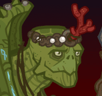

[Back to Main](index.md)

    
        Portait
    

# Gromma

Extremely elderly for a Tortle, Gromma Nander grew discontent with her secluded life after giving birth to her offspring. Once they were old enough to fend for themselves, she ventured back out into the world to learn as much as she could about the strange creatures that inhabit it. Gromma is a wise and inquisitive Tortle who is quick to friendship but slow to trust. She carries a pouch of smooth colored stones that she has collected on her journey and walks with the aid of a battle-worn spear.

# Changes

Gromma is potentially a reworked champion in the The Great Modron March event on 1 May 2024.

Only abilities that have seen some changes will be displayed here - and be aware that there's a lot of guesswork involved. Some abilities may not have names - some may have the *wrong* names - or specialisations might not be marked as such - etc.. Focus on the effect data itself.

Please do me a favour and don't get all melodramatic about what you find here. I - and CNE - don't appreciate it. These are spoilers and will almost certainly change before release - likely multiple times. That and we don't have access to any upgrade data prior to release. Making assumptions on how the champions will turn out based on this information would be premature.

# Abilities

**Base Attack: Melf's Acid Arrow** (Guess)
> Gromma attacks the nearest target, dealing BUD-based area damage in a small radius.

<em>Raw Data</em>

<pre>
{
    "id": 751,
    "name": "Melf's Acid Arrow",
    "description": "Gromma attacks the nearest target, dealing BUD-based area damage in a small radius.",
    "long_description": "",
    "graphic_id": 0,
    "target": "front",
    "num_targets": 1,
    "aoe_radius": 0,
    "damage_modifier": 1.5,
    "cooldown": 4.6,
    "animations": [
        {
            "type": "ranged_attack",
            "projectile": "acid_arrow",
            "shoot_frame": 10,
            "projectile_count": 1,
            "shoot_offset_x": 140,
            "shoot_offset_y": 0
        }
    ],
    "tags": [
        "ranged"
    ],
    "damage_types": [
        "magic"
    ]
}
</pre>

**Grandmotherly Love** (Guess)
> Gromma increases the damage of all other heroes proportional to their age. The buff starts applying to each Champion at 100%, and for every 10 years younger than 100 that Champion is, the buff on them is increased by 100%, stacking multiplicatively.

<em>Raw Data</em>

<pre>
{
    "id": 1949,
    "flavour_text": "",
    "description": {
        "desc": "Gromma increases the damage of all other heroes proportional to their age. The buff starts applying to each Champion at $(amount)%, and for every 10 years younger than 100 that Champion is, the buff on them is increased by $(buff_amount___2)%, stacking multiplicatively."
    },
    "effect_keys": [
        {
            "effect_string": "hero_dps_multiplier_mult,100",
            "targets": [
                "other"
            ],
            "amount_updated_listeners": [
                "slot_changed",
                "feat_changed"
            ]
        },
        {
            "effect_string": "buff_incoming_effect_by_expr",
            "effect_id": 1949,
            "effect_index": 0,
            "buff_amount": 100,
            "hero_expr": "pow((1+(buff_amount/100)), max(9 - floor(min(age,90)/10),0))",
            "targets": [
                "all"
            ],
            "filter_targets": [
                {
                    "type": "exclude_heroes",
                    "hero_ids": [
                        146
                    ]
                }
            ],
            "amount_updated_listeners": [
                "slot_changed",
                "feat_changed"
            ],
            "skip_effect_key_desc": true
        }
    ],
    "requirements": "",
    "graphic_id": 0,
    "large_graphic_id": 0,
    "properties": {
        "is_formation_ability": true,
        "owner_use_outgoing_description": true,
        "indexed_effect_properties": true
    }
}
</pre>

**Running With The Youngins** (Guess)
> The effect of Grandmotherly Love is increased by 50% for each Champion in the formation younger than Gromma, stacking multiplicatively.

<em>Raw Data</em>

<pre>
{
    "id": 1951,
    "flavour_text": "",
    "description": {
        "desc": "The effect of Grandmotherly Love is increased by $amount% for each Champion in the formation younger than Gromma, stacking multiplicatively."
    },
    "effect_keys": [
        {
            "off_when_benched": true,
            "effect_string": "pre_stack_amount,50"
        },
        {
            "effect_string": "buff_upgrade,0,14874,0",
            "amount_expr": "upgrade_amount(14876,0)",
            "amount_func": "mult",
            "stack_func": "per_hero_attribute",
            "per_hero_expr": "age<80",
            "per_hero_targets": [
                {
                    "type": "except_heroes",
                    "hero_ids": [
                        146
                    ],
                    "only_in_formation": true
                }
            ],
            "show_bonus": true,
            "amount_updated_listeners": [
                "slot_changed"
            ]
        },
        {
            "effect_string": "expression_on_trigger,area_complete",
            "per_trigger_expr": "AppendToSaveStat(`gromma_running_with_nine_youngins`, false, trigger_count * as_int(GetUpgradeStacks(14876, 1) >= 9))"
        }
    ],
    "requirements": "",
    "graphic_id": 0,
    "large_graphic_id": 0,
    "properties": {
        "is_formation_ability": true,
        "owner_use_outgoing_description": true,
        "indexed_effect_properties": true
    }
}
</pre>

**Specialisation: Unknown** (Guess)
> Gromma increases the damage of Neutral Champions (on the Good/Evil axis) by 5% for each enemy that has spawned and boss enrage stack in the current area, stacking multiplicatively and capping at 100.

<em>Raw Data</em>

<pre>
{
    "id": 1952,
    "flavour_text": "",
    "description": {
        "desc": "Gromma increases the damage of Neutral Champions (on the Good/Evil axis) by $amount% for each enemy that has spawned and boss enrage stack in the current area, stacking multiplicatively and capping at 100."
    },
    "effect_keys": [
        {
            "effect_string": "hero_dps_multiplier_mult,5",
            "targets": [
                {
                    "type": "by_tags",
                    "tags": "geneutral"
                }
            ],
            "amount_func": "mult",
            "stack_func": "per_hero_attribute",
            "per_hero_expr": "0",
            "post_process_expr": "boss_enrage_stacks+monsters_spawned",
            "limit": 100,
            "show_bonus": true
        }
    ],
    "requirements": "",
    "graphic_id": 0,
    "large_graphic_id": 0,
    "properties": {
        "is_formation_ability": true,
        "owner_use_outgoing_description": true,
        "spec_option_post_apply_info": "Champions Targeted: $num_targets"
    }
}
</pre>

**Specialisation: Circle of the Arctic** (Guess)
> Gromma now casts Sleet Storm on enemies she attacks, causing her targeted enemy, and all nearby enemies, to take 400% additional damage from all attacks.

<em>Raw Data</em>

<pre>
{
    "id": 1953,
    "flavour_text": "",
    "description": {
        "desc": "Gromma now casts Sleet Storm on enemies she attacks, causing her targeted enemy, and all nearby enemies, to take $amount% additional damage from all attacks."
    },
    "effect_keys": [
        {
            "effect_string": "add_monster_hit_effects,400,57",
            "use_chained_attack": false,
            "monster_effect": {
                "effect_string": "effect_def,1961"
            },
            "after_damage": false,
            "range": 200
        }
    ],
    "requirements": "",
    "graphic_id": 0,
    "large_graphic_id": 0,
    "properties": {
        "is_formation_ability": true,
        "owner_use_outgoing_description": true
    }
}
</pre>

**Specialisation: Unknown** (Guess)
> Gromma's damage is increased by 50% of the highest Grandmotherly Love buff she's applying to another Champion in the formation.

<em>Raw Data</em>

<pre>
{
    "id": 1954,
    "flavour_text": "",
    "description": {
        "desc": "Gromma's damage is increased by $(amount)% of the highest Grandmotherly Love buff she's applying to another Champion in the formation."
    },
    "effect_keys": [
        {
            "effect_string": "hero_dps_multiplier_mult,50",
            "targets": [
                "self"
            ],
            "amount_func": "mult_by_highest_applied_effect_amount",
            "upgrade_id": 14874,
            "effect_index": 0,
            "ignore_empty_slots": true,
            "amount_updated_listeners": [
                "slot_changed",
                "upgrade_unlocked"
            ],
            "show_bonus": true
        }
    ],
    "requirements": "",
    "graphic_id": 0,
    "large_graphic_id": 0,
    "properties": {
        "is_formation_ability": true,
        "owner_use_outgoing_description": true,
        "indexed_effect_properties": true
    }
}
</pre>

**Specialisation: Stoneskin** (Guess)
> Increase the effect of Hardened Shell by 100%. Enemies that attack Gromma are impaled by her spiked shell, instantly taking 10 seconds of BUD damage.

<em>Raw Data</em>

<pre>
{
    "id": 1955,
    "flavour_text": "",
    "description": {
        "desc": "Increase the effect of Hardened Shell by $amount%. Enemies that attack Gromma are impaled by her spiked shell, instantly taking $(amount___2) seconds of BUD damage."
    },
    "effect_keys": [
        {
            "effect_string": "buff_upgrade,100,14873"
        },
        {
            "effect_string": "deal_bud_damage_when_hit,10"
        }
    ],
    "requirements": "",
    "graphic_id": 0,
    "large_graphic_id": 0,
    "properties": {
        "is_formation_ability": true,
        "owner_use_outgoing_description": true,
        "indexed_effect_properties": true
    }
}
</pre>

**Specialisation: Entanglement** (Guess)
> The effect of Gromma's chosen Circle specialization is increased by 100%, and enemies damaged by Gromma have their movement speed and attack speed halved.

<em>Raw Data</em>

<pre>
{
    "id": 1956,
    "flavour_text": "",
    "description": {
        "desc": "The effect of Gromma's chosen Circle specialization is increased by $amount%, and enemies damaged by Gromma have their movement speed and attack speed halved."
    },
    "effect_keys": [
        {
            "effect_string": "buff_upgrade,100,14877"
        },
        {
            "effect_string": "buff_upgrade,100,14878"
        },
        {
            "effect_string": "buff_upgrade,100,14879"
        },
        {
            "effect_string": "add_monster_hit_effects,50,57",
            "use_chained_attack": false,
            "monster_effect": {
                "effect_string": "effect_def,1962"
            },
            "after_damage": false
        }
    ],
    "requirements": "",
    "graphic_id": 0,
    "large_graphic_id": 0,
    "properties": {
        "is_formation_ability": true,
        "owner_use_outgoing_description": true,
        "indexed_effect_properties": true
    }
}
</pre>

**Specialisation: Melf's Acid Arrow** (Guess)
> Replaces Gromma's base attack with Melf's Acid Arrow, changing her into a magic attacker. After hitting its target the arrow explodes, damaging it's target and all nearby enemies for an additional 5 seconds of BUD damage.

<em>Raw Data</em>

<pre>
{
    "id": 1957,
    "flavour_text": "",
    "description": {
        "desc": "Replaces Gromma's base attack with Melf's Acid Arrow, changing her into a magic attacker. After hitting its target the arrow explodes, damaging it's target and all nearby enemies for an additional $(amount___2) seconds of BUD damage."
    },
    "effect_keys": [
        {
            "effect_string": "change_base_attack,751"
        },
        {
            "effect_string": "add_monster_hit_effects,5",
            "after_damage": true,
            "monster_effect": {
                "effect_string": "deal_bud_damage_in_area,5,200"
            }
        }
    ],
    "requirements": "",
    "graphic_id": 0,
    "large_graphic_id": 0,
    "properties": {
        "is_formation_ability": true,
        "owner_use_outgoing_description": true,
        "indexed_effect_properties": true
    }
}
</pre>

# Adventures and Variants

 **Unlock Adventure: The Crypt of Legends (Gromma)** (Complete Area 50)
> Pay respects to the heroes of olde during the Feast of the Moon.

 **Variant 1: Respectful Restraint** (Complete Area 75)
> Ultimate attacks cannot be used Any attack with a cooldown of 5 seconds or less have an additional 3 second cooldown

 **Variant 2: The Relentless Undead** (Complete Area 125)
> Undead monsters have twice as much health as normal When an undead monster is reduced to 0 hit points, it is stunned for 10 seconds and then comes back to life with full health

 **Variant 3: A Grand Nandventure** (Complete Area 175)
> Gromma Nander must always be in your formation Gromma has a 4x damage boost and her normal attack cooldown is reduced by 2 seconds

# Formation

    <svg xmlns="http://www.w3.org/2000/svg" id="Gromma" fill="#aaa" data-formationName="Gromma" data-campaignName="Feast of the Moon" width="338" height="120"><circle cx="175" cy="45" r="15"/><circle cx="175" cy="85" r="15"/><circle cx="135" cy="65" r="15"/><circle cx="95" cy="45" r="15"/><circle cx="95" cy="85" r="15"/><circle cx="55" cy="25" r="15"/><circle cx="55" cy="65" r="15"/><circle cx="55" cy="105" r="15"/><circle cx="15" cy="45" r="15"/><circle cx="15" cy="85" r="15"/><text x="205" y="25" fill="#dcdcdc" font-size="25" font-family="Arial" font-weight="bold">Gromma</text><text x="205" y="65" fill="#dcdcdc" font-size="15" font-family="Arial" font-weight="bold">Feast of the Moon</text></svg>

[Back to Top](#top)

*Last Modified: {{ site.time }}*