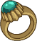

[Back to Main](index.md)

    
        
            
        
        
        Portrait
        
    
    
        
            
        
        
        Base Model
        
    
    
        
            
        
        
        Bear Model
        
    

# Halsin

Halsin, the esteemed Archdruid of the Emerald Grove, is a wise and powerful elf dedicated to the protection and preservation of nature. After being captured by goblins allied with the Absolute, he escaped and now fights to protect his grove and its inhabitants from this encroaching evil. He channels his deep connection to the natural world to aid his allies in their quests.

# Basic Information

Halsin will be a new champion in the Simril event on 4 December 2024.

    
        
            **Seat**:
        
        
            3
        
        
            **Stat**
        
        
            **Value**
        
        
            **Day 1 Trials**
        
        
            **Patrons**
        
    
    
        
            **Species**:
        
        
            Elf (Wood)
        
        
            **Strength**:
        
        
            16
        
        
            Yes
        
        
            Mirt
        
    
    
        
            **Class**:
        
        
            Druid
        
        
            **Dexterity**:
        
        
            11
        
        
            -
        
        
            Vajra
        
    
    
        
            **Roles**:
        
        
            Support / Healing / Speed
        
        
            **Constitution**:
        
        
            14
        
        
            Yes
        
        
            -
        
    
    
        
            **Age**:
        
        
            350
        
        
            **Intelligence**:
        
        
            10
        
        
            Yes
        
        
            Zariel
        
    
    
        
            **Gender**:
        
        
            Male
        
        
            **Wisdom**:
        
        
            17
        
        
            Yes
        
        
            Elminster
        
    
    
        
            **Alignment**:
        
        
            Neutral Good
        
        
            **Charisma**:
        
        
            13
        
        
            Yes
        
        
            &nbsp;
        
    
    
        
            **Affiliation**:
        
        
            Absolute Adversaries
        
        
            **Total**:
        
        
            81
        
        
            Champion ID:
        
        
            156
        
    

# Attacks

 **Base Attack: Thorn Whip** (Magic)
> Halsin attacks the enemy with the most health, dealing one hit and pulling them a short distance towards the formation.  
> Cooldown: 4.9s (Cap 1.225s)

<em>Raw Data</em>

<pre>
{
    "id": 818,
    "name": "Thorn Whip",
    "description": "Halsin attacks the enemy with the most health for one hit, pulling them a short distance.",
    "long_description": "Halsin attacks the enemy with the most health, dealing one hit and pulling them a short distance towards the formation.",
    "graphic_id": 0,
    "target": "highest_health",
    "num_targets": 1,
    "aoe_radius": 0,
    "damage_modifier": 1,
    "cooldown": 4.9,
    "animations": [
        {
            "type": "ranged_attack",
            "animation_sequence_name": "attack_b",
            "projectile": "halsin_thorn_whip",
            "speed": 200,
            "shoot_frame": 22,
            "shoot_offset_x": 145,
            "shoot_offset_y": -45,
            "target_offset_x": -30,
            "target_offset_y": -50,
            "hold_shoot_frame_until_damage": true,
            "projectile_details": {
                "fade_back_time1": 0.4,
                "pull_distance": 300,
                "whip_graphic_names": [
                    "Effect_Halsin_ThornWhip_Beam"
                ],
                "fade_back_destination1": [
                    0,
                    -15
                ],
                "fade_back_time2": 1,
                "fade_back_destination2": [
                    -80,
                    15
                ]
            }
        }
    ],
    "tags": [
        "ranged"
    ],
    "damage_types": [
        "magic"
    ]
}
</pre>

 **Ultimate Attack: Bear Form** (Level: 0)
> Halsin transforms into a bear for 20 seconds and his base attack changes to Bear Strike.  
> Cooldown: 320s (Cap 80s)

<em>Raw Data</em>

<pre>
{
    "id": 820,
    "name": "Bear Form",
    "description": "Halsin transforms into a bear for 20 seconds.",
    "long_description": "Halsin transforms into a bear for 20 seconds and his base attack changes to Bear Strike.",
    "graphic_id": 25060,
    "target": "none",
    "num_targets": 0,
    "aoe_radius": 0,
    "damage_modifier": 0,
    "cooldown": 320,
    "animations": [
        {
            "type": "ultimate_attack",
            "ultimate": "halsin",
            "no_damage_display": true
        }
    ],
    "tags": [
        "ultimate"
    ],
    "damage_types": []
}
</pre>

# Abilities

 **Archdruid of Emerald Grove** (Level: 20)
> Halsin gains a Harmony stack for each Good Champion in the formation, including himself. Halsin increases the damage of these Champions by 100% for each Harmony stack, stacking multiplicatively.

<em>Upgrade Data</em>

<pre>
Upgrades:
      100: 100%
      230: 100%
      360: 100%
      470: 100%
      580: 100%
      690: 100%
      800: 100%
      920: 100%
    1,040: 100%
    1,160: 100%
    1,280: 100%
    1,400: 100%
    1,520: 100%
    1,640: 100%
    1,740: 100%
    1,880: 100%
    2,000: 100%
    2,120: 100%
    2,240: 100%
    2,360: 100%
    2,430: 100%

    Total Upgrade Bonus: 2.10e08%
</pre>

<em>Raw Data</em>

<pre>
{
    "id": 15962,
    "hero_id": 156,
    "required_level": 20,
    "required_upgrade_id": 0,
    "upgrade_type": "unlock_ability",
    "effect": "effect_def,2136",
    "static_dps_mult": null,
    "default_enabled": 1,
    "name": "Archdruid of Emerald Grove",
    "tip_text": "Halsin buffs good Champions, and these abilities improve as more good Champions are placed in the formation."
}
{
    "id": 2136,
    "flavour_text": "",
    "description": {
        "conditions": [
            {
                "condition": "upgrade_purchased 15966",
                "desc": "Halsin gains a Harmony stack for each Good or Neutral (Good/Evil axis) Champion in the formation, including himself. Halsin increases the damage of these Champions by $(amount)% for each Harmony stack, stacking multiplicatively."
            },
            {
                "desc": "Halsin gains a Harmony stack for each Good Champion in the formation, including himself. Halsin increases the damage of these Champions by $(amount)% for each Harmony stack, stacking multiplicatively."
            }
        ]
    },
    "effect_keys": [
        {
            "effect_string": "pre_stack,100",
            "skip_effect_key_desc": true
        },
        {
            "effect_string": "hero_dps_multiplier_mult,0",
            "amount_expr": "upgrade_amount(15962,0)",
            "targets": [
                "all"
            ],
            "filter_targets": [
                {
                    "type": "hero_expr",
                    "hero_expr": "HasTag(`good`)"
                }
            ],
            "amount_func": "mult",
            "stack_func": "per_hero_attribute",
            "per_hero_expr": "HasTag(`good`)",
            "amount_updated_listeners": [
                "slot_changed",
                "hero_tags_changed"
            ],
            "show_bonus": true,
            "stack_title": "Harmony Stacks",
            "off_when_benched": true,
            "use_computed_amount_for_description": true
        },
        {
            "effect_string": "expression_on_trigger,area_complete",
            "per_trigger_expr": "AppendToSaveStat(`halsin_harmonious_areas_completed`, false, trigger_count * as_int(GetUpgradeStacks(15962, 1) >= 9))"
        }
    ],
    "requirements": "",
    "graphic_id": 25048,
    "large_graphic_id": 25042,
    "properties": {
        "is_formation_ability": true,
        "formation_circle_icon": true,
        "owner_use_outgoing_description": true,
        "indexed_effect_properties": true,
        "per_effect_index_bonuses": true,
        "default_bonus_index": 1
    }
}
{
    "id": 16188,
    "hero_id": 156,
    "required_level": 100,
    "required_upgrade_id": 0,
    "upgrade_type": "upgrade_ability",
    "effect": "buff_upgrade,100,15962",
    "static_dps_mult": null,
    "default_enabled": 1,
    "name": ""
}
{
    "id": 16190,
    "hero_id": 156,
    "required_level": 230,
    "required_upgrade_id": 0,
    "upgrade_type": "upgrade_ability",
    "effect": "buff_upgrade,100,15962",
    "static_dps_mult": null,
    "default_enabled": 1,
    "name": ""
}
{
    "id": 16192,
    "hero_id": 156,
    "required_level": 360,
    "required_upgrade_id": 0,
    "upgrade_type": "upgrade_ability",
    "effect": "buff_upgrade,100,15962",
    "static_dps_mult": null,
    "default_enabled": 1,
    "name": ""
}
{
    "id": 16194,
    "hero_id": 156,
    "required_level": 470,
    "required_upgrade_id": 0,
    "upgrade_type": "upgrade_ability",
    "effect": "buff_upgrade,100,15962",
    "static_dps_mult": null,
    "default_enabled": 1,
    "name": ""
}
{
    "id": 16197,
    "hero_id": 156,
    "required_level": 580,
    "required_upgrade_id": 0,
    "upgrade_type": "upgrade_ability",
    "effect": "buff_upgrade,100,15962",
    "static_dps_mult": null,
    "default_enabled": 1,
    "name": ""
}
{
    "id": 16199,
    "hero_id": 156,
    "required_level": 690,
    "required_upgrade_id": 0,
    "upgrade_type": "upgrade_ability",
    "effect": "buff_upgrade,100,15962",
    "static_dps_mult": null,
    "default_enabled": 1,
    "name": ""
}
{
    "id": 16200,
    "hero_id": 156,
    "required_level": 800,
    "required_upgrade_id": 0,
    "upgrade_type": "upgrade_ability",
    "effect": "buff_upgrade,100,15962",
    "static_dps_mult": null,
    "default_enabled": 1,
    "name": ""
}
{
    "id": 16203,
    "hero_id": 156,
    "required_level": 920,
    "required_upgrade_id": 0,
    "upgrade_type": "upgrade_ability",
    "effect": "buff_upgrade,100,15962",
    "static_dps_mult": null,
    "default_enabled": 1,
    "name": ""
}
{
    "id": 16204,
    "hero_id": 156,
    "required_level": 1040,
    "required_upgrade_id": 0,
    "upgrade_type": "upgrade_ability",
    "effect": "buff_upgrade,100,15962",
    "static_dps_mult": null,
    "default_enabled": 1,
    "name": ""
}
{
    "id": 16207,
    "hero_id": 156,
    "required_level": 1160,
    "required_upgrade_id": 0,
    "upgrade_type": "upgrade_ability",
    "effect": "buff_upgrade,100,15962",
    "static_dps_mult": null,
    "default_enabled": 1,
    "name": ""
}
{
    "id": 16208,
    "hero_id": 156,
    "required_level": 1280,
    "required_upgrade_id": 0,
    "upgrade_type": "upgrade_ability",
    "effect": "buff_upgrade,100,15962",
    "static_dps_mult": null,
    "default_enabled": 1,
    "name": ""
}
{
    "id": 16211,
    "hero_id": 156,
    "required_level": 1400,
    "required_upgrade_id": 0,
    "upgrade_type": "upgrade_ability",
    "effect": "buff_upgrade,100,15962",
    "static_dps_mult": null,
    "default_enabled": 1,
    "name": ""
}
{
    "id": 16212,
    "hero_id": 156,
    "required_level": 1520,
    "required_upgrade_id": 0,
    "upgrade_type": "upgrade_ability",
    "effect": "buff_upgrade,100,15962",
    "static_dps_mult": null,
    "default_enabled": 1,
    "name": ""
}
{
    "id": 16215,
    "hero_id": 156,
    "required_level": 1640,
    "required_upgrade_id": 0,
    "upgrade_type": "upgrade_ability",
    "effect": "buff_upgrade,100,15962",
    "static_dps_mult": null,
    "default_enabled": 1,
    "name": ""
}
{
    "id": 16216,
    "hero_id": 156,
    "required_level": 1740,
    "required_upgrade_id": 0,
    "upgrade_type": "upgrade_ability",
    "effect": "buff_upgrade,100,15962",
    "static_dps_mult": null,
    "default_enabled": 1,
    "name": ""
}
{
    "id": 16219,
    "hero_id": 156,
    "required_level": 1880,
    "required_upgrade_id": 0,
    "upgrade_type": "upgrade_ability",
    "effect": "buff_upgrade,100,15962",
    "static_dps_mult": null,
    "default_enabled": 1,
    "name": ""
}
{
    "id": 16221,
    "hero_id": 156,
    "required_level": 2000,
    "required_upgrade_id": 0,
    "upgrade_type": "upgrade_ability",
    "effect": "buff_upgrade,100,15962",
    "static_dps_mult": null,
    "default_enabled": 1,
    "name": ""
}
{
    "id": 16223,
    "hero_id": 156,
    "required_level": 2120,
    "required_upgrade_id": 0,
    "upgrade_type": "upgrade_ability",
    "effect": "buff_upgrade,100,15962",
    "static_dps_mult": null,
    "default_enabled": 1,
    "name": ""
}
{
    "id": 16225,
    "hero_id": 156,
    "required_level": 2240,
    "required_upgrade_id": 0,
    "upgrade_type": "upgrade_ability",
    "effect": "buff_upgrade,100,15962",
    "static_dps_mult": null,
    "default_enabled": 1,
    "name": ""
}
{
    "id": 16227,
    "hero_id": 156,
    "required_level": 2360,
    "required_upgrade_id": 0,
    "upgrade_type": "upgrade_ability",
    "effect": "buff_upgrade,100,15962",
    "static_dps_mult": null,
    "default_enabled": 1,
    "name": ""
}
{
    "id": 16230,
    "hero_id": 156,
    "required_level": 2430,
    "required_upgrade_id": 0,
    "upgrade_type": "upgrade_ability",
    "effect": "buff_upgrade,100,15962",
    "static_dps_mult": null,
    "default_enabled": 1,
    "name": ""
}
</pre>

 **Call To Action** (Level: 70)
> In non-boss areas, every time the area quest progresses there is a chance that you will just immediately complete the quest and move on to the next area. The maximum chance is 20% if the quest is one away from being completed but is greatly reduced based on the number of quest items left to collect or enemies left to defeat.

<em>Raw Data</em>

<pre>
{
    "id": 15963,
    "hero_id": 156,
    "required_level": 70,
    "required_upgrade_id": 0,
    "upgrade_type": "unlock_ability",
    "effect": "effect_def,2137",
    "static_dps_mult": null,
    "default_enabled": 1,
    "name": "Call To Action",
    "tip_text": "Halsin has a chance to complete area requirements early, advancing the Champions to the next area more rapidly."
}
{
    "id": 2137,
    "flavour_text": "",
    "description": {
        "desc": "In non-boss areas, every time the area quest progresses there is a chance that you will just immediately complete the quest and move on to the next area. The maximum chance is $(amount)% if the quest is one away from being completed but is greatly reduced based on the number of quest items left to collect or enemies left to defeat.^^Current Chance: $halsin_chance_to_instant_complete%"
    },
    "effect_keys": [
        {
            "off_when_benched": true,
            "effect_string": "halsin_call_to_action,20",
            "use_computed_amount_for_description": true,
            "effect_cap_affects_description": true,
            "effect_cap": 10000
        }
    ],
    "requirements": "",
    "graphic_id": 25049,
    "large_graphic_id": 25043,
    "properties": {
        "is_formation_ability": true,
        "formation_circle_icon": false,
        "owner_use_outgoing_description": true,
        "indexed_effect_properties": true,
        "per_effect_index_bonuses": true,
        "default_bonus_index": 0,
        "retain_on_slot_changed": true
    }
}
</pre>

 **Nature's Revival** (Level: 90)
> Halsin heals Champions affected by Archdruid of Emerald Grove by 10 health every second.

<em>Upgrade Data</em>

<pre>
Upgrades:
      190: 70%
      380: 70%
      540: 70%
      680: 70%
      885: 70%
    1,100: 70%
    1,320: 70%
    1,540: 70%
    1,760: 70%
    1,980: 70%
    2,200: 70%
    2,420: 70%

    Total Upgrade Bonus: 5.82e04%
</pre>

<em>Raw Data</em>

<pre>
{
    "id": 15964,
    "hero_id": 156,
    "required_level": 90,
    "required_upgrade_id": 0,
    "upgrade_type": "unlock_ability",
    "effect": "effect_def,2138",
    "static_dps_mult": null,
    "default_enabled": 1,
    "name": "Nature's Revival"
}
{
    "id": 2138,
    "flavour_text": "",
    "description": {
        "desc": "Halsin heals Champions affected by Archdruid of Emerald Grove by $(amount) health every second."
    },
    "effect_keys": [
        {
            "effect_string": "heal,10",
            "targets": [
                "all"
            ],
            "filter_targets": [
                {
                    "type": "hero_expr",
                    "hero_expr": "HasTag(`good`)"
                }
            ],
            "listen_for_computed_changes": true,
            "amount_updated_listeners": [
                "upgrade_unlocked",
                "slot_changed",
                "feat_changed"
            ],
            "off_when_benched": true
        }
    ],
    "requirements": "",
    "graphic_id": 25050,
    "large_graphic_id": 25044,
    "properties": {
        "is_formation_ability": true,
        "formation_circle_icon": true,
        "owner_use_outgoing_description": true,
        "indexed_effect_properties": true,
        "per_effect_index_bonuses": true,
        "default_bonus_index": 0,
        "retain_on_slot_changed": true
    }
}
{
    "id": 16189,
    "hero_id": 156,
    "required_level": 190,
    "required_upgrade_id": 0,
    "upgrade_type": "upgrade_ability",
    "effect": "buff_upgrade,70,15964",
    "static_dps_mult": null,
    "default_enabled": 1,
    "name": ""
}
{
    "id": 16193,
    "hero_id": 156,
    "required_level": 380,
    "required_upgrade_id": 0,
    "upgrade_type": "upgrade_ability",
    "effect": "buff_upgrade,70,15964",
    "static_dps_mult": null,
    "default_enabled": 1,
    "name": ""
}
{
    "id": 16195,
    "hero_id": 156,
    "required_level": 540,
    "required_upgrade_id": 0,
    "upgrade_type": "upgrade_ability",
    "effect": "buff_upgrade,70,15964",
    "static_dps_mult": null,
    "default_enabled": 1,
    "name": ""
}
{
    "id": 16198,
    "hero_id": 156,
    "required_level": 680,
    "required_upgrade_id": 0,
    "upgrade_type": "upgrade_ability",
    "effect": "buff_upgrade,70,15964",
    "static_dps_mult": null,
    "default_enabled": 1,
    "name": ""
}
{
    "id": 16202,
    "hero_id": 156,
    "required_level": 885,
    "required_upgrade_id": 0,
    "upgrade_type": "upgrade_ability",
    "effect": "buff_upgrade,70,15964",
    "static_dps_mult": null,
    "default_enabled": 1,
    "name": ""
}
{
    "id": 16206,
    "hero_id": 156,
    "required_level": 1100,
    "required_upgrade_id": 0,
    "upgrade_type": "upgrade_ability",
    "effect": "buff_upgrade,70,15964",
    "static_dps_mult": null,
    "default_enabled": 1,
    "name": ""
}
{
    "id": 16209,
    "hero_id": 156,
    "required_level": 1320,
    "required_upgrade_id": 0,
    "upgrade_type": "upgrade_ability",
    "effect": "buff_upgrade,70,15964",
    "static_dps_mult": null,
    "default_enabled": 1,
    "name": ""
}
{
    "id": 16213,
    "hero_id": 156,
    "required_level": 1540,
    "required_upgrade_id": 0,
    "upgrade_type": "upgrade_ability",
    "effect": "buff_upgrade,70,15964",
    "static_dps_mult": null,
    "default_enabled": 1,
    "name": ""
}
{
    "id": 16217,
    "hero_id": 156,
    "required_level": 1760,
    "required_upgrade_id": 0,
    "upgrade_type": "upgrade_ability",
    "effect": "buff_upgrade,70,15964",
    "static_dps_mult": null,
    "default_enabled": 1,
    "name": ""
}
{
    "id": 16220,
    "hero_id": 156,
    "required_level": 1980,
    "required_upgrade_id": 0,
    "upgrade_type": "upgrade_ability",
    "effect": "buff_upgrade,70,15964",
    "static_dps_mult": null,
    "default_enabled": 1,
    "name": ""
}
{
    "id": 16224,
    "hero_id": 156,
    "required_level": 2200,
    "required_upgrade_id": 0,
    "upgrade_type": "upgrade_ability",
    "effect": "buff_upgrade,70,15964",
    "static_dps_mult": null,
    "default_enabled": 1,
    "name": ""
}
{
    "id": 16229,
    "hero_id": 156,
    "required_level": 2420,
    "required_upgrade_id": 0,
    "upgrade_type": "upgrade_ability",
    "effect": "buff_upgrade,70,15964",
    "static_dps_mult": null,
    "default_enabled": 1,
    "name": ""
}
</pre>

 **Vow of Harmony** (Level: 150)
> Halsin provides benefits based on the number of Harmony stacks he has.  
> 3+ Harmony stacks: Nurturing: The effect of Nature's Revival is increased by 20% for each Harmony stack he has, stacking additively.  
> 5+ Harmony stacks: Hurrying: The effect of Call To Action is increased by 50%.  
> 7+ Harmony stacks: Recharging: When a Champion uses an Ultimate Attack, it recharges with 10% of the cooldown already done.  
> 9+ Harmony stacks: Growing: Increases the base value of Archdruid of Emerald Grove by 400%.

<em>Raw Data</em>

<pre>
{
    "id": 15965,
    "hero_id": 156,
    "required_level": 150,
    "required_upgrade_id": 0,
    "upgrade_type": "unlock_ability",
    "effect": "effect_def,2139",
    "static_dps_mult": null,
    "default_enabled": 1,
    "name": "Vow of Harmony"
}
{
    "id": 2139,
    "flavour_text": "",
    "description": {
        "desc": "Halsin provides benefits based on the number of Harmony stacks he has.^3+ Harmony stacks: Nurturing: The effect of Nature's Revival is increased by $(amount___2)% for each Harmony stack he has, stacking additively.^5+ Harmony stacks: Hurrying: The effect of Call To Action is increased by $(amount___3)%.^7+ Harmony stacks: Recharging: When a Champion uses an Ultimate Attack, it recharges with $(amount___4)% of the cooldown already done.^9+ Harmony stacks: Growing: Increases the base value of Archdruid of Emerald Grove by $(amount___5)%."
    },
    "effect_keys": [
        {
            "effect_string": "apply_effects_at_stacks",
            "show_description": false,
            "apply_effect_stack_amounts": [
                3,
                5,
                7,
                9
            ],
            "show_stacks": true,
            "stacks_are_bonus": false,
            "stacks_from_amount_func": "per_crusader",
            "target_filters": [
                {
                    "type": "tags",
                    "tags": "good"
                }
            ],
            "amount_updated_listeners": [
                "upgrade_unlocked",
                "slot_changed",
                "hero_tags_changed"
            ],
            "off_when_benched": true,
            "active_effect_key_description_prepender": "- ",
            "active_effect_key_description_joiner": "^"
        },
        {
            "effect_string": "buff_upgrade,20,15964,0",
            "apply_manually": true,
            "off_when_benched": true,
            "amount_func": "add",
            "stack_func": "per_hero_attribute",
            "per_hero_expr": "HasTag(`good`)",
            "amount_updated_listeners": [
                "upgrade_unlocked",
                "slot_changed",
                "hero_tags_changed"
            ],
            "override_key_desc": "The effect of Nature's Revival is increased by 20% for each Harmony stack he has, stacking additively.",
            "show_bonus": false,
            "show_stacks": false
        },
        {
            "effect_string": "buff_upgrade,50,15963,0",
            "apply_manually": true,
            "off_when_benched": true,
            "override_key_desc": "The effect of Call To Action is increased by 50%."
        },
        {
            "effect_string": "recharge_ultimates_on_use,10",
            "apply_manually": true,
            "off_when_benched": true,
            "override_key_desc": "When a Champion uses an Ultimate Attack, it recharges with 10% of the cooldown already done.",
            "show_bonus": false,
            "show_stacks": false
        },
        {
            "effect_string": "buff_upgrade,400,15962,0",
            "apply_manually": true,
            "off_when_benched": true,
            "override_key_desc": "Increases the base value of Archdruid of Emerald Grove by 400%."
        }
    ],
    "requirements": "",
    "graphic_id": 25051,
    "large_graphic_id": 25045,
    "properties": {
        "is_formation_ability": true,
        "formation_circle_icon": true,
        "owner_use_outgoing_description": false,
        "indexed_effect_properties": true,
        "per_effect_index_bonuses": true,
        "default_bonus_index": 0
    }
}
</pre>

 **Bear Form** (Level: 210)
> Unlocks Halsin's Bear Form Ultimate Attack.

<em>Raw Data</em>

<pre>
{
    "id": 15969,
    "hero_id": 156,
    "required_level": 210,
    "required_upgrade_id": 0,
    "upgrade_type": "unlock_ultimate",
    "effect": "effect_def,2143",
    "static_dps_mult": null,
    "default_enabled": 1,
    "name": "Bear Form"
}
{
    "id": 2143,
    "flavour_text": "",
    "description": {
        "desc": "Unlocks Halsin's Bear Form Ultimate Attack"
    },
    "effect_keys": [
        {
            "effect_string": "halsin_ult",
            "duration": 20,
            "bear_graphic_id": 25077,
            "bear_attack_id": 819
        },
        {
            "effect_string": "set_ultimate_attack",
            "skip_effect_key_desc": true
        }
    ],
    "requirements": "",
    "graphic_id": 0,
    "large_graphic_id": 0,
    "properties": {
        "is_formation_ability": false,
        "owner_use_outgoing_description": false,
        "formation_circle_icon": false
    }
}
</pre>

# Specialisations

 **Harbinger of the Wilds** (Level: 240)
> Archdruid of Emerald Grove now also grants Harmony stacks for Neutral Champions in the formation (on the Good/Evil axis).

<em>Raw Data</em>

<pre>
{
    "id": 15966,
    "hero_id": 156,
    "required_level": 240,
    "required_upgrade_id": 0,
    "upgrade_type": "unlock_ability",
    "effect": "effect_def,2140",
    "static_dps_mult": null,
    "default_enabled": 1,
    "name": "Harbinger of the Wilds",
    "specialization_name": "Harbinger of the Wilds",
    "specialization_description": "Halsin channels the primal strength of the natural world, extending his support to embrace those who navigate beyond the struggle between good and evil.",
    "specialization_graphic_id": 25054
}
{
    "id": 2140,
    "flavour_text": "",
    "description": {
        "desc": "Archdruid of Emerald Grove now also grants Harmony stacks for Neutral Champions in the formation (on the Good/Evil axis)."
    },
    "effect_keys": [
        {
            "effect_string": "change_upgrade_data,15962,1",
            "data": {
                "filter_targets": [
                    {
                        "type": "hero_expr",
                        "hero_expr": "HasTag(`geneutral`)||HasTag(`good`)"
                    }
                ]
            },
            "off_when_benched": true
        },
        {
            "effect_string": "change_upgrade_data,15962,1",
            "data": {
                "per_hero_expr": "HasTag(`geneutral`)||HasTag(`good`)"
            },
            "off_when_benched": true,
            "skip_effect_key_desc": true
        },
        {
            "effect_string": "change_upgrade_data,15964,0",
            "data": {
                "filter_targets": [
                    {
                        "type": "hero_expr",
                        "hero_expr": "HasTag(`geneutral`)||HasTag(`good`)"
                    }
                ]
            },
            "off_when_benched": true,
            "skip_effect_key_desc": true
        },
        {
            "effect_string": "change_upgrade_data,15965,0",
            "data": {
                "target_filters": [
                    {
                        "type": "tags",
                        "tags": "good|geneutral"
                    }
                ]
            },
            "off_when_benched": true,
            "skip_effect_key_desc": true
        },
        {
            "effect_string": "change_upgrade_data,15965,1",
            "data": {
                "per_hero_expr": "HasTag(`geneutral`)||HasTag(`good`)"
            },
            "off_when_benched": true,
            "skip_effect_key_desc": true
        }
    ],
    "requirements": "",
    "graphic_id": 25054,
    "large_graphic_id": 25054,
    "properties": {
        "is_formation_ability": true,
        "formation_circle_icon": true,
        "owner_use_outgoing_description": true,
        "indexed_effect_properties": true,
        "per_effect_index_bonuses": true,
        "default_bonus_index": 0
    }
}
</pre>

 **Protector of the Grove** (Level: 240)
> Increases the effect of Archdruid of Emerald Grove by your maximum chance of Call To Action triggering.

<em>Raw Data</em>

<pre>
{
    "id": 15968,
    "hero_id": 156,
    "required_level": 240,
    "required_upgrade_id": 0,
    "upgrade_type": "unlock_ability",
    "effect": "effect_def,2142",
    "static_dps_mult": null,
    "default_enabled": 1,
    "name": "Protector of the Grove",
    "specialization_name": "Protector of the Grove",
    "specialization_description": "Halsin increases the strength of his support depending on how strong his call to action is.",
    "specialization_graphic_id": 25055
}
{
    "id": 2142,
    "flavour_text": "",
    "description": {
        "desc": "Increases the effect of Archdruid of Emerald Grove by your maximum chance of Call To Action triggering."
    },
    "effect_keys": [
        {
            "effect_string": "buff_upgrade,0,15962,1",
            "amount_expr": "upgrade_amount(15963,0)",
            "use_computed_amount_for_description": true,
            "show_bonus": true,
            "off_when_benched": true
        }
    ],
    "requirements": "",
    "graphic_id": 25055,
    "large_graphic_id": 25055,
    "properties": {
        "is_formation_ability": true,
        "owner_use_outgoing_description": true,
        "formation_circle_icon": true
    }
}
</pre>

 **Sage of the Transformed** (Level: 240)
> Halsin increases the number of Ceremorphosis stacks the party has by 40%, rounded down.

<em>Raw Data</em>

<pre>
{
    "id": 15967,
    "hero_id": 156,
    "required_level": 240,
    "required_upgrade_id": 0,
    "upgrade_type": "unlock_ability",
    "effect": "effect_def,2141",
    "static_dps_mult": null,
    "default_enabled": 1,
    "name": "Sage of the Transformed",
    "specialization_name": "Sage of the Transformed",
    "specialization_description": "Halsin's research into the tadpole epidemic is of great use to the foes of the Absolute.",
    "specialization_graphic_id": 25056
}
{
    "id": 2141,
    "flavour_text": "",
    "description": {
        "desc": "Halsin increases the number of Ceremorphosis stacks the party has by $(amount)%, rounded down.^^Bonus Stacks: $(halsin_bonus_ceremorphosis_stacks amount)"
    },
    "effect_keys": [
        {
            "off_when_benched": true,
            "effect_string": "ceremorphosis_stacks_mult,40"
        }
    ],
    "requirements": "",
    "graphic_id": 25056,
    "large_graphic_id": 25056,
    "properties": {
        "is_formation_ability": true,
        "owner_use_outgoing_description": true,
        "formation_circle_icon": true
    }
}
</pre>

# Items

    
        
            **Icons**
        
        
            **Slot**
        
        
            **Epic Name**
        
        
            **Effect**
        
    
    
        
            ID: 3698**Faded Quarterstaff**Still serviceable as a walking stick.<code>global_dps_multiplier_mult,10 allow_ge:true</code>ID: 3699**Druid's Staff**As much a weapon as it is a symbol.<code>global_dps_multiplier_mult,65 allow_ge:true</code>ID: 3700**Nature's Snare**Wait long enough, and you'll notice the vines moving.<code>global_dps_multiplier_mult,120 allow_ge:true</code>ID: 3701**Pale Oak**Faithwardens defend all of nature's bounty, at any cost.<code>global_dps_multiplier_mult,230 allow_ge:true</code>&nbsp;
        
        
            1
        
        
            Pale Oak
        
        
            All Champion Damage
        
    
    
        
            ID: 3702**Outgrown Clothes**This keeps happening...<code>global_dps_multiplier_mult,10 allow_ge:false</code>ID: 3703**Grove Garments**It reminds me of sun, water, and fur.<code>global_dps_multiplier_mult,65 allow_ge:false</code>ID: 3704**Druid Leather Armour**Please pay no mind to the stains.<code>global_dps_multiplier_mult,120 allow_ge:false</code>ID: 3705**Armour of Moonbasking**The power of the bear lies within me.<code>global_dps_multiplier_mult,230 allow_ge:false</code>
        
        
            2
        
        
            Armour of Moonbasking
        
        
            All Champion Damage
        
    
    
        
            ID: 3706**Inert Venom**This batch is harmless, but could still be studied.<code>buff_upgrade,10,15962,0 allow_ge:false</code>ID: 3707**Wyvern Toxin**It promises a swift death. A mercy, perhaps.<code>buff_upgrade,30,15962,0 allow_ge:false</code>ID: 3708**Halsin's Journals**May Silvanus guide my path, and lend me all his strength for what is to come.<code>buff_upgrade,50,15962,0 allow_ge:false</code>ID: 3709**Stuffed Owlbear Toy**Delightful! I shall see that this cub finds a proper home.<code>buff_upgrade,100,15962,0 allow_ge:false</code>
        
        
            3
        
        
            Stuffed Owlbear Toy
        
        
            Archdruid of Emerald Grove (Prestack)
        
    
    
        
            ID: 3710**Ruined Shoes**I've walked through one too many briar patches in these.<code>buff_upgrade,10,15963 allow_ge:false</code>ID: 3711**Breezy Sandals**These offer little protection, but I can feel the wind between my toes.<code>buff_upgrade,30,15963 allow_ge:false</code>ID: 3712**Grovetender Boots**These boots have seen much of nature's wonders.<code>buff_upgrade,50,15963 allow_ge:false</code>ID: 3713**Boots of Persistence**Nature does not yield.<code>buff_upgrade,100,15963 allow_ge:false</code>
        
        
            4
        
        
            Boots of Persistence
        
        
            Call To Action Cap: 32571 dull / 21632 shiny / 16162 golden.
        
    
    
        
            ID: 3714**Empty Pouch**I should go foraging again soon.<code>buff_upgrade,25,15964 allow_ge:false</code>ID: 3715**Alchemy Pouch**Mugwort, balsam, rogue's morsel, and more. Everything I need.<code>buff_upgrade,87.5,15964 allow_ge:false</code>ID: 3716**Potions of Healing**I wouldn't be much use as a healer without a few of these on hand.<code>buff_upgrade,150,15964 allow_ge:false</code>ID: 3717**Amulet of Silvanus**Omn kept this safely tucked away under a rock, waiting patiently for my return.<code>buff_upgrade,275,15964 allow_ge:false</code>
        
        
            5
        
        
            Amulet of Silvanus
        
        
            Nature's Revival
        
    
    
        
            ID: 3718**Ring of Resistance to Ants**Its only magic was to bring a smile to a child who needed it.<code>reduce_ultimate_cooldown,8 allow_ge:false</code>ID: 3719**Crusher's Ring**All that remains of a certain goblin. Now to put it to better use.<code>reduce_ultimate_cooldown,16 allow_ge:false</code>ID: 3720**Shapeshifter's Boon Ring**I've met many strange creatures in my time, but that ox was something else.<code>reduce_ultimate_cooldown,32 allow_ge:false</code>ID: 3721**Shapeshifter Hat**What I would not give for a chunk of fresh honeycomb.<code>reduce_ultimate_cooldown,80 allow_ge:false</code>
        
        
            6
        
        
            Shapeshifter Hat
        
        
            Ultimate Cooldown Reduction Cap: 501 dull / 251 shiny / 126 golden.
        
    

<em>Item Names and Descriptions</em>

<pre>
Slot 1:
        Faded Quarterstaff: Still serviceable as a walking stick.
             Druid's Staff: As much a weapon as it is a symbol.
            Nature's Snare: Wait long enough, and you'll notice the vines moving.
                  Pale Oak: Faithwardens defend all of nature's bounty, at any cost.

Slot 2:
          Outgrown Clothes: This keeps happening...
            Grove Garments: It reminds me of sun, water, and fur.
      Druid Leather Armour: Please pay no mind to the stains.
     Armour of Moonbasking: The power of the bear lies within me.

Slot 3:
               Inert Venom: This batch is harmless, but could still be studied.
              Wyvern Toxin: It promises a swift death. A mercy, perhaps.
         Halsin's Journals: May Silvanus guide my path, and lend me all his strength for what
                            is to come.
       Stuffed Owlbear Toy: Delightful! I shall see that this cub finds a proper home.

Slot 4:
              Ruined Shoes: I've walked through one too many briar patches in these.
            Breezy Sandals: These offer little protection, but I can feel the wind between my
                            toes.
         Grovetender Boots: These boots have seen much of nature's wonders.
      Boots of Persistence: Nature does not yield.

Slot 5:
               Empty Pouch: I should go foraging again soon.
             Alchemy Pouch: Mugwort, balsam, rogue's morsel, and more. Everything I need.
        Potions of Healing: I wouldn't be much use as a healer without a few of these on hand.
        Amulet of Silvanus: Omn kept this safely tucked away under a rock, waiting patiently
                            for my return.

Slot 6:
Ring of Resistance to Ants: Its only magic was to bring a smile to a child who needed it.
            Crusher's Ring: All that remains of a certain goblin. Now to put it to better use.
  Shapeshifter's Boon Ring: I've met many strange creatures in my time, but that ox was
                            something else.
          Shapeshifter Hat: What I would not give for a chunk of fresh honeycomb.
</pre>

 

# Feats

This list will only show feats that are going to be available on the release of this champion. The separate [Feats](feats.md) page may show others that could be available later if they exist.

    
        
            **Feat**
        
        
            **Effect**
        
        
            **Source**
        
    
    
        
            ID: 1991**Selflessness (Halsin)**Nature stands with you, my friend.<code>global_dps_multiplier_mult,10</code>Selflessness
        
        
            10% All Champion Damage
        
        
            Free
        
    
    
        
            ID: 1992**Inspiring Leader (Halsin)**There are no mistakes in nature; only hidden purpose.<code>global_dps_multiplier_mult,25</code>Inspiring Leader
        
        
            25% All Champion Damage
        
        
            Gold Chest
        
    
    
        
            ID: 1993**Emerald Prayer (Halsin)**Oak Father watch over your servant.<code>buff_upgrade,20,15962,0</code>Emerald Prayer
        
        
            20% Archdruid of Emerald Grove (Prestack)
        
        
            Free
        
    
    
        
            ID: 1994**Emerald Oath (Halsin)**I fight for the Oak Father's realm.<code>buff_upgrade,40,15962,0</code>Emerald Oath
        
        
            40% Archdruid of Emerald Grove (Prestack)
        
        
            12,500 Gems
        
    
    
        
            ID: 1995**No Time to Wait (Halsin)**Do not lose heart.<code>buff_upgrade,20,15963</code>No Time to Wait
        
        
            20% Call To Action
        
        
            Free
        
    
    
        
            ID: 1996**Righteous Momentum (Halsin)**Do not falter. Victory looms.<code>buff_upgrade,40,15963</code>Righteous Momentum
        
        
            40% Call To Action
        
        
            Gold Chest
        
    
    
        
            ID: 1997**Kick the Door Down (Halsin)**Nature's fury shall not be checked.<code>buff_upgrade,80,15963</code>Kick the Door Down
        
        
            80% Call To Action
        
        
            Event Bonus
        
    
    
        
            ID: 1998**Green Thumb (Halsin)**A healing touch is in order.<code>buff_upgrade,20,15964</code>Green Thumb
        
        
            20% Nature's Revival
        
        
            Free
        
    
    
        
            ID: 1999**Nature's Bounty (Halsin)**Silvanus, banish all wounds.<code>buff_upgrade,40,15964</code>Nature's Bounty
        
        
            40% Nature's Revival
        
        
            12,500 Gems
        
    
    
        
            ID: 2000**Rejuvenating Touch (Halsin)**Oak Father guide my hands.<code>buff_upgrade,40,15965,1</code>Rejuvenating Touch
        
        
            40% Vow of Harmony
        
        
            12,500 Gems
        
    
    
        
            ID: 2001**Bear Hug (Halsin)**Let the Oak Father's strength flow through you.<code>buff_upgrade,80,15965,3</code>Bear Hug
        
        
            80% Vow of Harmony
        
        
            Event Bonus
        
    
    
        
            ID: 2002**Rampant Growth (Halsin)**The Oak Father's work is never done.<code>buff_upgrade,80,15965,4</code>Rampant Growth
        
        
            80% Vow of Harmony (Prestack)
        
        
            50,000 Gems
        
    

# Legendaries

* Increases the damage of all Champions by 100%.
* Increases the damage of all Champions by 135% for each Nonbinary Champion in the formation.
* Increases the damage of all Elf Champions by 150%.
* Increases the damage of all Champions with a STR score of 13 or higher by 150%.
* Increases the damage of all Champions with a CON score of 13 or higher by 150%.
* Increases the damage of all Good Champions by 150%.

<em>DPS Applicable</em>

<pre>
        Arkhan: 3 / 6 (Potentially 4 / 6)
       Asharra: 1 / 6 (Potentially 2 / 6)
         Azaka: 3 / 6 (Potentially 4 / 6)
Beadle & Grimm: 4 / 6 (Potentially 5 / 6)
      Birdsong: 1 / 6 (Potentially 2 / 6)
   Black Viper: 2 / 6 (Potentially 3 / 6)
         Bobby: 3 / 6 (Potentially 4 / 6)
    Catti-brie: 4 / 6 (Potentially 5 / 6)
        D'hani: 3 / 6 (Potentially 4 / 6)
     Dark Urge: 2 / 6 (Potentially 3 / 6)
        Delina: 4 / 6 (Potentially 5 / 6)
       Dhadius: 1 / 6 (Potentially 2 / 6)
        Drizzt: 4 / 6 (Potentially 5 / 6)
       Farideh: 3 / 6 (Potentially 4 / 6)
           Fen: 4 / 6 (Potentially 5 / 6)
         Grimm: 4 / 6 (Potentially 5 / 6)
          Ishi: 3 / 6 (Potentially 4 / 6)
       Jaheira: 3 / 6 (Potentially 4 / 6)
       Jamilah: 3 / 6 (Potentially 4 / 6)
      Jarlaxle: 3 / 6 (Potentially 4 / 6)
           Jim: 1 / 6 (Potentially 2 / 6)
       Karlach: 4 / 6 (Potentially 5 / 6)
           Kas: 3 / 6 (Potentially 4 / 6)
          Kent: 3 / 6 (Potentially 4 / 6)
         Krond: 3 / 6 (Potentially 4 / 6)
          Krux: 4 / 6 (Potentially 5 / 6)
       Lae'zel: 3 / 6 (Potentially 4 / 6)
        Lucius: 4 / 6 (Potentially 5 / 6)
         Makos: 2 / 6 (Potentially 3 / 6)
         Minsc: 4 / 6 (Potentially 5 / 6)
         NERDS: 3 / 6
         Nixie: 2 / 6 (Potentially 3 / 6)
        Orisha: 3 / 6 (Potentially 4 / 6)
      Prudence: 3 / 6 (Potentially 4 / 6)
         Rosie: 2 / 6 (Potentially 3 / 6)
         Strix: 3 / 6 (Potentially 4 / 6)
       Torogar: 3 / 6 (Potentially 4 / 6)
        Warden: 3 / 6
       Warduke: 3 / 6 (Potentially 4 / 6)
        Yorven: 3 / 6 (Potentially 4 / 6)
         Zorbu: 3 / 6 (Potentially 4 / 6)
</pre>

<em>Non-DPS Applicable</em>

<pre>
          Aeon: 1 / 6 (Potentially 2 / 6)
          Aila: 4 / 6 (Potentially 5 / 6)
       Alyndra: 3 / 6 (Potentially 4 / 6)
       Antrius: 3 / 6 (Potentially 4 / 6)
      Astarion: 3 / 6 (Potentially 4 / 6)
         Avren: 2 / 6 (Potentially 3 / 6)
       Baeloth: 3 / 6 (Potentially 4 / 6)
      Barrowin: 4 / 6 (Potentially 5 / 6)
        Beadle: 2 / 6 (Potentially 3 / 6)
       Blooshi: 2 / 6 (Potentially 3 / 6)
          Briv: 4 / 6 (Potentially 5 / 6)
       Bruenor: 4 / 6 (Potentially 5 / 6)
      Calliope: 3 / 6 (Potentially 4 / 6)
       Celeste: 4 / 6 (Potentially 5 / 6)
     Certainty: 3 / 6 (Potentially 4 / 6)
       Corazn: 2 / 6 (Potentially 3 / 6)
        Deekin: 2 / 6 (Potentially 3 / 6)
       Desmond: 3 / 6 (Potentially 4 / 6)
         Diana: 2 / 6 (Potentially 3 / 6)
           Dob: 3 / 6 (Potentially 4 / 6)
        Donaar: 4 / 6 (Potentially 5 / 6)
    Dragonbait: 4 / 6 (Potentially 5 / 6)
Dungeon Master: 4 / 6 (Potentially 5 / 6)
        Egbert: 4 / 6 (Potentially 5 / 6)
      Ellywick: 2 / 6 (Potentially 3 / 6)
       Evandra: 3 / 6 (Potentially 4 / 6)
        Evelyn: 4 / 6 (Potentially 5 / 6)
     Ezmerelda: 4 / 6 (Potentially 5 / 6)
        Freely: 3 / 6 (Potentially 4 / 6)
          Gale: 2 / 6 (Potentially 3 / 6)
       Gazrick: 3 / 6 (Potentially 4 / 6)
        Halsin: 5 / 6
       Havilar: 4 / 6 (Potentially 5 / 6)
      Hew Maan: 2 / 6 (Potentially 3 / 6)
         Hitch: 2 / 6 (Potentially 3 / 6)
         Imoen: 3 / 6 (Potentially 4 / 6)
      Jang Sao: 1 / 6 (Potentially 2 / 6)
      K'thriss: 2 / 6 (Potentially 3 / 6)
         Korth: 3 / 6 (Potentially 4 / 6)
         Krull: 3 / 6 (Potentially 4 / 6)
        Krydle: 4 / 6 (Potentially 5 / 6)
       Lazaapz: 2 / 6 (Potentially 3 / 6)
          Melf: 5 / 6 (Potentially 6 / 6)
      Merilwen: 3 / 6 (Potentially 4 / 6)
         Miria: 3 / 6 (Potentially 4 / 6)
        Mrgn: 2 / 6 (Potentially 3 / 6)
         Nerys: 4 / 6 (Potentially 5 / 6)
        Nordom: 4 / 6
          Nova: 3 / 6 (Potentially 4 / 6)
         Nrakk: 3 / 6 (Potentially 4 / 6)
        Orkira: 4 / 6 (Potentially 5 / 6)
       Paultin: 3 / 6 (Potentially 4 / 6)
      Penelope: 3 / 6 (Potentially 4 / 6)
        Presto: 2 / 6 (Potentially 3 / 6)
         Pwent: 4 / 6 (Potentially 5 / 6)
        Qillek: 2 / 6 (Potentially 3 / 6)
     Ravengard: 3 / 6 (Potentially 4 / 6)
         Regis: 2 / 6 (Potentially 3 / 6)
          Reya: 4 / 6 (Potentially 5 / 6)
          Rust: 2 / 6 (Potentially 3 / 6)
        Selise: 2 / 6 (Potentially 3 / 6)
        Sentry: 4 / 6 (Potentially 5 / 6)
     Sgt. Knox: 4 / 6 (Potentially 5 / 6)
   Shadowheart: 2 / 6 (Potentially 3 / 6)
         Shaka: 3 / 6 (Potentially 4 / 6)
       Shandie: 3 / 6 (Potentially 4 / 6)
      Sisaspia: 2 / 6 (Potentially 3 / 6)
        Solaak: 4 / 6 (Potentially 5 / 6)
         Stoki: 2 / 6 (Potentially 3 / 6)
   Strongheart: 4 / 6 (Potentially 5 / 6)
         Talin: 2 / 6 (Potentially 3 / 6)
       Tatyana: 3 / 6 (Potentially 4 / 6)
      Thellora: 3 / 6 (Potentially 4 / 6)
        Turiel: 3 / 6 (Potentially 4 / 6)
         Tyril: 4 / 6 (Potentially 5 / 6)
       Ulkoria: 2 / 6 (Potentially 3 / 6)
       Umberto: 4 / 6 (Potentially 5 / 6)
         Uriah: 2 / 6 (Potentially 3 / 6)
     Valentine: 2 / 6 (Potentially 3 / 6)
            Vi: 3 / 6 (Potentially 4 / 6)
       Viconia: 2 / 6 (Potentially 3 / 6)
      Vin Ursa: 1 / 6 (Potentially 2 / 6)
        Virgil: 3 / 6 (Potentially 4 / 6)
       Vlahnya: 3 / 6 (Potentially 4 / 6)
      Voronika: 3 / 6 (Potentially 4 / 6)
        Walnut: 3 / 6 (Potentially 4 / 6)
        Widdle: 3 / 6 (Potentially 4 / 6)
       Wulfgar: 4 / 6 (Potentially 5 / 6)
          Wyll: 3 / 6 (Potentially 4 / 6)
        Xander: 2 / 6 (Potentially 3 / 6)
      Xerophon: 3 / 6
</pre>

 

# Adventures and Variants

 **Variant 1: The Simril Spoilsport (Halsin)** (Complete Area 50)
> No restrictions

# Other Champion Images

    
        
            Console Portrait
        
    
    
        
            Gold Chest Icon
        
        
            Silver Chest Icon
        
    

[Back to Top](#top)

*Last Modified: {{ site.time }}*