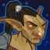

[Back to Main](index.md)

    
        
            
        
        
        Portrait
        
    
    
        
            
        
        
        Base Model
        
    
    
        
            
        
        
        Bear Model
        
    

# Halsin

Halsin is the Archdruid of the Emerald Grove and an accomplished healer. Before he went missing, Halsin and his apprentice Nettie were researching the recent spike in illithid tadpole infections.

[Halsin - BG3 Wiki](https://bg3.wiki/wiki/Halsin)

# Basic Information

Halsin will be a new champion in the Simril event on 4 December 2024.

    
        
            **Seat**:
        
        
            Unknown
        
    
    
        
            **Species**:
        
        
            Elf (Wood) (Guess)
        
    
    
        
            **Class**:
        
        
            Druid (Guess)
        
    
    
        
            **Roles**:
        
        
            DPS / Support / Healing / Speed (Guess)
        
    
    
        
            **Age**:
        
        
            350 (Guess)
        
    
    
        
            **Gender**:
        
        
            Male (Guess)
        
    
    
        
            **Alignment**:
        
        
            Unknown
        
    
    
        
            **Affiliation**:
        
        
            Absolute Adversaries (Guess)
        
    

# Formation

    <svg xmlns="http://www.w3.org/2000/svg" id="Halsin" fill="#aaa" data-formationName="Halsin" data-campaignName="Highharvestide" width="319" height="140"><circle cx="175" cy="45" r="15"/><circle cx="135" cy="25" r="15"/><circle cx="135" cy="65" r="15"/><circle cx="135" cy="105" r="15"/><circle cx="95" cy="45" r="15"/><circle cx="95" cy="125" r="15"/><circle cx="55" cy="25" r="15"/><circle cx="55" cy="65" r="15"/><circle cx="55" cy="105" r="15"/><circle cx="15" cy="45" r="15"/><text x="205" y="25" fill="#dcdcdc" font-size="25" font-family="Arial" font-weight="bold">Halsin</text><text x="205" y="65" fill="#dcdcdc" font-size="15" font-family="Arial" font-weight="bold">Highharvestide</text></svg>

# Attacks

**Base Attack: Thorn Whip** (Ranged)
> Halsin attacks the enemy with the most health, dealing one hit and pulling them a short distance towards the formation.  
> Cooldown: 4.9s (Cap 1.225s)

<em>Raw Data</em>

<pre>
{
    "id": 818,
    "name": "Thorn Whip",
    "description": "Halsin attacks the enemy with the most health for one hit, pulling them a short distance.",
    "long_description": "Halsin attacks the enemy with the most health, dealing one hit and pulling them a short distance towards the formation.",
    "graphic_id": 0,
    "target": "highest_health",
    "num_targets": 1,
    "aoe_radius": 0,
    "damage_modifier": 1,
    "cooldown": 4.9,
    "animations": [
        {
            "type": "ranged_attack",
            "animation_sequence_name": "attack_b",
            "projectile": "halsin_thorn_whip",
            "speed": 200,
            "shoot_frame": 22,
            "shoot_offset_x": 145,
            "shoot_offset_y": -45,
            "target_offset_x": -30,
            "target_offset_y": -50,
            "hold_shoot_frame": false,
            "hold_shoot_frame_for_seconds": 0.2,
            "projectile_details": {
                "fade_back_time1": 0.5,
                "pull_distance": 300,
                "whip_graphic_names": [
                    "Effect_Halsin_ThornWhip_Beam"
                ],
                "fade_back_destination1": [
                    0,
                    -15
                ],
                "fade_back_time2": 1,
                "fade_back_destination2": [
                    -80,
                    15
                ]
            }
        }
    ],
    "tags": [
        "ranged"
    ],
    "damage_types": [
        "ranged"
    ]
}
</pre>

**Ultimate Attack: Bear Strike**
> Halsin moves up to the enemy with the most health and deals 1 ultimate hit to all nearby enemies and knocks them back a short distance.  
> Cooldown: 4.9s (Cap 1.225s)

ⓘ *Note: Very short ultimate cooldowns are almost always for testing purposes and are likely to be increased later.*

<em>Raw Data</em>

<pre>
{
    "id": 819,
    "name": "Bear Strike",
    "description": "Halsin moves up to the enemy with the most health and swipes at all nearby foes for one ultimate hit each.",
    "long_description": "Halsin moves up to the enemy with the most health and deals 1 ultimate hit to all nearby enemies and knocks them back a short distance.",
    "graphic_id": 0,
    "target": "highest_health",
    "num_targets": 1,
    "aoe_radius": 100,
    "damage_modifier": 0.03,
    "cooldown": 4.9,
    "animations": [
        {
            "type": "melee_attack",
            "animation_sequence_name": "attack",
            "target_offset_x": -100,
            "start_frame": 5,
            "damage_frame": 8,
            "jump_sound": 30,
            "sound_frames": {
                "2": 194
            },
            "is_bud_damage": true,
            "force_count_for_bud": false
        }
    ],
    "tags": [
        "melee",
        "ultimate"
    ],
    "damage_types": [
        "ranged"
    ]
}
</pre>

# Abilities

**Archdruid of Emerald Grove** (Guess)
> Halsin gains a Harmony stack for each Good Champion in the formation, including himself. Halsin increases the damage of these Champions by 100% for each Harmony stack, stacking multiplicatively.

<em>Raw Data</em>

<pre>
{
    "id": 2136,
    "flavour_text": "",
    "description": {
        "conditions": [
            {
                "condition": "upgrade_purchased 15946",
                "desc": "Halsin gains a Harmony stack for each Good or Neutral (Good/Evil axis) Champion in the formation, including himself. Halsin increases the damage of these Champions by $(amount)% for each Harmony stack, stacking multiplicatively."
            },
            {
                "desc": "Halsin gains a Harmony stack for each Good Champion in the formation, including himself. Halsin increases the damage of these Champions by $(amount)% for each Harmony stack, stacking multiplicatively."
            }
        ]
    },
    "effect_keys": [
        {
            "effect_string": "pre_stack,100",
            "skip_effect_key_desc": true
        },
        {
            "effect_string": "hero_dps_multiplier_mult,0",
            "amount_expr": "upgrade_amount(15962,0)",
            "targets": [
                "all"
            ],
            "filter_targets": [
                {
                    "type": "hero_expr",
                    "hero_expr": "HasTag(`good`)"
                }
            ],
            "amount_func": "mult",
            "stack_func": "per_hero_attribute",
            "per_hero_expr": "HasTag(`good`)",
            "amount_updated_listeners": [
                "slot_changed",
                "hero_tags_changed"
            ],
            "show_bonus": true,
            "stack_title": "Harmony Stacks",
            "off_when_benched": true,
            "use_computed_amount_for_description": true
        },
        {
            "effect_string": "expression_on_trigger,area_complete",
            "per_trigger_expr": "AppendToSaveStat(`halsin_harmonious_areas_completed`, false, trigger_count * as_int(GetUpgradeStacks(15962, 1) >= 9))"
        }
    ],
    "requirements": "",
    "graphic_id": 25048,
    "large_graphic_id": 25042,
    "properties": {
        "is_formation_ability": true,
        "formation_circle_icon": true,
        "owner_use_outgoing_description": true,
        "indexed_effect_properties": true,
        "per_effect_index_bonuses": true,
        "default_bonus_index": 1
    }
}
</pre>

**Call to Action** (Guess)
> In non-boss areas, every time the area quest progresses there is a chance that you will just immediately complete the quest and move on to the next area. The maximum chance is 10% if the quest is one away from being completed but is greatly reduced based on the number of quest items left to collect or kills left to do.  

<em>Raw Data</em>

<pre>
{
    "id": 2137,
    "flavour_text": "",
    "description": {
        "desc": "In non-boss areas, every time the area quest progresses there is a chance that you will just immediately complete the quest and move on to the next area. The maximum chance is $(amount)% if the quest is one away from being completed but is greatly reduced based on the number of quest items left to collect or kills left to do.^^Current Chance: $halsin_chance_to_instant_complete%"
    },
    "effect_keys": [
        {
            "off_when_benched": true,
            "effect_string": "halsin_call_to_action,10",
            "effect_cap": 10000
        }
    ],
    "requirements": "",
    "graphic_id": 25049,
    "large_graphic_id": 25043,
    "properties": {
        "is_formation_ability": true,
        "formation_circle_icon": false,
        "owner_use_outgoing_description": true,
        "indexed_effect_properties": true,
        "per_effect_index_bonuses": true,
        "default_bonus_index": 0,
        "retain_on_slot_changed": true
    }
}
</pre>

**Nature's Revival** (Guess)
> Halsin heals Champions affected by Archdruid of Emerald Grove by 10 health every second.

<em>Raw Data</em>

<pre>
{
    "id": 2138,
    "flavour_text": "",
    "description": {
        "desc": "Halsin heals Champions affected by Archdruid of Emerald Grove by $(amount) health every second."
    },
    "effect_keys": [
        {
            "effect_string": "heal,10",
            "targets": [
                "all"
            ],
            "filter_targets": [
                {
                    "type": "hero_expr",
                    "hero_expr": "HasTag(`good`)"
                }
            ],
            "listen_for_computed_changes": true,
            "amount_updated_listeners": [
                "upgrade_unlocked",
                "slot_changed",
                "feat_changed"
            ],
            "off_when_benched": true
        }
    ],
    "requirements": "",
    "graphic_id": 25050,
    "large_graphic_id": 25044,
    "properties": {
        "is_formation_ability": true,
        "formation_circle_icon": true,
        "owner_use_outgoing_description": true,
        "indexed_effect_properties": true,
        "per_effect_index_bonuses": true,
        "default_bonus_index": 0,
        "retain_on_slot_changed": true
    }
}
</pre>

**Vow of Harmony** (Guess)
> Halsin provides benefits based on the number of Harmony stacks he has.  
> 3+ Harmony stacks: Nurturing: The effect of Nature's Revival is increased by 20% for each Harmony stack he has, stacking additively.  
> 5+ Harmony stacks: Hurrying: The effect of Call To Action is increased by 50%.  
> 7+ Harmony stacks: Recharging: When a Champion uses an Ultimate Attack, it recharges with 10% of the cooldown already done.  
> 9+ Harmony stacks: Growing: Increases the base value of Archdruid of Emerald Grove by 400%.

<em>Raw Data</em>

<pre>
{
    "id": 2139,
    "flavour_text": "",
    "description": {
        "desc": "Halsin provides benefits based on the number of Harmony stacks he has.^3+ Harmony stacks: Nurturing: The effect of Nature's Revival is increased by $(amount___2)% for each Harmony stack he has, stacking additively.^5+ Harmony stacks: Hurrying: The effect of Call To Action is increased by $(amount___3)%.^7+ Harmony stacks: Recharging: When a Champion uses an Ultimate Attack, it recharges with $(amount___4)% of the cooldown already done.^9+ Harmony stacks: Growing: Increases the base value of Archdruid of Emerald Grove by $(amount___5)%."
    },
    "effect_keys": [
        {
            "effect_string": "apply_effects_at_stacks",
            "show_description": false,
            "apply_effect_stack_amounts": [
                3,
                5,
                7,
                9
            ],
            "show_stacks": true,
            "stacks_are_bonus": false,
            "stacks_from_amount_func": "per_crusader",
            "target_filters": [
                {
                    "type": "tags",
                    "tags": "good"
                }
            ],
            "amount_updated_listeners": [
                "upgrade_unlocked",
                "slot_changed",
                "hero_tags_changed"
            ],
            "off_when_benched": true,
            "active_effect_key_description_prepender": "- ",
            "active_effect_key_description_joiner": "^"
        },
        {
            "effect_string": "buff_upgrade,20,15964,0",
            "apply_manually": true,
            "off_when_benched": true,
            "amount_func": "add",
            "stack_func": "per_hero_attribute",
            "per_hero_expr": "HasTag(`good`)",
            "amount_updated_listeners": [
                "upgrade_unlocked",
                "slot_changed",
                "hero_tags_changed"
            ],
            "override_key_desc": "The effect of Nature's Revival is increased by 20% for each Harmony stack he has, stacking additively.",
            "show_bonus": false,
            "show_stacks": false
        },
        {
            "effect_string": "buff_upgrade,50,15963,0",
            "apply_manually": true,
            "off_when_benched": true,
            "override_key_desc": "The effect of Call To Action is increased by 50%."
        },
        {
            "effect_string": "recharge_ultimates_on_use,10",
            "apply_manually": true,
            "off_when_benched": true,
            "override_key_desc": "When a Champion uses an Ultimate Attack, it recharges with 10% of the cooldown already done.",
            "show_bonus": false,
            "show_stacks": false
        },
        {
            "effect_string": "buff_upgrade,400,15962,0",
            "apply_manually": true,
            "off_when_benched": true,
            "override_key_desc": "Increases the base value of Archdruid of Emerald Grove by 400%."
        }
    ],
    "requirements": "",
    "graphic_id": 25051,
    "large_graphic_id": 25045,
    "properties": {
        "is_formation_ability": true,
        "formation_circle_icon": true,
        "owner_use_outgoing_description": false,
        "indexed_effect_properties": true,
        "per_effect_index_bonuses": true,
        "default_bonus_index": 0
    }
}
</pre>

**Unlock Ultimate** (Guess)
> Unlocks Halsin's Bear Form Ultimate Attack.

<em>Raw Data</em>

<pre>
{
    "id": 2143,
    "flavour_text": "",
    "description": {
        "desc": "Unlocks Halsin's Bear Form Ultimate Attack"
    },
    "effect_keys": [
        {
            "effect_string": "halsin_ult",
            "duration": 20,
            "bear_graphic_id": 25077,
            "bear_attack_id": 819
        },
        {
            "effect_string": "set_ultimate_attack",
            "skip_effect_key_desc": true
        }
    ],
    "requirements": "",
    "graphic_id": 0,
    "large_graphic_id": 0,
    "properties": {
        "is_formation_ability": false,
        "owner_use_outgoing_description": false,
        "formation_circle_icon": false
    }
}
</pre>

# Specialisations

**Harbinger of the Wilds** (Guess)
> Archdruid of Emerald Grove now also grants Harmony stacks for Neutral Champions in the formation (on the good/evil axis).

<em>Raw Data</em>

<pre>
{
    "id": 2140,
    "flavour_text": "",
    "description": {
        "desc": "Archdruid of Emerald Grove now also grants Harmony stacks for Neutral Champions in the formation (on the good/evil axis)."
    },
    "effect_keys": [
        {
            "effect_string": "change_upgrade_data,15962,1",
            "data": {
                "filter_targets": [
                    {
                        "type": "hero_expr",
                        "hero_expr": "HasTag(`geneutral`)||HasTag(`good`)"
                    }
                ]
            },
            "off_when_benched": true
        },
        {
            "effect_string": "change_upgrade_data,15962,1",
            "data": {
                "per_hero_expr": "HasTag(`geneutral`)||HasTag(`good`)"
            },
            "off_when_benched": true,
            "skip_effect_key_desc": true
        },
        {
            "effect_string": "change_upgrade_data,15964,0",
            "data": {
                "filter_targets": [
                    {
                        "type": "hero_expr",
                        "hero_expr": "HasTag(`geneutral`)||HasTag(`good`)"
                    }
                ]
            },
            "off_when_benched": true,
            "skip_effect_key_desc": true
        },
        {
            "effect_string": "change_upgrade_data,15965,0",
            "data": {
                "target_filters": [
                    {
                        "type": "tags",
                        "tags": "good|geneutral"
                    }
                ]
            },
            "off_when_benched": true,
            "skip_effect_key_desc": true
        },
        {
            "effect_string": "change_upgrade_data,15965,1",
            "data": {
                "per_hero_expr": "HasTag(`geneutral`)||HasTag(`good`)"
            },
            "off_when_benched": true,
            "skip_effect_key_desc": true
        }
    ],
    "requirements": "",
    "graphic_id": 25054,
    "large_graphic_id": 25054,
    "properties": {
        "is_formation_ability": true,
        "formation_circle_icon": true,
        "owner_use_outgoing_description": true,
        "indexed_effect_properties": true,
        "per_effect_index_bonuses": true,
        "default_bonus_index": 0
    }
}
</pre>

**Sage of the Transformed** (Guess)
> Halsin increases the number of Ceremorphosis stacks the party has by 40%, rounded down.  

<em>Raw Data</em>

<pre>
{
    "id": 2141,
    "flavour_text": "",
    "description": {
        "desc": "Halsin increases the number of Ceremorphosis stacks the party has by $(amount)%, rounded down.^^Bonus Stacks: $(halsin_bonus_ceremorphosis_stacks amount)"
    },
    "effect_keys": [
        {
            "off_when_benched": true,
            "effect_string": "ceremorphosis_stacks_mult,40"
        }
    ],
    "requirements": "",
    "graphic_id": 25056,
    "large_graphic_id": 25056,
    "properties": {
        "is_formation_ability": true,
        "owner_use_outgoing_description": true,
        "formation_circle_icon": true
    }
}
</pre>

**Protector of the Grove** (Guess)
> Increases the effect of Archdruid of Emerald Grove by your maximum chance of Call To Action triggering.

<em>Raw Data</em>

<pre>
{
    "id": 2142,
    "flavour_text": "",
    "description": {
        "desc": "Increases the effect of Archdruid of Emerald Grove by your maximum chance of Call To Action triggering."
    },
    "effect_keys": [
        {
            "effect_string": "buff_upgrade,0,15962,1",
            "amount_expr": "upgrade_amount(15963,0)",
            "use_computed_amount_for_description": true,
            "show_bonus": true,
            "off_when_benched": true
        }
    ],
    "requirements": "",
    "graphic_id": 25055,
    "large_graphic_id": 25055,
    "properties": {
        "is_formation_ability": true,
        "owner_use_outgoing_description": true,
        "formation_circle_icon": true
    }
}
</pre>

# Items

    
        
            **Icons**
        
        
            **Name**
        
    
    
        
            
        
        
            Armor
        
    
    
        
            
        
        
            Boots
        
    
    
        
            
        
        
            Healing Stuff
        
    
    
        
            
        
        
            Magic Items
        
    
    
        
            
        
        
            Staff
        
    
    
        
            
        
        
            Story Items
        
    

# Feats

Unknown.

# Legendaries

Unknown.

# Adventures and Variants

**Unlock Adventure: The Simril Spoilsport (Halsin)** (Complete Area 50)
> Simril is ruined! Someone has pilfered the food supplies!

 **Variant 1: Escape from the Shattered Sanctum** (Complete Area 75)
> Halsin starts in the formation. He can be moved, but not removed.  
> 1-2 Goblins spawn with each wave. They don't drop gold nor count towards quest progress.  
> You may only use Good and/or Neutral Champions.  
> Getting to know Halsin: Halsin works well with Good Champions, and a specialization choice extends that to include Neutral Champions.

 **Variant 2: Lifting the Shadow Curse** (Complete Area 125)
> Due to the Shadow Curse, the weather is Foggy.  
> In non-boss areas, quest requirements are halved, but there is a 50% chance that a defeated enemy doesn't drop quest items nor count towards quest progress.  
> Halsin starts in the formation. He can be moved, but not removed.  
> Getting to know Halsin: Halsin provides a chance to advance to the next area before all the quest requirements are completed.

 **Variant 3: Bear Necessities** (Complete Area 175)
> Halsin starts in the formation with his Archdruid of Emerald Grove and Nature's Revival abilities unlocked. He can be moved, but not removed.  
> Champions don't recover health when moving to a new area.   
> Champions resurrect at half health when changing areas instead of full health.  
> Getting to know Halsin: Halsin heals good Champions in the formation, and this can be extended to include Neutral Champions with his specialization choice.

# Other Champion Images

    
        
            Console Portrait
        
    
    
        
            Gold Chest Icon
        
        
            Silver Chest Icon
        
    

[Back to Top](#top)

*Last Modified: {{ site.time }}*