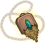
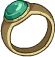
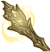
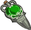

[Back to Main](index.md)

    
        
            
        
        
        Portrait
        
    
    
        
            
        
        
        Model
        
    

# Halsin

Halsin is the Archdruid of the Emerald Grove and an accomplished healer. Before he went missing, Halsin and his apprentice Nettie were researching the recent spike in illithid tadpole infections.

[Halsin - BG3 Wiki](https://bg3.wiki/wiki/Halsin)

# Basic Information

Halsin will be a new champion in the Simril event on 4 December 2024.

    
        
            **Seat**:
        
        
            Unknown
        
    
    
        
            **Species**:
        
        
            Elf (Wood) (Guess)
        
    
    
        
            **Class**:
        
        
            Druid (Guess)
        
    
    
        
            **Roles**:
        
        
            Unknown
        
    
    
        
            **Age**:
        
        
            350 (Guess)
        
    
    
        
            **Gender**:
        
        
            Male (Guess)
        
    
    
        
            **Alignment**:
        
        
            Unknown
        
    
    
        
            **Affiliation**:
        
        
            Absolute Adversaries (Guess)
        
    

# Formation

Unknown.


    



# Attacks

Unknown.

# Abilities

Unknown.

# Specialisations

Unknown.

# Items

    
        
            **Icons**
        
        
            **Name**
        
    
    
        
            
        
        
            Armor
        
    
    
        
            
        
        
            Boots
        
    
    
        
            
        
        
            Healing Stuff
        
    
    
        
            
        
        
            Magic Items
        
    
    
        
            
        
        
            Staff
        
    
    
        
            
        
        
            Story Items
        
    

# Feats

Unknown.

# Legendaries

Unknown.

# Adventures and Variants

**Unlock Adventure: The Simril Spoilsport (???)** (Complete Area 50)
> Simril is ruined! Someone has pilfered the food supplies!

**Variant 1: TBD** (Complete Area 75)
> TBD

**Variant 2: TBD** (Complete Area 125)
> TBD

**Variant 3: TBD** (Complete Area 175)
> TBD

# Other Champion Images

    
        
            Console Portrait
        
    
    
        
            Gold Chest Icon
        
        
            Silver Chest Icon
        
    

[Back to Top](#top)

*Last Modified: {{ site.time }}*