[Back to Main](index.md)

    
        
            
        
        
        Portrait
        
    
    
        
            
        
        
        Model
        
    

# Hank

Hank, the Ranger, at 15 years of age, he is the leader of the group. Hank is brave and noble, maintaining a focus and determination even when presented with grave danger. Hank is a Ranger, with a magical bow that shoots arrows of glowing energy. These arrows can be used in many different ways such as a climbing tool, to hurt enemies, to bind them, to create light, or to form temporary makeshift cages.

[D&D (TV Series) - Wikipedia](https://en.wikipedia.org/wiki/Dungeons_%26_Dragons_(TV_series))

# Basic Information

Hank will be a new champion in the Dragondown event on 4 June 2025.

    
        
            **Seat**:
        
        
            Unknown
        
    
    
        
            **Species**:
        
        
            Human (Guess)
        
    
    
        
            **Class**:
        
        
            Ranger (Guess)
        
    
    
        
            **Roles**:
        
        
            Support / Hunter / Control (Guess)
        
    
    
        
            **Age**:
        
        
            15 (Guess)
        
    
    
        
            **Gender**:
        
        
            Male (Guess)
        
    
    
        
            **Alignment**:
        
        
            Unknown
        
    
    
        
            **Affiliation**:
        
        
            Saturday Morning Squad (Guess)
        
    

# Formation

    <svg xmlns="http://www.w3.org/2000/svg" id="Hank" fill="#aaa" data-formationName="Hank" data-campaignName="Dragondown" width="340" height="160"><circle cx="215" cy="45" r="15"/><circle cx="175" cy="65" r="15"/><circle cx="175" cy="105" r="15"/><circle cx="175" cy="145" r="15"/><circle cx="135" cy="45" r="15"/><circle cx="135" cy="85" r="15"/><circle cx="95" cy="25" r="15"/><circle cx="95" cy="105" r="15"/><circle cx="55" cy="125" r="15"/><circle cx="15" cy="145" r="15"/><text x="245" y="25" fill="#dcdcdc" font-size="25" font-family="Arial" font-weight="bold">Hank</text><text x="245" y="65" fill="#dcdcdc" font-size="15" font-family="Arial" font-weight="bold">Dragondown</text></svg>

# Attacks

**Base Attack: Energy Bow** (Ranged)
> Hank attacks the closest enemy, dealing 1 hit. (They are also knocked back once the Energy Bow ability is unlocked.)  
> Cooldown: 3.5s (Cap 0.875s)

<em>Raw Data</em>

<pre>
{
    "id": 858,
    "name": "Energy Bow",
    "description": "Hank attacks the closest enemy, dealing 1 hit.",
    "long_description": "Hank attacks the closest enemy, dealing 1 hit. (They are also knocked back once the Energy Bow ability is unlocked.)",
    "graphic_id": 0,
    "target": "front",
    "num_targets": 1,
    "aoe_radius": 0,
    "damage_modifier": 1,
    "cooldown": 3.5,
    "animations": [
        {
            "type": "ranged_attack",
            "projectile": "pd_generic_projectile",
            "shoot_offset_x": 15,
            "shoot_offset_y": -50,
            "shoot_frame": 13,
            "shoot_sound": 149,
            "hit_sound": 133,
            "projectile_details": {
                "hash": "7d2285a51fcb458b32b02d796020b776",
                "target_offset_y": -100,
                "projectile_speed": 2000,
                "projectile_graphic_id": 26469,
                "projectile_hit_graphic_id": 26470
            }
        }
    ],
    "tags": [
        "ranged"
    ],
    "damage_types": [
        "ranged"
    ]
}
</pre>

**Base Attack: Energy Bow** (Ranged)
> Hank attacks the closest enemy, dealing 1 hit and knocking them back.  
> Cooldown: 3.5s (Cap 0.875s)

<em>Raw Data</em>

<pre>
{
    "id": 859,
    "name": "Energy Bow",
    "description": "Hank attacks the closest enemy, dealing 1 hit and knocking them back.",
    "long_description": "Hank attacks the closest enemy, dealing 1 hit and knocking them back.",
    "graphic_id": 0,
    "target": "front",
    "num_targets": 1,
    "aoe_radius": 0,
    "damage_modifier": 1,
    "cooldown": 3.5,
    "animations": [
        {
            "type": "ranged_attack",
            "projectile": "pd_generic_projectile",
            "shoot_offset_x": 15,
            "shoot_offset_y": -50,
            "shoot_frame": 13,
            "shoot_sound": 149,
            "hit_sound": 133,
            "hit_effects_only_on_direct_hit": true,
            "effects_on_monsters": [
                {
                    "effect_string": "push_back_monster,25",
                    "animation": "hit",
                    "use_distance": true,
                    "after_damage": true
                }
            ],
            "projectile_details": {
                "hash": "7d2285a51fcb458b32b02d796020b776",
                "target_offset_y": -100,
                "projectile_speed": 2000,
                "projectile_graphic_id": 26469,
                "projectile_hit_graphic_id": 26470
            }
        }
    ],
    "tags": [
        "ranged"
    ],
    "damage_types": [
        "ranged"
    ]
}
</pre>

**Ultimate Attack: Arrows of Restraint**
> Hank fires 5 arrows at random enemies, dealing 1 ultimate hit and stunning each of them.  
> Cooldown: 300s (Cap 75s)

<em>Raw Data</em>

<pre>
{
    "id": 861,
    "name": "Arrows of Restraint",
    "description": "Hank attacks 5 random enemies, damaging and stunning each of them.",
    "long_description": "Hank fires 5 arrows at random enemies, dealing 1 ultimate hit and stunning each of them.",
    "graphic_id": 26507,
    "target": "random",
    "num_targets": 5,
    "aoe_radius": 0,
    "damage_modifier": 0.03,
    "cooldown": 300,
    "animations": [
        {
            "type": "ultimate_attack",
            "ultimate": "hank",
            "animation_sequence_name": "ultimate"
        }
    ],
    "tags": [
        "ultimate"
    ],
    "damage_types": [
        "melee"
    ]
}
</pre>

# Abilities

**Stalwart Encouragement** (Guess)
> Hank increases the damage of Champions adjacent to him by 100%.

<em>Raw Data</em>

<pre>
{
    "id": 2320,
    "flavour_text": "",
    "description": {
        "desc": "Hank increases the damage of Champions adjacent to him by $amount%."
    },
    "effect_keys": [
        {
            "effect_string": "hero_dps_multiplier_mult,100",
            "off_when_benched": true,
            "targets": [
                "adj"
            ]
        }
    ],
    "requirements": "",
    "graphic_id": 26494,
    "large_graphic_id": 26490,
    "properties": {
        "is_formation_ability": true,
        "owner_use_outgoing_description": true,
        "indexed_effect_properties": true,
        "per_effect_index_bonuses": true,
        "default_bonus_index": 0
    }
}
</pre>

**Energy Bow** (Guess)
> Enemies that Hank hits are knocked back. The distance they're knocked back increases the closer they are to the formation.

<em>Raw Data</em>

<pre>
{
    "id": 2321,
    "flavour_text": "",
    "description": {
        "desc": "Enemies that Hank hits are knocked back. The distance they're knocked back increases the closer they are to the formation."
    },
    "effect_keys": [
        {
            "effect_string": "change_base_attack,859"
        }
    ],
    "requirements": "",
    "graphic_id": 26492,
    "large_graphic_id": 26488,
    "properties": {
        "is_formation_ability": true,
        "owner_use_outgoing_description": true,
        "indexed_effect_properties": true,
        "per_effect_index_bonuses": true,
        "default_bonus_index": 0
    }
}
</pre>

**Time Gate Piece Scavenger** (Guess)
> Hank can help scavenge up to 25 additional Time Gate Pieces when killing bosses. While this cap is not reached, Hank has a 1% chance of scavenging 1 Time Gate Piece each time a boss is defeated. The cap increases by 1/3 every day.

<em>Raw Data</em>

<pre>
{
    "id": 2322,
    "flavour_text": "",
    "description": {
        "desc": "Hank can help scavenge up to $(current_scavenge_cap hank_time_gate_pieces_scavenger floor) additional Time Gate Pieces when killing bosses. While this cap is not reached, Hank has a $amount% chance of scavenging $amount_per_drop Time Gate Piece each time a boss is defeated. The cap increases by $cap_increase_per_day/$cap_divisor every day.",
        "post": {
            "conditions": [
                {
                    "condition": "not static_desc",
                    "desc": "^^Time Gate Pieces Scavenged: $(stat_value hank_time_gate_pieces_collected 0 none) ($(stat_value hank_time_gate_pieces_collected_this_adventure 1 none) this adventure)"
                }
            ]
        }
    },
    "effect_keys": [
        {
            "effect_string": "scavenge_items,1",
            "off_when_benched": true,
            "id": "hank_time_gate_pieces_scavenger",
            "item_type": "time_gate_piece",
            "initial_cap": 25,
            "cap_increase_per_day": 1,
            "cap_divisor": 3,
            "start_date": "2025-04-3 12:00:00",
            "total_collected_stat": "hank_time_gate_pieces_collected",
            "adventure_collected_stat": "hank_time_gate_pieces_collected_this_adventure",
            "upgrade_id": 17081,
            "amount_per_drop": 1
        }
    ],
    "requirements": "",
    "graphic_id": 26495,
    "large_graphic_id": 26491,
    "properties": {
        "is_formation_ability": true,
        "owner_use_outgoing_description": true,
        "indexed_effect_properties": true,
        "per_effect_index_bonuses": true,
        "default_bonus_index": 0
    }
}
</pre>

**Every Little Bit Helps** (Guess)
> Hank increases the effect of Stalwart Encouragement by 10% for each item that has ever been collected by Scavenger abilities, stacking additively.

<em>Raw Data</em>

<pre>
{
    "id": 2323,
    "flavour_text": "",
    "description": {
        "desc": "Hank increases the effect of Stalwart Encouragement by $(not_buffed amount)% for each item that has ever been collected by Scavenger abilities, stacking additively."
    },
    "effect_keys": [
        {
            "effect_string": "buff_upgrade,10,17079",
            "off_when_benched": true,
            "amount_func": "add",
            "stack_func": "per_hero_attribute",
            "post_process_expr": "num_items_scavenged",
            "amount_updated_listeners": [
                "scavenge_changed"
            ],
            "stack_title": "Items Scavenged",
            "stacks_mulitply": false,
            "show_bonus": true
        }
    ],
    "requirements": "",
    "graphic_id": 26493,
    "large_graphic_id": 26489,
    "properties": {
        "is_formation_ability": true,
        "owner_use_outgoing_description": true,
        "indexed_effect_properties": true,
        "per_effect_index_bonuses": true,
        "default_bonus_index": 0
    }
}
</pre>

**Arrows of Restraint** (Guess)
> Hank fires a flurry of five arrows, each at a random enemy, dealing 1 ultimate hit and stunning them for 8 seconds.

<em>Raw Data</em>

<pre>
{
    "id": 2337,
    "flavour_text": "",
    "description": {
        "desc": "Hank fires a flurry of five arrows, each at a random enemy, dealing 1 ultimate hit and stunning them for 8 seconds"
    },
    "effect_keys": [
        {
            "effect_string": "hank_arrows_of_restraint",
            "targets": 5,
            "stun_time": 8,
            "stun_graphic": 1509,
            "projectile_details": {
                "hash": "7d2285a51fcb458b32b02d796020b776",
                "projectile_speed": 3000,
                "projectile_graphic_id": 26469,
                "projectile_hit_graphic_id": 26470
            }
        },
        {
            "effect_string": "push_back_monster,25",
            "animation": "hit",
            "use_distance": true,
            "after_damage": true
        },
        {
            "effect_string": "set_ultimate_attack,861"
        }
    ],
    "requirements": "",
    "graphic_id": 26507,
    "large_graphic_id": 26507,
    "properties": {
        "is_formation_ability": true,
        "owner_use_outgoing_description": true,
        "formation_circle_icon": false,
        "show_outgoing_desc_when_benched": false
    }
}
</pre>

# Specialisations

**Heart of Heroes** (Guess)
> Hank increases the damage bonus of Stalwart Encouragement by 100% for each Champion in the formation with a total ability score of 78 or less, stacking multiplicatively.

ⓘ *Note: This ability is prestack.*

<em>Raw Data</em>

<pre>
{
    "id": 2324,
    "flavour_text": "",
    "description": {
        "desc": "Hank increases the damage bonus of Stalwart Encouragement by $amount% for each Champion in the formation with a total ability score of 78 or less, stacking multiplicatively."
    },
    "effect_keys": [
        {
            "effect_string": "pre_stack,100",
            "skip_effect_key_desc": true
        },
        {
            "effect_string": "buff_upgrade,0,17079",
            "off_when_benched": true,
            "amount_expr": "upgrade_amount(17083,0)",
            "amount_func": "mult",
            "stack_func": "per_crusader",
            "stack_func_data": {
                "target_filters": [
                    {
                        "type": "stat",
                        "stat": "total_ability_score",
                        "comparison": "<=",
                        "value": 78
                    }
                ]
            },
            "amount_updated_listeners": [
                "slot_changed",
                "ability_score_changed"
            ],
            "stacks_multiply": true,
            "show_bonus": true
        }
    ],
    "requirements": "",
    "graphic_id": 26498,
    "large_graphic_id": 26498,
    "properties": {
        "is_formation_ability": true,
        "spec_option_post_apply_info": "Qualified Champions: $num_stacks___2",
        "owner_use_outgoing_description": true,
        "indexed_effect_properties": true,
        "per_effect_index_bonuses": true,
        "default_bonus_index": 0
    }
}
</pre>

**Arrow Alliance** (Guess)
> Hank increases the damage bonus of Stalwart Encouragement by 125% for each Champion in the formation with a Ranged attack, stacking multiplicatively.

ⓘ *Note: This ability is prestack.*

<em>Raw Data</em>

<pre>
{
    "id": 2325,
    "flavour_text": "",
    "description": {
        "desc": "Hank increases the damage bonus of Stalwart Encouragement by $amount% for each Champion in the formation with a Ranged attack, stacking multiplicatively."
    },
    "effect_keys": [
        {
            "effect_string": "pre_stack,125",
            "skip_effect_key_desc": true
        },
        {
            "effect_string": "buff_upgrade,0,17079",
            "off_when_benched": true,
            "amount_expr": "upgrade_amount(17084,0)",
            "amount_func": "mult",
            "stack_func": "per_crusader",
            "stack_func_data": {
                "target_filters": [
                    {
                        "type": "attack_type",
                        "attack": "ranged"
                    }
                ]
            },
            "amount_updated_listeners": [
                "slot_changed",
                "ability_score_changed"
            ],
            "stacks_multiply": true,
            "show_bonus": true
        }
    ],
    "requirements": "",
    "graphic_id": 26496,
    "large_graphic_id": 26496,
    "properties": {
        "is_formation_ability": true,
        "spec_option_post_apply_info": "Qualified Champions: $num_stacks___2",
        "owner_use_outgoing_description": true,
        "indexed_effect_properties": true,
        "per_effect_index_bonuses": true,
        "default_bonus_index": 0
    }
}
</pre>

**Unyielding Unity** (Guess)
> Hank increases the damage bonus of Stalwart Encouragement by 200% for each member of the Saturday Morning Squad in the formation, stacking multiplicatively. This also adds the Saturday Morning Squad affiliation to Dungeon Master.

ⓘ *Note: This ability is prestack.*

<em>Raw Data</em>

<pre>
{
    "id": 2326,
    "flavour_text": "",
    "description": {
        "desc": "Hank increases the damage bonus of Stalwart Encouragement by $amount% for each member of the Saturday Morning Squad in the formation, stacking multiplicatively. This also adds the Saturday Morning Squad affiliation to Dungeon Master."
    },
    "effect_keys": [
        {
            "effect_string": "pre_stack,200",
            "skip_effect_key_desc": true
        },
        {
            "effect_string": "add_hero_tags,0,saturdaymorningsquad",
            "off_when_benched": true,
            "targets": [
                {
                    "type": "heroes",
                    "hero_ids": [
                        99
                    ]
                }
            ]
        },
        {
            "effect_string": "buff_upgrade,0,17079",
            "off_when_benched": true,
            "amount_expr": "upgrade_amount(17085,0)",
            "amount_func": "mult",
            "stack_func": "per_crusader",
            "stack_func_data": {
                "target_filters": [
                    {
                        "type": "tags",
                        "tags": "saturdaymorningsquad"
                    }
                ]
            },
            "amount_updated_listeners": [
                "slot_changed"
            ],
            "stacks_multiply": true,
            "show_bonus": true
        }
    ],
    "requirements": "",
    "graphic_id": 26500,
    "large_graphic_id": 26500,
    "properties": {
        "is_formation_ability": true,
        "spec_option_post_apply_info": "Qualified Champions: $num_stacks___3",
        "owner_use_outgoing_description": true,
        "indexed_effect_properties": true,
        "per_effect_index_bonuses": true,
        "default_bonus_index": 0
    }
}
</pre>

**Tactical Advantage** (Guess)
> Whenever an enemy is knocked back, Hank gains a Tactics stack. For each Tactics stack, the Critical Hit Chance of all Champions in the formation is increased by 1%, and the Critical Hit Damage of all Champions in the formation is increased by 10%. Tactics stacks stack additively up to 50 times and reset when changing areas.

<em>Raw Data</em>

<pre>
{
    "id": 2327,
    "flavour_text": "",
    "description": {
        "desc": "Whenever an enemy is knocked back, Hank gains a Tactics stack. For each Tactics stack, the Critical Hit Chance of all Champions in the formation is increased by $(not_buffed amount)%, and the Critical Hit Damage of all Champions in the formation is increased by $(not_buffed amount___2)%. Tactics stacks stack additively up to $max_stacks times and reset when changing areas."
    },
    "effect_keys": [
        {
            "effect_string": "global_buff_base_crit_chance_add,1",
            "off_when_benched": true,
            "stacks_on_trigger": "monster_pushed_back",
            "stacks_multiply": false,
            "max_stacks": 50,
            "more_triggers": [
                {
                    "trigger": "area_changed",
                    "action": {
                        "type": "reset"
                    }
                }
            ],
            "stack_title": "Tactics Stacks",
            "total_title": "Critical Hit Chance Bonus",
            "amount_updated_listeners": [
                "slot_changed"
            ],
            "show_bonus": true
        },
        {
            "effect_string": "global_buff_base_crit_damage_add,10",
            "off_when_benched": true,
            "stacks_on_trigger": "monster_pushed_back",
            "stacks_multiply": false,
            "max_stacks": 50,
            "more_triggers": [
                {
                    "trigger": "area_changed",
                    "action": {
                        "type": "reset"
                    }
                }
            ],
            "total_title": "Critical Hit Damage Bonus",
            "stack_title": "Tactics Stacks",
            "amount_updated_listeners": [
                "slot_changed"
            ],
            "show_bonus": true
        }
    ],
    "requirements": "",
    "graphic_id": 26499,
    "large_graphic_id": 26499,
    "properties": {
        "is_formation_ability": true,
        "owner_use_outgoing_description": true,
        "indexed_effect_properties": true,
        "per_effect_index_bonuses": true,
        "default_bonus_index": 1
    }
}
</pre>

**Dragon Slayer** (Guess)
> Hank gains the Hunter role and Dragons become Hank's Favored Foe. Each non-boss area wave has a 50% chance to spawn a Dragon enemy. When a Dragon enemy is slain, Hank increases the effect of Stalwart Encouragement by 100%, stacking multiplicatively up to 10 times and reset when changing areas. Non-boss waves in boss areas always spawn a dragon, and when a dragon is slain in a boss area, it provides 5 stacks.

<em>Raw Data</em>

<pre>
{
    "id": 2328,
    "flavour_text": "",
    "description": {
        "desc": "Hank gains the Hunter role and Dragons become Hank's Favored Foe. Each non-boss area wave has a $(not_buffed amount___3)% chance to spawn a Dragon enemy. When a Dragon enemy is slain, Hank increases the effect of Stalwart Encouragement by $(not_buffed amount___2)%, stacking multiplicatively up to $max_stacks___2 times and reset when changing areas. Non-boss waves in boss areas always spawn a dragon, and when a dragon is slain in a boss area, it provides 5 stacks."
    },
    "effect_keys": [
        {
            "effect_string": "hank_dragon_slayer",
            "off_when_benched": true,
            "base_buff_index": 1,
            "monster_ids": [
                1450,
                1451,
                1452,
                1453,
                1454,
                1455,
                1457,
                1458,
                1459,
                1464,
                1465,
                1466,
                1486,
                1486,
                1486
            ]
        },
        {
            "effect_string": "buff_upgrade,100,17079",
            "off_when_benched": true,
            "stacks_on_trigger": "monster_killed_with_tag,dragon",
            "more_triggers": [
                {
                    "trigger": "area_changed",
                    "action": {
                        "type": "reset"
                    }
                }
            ],
            "max_stacks": 10,
            "stacks_multiply": true,
            "show_bonus": true
        },
        {
            "effect_string": "spawn_additional_monsters,50",
            "off_when_benched": true,
            "monster_ids": [
                1450,
                1451,
                1452,
                1453,
                1454,
                1455,
                1457,
                1458,
                1459,
                1464,
                1465,
                1466,
                1486,
                1486,
                1486
            ],
            "spawn_count": 1,
            "non_boss_areas": true,
            "boss_areas": false
        },
        {
            "effect_string": "add_hero_tags,0,hunter"
        },
        {
            "off_when_benched": true,
            "effect_string": "favored_foe,dragon"
        }
    ],
    "requirements": "",
    "graphic_id": 26497,
    "large_graphic_id": 26497,
    "properties": {
        "is_formation_ability": true,
        "owner_use_outgoing_description": true,
        "indexed_effect_properties": true,
        "per_effect_index_bonuses": true,
        "default_bonus_index": 1
    }
}
</pre>

# Items

    
        
            **Icons**
        
        
            **Name**
        
    
    
        
            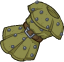
        
        
            Armor
        
    
    
        
            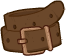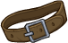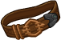
        
        
            Belt
        
    
    
        
            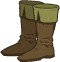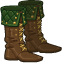
        
        
            Boots
        
    
    
        
            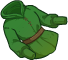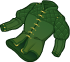
        
        
            Clothing
        
    
    
        
            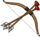
        
        
            Energy Bow
        
    
    
        
            
        
        
            Trinket
        
    

# Feats

Unknown.

# Legendaries

Unknown.

# Adventures and Variants

**Unlock Adventure: Let Sleeping Dragons Lie (Hank)** (Complete Area 50)
> Attempt to calm down a very angry bronze dragon.

 **Variant 1: Ranger!** (Complete Area 75)
> Hank starts in the formation. He can be moved, but not removed.  
> Only Hank and Champions next to him can deal damage.  
> 1-2 Chromatic Wyrmlings spawn with each wave. They don't drop gold, nor count towards quest progress.  
> Getting to Know Hank: Hank's main support ability increases the damage of Champions next to him. Place your damage dealers to take advantage of this!

 **Variant 2: Quest of the Skeleton Warrior** (Complete Area 125)
> Hank starts in the formation. He can be moved, but not removed.  
> Dekkion joins the formation as an escort. Champions next to him attack slower due to his unsettling appearance.  
> You may only use Champions from the Saturday Morning Squad affiliation, Champions with a total ability score of 78 or lower, and/or Champions with a ranged attack.  
> Getting to Know Hank: Hank's first set of specializations determines which Champions he works best with. Make the best choice for your formation!

 **Variant 3: Can't Spell Scavenger without Venger** (Complete Area 175)
> Hank starts in the formation. He can be moved, but not removed.   
> You may only use Core Champions, Champions with the Speed role, or Champions from the Saturday Morning Squad affiliation (and Strongheart!)  
> At the start of each Boss area, Venger arrives on his nightmare as an additional boss that must be defeated.  
> Bosses immediately start to enrage upon spawning.  
> Getting to Know Hank: Hank and the other Saturday Morning Squad Champions can all scavenge useful loot when completing boss areas. You might collect them faster with a few Speed Champions!

# Other Champion Images

    
        
            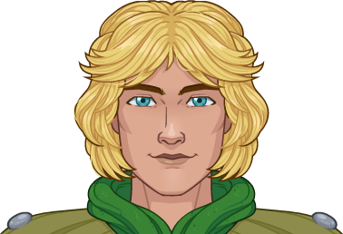Console Portrait
        
    
    
        
            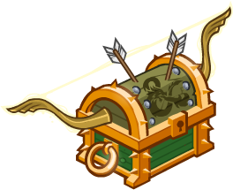Gold Chest Icon
        
        
            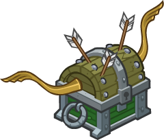Silver Chest Icon
        
    

[Back to Top](#top)

*Last Modified: {{ site.time }}*