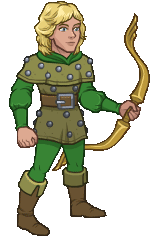

[Back to Main](index.md)

    
        
            
        
        
        Portrait
        
    
    
        
            
        
        
        Model
        
    

# Hank

Hank is the steadfast and courageous leader of the group of friends that has been swept away into the perilous realm of Dungeons & Dragons. As the Ranger, he wields his signature Energy Bow to fend off danger and light the way forward. Though the weight of leadership tests him at every turn, Hank's tactical insight and unwavering resolve keep the party moving forward in their quest to find a way back home.

# Basic Information

Hank will be a new champion in the Dragondown event on 4 June 2025.

    
        
            **Seat**:
        
        
            1
        
        
            **Stat**
        
        
            **Value**
        
        
            **Day 1 Trials**
        
        
            **Patrons**
        
    
    
        
            **Species**:
        
        
            Human
        
        
            **Strength**:
        
        
            13
        
        
            Yes
        
        
            Mirt
        
    
    
        
            **Class**:
        
        
            Ranger
        
        
            **Dexterity**:
        
        
            17
        
        
            Yes
        
        
            Vajra (with Feat)
        
    
    
        
            **Roles**:
        
        
            Support / Control
        
        
            **Constitution**:
        
        
            12
        
        
            Yes
        
        
            -
        
    
    
        
            **Age**:
        
        
            15
        
        
            **Intelligence**:
        
        
            10
        
        
            Yes
        
        
            -
        
    
    
        
            **Gender**:
        
        
            Male
        
        
            **Wisdom**:
        
        
            14
        
        
            Yes
        
        
            Elminster
        
    
    
        
            **Alignment**:
        
        
            Lawful Good
        
        
            **Charisma**:
        
        
            10
        
        
            -
        
        
            &nbsp;
        
    
    
        
            **Affiliation**:
        
        
            Saturday Morning Squad
        
        
            **Total**:
        
        
            76
        
        
            Champion ID:
        
        
            163
        
    

# Formation

    <svg xmlns="http://www.w3.org/2000/svg" id="Hank" fill="#aaa" data-formationName="Hank" data-campaignName="Dragondown" width="340" height="160"><circle cx="215" cy="45" r="15"/><circle cx="175" cy="65" r="15"/><circle cx="175" cy="105" r="15"/><circle cx="175" cy="145" r="15"/><circle cx="135" cy="45" r="15"/><circle cx="135" cy="85" r="15"/><circle cx="95" cy="25" r="15"/><circle cx="95" cy="105" r="15"/><circle cx="55" cy="125" r="15"/><circle cx="15" cy="145" r="15"/><text x="245" y="25" fill="#dcdcdc" font-size="25" font-family="Arial" font-weight="bold">Hank</text><text x="245" y="65" fill="#dcdcdc" font-size="15" font-family="Arial" font-weight="bold">Dragondown</text></svg>

# Attacks

 **Base Attack: Energy Bow** (Ranged)
> Hank attacks the closest enemy, dealing 1 hit. (They are also knocked back once the Energy Bow ability is unlocked.)  
> Cooldown: 3.5s (Cap 0.875s)

<em>Raw Data</em>

<pre>
{
    "id": 858,
    "name": "Energy Bow",
    "description": "Hank attacks the closest enemy, dealing 1 hit.",
    "long_description": "Hank attacks the closest enemy, dealing 1 hit. (They are also knocked back once the Energy Bow ability is unlocked.)",
    "graphic_id": 0,
    "target": "front",
    "num_targets": 1,
    "aoe_radius": 0,
    "damage_modifier": 1,
    "cooldown": 3.5,
    "animations": [
        {
            "type": "ranged_attack",
            "projectile": "pd_generic_projectile",
            "shoot_offset_x": 15,
            "shoot_offset_y": -50,
            "shoot_frame": 13,
            "shoot_sound": 149,
            "hit_sound": 133,
            "projectile_details": {
                "hash": "7d2285a51fcb458b32b02d796020b776",
                "target_offset_y": -100,
                "projectile_speed": 2000,
                "projectile_graphic_id": 26469,
                "projectile_hit_graphic_id": 26470
            }
        }
    ],
    "tags": [
        "ranged"
    ],
    "damage_types": [
        "ranged"
    ]
}
</pre>

 **Base Attack: Energy Bow** (Ranged)
> Hank attacks the closest enemy, dealing 1 hit and knocking them back.  
> Cooldown: 3.5s (Cap 0.875s)

<em>Raw Data</em>

<pre>
{
    "id": 859,
    "name": "Energy Bow",
    "description": "Hank attacks the closest enemy, dealing 1 hit and knocking them back.",
    "long_description": "Hank attacks the closest enemy, dealing 1 hit and knocking them back.",
    "graphic_id": 0,
    "target": "front",
    "num_targets": 1,
    "aoe_radius": 0,
    "damage_modifier": 1,
    "cooldown": 3.5,
    "animations": [
        {
            "type": "ranged_attack",
            "projectile": "pd_generic_projectile",
            "shoot_offset_x": 15,
            "shoot_offset_y": -50,
            "shoot_frame": 13,
            "shoot_sound": 149,
            "hit_sound": 133,
            "hit_effects_only_on_direct_hit": true,
            "effects_on_monsters": [
                {
                    "effect_string": "push_back_monster,25",
                    "animation": "hit",
                    "use_distance": true,
                    "after_damage": true
                }
            ],
            "projectile_details": {
                "hash": "7d2285a51fcb458b32b02d796020b776",
                "target_offset_y": -100,
                "projectile_speed": 2000,
                "projectile_graphic_id": 26469,
                "projectile_hit_graphic_id": 26470
            }
        }
    ],
    "tags": [
        "ranged"
    ],
    "damage_types": [
        "ranged"
    ]
}
</pre>

 **Ultimate Attack: Arrows of Restraint** (Level: 0)
> Hank fires 5 arrows at random enemies, dealing 1 ultimate hit and stunning each of them.  
> Cooldown: 300s (Cap 75s)

<em>Raw Data</em>

<pre>
{
    "id": 861,
    "name": "Arrows of Restraint",
    "description": "Hank attacks 5 random enemies, damaging and stunning each of them.",
    "long_description": "Hank fires 5 arrows at random enemies, dealing 1 ultimate hit and stunning each of them.",
    "graphic_id": 26507,
    "target": "random",
    "num_targets": 5,
    "aoe_radius": 0,
    "damage_modifier": 0.03,
    "cooldown": 300,
    "animations": [
        {
            "type": "ultimate_attack",
            "ultimate": "hank",
            "animation_sequence_name": "ultimate"
        }
    ],
    "tags": [
        "ultimate",
        "ranged"
    ],
    "damage_types": [
        "ranged"
    ]
}
</pre>

# Abilities

 **Stalwart Encouragement** (Level: 30)
> Hank increases the damage of Champions adjacent to him by 100%.

<em>Upgrade Data</em>

<pre>
Upgrades:
       90: 100%
      190: 100%
      300: 100%
      420: 100%
      520: 100%
      620: 100%
      720: 100%
      820: 100%
      910: 100%
    1,010: 100%
    1,100: 100%
    1,200: 100%
    1,300: 100%
    1,400: 100%
    1,500: 100%
    1,600: 100%
    1,700: 100%
    1,800: 100%
    1,900: 100%
    2,000: 100%

    Total Upgrade Bonus: 1.05e08%
</pre>

<em>Raw Data</em>

<pre>
{
    "id": 17079,
    "hero_id": 163,
    "required_level": 30,
    "required_upgrade_id": 0,
    "upgrade_type": "unlock_ability",
    "effect": "effect_def,2320",
    "static_dps_mult": null,
    "default_enabled": 1,
    "name": "Stalwart Encouragement",
    "tip_text": "Hank's primary support ability increases the damage of Champions next to him in the formation."
}
{
    "id": 2320,
    "flavour_text": "",
    "description": {
        "desc": "Hank increases the damage of Champions adjacent to him by $amount%."
    },
    "effect_keys": [
        {
            "effect_string": "hero_dps_multiplier_mult,100",
            "off_when_benched": true,
            "targets": [
                "adj"
            ]
        }
    ],
    "requirements": "",
    "graphic_id": 26494,
    "large_graphic_id": 26490,
    "properties": {
        "is_formation_ability": true,
        "owner_use_outgoing_description": true,
        "indexed_effect_properties": true,
        "per_effect_index_bonuses": true,
        "default_bonus_index": 0
    }
}
{
    "id": 17314,
    "hero_id": 163,
    "required_level": 90,
    "required_upgrade_id": 0,
    "upgrade_type": "upgrade_ability",
    "effect": "buff_upgrade,100,17079",
    "static_dps_mult": null,
    "default_enabled": 1,
    "name": ""
}
{
    "id": 17397,
    "hero_id": 163,
    "required_level": 190,
    "required_upgrade_id": 0,
    "upgrade_type": "upgrade_ability",
    "effect": "buff_upgrade,100,17079",
    "static_dps_mult": null,
    "default_enabled": 1,
    "name": ""
}
{
    "id": 17399,
    "hero_id": 163,
    "required_level": 300,
    "required_upgrade_id": 0,
    "upgrade_type": "upgrade_ability",
    "effect": "buff_upgrade,100,17079",
    "static_dps_mult": null,
    "default_enabled": 1,
    "name": ""
}
{
    "id": 17400,
    "hero_id": 163,
    "required_level": 420,
    "required_upgrade_id": 0,
    "upgrade_type": "upgrade_ability",
    "effect": "buff_upgrade,100,17079",
    "static_dps_mult": null,
    "default_enabled": 1,
    "name": ""
}
{
    "id": 17402,
    "hero_id": 163,
    "required_level": 520,
    "required_upgrade_id": 0,
    "upgrade_type": "upgrade_ability",
    "effect": "buff_upgrade,100,17079",
    "static_dps_mult": null,
    "default_enabled": 1,
    "name": ""
}
{
    "id": 17404,
    "hero_id": 163,
    "required_level": 620,
    "required_upgrade_id": 0,
    "upgrade_type": "upgrade_ability",
    "effect": "buff_upgrade,100,17079",
    "static_dps_mult": null,
    "default_enabled": 1,
    "name": ""
}
{
    "id": 17405,
    "hero_id": 163,
    "required_level": 720,
    "required_upgrade_id": 0,
    "upgrade_type": "upgrade_ability",
    "effect": "buff_upgrade,100,17079",
    "static_dps_mult": null,
    "default_enabled": 1,
    "name": ""
}
{
    "id": 17407,
    "hero_id": 163,
    "required_level": 820,
    "required_upgrade_id": 0,
    "upgrade_type": "upgrade_ability",
    "effect": "buff_upgrade,100,17079",
    "static_dps_mult": null,
    "default_enabled": 1,
    "name": ""
}
{
    "id": 17409,
    "hero_id": 163,
    "required_level": 910,
    "required_upgrade_id": 0,
    "upgrade_type": "upgrade_ability",
    "effect": "buff_upgrade,100,17079",
    "static_dps_mult": null,
    "default_enabled": 1,
    "name": ""
}
{
    "id": 17411,
    "hero_id": 163,
    "required_level": 1010,
    "required_upgrade_id": 0,
    "upgrade_type": "upgrade_ability",
    "effect": "buff_upgrade,100,17079",
    "static_dps_mult": null,
    "default_enabled": 1,
    "name": ""
}
{
    "id": 17412,
    "hero_id": 163,
    "required_level": 1100,
    "required_upgrade_id": 0,
    "upgrade_type": "upgrade_ability",
    "effect": "buff_upgrade,100,17079",
    "static_dps_mult": null,
    "default_enabled": 1,
    "name": ""
}
{
    "id": 17414,
    "hero_id": 163,
    "required_level": 1200,
    "required_upgrade_id": 0,
    "upgrade_type": "upgrade_ability",
    "effect": "buff_upgrade,100,17079",
    "static_dps_mult": null,
    "default_enabled": 1,
    "name": ""
}
{
    "id": 17416,
    "hero_id": 163,
    "required_level": 1300,
    "required_upgrade_id": 0,
    "upgrade_type": "upgrade_ability",
    "effect": "buff_upgrade,100,17079",
    "static_dps_mult": null,
    "default_enabled": 1,
    "name": ""
}
{
    "id": 17418,
    "hero_id": 163,
    "required_level": 1400,
    "required_upgrade_id": 0,
    "upgrade_type": "upgrade_ability",
    "effect": "buff_upgrade,100,17079",
    "static_dps_mult": null,
    "default_enabled": 1,
    "name": ""
}
{
    "id": 17420,
    "hero_id": 163,
    "required_level": 1500,
    "required_upgrade_id": 0,
    "upgrade_type": "upgrade_ability",
    "effect": "buff_upgrade,100,17079",
    "static_dps_mult": null,
    "default_enabled": 1,
    "name": ""
}
{
    "id": 17422,
    "hero_id": 163,
    "required_level": 1600,
    "required_upgrade_id": 0,
    "upgrade_type": "upgrade_ability",
    "effect": "buff_upgrade,100,17079",
    "static_dps_mult": null,
    "default_enabled": 1,
    "name": ""
}
{
    "id": 17423,
    "hero_id": 163,
    "required_level": 1700,
    "required_upgrade_id": 0,
    "upgrade_type": "upgrade_ability",
    "effect": "buff_upgrade,100,17079",
    "static_dps_mult": null,
    "default_enabled": 1,
    "name": ""
}
{
    "id": 17425,
    "hero_id": 163,
    "required_level": 1800,
    "required_upgrade_id": 0,
    "upgrade_type": "upgrade_ability",
    "effect": "buff_upgrade,100,17079",
    "static_dps_mult": null,
    "default_enabled": 1,
    "name": ""
}
{
    "id": 17427,
    "hero_id": 163,
    "required_level": 1900,
    "required_upgrade_id": 0,
    "upgrade_type": "upgrade_ability",
    "effect": "buff_upgrade,100,17079",
    "static_dps_mult": null,
    "default_enabled": 1,
    "name": ""
}
{
    "id": 17428,
    "hero_id": 163,
    "required_level": 2000,
    "required_upgrade_id": 0,
    "upgrade_type": "upgrade_ability",
    "effect": "buff_upgrade,100,17079",
    "static_dps_mult": null,
    "default_enabled": 1,
    "name": ""
}
</pre>

 **Energy Bow** (Level: 70)
> Enemies that Hank hits are knocked back. The distance they're knocked back increases the closer they are to the formation.

<em>Raw Data</em>

<pre>
{
    "id": 17080,
    "hero_id": 163,
    "required_level": 70,
    "required_upgrade_id": 0,
    "upgrade_type": "unlock_ability",
    "effect": "effect_def,2321",
    "static_dps_mult": null,
    "default_enabled": 1,
    "name": "Energy Bow"
}
{
    "id": 2321,
    "flavour_text": "",
    "description": {
        "desc": "Enemies that Hank hits are knocked back. The distance they're knocked back increases the closer they are to the formation."
    },
    "effect_keys": [
        {
            "effect_string": "change_base_attack,859"
        }
    ],
    "requirements": "",
    "graphic_id": 26492,
    "large_graphic_id": 26488,
    "properties": {
        "is_formation_ability": true,
        "owner_use_outgoing_description": true,
        "indexed_effect_properties": true,
        "per_effect_index_bonuses": true,
        "default_bonus_index": 0
    }
}
</pre>

 **Time Gate Piece Scavenger** (Level: 140)
> Hank can help scavenge up to 5 additional Time Gate Pieces when killing bosses. While this cap is not reached, Hank has a 1% chance of scavenging 1 Time Gate Piece each time a boss is defeated. The cap increases by 1/3 every day.

<em>Raw Data</em>

<pre>
{
    "id": 17081,
    "hero_id": 163,
    "required_level": 140,
    "required_upgrade_id": 0,
    "upgrade_type": "unlock_ability",
    "effect": "effect_def,2322",
    "static_dps_mult": null,
    "default_enabled": 1,
    "name": "Time Gate Piece Scavenger",
    "tip_text": "Hank has a chance to uncover Time Gate Pieces with each defeated boss, with a cap that increases every day."
}
{
    "id": 2322,
    "flavour_text": "",
    "description": {
        "desc": "Hank can help scavenge up to $(current_scavenge_cap hank_time_gate_pieces_scavenger floor) additional Time Gate Pieces when killing bosses. While this cap is not reached, Hank has a $amount% chance of scavenging $amount_per_drop Time Gate Piece each time a boss is defeated. The cap increases by $cap_increase_per_day/$cap_divisor every day.",
        "post": {
            "conditions": [
                {
                    "condition": "not static_desc",
                    "desc": "^^Time Gate Pieces Scavenged: $(stat_value hank_time_gate_pieces_collected 0 none) ($(stat_value hank_time_gate_pieces_collected_this_adventure 1 none) this adventure)"
                }
            ]
        }
    },
    "effect_keys": [
        {
            "effect_string": "scavenge_items,1",
            "off_when_benched": true,
            "id": "hank_time_gate_pieces_scavenger",
            "item_type": "time_gate_piece",
            "initial_cap": 5,
            "cap_increase_per_day": 1,
            "cap_divisor": 3,
            "start_date": "2025-05-28 12:00:00",
            "total_collected_stat": "hank_time_gate_pieces_collected",
            "adventure_collected_stat": "hank_time_gate_pieces_collected_this_adventure",
            "upgrade_id": 17081,
            "amount_per_drop": 1
        }
    ],
    "requirements": "",
    "graphic_id": 26495,
    "large_graphic_id": 26491,
    "properties": {
        "is_formation_ability": true,
        "owner_use_outgoing_description": true,
        "indexed_effect_properties": true,
        "per_effect_index_bonuses": true,
        "default_bonus_index": 0
    }
}
</pre>

 **Arrows of Restraint** (Level: 170)
> Hank fires a flurry of five arrows, each at a random enemy, dealing 1 ultimate hit and stunning them for 8 seconds.

<em>Raw Data</em>

<pre>
{
    "id": 17247,
    "hero_id": 163,
    "required_level": 170,
    "required_upgrade_id": 0,
    "upgrade_type": "unlock_ultimate",
    "effect": "effect_def,2337",
    "static_dps_mult": null,
    "default_enabled": 1,
    "name": "Arrows of Restraint"
}
{
    "id": 2337,
    "flavour_text": "",
    "description": {
        "desc": "Hank fires a flurry of five arrows, each at a random enemy, dealing 1 ultimate hit and stunning them for 8 seconds"
    },
    "effect_keys": [
        {
            "effect_string": "hank_arrows_of_restraint",
            "targets": 5,
            "stun_time": 8,
            "stun_graphic": 1509,
            "projectile_details": {
                "hash": "7d2285a51fcb458b32b02d796020b776",
                "projectile_speed": 3000,
                "projectile_graphic_id": 26469,
                "projectile_hit_graphic_id": 26470
            }
        },
        {
            "effect_string": "push_back_monster,25",
            "animation": "hit",
            "use_distance": true,
            "after_damage": true
        },
        {
            "effect_string": "set_ultimate_attack,861"
        }
    ],
    "requirements": "",
    "graphic_id": 26507,
    "large_graphic_id": 26507,
    "properties": {
        "is_formation_ability": true,
        "owner_use_outgoing_description": true,
        "formation_circle_icon": false,
        "show_outgoing_desc_when_benched": false
    }
}
</pre>

 **Every Little Bit Helps** (Level: 200)
> Hank increases the effect of Stalwart Encouragement by 10% for each item that has ever been collected by Scavenger abilities, stacking additively.

<em>Raw Data</em>

<pre>
{
    "id": 17082,
    "hero_id": 163,
    "required_level": 200,
    "required_upgrade_id": 0,
    "upgrade_type": "unlock_ability",
    "effect": "effect_def,2323",
    "static_dps_mult": null,
    "default_enabled": 1,
    "name": "Every Little Bit Helps"
}
{
    "id": 2323,
    "flavour_text": "",
    "description": {
        "desc": "Hank increases the effect of Stalwart Encouragement by $(not_buffed amount)% for each item that has ever been collected by Scavenger abilities, stacking additively."
    },
    "effect_keys": [
        {
            "effect_string": "buff_upgrade,10,17079",
            "off_when_benched": true,
            "amount_func": "add",
            "stack_func": "per_hero_attribute",
            "post_process_expr": "num_items_scavenged",
            "amount_updated_listeners": [
                "scavenge_changed"
            ],
            "stack_title": "Items Scavenged",
            "stacks_mulitply": false,
            "show_bonus": true
        }
    ],
    "requirements": "",
    "graphic_id": 26493,
    "large_graphic_id": 26489,
    "properties": {
        "is_formation_ability": true,
        "owner_use_outgoing_description": true,
        "indexed_effect_properties": true,
        "per_effect_index_bonuses": true,
        "default_bonus_index": 0
    }
}
</pre>

# Specialisations

 **Heart of Heroes** (Level: 110)
> Hank increases the damage bonus of Stalwart Encouragement by 100% for each Champion in the formation with a total ability score of 78 or less, stacking multiplicatively.

ⓘ *Note: This ability is prestack.*

<em>Raw Data</em>

<pre>
{
    "id": 17083,
    "hero_id": 163,
    "required_level": 110,
    "required_upgrade_id": 0,
    "upgrade_type": "unlock_ability",
    "effect": "effect_def,2324",
    "static_dps_mult": null,
    "default_enabled": 1,
    "name": "Heart of Heroes",
    "specialization_name": "Heart of Heroes",
    "specialization_description": "Heroism isn't measured by skill, but by courage.",
    "specialization_graphic_id": 26498
}
{
    "id": 2324,
    "flavour_text": "",
    "description": {
        "desc": "Hank increases the damage bonus of Stalwart Encouragement by $amount% for each Champion in the formation with a total ability score of 78 or less, stacking multiplicatively."
    },
    "effect_keys": [
        {
            "effect_string": "pre_stack,100",
            "skip_effect_key_desc": true
        },
        {
            "effect_string": "buff_upgrade,0,17079",
            "off_when_benched": true,
            "amount_expr": "upgrade_amount(17083,0)",
            "amount_func": "mult",
            "stack_func": "per_crusader",
            "stack_func_data": {
                "target_filters": [
                    {
                        "type": "stat",
                        "stat": "total_ability_score",
                        "comparison": "<=",
                        "value": 78
                    }
                ]
            },
            "amount_updated_listeners": [
                "slot_changed",
                "ability_score_changed"
            ],
            "stacks_multiply": true,
            "show_bonus": true
        }
    ],
    "requirements": "",
    "graphic_id": 26498,
    "large_graphic_id": 26498,
    "properties": {
        "is_formation_ability": true,
        "spec_option_post_apply_info": "Qualified Champions: $num_stacks___2",
        "owner_use_outgoing_description": true,
        "indexed_effect_properties": true,
        "per_effect_index_bonuses": true,
        "default_bonus_index": 0
    }
}
</pre>

 **Arrow Alliance** (Level: 110)
> Hank increases the damage bonus of Stalwart Encouragement by 125% for each Champion in the formation with a Ranged attack, stacking multiplicatively.

ⓘ *Note: This ability is prestack.*

<em>Raw Data</em>

<pre>
{
    "id": 17084,
    "hero_id": 163,
    "required_level": 110,
    "required_upgrade_id": 0,
    "upgrade_type": "unlock_ability",
    "effect": "effect_def,2325",
    "static_dps_mult": null,
    "default_enabled": 1,
    "name": "Arrow Alliance",
    "specialization_name": "Arrow Alliance",
    "specialization_description": "Precision comes from practiced coordination.",
    "specialization_graphic_id": 26496
}
{
    "id": 2325,
    "flavour_text": "",
    "description": {
        "desc": "Hank increases the damage bonus of Stalwart Encouragement by $amount% for each Champion in the formation with a Ranged attack, stacking multiplicatively."
    },
    "effect_keys": [
        {
            "effect_string": "pre_stack,125",
            "skip_effect_key_desc": true
        },
        {
            "effect_string": "buff_upgrade,0,17079",
            "off_when_benched": true,
            "amount_expr": "upgrade_amount(17084,0)",
            "amount_func": "mult",
            "stack_func": "per_crusader",
            "stack_func_data": {
                "target_filters": [
                    {
                        "type": "attack_type",
                        "attack": "ranged"
                    }
                ]
            },
            "amount_updated_listeners": [
                "slot_changed",
                "ability_score_changed"
            ],
            "stacks_multiply": true,
            "show_bonus": true
        }
    ],
    "requirements": "",
    "graphic_id": 26496,
    "large_graphic_id": 26496,
    "properties": {
        "is_formation_ability": true,
        "spec_option_post_apply_info": "Qualified Champions: $num_stacks___2",
        "owner_use_outgoing_description": true,
        "indexed_effect_properties": true,
        "per_effect_index_bonuses": true,
        "default_bonus_index": 0
    }
}
</pre>

 **Unyielding Unity** (Level: 110)
> Hank increases the damage bonus of Stalwart Encouragement by 200% for each member of the Saturday Morning Squad in the formation, stacking multiplicatively. This also adds the Saturday Morning Squad affiliation to Dungeon Master.

ⓘ *Note: This ability is prestack.*

<em>Raw Data</em>

<pre>
{
    "id": 17085,
    "hero_id": 163,
    "required_level": 110,
    "required_upgrade_id": 0,
    "upgrade_type": "unlock_ability",
    "effect": "effect_def,2326",
    "static_dps_mult": null,
    "default_enabled": 1,
    "name": "Unyielding Unity",
    "specialization_name": "Unyielding Unity",
    "specialization_description": "Together, even the softest voices can overcome the mightiest foes.",
    "specialization_graphic_id": 26500
}
{
    "id": 2326,
    "flavour_text": "",
    "description": {
        "desc": "Hank increases the damage bonus of Stalwart Encouragement by $amount% for each member of the Saturday Morning Squad in the formation, stacking multiplicatively. This also adds the Saturday Morning Squad affiliation to Dungeon Master."
    },
    "effect_keys": [
        {
            "effect_string": "pre_stack,200",
            "skip_effect_key_desc": true
        },
        {
            "effect_string": "add_hero_tags,0,saturdaymorningsquad",
            "off_when_benched": true,
            "targets": [
                {
                    "type": "heroes",
                    "hero_ids": [
                        99
                    ]
                }
            ]
        },
        {
            "effect_string": "buff_upgrade,0,17079",
            "off_when_benched": true,
            "amount_expr": "upgrade_amount(17085,0)",
            "amount_func": "mult",
            "stack_func": "per_crusader",
            "stack_func_data": {
                "target_filters": [
                    {
                        "type": "tags",
                        "tags": "saturdaymorningsquad"
                    }
                ]
            },
            "amount_updated_listeners": [
                "slot_changed"
            ],
            "stacks_multiply": true,
            "show_bonus": true
        }
    ],
    "requirements": "",
    "graphic_id": 26500,
    "large_graphic_id": 26500,
    "properties": {
        "is_formation_ability": true,
        "spec_option_post_apply_info": "Qualified Champions: $num_stacks___3",
        "owner_use_outgoing_description": true,
        "indexed_effect_properties": true,
        "per_effect_index_bonuses": true,
        "default_bonus_index": 0
    }
}
</pre>

 **Tactical Advantage** (Level: 230)
> Whenever an enemy is knocked back, Hank gains a Tactics stack. For each Tactics stack, the Critical Hit Chance of all Champions in the formation is increased by 1%, and the Critical Hit Damage of all Champions in the formation is increased by 10%. Tactics stacks stack additively up to 50 times and reset when changing areas.

<em>Raw Data</em>

<pre>
{
    "id": 17086,
    "hero_id": 163,
    "required_level": 230,
    "required_upgrade_id": 0,
    "upgrade_type": "unlock_ability",
    "effect": "effect_def,2327",
    "static_dps_mult": null,
    "default_enabled": 1,
    "name": "Tactical Advantage",
    "specialization_name": "Tactical Advantage",
    "specialization_description": "Knock them off balance, then strike where it counts.",
    "specialization_graphic_id": 26499
}
{
    "id": 2327,
    "flavour_text": "",
    "description": {
        "desc": "Whenever an enemy is knocked back, Hank gains a Tactics stack. For each Tactics stack, the Critical Hit Chance of all Champions in the formation is increased by $(not_buffed amount)%, and the Critical Hit Damage of all Champions in the formation is increased by $(not_buffed amount___2)%. Tactics stacks stack additively up to $max_stacks times and reset when changing areas."
    },
    "effect_keys": [
        {
            "effect_string": "global_buff_base_crit_chance_add,1",
            "off_when_benched": true,
            "stacks_on_trigger": "monster_pushed_back",
            "stacks_multiply": false,
            "max_stacks": 50,
            "more_triggers": [
                {
                    "trigger": "area_changed",
                    "action": {
                        "type": "reset"
                    }
                }
            ],
            "stack_title": "Tactics Stacks",
            "total_title": "Critical Hit Chance Bonus",
            "amount_updated_listeners": [
                "slot_changed"
            ],
            "show_bonus": true
        },
        {
            "effect_string": "global_buff_base_crit_damage_add,10",
            "off_when_benched": true,
            "stacks_on_trigger": "monster_pushed_back",
            "stacks_multiply": false,
            "max_stacks": 50,
            "more_triggers": [
                {
                    "trigger": "area_changed",
                    "action": {
                        "type": "reset"
                    }
                }
            ],
            "total_title": "Critical Hit Damage Bonus",
            "stack_title": "Tactics Stacks",
            "amount_updated_listeners": [
                "slot_changed"
            ],
            "show_bonus": true
        }
    ],
    "requirements": "",
    "graphic_id": 26499,
    "large_graphic_id": 26499,
    "properties": {
        "is_formation_ability": true,
        "owner_use_outgoing_description": true,
        "indexed_effect_properties": true,
        "per_effect_index_bonuses": true,
        "default_bonus_index": 1
    }
}
</pre>

 **Dragon Slayer** (Level: 230)
> Hank gains the Hunter role with Dragons as his Favored Foe. Non-boss waves spawn a Dragon 50% of the time. Stalwart Encouragement’s effect is increased by 100% for each Dragon defeated in the current area, stacking multiplicatively up to 10 times. In boss areas, non-boss waves always spawn a dragon, and defeated dragons provide 5 stacks.

<em>Raw Data</em>

<pre>
{
    "id": 17087,
    "hero_id": 163,
    "required_level": 230,
    "required_upgrade_id": 0,
    "upgrade_type": "unlock_ability",
    "effect": "effect_def,2328",
    "static_dps_mult": null,
    "default_enabled": 1,
    "name": "Dragon Slayer",
    "specialization_name": "Dragon Slayer",
    "specialization_description": "No monster is invincible, not even the five-headed queen.",
    "specialization_graphic_id": 26497
}
{
    "id": 2328,
    "flavour_text": "",
    "description": {
        "desc": "Hank gains the Hunter role with Dragons as his Favored Foe. Non-boss waves spawn a Dragon $(not_buffed amount___3)% of the time. Stalwart Encouragement’s effect is increased by $(not_buffed amount___2)% for each Dragon defeated in the current area, stacking multiplicatively up to $max_stacks___2 times. In boss areas, non-boss waves always spawn a dragon, and defeated dragons provide 5 stacks."
    },
    "effect_keys": [
        {
            "effect_string": "hank_dragon_slayer",
            "off_when_benched": true,
            "base_buff_index": 1,
            "monster_ids": [
                1450,
                1451,
                1452,
                1453,
                1454,
                1455,
                1457,
                1458,
                1459,
                1464,
                1465,
                1466,
                1486,
                1486,
                1486
            ]
        },
        {
            "effect_string": "buff_upgrade,100,17079",
            "off_when_benched": true,
            "stacks_on_trigger": "monster_killed_with_tag,dragon",
            "more_triggers": [
                {
                    "trigger": "area_changed",
                    "action": {
                        "type": "reset"
                    }
                }
            ],
            "max_stacks": 10,
            "stacks_multiply": true,
            "show_bonus": true
        },
        {
            "effect_string": "spawn_additional_monsters,50",
            "off_when_benched": true,
            "monster_ids": [
                1450,
                1451,
                1452,
                1453,
                1454,
                1455,
                1457,
                1458,
                1459,
                1464,
                1465,
                1466,
                1486,
                1486,
                1486
            ],
            "spawn_count": 1,
            "non_boss_areas": true,
            "boss_areas": false
        },
        {
            "effect_string": "add_hero_tags,0,hunter"
        },
        {
            "off_when_benched": true,
            "effect_string": "favored_foe,dragon"
        }
    ],
    "requirements": "",
    "graphic_id": 26497,
    "large_graphic_id": 26497,
    "properties": {
        "is_formation_ability": true,
        "owner_use_outgoing_description": true,
        "indexed_effect_properties": true,
        "per_effect_index_bonuses": true,
        "default_bonus_index": 1
    }
}
</pre>

# Items

    
        
            **Icons**
        
        
            **Slot**
        
        
            **Epic Name**
        
        
            **Effect**
        
    
    
        
            ID: 3866**Old Laundry**Ugh, these are starting to smell.<code>global_dps_multiplier_mult,10 allow_ge:true</code>ID: 3867**Fresh Duds**That's much better. I'm ready for a great day out with my friends!<code>global_dps_multiplier_mult,65 allow_ge:true</code>ID: 3868**Ranger's Tunic**Not too loose, not too tight. Not too dark, not too bright.<code>global_dps_multiplier_mult,120 allow_ge:true</code>ID: 3869**Gambeson of Leadership**Come on, everyone! We can do anything if we work together!<code>global_dps_multiplier_mult,230 allow_ge:true</code>&nbsp;
        
        
            1
        
        
            Gambeson of Leadership
        
        
            All Champion Damage
        
    
    
        
            ID: 3870**Toy Bow**Hey, I remember this! I would play with it for hours.<code>buff_upgrade,25,17079 allow_ge:true</code>ID: 3871**Prize Bow**I won this for Bobby at a carnival game. I hope he likes it.<code>buff_upgrade,87.5,17079 allow_ge:true</code>ID: 3872**Ranger's Bow**You're wondering where the string is? Don't worry about that.<code>buff_upgrade,150,17079 allow_ge:true</code>ID: 3873**Energy Bow**The arrows it fires can tie up baddies and even make ladders to climb!<code>buff_upgrade,275,17079 allow_ge:true</code>&nbsp;
        
        
            2
        
        
            Energy Bow
        
        
            Stalwart Encouragement
        
    
    
        
            ID: 3874**Venger's Talisman**We might be able to stop Demodragon with this!<code>buff_upgrade,25,17082 allow_ge:false</code>ID: 3875**Explosive Trinket**I have an idea! Get down and cover your eyes!<code>buff_upgrade,87.5,17082 allow_ge:false</code>ID: 3876**Circle of Power**This better be worth the trouble...<code>buff_upgrade,150,17082 allow_ge:false</code>ID: 3877**Heartstone**I learned an important lesson from my time with the cloud bears.<code>buff_upgrade,275,17082 allow_ge:false</code>
        
        
            3
        
        
            Heartstone
        
        
            Every Little Bit Helps
        
    
    
        
            ID: 3878**Overstarched Coat**Too... stiff... Can't... move...<code>buff_upgrades,10,17083,17084,17085 allow_ge:false</code>ID: 3879**Varsity Jacket**Go Dragons!<code>buff_upgrades,30,17083,17084,17085 allow_ge:false</code>ID: 3880**Ranger's Studded Leather**Does this make me look heroic? I sure hope so.<code>buff_upgrades,50,17083,17084,17085 allow_ge:false</code>ID: 3881**Emerald Vest**I'll blend into the trees with this on. Venger will never know what hit him.<code>buff_upgrades,100,17083,17084,17085 allow_ge:false</code>
        
        
            4
        
        
            Emerald Vest
        
        
            All First Specialisations (Prestack)
        
    
    
        
            ID: 3882**Itchy Belt**I really don't want to put this on.<code>buff_upgrades,25,17086,17087 allow_ge:false</code>ID: 3883**Rawhide Belt**It's not much better, but at least the itching stopped.<code>buff_upgrades,87.5,17086,17087 allow_ge:false</code>ID: 3884**Ranger's Belt**Tough and reliable, just like me and my friends.<code>buff_upgrades,150,17086,17087 allow_ge:false</code>ID: 3885**Belt of Bracing**My stance has improved ever since I put this on. It helps me aim better.<code>buff_upgrades,275,17086,17087 allow_ge:false</code>
        
        
            5
        
        
            Belt of Bracing
        
        
            All Second Specialisations
        
    
    
        
            ID: 3886**Thrifty Sneakers**My parents got these on sale years ago. They don't really fit now.<code>reduce_ultimate_cooldown,8 allow_ge:false</code>ID: 3887**Tennis Shoes**Now we're talking! I can run for miles with these on!<code>reduce_ultimate_cooldown,15 allow_ge:false</code>ID: 3888**Ranger's Boots**I'm ready to wander the whole world now!<code>reduce_ultimate_cooldown,30 allow_ge:false</code>ID: 3889**Wayfarer's Boots**No matter where I go, these boots will always bring me back home.<code>reduce_ultimate_cooldown,75 allow_ge:false</code>
        
        
            6
        
        
            Wayfarer's Boots
        
        
            Ultimate Cooldown Reduction Cap: 501 dull / 251 shiny / 126 golden.
        
    

<em>Item Names and Descriptions</em>

<pre>
Slot 1:
             Old Laundry: Ugh, these are starting to smell.
              Fresh Duds: That's much better. I'm ready for a great day out with my friends!
          Ranger's Tunic: Not too loose, not too tight. Not too dark, not too bright.
  Gambeson of Leadership: Come on, everyone! We can do anything if we work together!

Slot 2:
                 Toy Bow: Hey, I remember this! I would play with it for hours.
               Prize Bow: I won this for Bobby at a carnival game. I hope he likes it.
            Ranger's Bow: You're wondering where the string is? Don't worry about that.
              Energy Bow: The arrows it fires can tie up baddies and even make ladders to
                          climb!

Slot 3:
       Venger's Talisman: We might be able to stop Demodragon with this!
       Explosive Trinket: I have an idea! Get down and cover your eyes!
         Circle of Power: This better be worth the trouble...
              Heartstone: I learned an important lesson from my time with the cloud bears.

Slot 4:
       Overstarched Coat: Too... stiff... Can't... move...
          Varsity Jacket: Go Dragons!
Ranger's Studded Leather: Does this make me look heroic? I sure hope so.
            Emerald Vest: I'll blend into the trees with this on. Venger will never know what
                          hit him.

Slot 5:
              Itchy Belt: I really don't want to put this on.
            Rawhide Belt: It's not much better, but at least the itching stopped.
           Ranger's Belt: Tough and reliable, just like me and my friends.
         Belt of Bracing: My stance has improved ever since I put this on. It helps me aim
                          better.

Slot 6:
        Thrifty Sneakers: My parents got these on sale years ago. They don't really fit now.
            Tennis Shoes: Now we're talking! I can run for miles with these on!
          Ranger's Boots: I'm ready to wander the whole world now!
        Wayfarer's Boots: No matter where I go, these boots will always bring me back home.
</pre>

 

# Feats

This list will only show feats that are going to be available on the release of this champion. The separate [Feats](feats.md) page may show others that could be available later if they exist.

    
        
            **Feat**
        
        
            **Effect**
        
        
            **Source**
        
    
    
        
            ID: 2192**Selflessness (Hank)**Look out! Get behind me!<code>global_dps_multiplier_mult,10</code>Selflessness
        
        
            10% All Champion Damage
        
        
            Free
        
    
    
        
            ID: 2193**Inspiring Leader (Hank)**No matter what Venger throws at us, I know we'll make it!<code>global_dps_multiplier_mult,25</code>Inspiring Leader
        
        
            25% All Champion Damage
        
        
            Gold Chest
        
    
    
        
            ID: 2194**Kind Words (Hank)**I believe in you, and I'm right here with you.<code>buff_upgrade,20,17079</code>Kind Words
        
        
            20% Stalwart Encouragement
        
        
            Free
        
    
    
        
            ID: 2195**Stirring Words (Hank)**When the going gets tough, we rely on you. You've got this.<code>buff_upgrade,40,17079</code>Stirring Words
        
        
            40% Stalwart Encouragement
        
        
            Gold Chest
        
    
    
        
            ID: 2196**Chipping In (Hank)**If we all give a little bit, together it makes a big difference.<code>buff_upgrade,20,17082</code>Chipping In
        
        
            20% Every Little Bit Helps
        
        
            Free
        
    
    
        
            ID: 2197**Helping Hand (Hank)**Hey, you're not alone. Let's do this together, okay?<code>buff_upgrade,40,17082</code>Helping Hand
        
        
            40% Every Little Bit Helps
        
        
            12,500 Gems
        
    
    
        
            ID: 2198**Rookie Leader (Hank)**Don't fight, you guys! We have to work together!<code>buff_upgrades,20,17083,17084,17085</code>Rookie Leader
        
        
            20% All First Specialisations (Prestack)
        
        
            Free
        
    
    
        
            ID: 2199**Skilled Leader (Hank)**Great job, gang! Now that's what I call teamwork!<code>buff_upgrades,40,17083,17084,17085</code>Skilled Leader
        
        
            40% All First Specialisations (Prestack)
        
        
            12,500 Gems
        
    
    
        
            ID: 2200**Training Montage (Hank)**I've gotta stay sharp to keep my edge against Venger.<code>buff_upgrades,40,17086,17087</code>Training Montage
        
        
            40% All Second Specialisations
        
        
            Gold Chest
        
    
    
        
            ID: 2201**Tenacious (Hank)**All this running around has been great for keeping me in shape!<code>increase_ability_score,con,2</code>Tenacious
        
        
            Stat: +2 Constitution
        
        
            Event Bonus
        
    
    
        
            ID: 2202**Foe Slayer (Hank)**This bow isn't just for show, you know. Go ahead. Make my day.<code>change_upgrade_data,17087,1</code>Foe Slayer
        
        
            Dragon Slayer Stacks From Any Favoured Foe Kill
        
        
            3,830 Platinum 50,000 Gems
        
    

# Legendaries

* Increases the damage of all Champions by 100%.
* Increases the damage of all Champions by 20% for each Male Champion in the formation.
* Increases the damage of all Champions by 30% for each Human Champion in the formation.
* Increases the damage of all Champions with a DEX score of 15 or higher by 200%.
* Increases the damage of all Champions with a WIS score of 13 or higher by 150%.
* Increases the damage of all Ranged Champions by 150%.

<em>DPS Applicable</em>

<pre>
     Arkhan: 3 / 6
    Artemis: 5 / 6
    Asharra: 4 / 6
      Azaka: 3 / 6
     Binwin: 3 / 6
   Birdsong: 4 / 6
Black Viper: 4 / 6
      Bobby: 4 / 6
 Catti-brie: 5 / 6
  Dark Urge: 3 / 6
     Delina: 5 / 6
    Dhadius: 3 / 6
     Drizzt: 5 / 6
    Farideh: 4 / 6
        Fen: 3 / 6
      Grimm: 3 / 6
     Gromma: 4 / 6
       Ishi: 5 / 6
    Jaheira: 4 / 6
    Jamilah: 4 / 6
   Jarlaxle: 4 / 6
        Jim: 3 / 6
    Karlach: 3 / 6
        Kas: 5 / 6
       Kent: 4 / 6
      Krond: 4 / 6
       Krux: 4 / 6
    Lae'zel: 3 / 6
     Lucius: 4 / 6
      Makos: 3 / 6
      Minsc: 3 / 6
     Nahara: 5 / 6
     Orisha: 4 / 6
   Prudence: 3 / 6
      Rosie: 5 / 6
      Strix: 3 / 6
    Torogar: 4 / 6
     Warden: 4 / 6
    Warduke: 3 / 6
   Windfall: 5 / 6
       Wren: 4 / 6
     Yorven: 4 / 6
      Zorbu: 6 / 6
</pre>

<em>Non-DPS Applicable</em>

<pre>
          Aeon: 5 / 6
          Aila: 5 / 6
       Alyndra: 4 / 6
       Antrius: 3 / 6
      Astarion: 6 / 6
         Avren: 4 / 6
          BBEG: 4 / 6
       Baeloth: 3 / 6
      Barrowin: 4 / 6
        Beadle: 4 / 6
       Blooshi: 3 / 6
          Brig: 5 / 6
          Briv: 3 / 6
      Calliope: 4 / 6
       Celeste: 4 / 6
     Certainty: 4 / 6
       Corazón: 5 / 6
       Desmond: 4 / 6
         Diana: 5 / 6
           Dob: 5 / 6
        Donaar: 3 / 6
    Dragonbait: 4 / 6
Dungeon Master: 5 / 6
      Dynaheir: 5 / 6
        Egbert: 4 / 6
      Ellywick: 4 / 6
          Eric: 3 / 6
       Evandra: 3 / 6
        Evelyn: 3 / 6
        Freely: 4 / 6
       Gazrick: 4 / 6
        Halsin: 4 / 6
          Hank: 6 / 6
       Havilar: 4 / 6
      Hew Maan: 4 / 6
         Hitch: 5 / 6
         Imoen: 5 / 6
      Jang Sao: 6 / 6
         Kalix: 5 / 6
         Korth: 5 / 6
         Krull: 4 / 6
        Krydle: 4 / 6
       Lazaapz: 4 / 6
         Mehen: 3 / 6
          Melf: 4 / 6
      Merilwen: 5 / 6
      Minthara: 4 / 6
         Miria: 5 / 6
        Môrgæn: 6 / 6
        Nayeli: 3 / 6
         Nerys: 4 / 6
        Nordom: 5 / 6
          Nova: 4 / 6
         Nrakk: 5 / 6
          Omin: 4 / 6
       Paultin: 5 / 6
      Penelope: 5 / 6
        Presto: 4 / 6
         Pwent: 3 / 6
        Qillek: 5 / 6
     Ravengard: 3 / 6
         Regis: 4 / 6
          Reya: 3 / 6
          Rust: 4 / 6
        Selise: 4 / 6
        Sentry: 4 / 6
     Sgt. Knox: 3 / 6
   Shadowheart: 4 / 6
         Shaka: 5 / 6
       Shandie: 5 / 6
        Sheila: 4 / 6
        Solaak: 6 / 6
         Spurt: 5 / 6
         Stoki: 5 / 6
   Strongheart: 4 / 6
         Talin: 5 / 6
       Tatyana: 4 / 6
         Tyril: 5 / 6
       Ulkoria: 4 / 6
       Umberto: 4 / 6
         Uriah: 4 / 6
     Valentine: 4 / 6
            Vi: 5 / 6
       Viconia: 6 / 6
      Vin Ursa: 6 / 6
        Virgil: 3 / 6
       Vlahnya: 4 / 6
      Vlithryn: 4 / 6
          Volo: 3 / 6
        Walnut: 5 / 6
        Widdle: 4 / 6
       Wulfgar: 3 / 6
          Wyll: 3 / 6
        Xander: 5 / 6
      Xerophon: 5 / 6
</pre>

 

# Adventures and Variants

**Unlock Adventure: Let Sleeping Dragons Lie (Hank)** (Complete Area 50)
> Attempt to calm down a very angry bronze dragon.

 **Variant 1: Ranger!** (Complete Area 75)
> Hank starts in the formation. He can be moved, but not removed.  
> Only Hank and Champions next to him can deal damage.  
> 1-2 Chromatic Wyrmlings spawn with each wave. They don't drop gold, nor count towards quest progress.  
> Getting to Know Hank: Hank's main support ability increases the damage of Champions next to him. Place your damage dealers to take advantage of this!

 **Variant 2: Quest of the Skeleton Warrior** (Complete Area 125)
> Hank starts in the formation. He can be moved, but not removed.  
> Dekkion joins the formation as an escort. Champions next to him attack slower due to his unsettling appearance.  
> You may only use Champions from the Saturday Morning Squad affiliation, Champions with a total ability score of 78 or lower, and/or Champions with a ranged attack.  
> Getting to Know Hank: Hank's first set of specializations determines which Champions he works best with. Make the best choice for your formation!

 **Variant 3: Can't Spell Scavenger without Venger** (Complete Area 175)
> Hank starts in the formation. He can be moved, but not removed.   
> You may only use Core Champions, Champions with the Speed role, or Champions from the Saturday Morning Squad affiliation (and Strongheart!)  
> At the start of each Boss area, Venger arrives on his nightmare as an additional boss that must be defeated.  
> Bosses immediately start to enrage upon spawning.  
> Getting to Know Hank: Hank and the other Saturday Morning Squad Champions can all scavenge useful loot when completing boss areas. You might collect them faster with a few Speed Champions!

# Other Champion Images

    
        
            Console Portrait
        
    
    
        
            Gold Chest Icon
        
        
            Silver Chest Icon
        
    

[Back to Top](#top)

*Last Modified: {{ site.time }}*