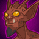

[Back to Main](index.md)

    
        
            
        
        
        Portrait
        
    

# Havilar

Havilar's twin sister Farideh has always been 'the smart one' and 'the responsible one'-but that's all right, Havilar is definitely 'the tough one,' 'the funny one' and the 'pretty one' (despite being identical twins). Plus, Havilar has a hellhound! Even if it means she's a sort-of-but-not-quite Chosen of Asmodeus, too, not that anyone asked Havi about that. But he should know her glaive is as good as her right hand, and she can slice a devil just as well as an orc, a zombie, or any other villain!

# Changes

Havilar will be a reworked champion in the Feast of the Moon event and delayed until 12 November 2025.

Only abilities that have seen some changes will be displayed here - and be aware that there's a lot of guesswork involved. Some abilities may not have names - some may have the *wrong* names - or specialisations might not be marked as such - etc.. Focus on the effect data itself.

Please do me a favour and don't get all melodramatic about what you find here. I - and CNE - don't appreciate it. These are spoilers and will almost certainly change before release - likely multiple times. That and we don't have access to any upgrade data prior to release. Making assumptions on how the champions will turn out based on this information would be premature.

# Attacks

**Ultimate: Infernal Aspect** (Guess)
> Farideh taps into her infernal bloodline, berserking enemies and damaging them.  
> Cooldown: 450s (Cap 112.5s)

<em>Raw Data</em>

<pre>
{
    "id": 903,
    "name": "Infernal Aspect",
    "description": "Farideh taps into her infernal bloodline, causing enemies to move faster and attack more often, but deal less damage, while also damaging them",
    "long_description": "Farideh taps into her infernal bloodline, berserking enemies and damaging them.",
    "graphic_id": 4109,
    "target": "none",
    "num_targets": 1,
    "aoe_radius": 0,
    "damage_modifier": 0.03,
    "cooldown": 450,
    "animations": [
        {
            "type": "ultimate_attack",
            "ultimate": "farideh_v2",
            "animation_sequence_name": "ultimate",
            "no_damage_display": true
        }
    ],
    "tags": [
        "magic",
        "ultimate"
    ],
    "damage_types": [
        "magic"
    ]
}
</pre>

# Abilities

**Mott** (Guess)
> Unknown.

<em>Raw Data</em>

<pre>
{
    "id": 27666,
    "graphic": "Icons/Events/2017FeastOfTheMoon/Y9/Icon_Formation_Havilar_Mott",
    "v": 2,
    "fs": 0,
    "p": 0,
    "type": 1,
    "export_params": {
        "uses": [
            "icon"
        ],
        "quantize": true
    }
}
</pre>

**Speed Demon** (Guess)
> Unknown.

<em>Raw Data</em>

<pre>
{
    "id": 27666,
    "graphic": "Icons/Events/2017FeastOfTheMoon/Y9/Icon_Formation_Havilar_Mott",
    "v": 2,
    "fs": 0,
    "p": 0,
    "type": 1,
    "export_params": {
        "uses": [
            "icon"
        ],
        "quantize": true
    }
}
</pre>

# Specialisations

**Specialisation: Bosh** (Guess)
> Unknown.

<em>Raw Data</em>

<pre>
{
    "id": 27671,
    "graphic": "Icons/Events/2017FeastOfTheMoon/Y9/Icon_Specialization_Havilar_Bosh",
    "v": 2,
    "fs": 0,
    "p": 0,
    "type": 1,
    "export_params": {
        "uses": [
            "icon"
        ],
        "quantize": true
    }
}
</pre>

**Specialisation: Dembo** (Guess)
> Unknown.

<em>Raw Data</em>

<pre>
{
    "id": 27672,
    "graphic": "Icons/Events/2017FeastOfTheMoon/Y9/Icon_Specialization_Havilar_Dembo",
    "v": 2,
    "fs": 0,
    "p": 0,
    "type": 1,
    "export_params": {
        "uses": [
            "icon"
        ],
        "quantize": true
    }
}
</pre>

**Specialisation: Ola** (Guess)
> Unknown.

<em>Raw Data</em>

<pre>
{
    "id": 27673,
    "graphic": "Icons/Events/2017FeastOfTheMoon/Y9/Icon_Specialization_Havilar_Ola",
    "v": 2,
    "fs": 0,
    "p": 0,
    "type": 1,
    "export_params": {
        "uses": [
            "icon"
        ],
        "quantize": true
    }
}
</pre>

# Adventures and Variants

**Unlock Adventure: The Missing Merchants (Havilar)** (Complete Area 50)
> Discover the fate of some merchants in the jungles of Chult.

 **Variant 1: Odd Ones Out** (Complete Area 75)
> Only every second bench seat can be used. The odd ones are right out!

 **Variant 2: Diamonds Are Forever** (Complete Area 125)
> Diamond Golems attack the formation at random. They can not be damaged and must be tanked until the area is beaten.

 **Variant 3: Nightmare Scenario** (Complete Area 175)
> Havilar starts in the formation and can not be swapped, moved, or removed from the formation. Half of the enemies that spawn in non-boss areas are replaced with random demons that have more health and move more quickly than normal monsters.

# Formation

    <svg xmlns="http://www.w3.org/2000/svg" id="Havilar" fill="#aaa" data-formationName="Havilar" data-campaignName="Grand Revel" width="300" height="140"><circle cx="175" cy="65" r="15"/><circle cx="135" cy="45" r="15"/><circle cx="135" cy="85" r="15"/><circle cx="95" cy="25" r="15"/><circle cx="95" cy="65" r="15"/><circle cx="95" cy="105" r="15"/><circle cx="55" cy="85" r="15"/><circle cx="55" cy="125" r="15"/><circle cx="15" cy="25" r="15"/><circle cx="15" cy="65" r="15"/><text x="205" y="25" fill="#dcdcdc" font-size="25" font-family="Arial" font-weight="bold">Havilar</text><text x="205" y="65" fill="#dcdcdc" font-size="15" font-family="Arial" font-weight="bold">Grand Revel</text></svg>

[Back to Top](#top)

*Last Modified: {{ site.time }}*