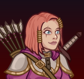

[Back to Main](index.md)

# Imoen
Imoen was an adventurer and mage that traveled across Faerûn during the mid–14th century DR. She was one of the mortal children spawned by the deity Bhaal a decade before the Time of Troubles.

[https://forgottenrealms.fandom.com/wiki/Imoen](https://forgottenrealms.fandom.com/wiki/Imoen)

# Basic Information
Imoen will be the new champion in the Wintershield event on 30 November 2022.

* Seat: Unknown
* Race: Human
* Class: Rogue / Wizard (Guess)
* Roles: Unknown
* Gender: Female
* Alignment: Neutral Good
* Affiliation: Unknown
* Stats: Unknown

# Formation
Unknown.
<!-- Uncomment once formation is available. -->
<!--  -->

# Abilities

Short Bow (Base Attack)
> Imoen shoots a random enemy with her bow. Once her specialization is unlocked, she does an additional 5 seconds worth of BUD based damage.

Disarm Traps (Ultimate)
> Imoen leaps out into the fray, attacking five enemies in sequence with her short sword in one hand and her lockpicks in the other. She prioritizes enemies with hits-based health and deals 5 hits per attack; if no hits-based enemies are available she deals normal ultimate damage to enemies she attacks.

Unknown Name (Stack Title: Perseverance Stacks)
> Any time any Champion's Favored Foe appears or is defeated, Imoen increases the effect of `$(upgrade_name id)` by `$(amount)%`, stacking multiplicatively and then applying multiplicatively. Stacks up to `$(max_stacks)` times. Stacks are reset each time the Champions change areas.

Polymorph (Guess)
> Before every third attack, Imoen polymorphs a random non-boss non-static enemy into a monster with the same type as her Favored Foe, but only 10% of its original health. She can not polymorph enemies that are already polymorphed by this ability a second time.  
> Animals: Polymorphed Rabbit / Faerie Dragon / Gremishka / Gazer

Stoneskin
> Unknown effect.

Favored Foe
> Beast / Dragon / Monstrosity / Aberration

# Specialisations

Aberration Slaying Arrow
> Aberration enemies become Imoen's Favored Foe. Her Short Bow attacks against Beast enemies deal an additional BUD-based damage with each hit.

Beast Slaying Arrow
> Beast enemies become Imoen's Favored Foe. Her Short Bow attacks against Beast enemies deal an additional BUD-based damage with each hit.

Dragon Slaying Arrow
> Dragon enemies become Imoen's Favored Foe. Her Short Bow attacks against Beast enemies deal an additional BUD-based damage with each hit.

Monstrosity Slaying Arrow
> Monstrosity enemies become Imoen's Favored Foe. Her Short Bow attacks against Beast enemies deal an additional BUD-based damage with each hit.

# Items

1. Arrows
2. Clothing
3. Lockpicks
4. Short Bow
5. Spellcaster Material
6. Sword

# Legendaries
Unknown.

[Back to Top](#top)

*Last Modified: {{ site.time }}*