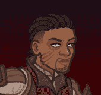
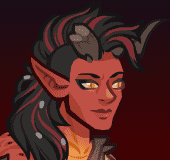

# Idle Champions Spoilers

Just a collection of most of the currently-known spoilers. It is by no means exhaustive. Of course - spoilers are subject to change at any time. Don't plan any major life events around them.

 

I'm not angry that you discuss spoilers in places you shouldn't... I'm just disappointed. Spoilers belong on the {::nomarkdown}<a href="https://discord.gg/idlechampions" target="_blank">official IC Discord</a>{:/nomarkdown} in the `#well_of_spoilers` channel only.

# Event Champions

These are the event champions that are upcoming and all the information we know about them. Dates are guesstimates based on the normal event schedule.

{::nomarkdown}
<a href="shadowheart.html">
{:/nomarkdown}
    
        
            
        
        
            
                Shadowheart&nbsp;- Half-Elf Cleric of Absolute Adversaries (Guess)
            
            
                Simril - 29 November 2023
            
        
    
{::nomarkdown}
</a>
{:/nomarkdown}
{::nomarkdown}
<a href="wyll.html">
{:/nomarkdown}
    
        
            
        
        
            
                Wyll&nbsp;- Human Warlock of Absolute Adversaries (Guess)
            
            
                Wintershield - 20 December 2023
            
        
    
{::nomarkdown}
</a>
{:/nomarkdown}
{::nomarkdown}
<a href="karlach.html">
{:/nomarkdown}
    
        
            
        
        
            
                Karlach&nbsp;- Tiefling Barbarian of Absolute Adversaries (Guess)
            
            
                Midwinter - 10 January 2024
            
        
    
{::nomarkdown}
</a>
{:/nomarkdown}

# Recurring Events

Not events events - but events. You know?

* [Emergence 4](emergence_4.md) - 22 November 2023
* [Season 7](season_7.md) - 03 January 2024
* [Emergence 5](emergence_5.md) - 24 January 2024
* [Recurring Event Exclusivity Dates](exclusivitydates.md)

# Misc

Miscellaneous spoilers.

* [Feats](feats.md)
* [Skins](skins.md)
* [Premium Packs and DLC](premium.md)
* [Content Drops](contentdrops.md)
* [Weekends](weekends.md)
* [Archive of Old Spoilers]({{ site.github.owner_url }}/ic_spoilers/tree/main/docs/archive)

[Back to Top](#top)

*Last Modified: {{ site.time }}*