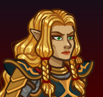

# Idle Champions Spoilers

Just a collection of most of the currently-known spoilers. It is by no means exhaustive. Of course - spoilers are subject to change at any time. Don't plan any major life events around them.

 

I'm not angry that you discuss spoilers in places you shouldn't... I'm just disappointed. Spoilers belong on the {::nomarkdown}<a href="https://discord.gg/idlechampions" target="_blank">official IC Discord</a>{:/nomarkdown} in the `#well_of_spoilers` channel only.

    <input type="checkbox" onClick="changeIndexVersion()" id="sortByEvents">
    <label class="switch" for="eventsVersion">Sort by Event Schedule</label>

{::nomarkdown}

{:/nomarkdown}

# New Event Champions

These are the event champions that are upcoming and all the information we know about them.

{::nomarkdown}
<a href="raistlin.html">
{:/nomarkdown}
    
        
            
        
        
            
                Raistlin
            
            
                Human Wizard of Heroes of the Lance (Guess)
            
            
                Fleetswake - 4 March 2026
            
        
        
            
        
        
            Roadmapped 🗺️
        
    
{::nomarkdown}
</a>
{:/nomarkdown}
{::nomarkdown}
<a href="tasslehoff.html">
{:/nomarkdown}
    
        
            
        
        
            
                Tasslehoff
            
            
                Kender Rogue of Heroes of the Lance (Guess)
            
            
                Festival of Fools - 1 April 2026
            
        
    
{::nomarkdown}
</a>
{:/nomarkdown}
{::nomarkdown}
<a href="laurana.html">
{:/nomarkdown}
    
        
            
        
        
            
                Laurana
            
            
                Elf Fighter of Heroes of the Lance (Guess)
            
            
                The Great Modron March - 6 May 2026
            
        
    
{::nomarkdown}
</a>
{:/nomarkdown}

# Reworked Champions

A list of champions that will be seeing reworks in upcoming events.

{::nomarkdown}
<a href="deekin.html">
{:/nomarkdown}
    
        
            
        
        
            
                Deekin
            
            
                Kobold Bard
            
            
                Fleetswake - Delayed until 11 March 2026
            
        
        
            
        
        
            Roadmapped 🗺️
        
    
{::nomarkdown}
</a>
{:/nomarkdown}
{::nomarkdown}
<a href="lucius.html">
{:/nomarkdown}
    
        
            
        
        
            
                Lucius Elenasto
            
            
                Elf (High) Sorcerer of Heroes of Aerois
            
            
                Festival of Fools - Delayed until 08 April 2026
            
        
        
            
        
    
{::nomarkdown}
</a>
{:/nomarkdown}
{::nomarkdown}
<a href="melf.html">
{:/nomarkdown}
    
        
            
        
        
            
                Melf
            
            
                Elf (High) Fighter / Wizard
            
            
                The Great Modron March - Delayed until 13 May 2026
            
        
        
            
        
    
{::nomarkdown}
</a>
{:/nomarkdown}

{::nomarkdown}

{:/nomarkdown}

# Champions

These are the upcoming new and reworked champions and where they'll be found.

## Fleetswake - 4 March 2026

{::nomarkdown}
<a href="raistlin.html">
{:/nomarkdown}
    
        
            
        
        
            
                Raistlin
            
            
                Human Wizard of Heroes of the Lance (Guess)
            
        
        
            New ⭐ Roadmapped 🗺️
        
        
            
        
    
{::nomarkdown}
</a>
{:/nomarkdown}
{::nomarkdown}
<a href="deekin.html">
{:/nomarkdown}
    
        
            
        
        
            
                Deekin
            
            
                Kobold Bard
            
            
                Delayed until 11 March 2026
            
        
        
            Rework ♻️ Roadmapped 🗺️
        
        
            
        
    
{::nomarkdown}
</a>
{:/nomarkdown}

## Festival of Fools - 1 April 2026

{::nomarkdown}
<a href="tasslehoff.html">
{:/nomarkdown}
    
        
            
        
        
            
                Tasslehoff
            
            
                Kender Rogue of Heroes of the Lance (Guess)
            
        
        
            New ⭐
        
    
{::nomarkdown}
</a>
{:/nomarkdown}
{::nomarkdown}
<a href="lucius.html">
{:/nomarkdown}
    
        
            
        
        
            
                Lucius Elenasto
            
            
                Elf (High) Sorcerer of Heroes of Aerois
            
            
                Delayed until 08 April 2026
            
        
        
            Rework ♻️
        
        
            
        
    
{::nomarkdown}
</a>
{:/nomarkdown}

## The Great Modron March - 6 May 2026

{::nomarkdown}
<a href="laurana.html">
{:/nomarkdown}
    
        
            
        
        
            
                Laurana
            
            
                Elf Fighter of Heroes of the Lance (Guess)
            
        
        
            New ⭐
        
    
{::nomarkdown}
</a>
{:/nomarkdown}
{::nomarkdown}
<a href="melf.html">
{:/nomarkdown}
    
        
            
        
        
            
                Melf
            
            
                Elf (High) Fighter / Wizard
            
            
                Delayed until 13 May 2026
            
        
        
            Rework ♻️
        
        
            
        
    
{::nomarkdown}
</a>
{:/nomarkdown}

{::nomarkdown}

{:/nomarkdown}

# Timed Misc

Miscellaneous spoilers with due dates.

* Dragonlance Celebration - 4 March 2026
* [Fleetswake Augments](augments_12.md) - 4 March 2026
* EGS Giveaway - Raistlin's Renown Pack - 5 March 2026
* Emergence 15 - 22 April 2026
* [Bastion](bastion.md) - ???

# Misc

Miscellaneous spoilers.

* [Exclusivity Dates](exclusivitydates.md)
* [Event Roster](event_roster.md)
* [Patron Roster](patron_roster.md)
* [Feats](feats.md)
* [Skins](skins.md)
* [Familiars](familiars.md)
* [Premium Packs and DLC](premium.md)
* [Content Drops](contentdrops.md)
* [Blessings](blessings.md)
* [Weekends](weekends.md)
* [Archive of Old Spoilers](archive.md)

[Back to Top](#top)

*Last Modified: {{ site.time }}*

