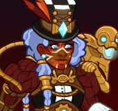
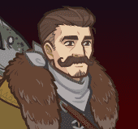
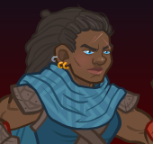
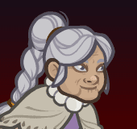

# Idle Champions Spoilers

Just a collection of most of the currently-known spoilers. It is by no means exhaustive. Of course - spoilers are subject to change at any time. Don't plan any major life events around them.

 

I'm not angry that you discuss spoilers in places you shouldn't... I'm just disappointed. Spoilers belong on the {::nomarkdown}<a href="https://discord.gg/idlechampions" target="_blank">official IC Discord</a>{:/nomarkdown} in the `#well_of_spoilers` channel only.

# New Event Champions

These are the event champions that are upcoming and all the information we know about them. Dates are guesstimates based on the normal event schedule.

{::nomarkdown}
<a href="aeon.html">
{:/nomarkdown}
    
        
            
        
        
            
                Aeon
            
            
                Goliath Bard / Artificer
            
            
                Founders' Day - 3 July 2024
            
        
        
            
        
    
{::nomarkdown}
</a>
{:/nomarkdown}
{::nomarkdown}
<a href="umberto.html">
{:/nomarkdown}
    
        
            
        
        
            
                Umberto Thornheart
            
            
                Human Druid
            
            
                Founders' Day - 3 July 2024
            
        
        
            
        
    
{::nomarkdown}
</a>
{:/nomarkdown}
    
        
            
        
        
            
                Spooky Themed Champion
            
            
                Unknown
            
            
                Liars' Night - 2 October 2024
            
        
    

# New Evergreen Champion

The upcoming Evergreen champion we're aware of.

{::nomarkdown}
<a href="wren.html">
{:/nomarkdown}
    
        
            
        
        
            
                Wren
            
            
                Dwarf / Tabaxi / Warforged Monk / Barbarian / Sorcerer (Guess)
            
            
                Fortune's Wheel 6 - 24 July 2024 (Guess)
            
        
        
            
            
        
    
{::nomarkdown}
</a>
{:/nomarkdown}

# Reworked Champions

A list of champions that will be seeing reworks in upcoming events.

{::nomarkdown}
<a href="ellywick.html">
{:/nomarkdown}
    
        
            
        
        
            
                Ellywick
            
            
                Gnome Bard
            
            
                Ahghairon's Day - 7 August 2024 (Guess)
            
        
        
            
        
    
{::nomarkdown}
</a>
{:/nomarkdown}
{::nomarkdown}
<a href="rust.html">
{:/nomarkdown}
    
        
            
        
        
            
                Rust
            
            
                Tabaxi Rogue of Oxventurers Guild
            
            
                Ahghairon's Day - 7 August 2024 (Guess)
            
        
        
            
            
        
    
{::nomarkdown}
</a>
{:/nomarkdown}
    
        
            
        
        
            
                Rosie
            
            
                Halfling Monk of Acq Inc "C" Team
            
            
                Highharvestide - 4 September 2024 (Guess)
            
        
        
            
        
    

# Timed Misc

Miscellaneous spoilers with due dates.

* [Emergence 8](emergence_8.md) - 24 July 2024
* [XBox Giveaway](xbox_giveaway_laezel.md) - 31 August 2024

# Misc

Miscellaneous spoilers.

* [Exclusivity Dates](exclusivitydates.md)
* [Event Roster](event_roster.md)
* [Patron Roster](patron_roster.md)
* [Feats](feats.md)
* [Skins](skins.md)
* [Premium Packs and DLC](premium.md)
* [Content Drops](contentdrops.md)
* [Weekends](weekends.md)
* [Archive of Old Spoilers]({{ site.github.owner_url }}/ic_spoilers/tree/main/docs/archive)

[Back to Top](#top)

*Last Modified: {{ site.time }}*