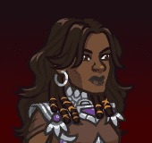

# Idle Champions Spoilers

Just a collection of most of the currently-known spoilers. It is by no means exhaustive. Of course - spoilers are subject to change at any time. Don't plan any major life events around them.

 

I'm not angry that you discuss spoilers in places you shouldn't... I'm just disappointed. Spoilers belong on the {::nomarkdown}<a href="https://discord.gg/idlechampions" target="_blank">official IC Discord</a>{:/nomarkdown} in the `#well_of_spoilers` channel only.

# Event Champions

These are the event champions that are upcoming and all the information we know about them. Dates are guesstimates based on the normal event schedule.

{::nomarkdown}
<a href="dynaheir.html">
{:/nomarkdown}
    
        
            
        
        
            
                Dynaheir&nbsp;- Human Wizard of Heroes of Baldur's Gate
            
            
                Fleetswake - 21 February 2024
            
        
    
{::nomarkdown}
</a>
{:/nomarkdown}
{::nomarkdown}
<a href="thedarkurge.html">
{:/nomarkdown}
    
        
            
        
        
            
                The Dark Urge&nbsp;- Dragonborn Sorcerer (Guess)
            
            
                Festival of Fools - 6 March 2024
            
        
    
{::nomarkdown}
</a>
{:/nomarkdown}
{::nomarkdown}
<a href="gale.html">
{:/nomarkdown}
    
        
            
        
        
            
                Gale&nbsp;- Human Wizard of Absolute Adversaries (Guess)
            
            
                Greengrass - 27 March 2024
            
        
    
{::nomarkdown}
</a>
{:/nomarkdown}
{::nomarkdown}
<a href="diana.html">
{:/nomarkdown}
    
        
            
        
        
            
                Diana&nbsp;- Human of Saturday Morning Squad (Guess)
            
            
                The Running - 17 April 2024
            
        
    
{::nomarkdown}
</a>
{:/nomarkdown}

# Recurring Events

Not events events - but events. You know?

* Seasons Are Currently Paused
* [Emergence 6](emergence_6.md) - 28 February 2024
* [Exclusivity Dates](exclusivitydates.md)

# Misc

Miscellaneous spoilers.

* [Collections Dialogue](collections.md) - ???
* [Events 2.0](events20.md) - ???
* [Feats](feats.md)
* [Skins](skins.md)
* [Premium Packs and DLC](premium.md)
* [Content Drops](contentdrops.md)
* [Weekends](weekends.md)
* [Archive of Old Spoilers]({{ site.github.owner_url }}/ic_spoilers/tree/main/docs/archive)

[Back to Top](#top)

*Last Modified: {{ site.time }}*