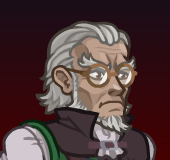
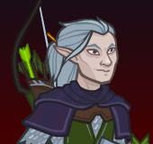
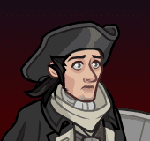
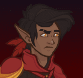

# Idle Champions Spoilers

Just a collection of most of the currently-known spoilers. It is by no means exhaustive. Of course - spoilers are subject to change at any time. Don't plan any major life events around them.

 

I'm not angry that you discuss spoilers in places you shouldn't... I'm just disappointed. Spoilers belong on the {::nomarkdown}<a href="https://discord.gg/idlechampions" target="_blank">official IC Discord</a>{:/nomarkdown} in the `#well_of_spoilers` channel only.

    <input type="checkbox" onClick="changeIndexVersion()" id="sortByEvents">
    <label class="switch" for="eventsVersion">Sort by Event Schedule</label>

{::nomarkdown}

{:/nomarkdown}

# New Event Champions

These are the event champions that are upcoming and all the information we know about them.

{::nomarkdown}
<a href="trixie.html">
{:/nomarkdown}
    
        
            
        
        
            
                Trixie
            
            
                Fairy (Guess)
            
            
                Dragondown - 3 June 2026
            
        
        
            
        
    
{::nomarkdown}
</a>
{:/nomarkdown}
{::nomarkdown}
<a href="vanrichten.html">
{:/nomarkdown}
    
        
            
        
        
            
                Van Richten
            
            
                Human (Guess)
            
            
                Founders' Day - 1 July 2026
            
        
        
            
        
    
{::nomarkdown}
</a>
{:/nomarkdown}

# Reworked Champions

A list of champions that will be seeing reworks in upcoming events.

{::nomarkdown}
<a href="melf.html">
{:/nomarkdown}
    
        
            
        
        
            
                Melf
            
            
                Elf (High) Fighter / Wizard
            
            
                The Great Modron March - Delayed until 13 May 2026
            
        
        
            
        
    
{::nomarkdown}
</a>
{:/nomarkdown}
{::nomarkdown}
<a href="uriah.html">
{:/nomarkdown}
    
        
            
        
        
            
                Brother Uriah
            
            
                Human Cleric of Black Dice Society
            
            
                Dragondown - Delayed until 10 June 2026
            
        
        
            
        
    
{::nomarkdown}
</a>
{:/nomarkdown}
{::nomarkdown}
<a href="walnut.html">
{:/nomarkdown}
    
        
            
        
        
            
                Walnut Dankgrass
            
            
                Elf (Wood) Druid of Acq Inc "C" Team
            
            
                Founders' Day - Delayed until 08 July 2026 (Guess)
            
        
        
            
        
    
{::nomarkdown}
</a>
{:/nomarkdown}

{::nomarkdown}

{:/nomarkdown}

# Champions

These are the upcoming new and reworked champions and where they'll be found.

## The Great Modron March - 6 May 2026

{::nomarkdown}
<a href="melf.html">
{:/nomarkdown}
    
        
            
        
        
            
                Melf
            
            
                Elf (High) Fighter / Wizard
            
            
                Delayed until 13 May 2026
            
        
        
            Rework ♻️
        
        
            
        
    
{::nomarkdown}
</a>
{:/nomarkdown}

## Dragondown - 3 June 2026

{::nomarkdown}
<a href="trixie.html">
{:/nomarkdown}
    
        
            
        
        
            
                Trixie
            
            
                Fairy (Guess)
            
        
        
            New ⭐
        
        
            
        
    
{::nomarkdown}
</a>
{:/nomarkdown}
{::nomarkdown}
<a href="uriah.html">
{:/nomarkdown}
    
        
            
        
        
            
                Brother Uriah
            
            
                Human Cleric of Black Dice Society
            
            
                Delayed until 10 June 2026
            
        
        
            Rework ♻️
        
        
            
        
    
{::nomarkdown}
</a>
{:/nomarkdown}

## Founders' Day - 1 July 2026

{::nomarkdown}
<a href="vanrichten.html">
{:/nomarkdown}
    
        
            
        
        
            
                Van Richten
            
            
                Human (Guess)
            
        
        
            New ⭐
        
        
            
        
    
{::nomarkdown}
</a>
{:/nomarkdown}
{::nomarkdown}
<a href="walnut.html">
{:/nomarkdown}
    
        
            
        
        
            
                Walnut Dankgrass (Guess)
            
            
                Elf (Wood) Druid of Acq Inc "C" Team
            
            
                Delayed until 08 July 2026
            
        
        
            Rework ♻️
        
        
            
        
    
{::nomarkdown}
</a>
{:/nomarkdown}

{::nomarkdown}

{:/nomarkdown}

# Timed Misc

Miscellaneous spoilers with due dates.

* [The Great Modron March Augments](augments_26.md) - 6 May 2026
* [EGS (Guess) Exclusive Giveaway](platform_giveaway_716.md) - 14 May 2026
* Emergence 16 - 22 July 2026
* [Bastion](bastion.md) - ???
* [Trials & Legendaries](trialsLegs.md) - ???

# Misc

Miscellaneous spoilers.

* [Exclusivity Dates](exclusivitydates.md)
* [Event Roster](event_roster.md)
* [Patron Roster](patron_roster.md)
* [Feats](feats.md)
* [Skins](skins.md)
* [Familiars](familiars.md)
* [Premium Packs and DLC](premium.md)
* [Content Drops](contentdrops.md)
* [Blessings](blessings.md)
* [Weekends](weekends.md)
* [Archive of Old Spoilers](archive.md)

[Back to Top](#top)

*Last Modified: {{ site.time }}*

