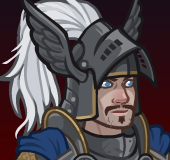
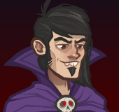
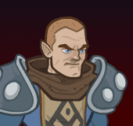
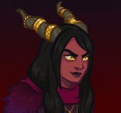
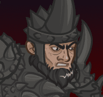

# Idle Champions Spoilers

Just a collection of most of the currently-known spoilers. It is by no means exhaustive. Of course - spoilers are subject to change at any time. Don't plan any major life events around them.

 

I'm not angry that you discuss spoilers in places you shouldn't... I'm just disappointed. Spoilers belong on the {::nomarkdown}<a href="https://discord.gg/idlechampions" target="_blank">official IC Discord</a>{:/nomarkdown} in the `#well_of_spoilers` channel only.

    <input type="checkbox" onClick="changeIndexVersion()" id="sortByEvents">
    <label class="switch" for="eventsVersion">Sort by Event Schedule</label>

{::nomarkdown}

{:/nomarkdown}

# New Event Champions

These are the event champions that are upcoming and all the information we know about them.

{::nomarkdown}
<a href="vanrichten.html">
{:/nomarkdown}
    
        
            
        
        
            
                Van Richten
            
            
                Human (Guess)
            
            
                Founders' Day - 1 July 2026
            
        
        
            
        
        
            New ⭐ Roadmapped 🗺️
        
    
{::nomarkdown}
</a>
{:/nomarkdown}
{::nomarkdown}
<a href="flint.html">
{:/nomarkdown}
    
        
            
        
        
            
                Flint
            
            
                Dwarf Fighter of Heroes of the Lance (Guess)
            
            
                Ahghairon's Day - 5 August 2026
            
        
        
            
        
        
            New ⭐ Roadmapped 🗺️
        
    
{::nomarkdown}
</a>
{:/nomarkdown}
{::nomarkdown}
<a href="caramonmajere.html">
{:/nomarkdown}
    
        
            
        
        
            
                Caramon Majere
            
            
                Human Fighter of Heroes of the Lance (Guess)
            
            
                Highharvestide - 2 September 2026
            
        
        
            New ⭐ Roadmapped 🗺️
        
    
{::nomarkdown}
</a>
{:/nomarkdown}

# Reworked Champions

A list of champions that will be seeing reworks in upcoming events.

{::nomarkdown}
<a href="uriah.html">
{:/nomarkdown}
    
        
            
        
        
            
                Brother Uriah
            
            
                Human Cleric of Black Dice Society
            
            
                Dragondown - Delayed until 10 June 2026
            
        
        
            
        
        
            Rework ♻️
        
    
{::nomarkdown}
</a>
{:/nomarkdown}
{::nomarkdown}
<a href="walnut.html">
{:/nomarkdown}
    
        
            
        
        
            
                Walnut Dankgrass
            
            
                Elf (Wood) Druid of Acq Inc "C" Team
            
            
                Founders' Day - 1 July 2026
            
        
        
            
        
        
            Rebalance 🛠️ Roadmapped 🗺️
        
    
{::nomarkdown}
</a>
{:/nomarkdown}
{::nomarkdown}
<a href="nahara.html">
{:/nomarkdown}
    
        
            
        
        
            
                Nahara
            
            
                Aasimar (Reborn) Warlock / Bard of Black Dice Society
            
            
                Founders' Day - 1 July 2026
            
        
        
            
        
        
            Rebalance 🛠️ Roadmapped 🗺️
        
    
{::nomarkdown}
</a>
{:/nomarkdown}
{::nomarkdown}
<a href="strongheart.html">
{:/nomarkdown}
    
        
            
        
        
            
                Strongheart
            
            
                Human Paladin
            
            
                Founders' Day - 1 July 2026
            
        
        
            
        
        
            Rebalance 🛠️ Roadmapped 🗺️
        
    
{::nomarkdown}
</a>
{:/nomarkdown}
    
        
            
        
        
            
                James (Jim) Winifred Darkmagic III
            
            
                Human Wizard of Acquisitions Incorporated
            
            
                Ahghairon's Day - 5 August 2026
            
        
        
            
        
        
            Rebalance 🛠️ Roadmapped 🗺️
        
    
    
        
            
        
        
            
                Omin Dran
            
            
                Half-Elf Cleric of Acquisitions Incorporated
            
            
                Ahghairon's Day - 5 August 2026
            
        
        
            
        
        
            Rebalance 🛠️ Roadmapped 🗺️
        
    
{::nomarkdown}
<a href="prudence.html">
{:/nomarkdown}
    
        
            
        
        
            
                Prudence
            
            
                Tiefling Warlock of Oxventurers Guild
            
            
                Ahghairon's Day - 5 August 2026
            
        
        
            
        
        
            Rebalance 🛠️ Roadmapped 🗺️
        
    
{::nomarkdown}
</a>
{:/nomarkdown}
    
        
            
        
        
            
                Stoki
            
            
                Gnome Monk
            
            
                Highharvestide - 2 September 2026
            
        
        
            
        
        
            Rebalance 🛠️ Roadmapped 🗺️
        
    
    
        
            
        
        
            
                Thibbledorf Pwent
            
            
                Dwarf Barbarian
            
            
                Highharvestide - 2 September 2026
            
        
        
            
        
        
            Rebalance 🛠️ Roadmapped 🗺️
        
    
    
        
            
        
        
            
                Corazón de Ballena
            
            
                Human Rogue of Oxventurers Guild
            
            
                Highharvestide - 2 September 2026
            
        
        
            
        
        
            Rebalance 🛠️ Roadmapped 🗺️
        
    

{::nomarkdown}

{:/nomarkdown}

# Champions

These are the upcoming new and reworked champions and where they'll be found.

## Dragondown - 3 June 2026

{::nomarkdown}
<a href="uriah.html">
{:/nomarkdown}
    
        
            
        
        
            
                Brother Uriah
            
            
                Human Cleric of Black Dice Society
            
            
                Delayed until 10 June 2026
            
        
        
            Rework ♻️
        
        
            
        
    
{::nomarkdown}
</a>
{:/nomarkdown}

## Founders' Day - 1 July 2026

{::nomarkdown}
<a href="vanrichten.html">
{:/nomarkdown}
    
        
            
        
        
            
                Van Richten
            
            
                Human (Guess)
            
        
        
            New ⭐ Roadmapped 🗺️
        
        
            
        
    
{::nomarkdown}
</a>
{:/nomarkdown}
{::nomarkdown}
<a href="walnut.html">
{:/nomarkdown}
    
        
            
        
        
            
                Walnut Dankgrass
            
            
                Elf (Wood) Druid of Acq Inc "C" Team
            
        
        
            Rebalance 🛠️ Roadmapped 🗺️
        
        
            
        
    
{::nomarkdown}
</a>
{:/nomarkdown}
{::nomarkdown}
<a href="nahara.html">
{:/nomarkdown}
    
        
            
        
        
            
                Nahara
            
            
                Aasimar (Reborn) Warlock / Bard of Black Dice Society
            
        
        
            Rebalance 🛠️ Roadmapped 🗺️
        
        
            
        
    
{::nomarkdown}
</a>
{:/nomarkdown}
{::nomarkdown}
<a href="strongheart.html">
{:/nomarkdown}
    
        
            
        
        
            
                Strongheart
            
            
                Human Paladin
            
        
        
            Rebalance 🛠️ Roadmapped 🗺️
        
        
            
        
    
{::nomarkdown}
</a>
{:/nomarkdown}

## Ahghairon's Day - 5 August 2026

{::nomarkdown}
<a href="flint.html">
{:/nomarkdown}
    
        
            
        
        
            
                Flint
            
            
                Dwarf Fighter of Heroes of the Lance (Guess)
            
        
        
            New ⭐ Roadmapped 🗺️
        
        
            
        
    
{::nomarkdown}
</a>
{:/nomarkdown}
    
        
            
        
        
            
                James (Jim) Winifred Darkmagic III
            
            
                Human Wizard of Acquisitions Incorporated
            
        
        
            Rebalance 🛠️ Roadmapped 🗺️
        
        
            
        
    
    
        
            
        
        
            
                Omin Dran
            
            
                Half-Elf Cleric of Acquisitions Incorporated
            
        
        
            Rebalance 🛠️ Roadmapped 🗺️
        
        
            
        
    
{::nomarkdown}
<a href="prudence.html">
{:/nomarkdown}
    
        
            
        
        
            
                Prudence
            
            
                Tiefling Warlock of Oxventurers Guild
            
        
        
            Rebalance 🛠️ Roadmapped 🗺️
        
        
            
        
    
{::nomarkdown}
</a>
{:/nomarkdown}

## Highharvestide - 2 September 2026

{::nomarkdown}
<a href="caramonmajere.html">
{:/nomarkdown}
    
        
            
        
        
            
                Caramon Majere
            
            
                Human Fighter of Heroes of the Lance (Guess)
            
        
        
            New ⭐ Roadmapped 🗺️
        
    
{::nomarkdown}
</a>
{:/nomarkdown}
    
        
            
        
        
            
                Stoki
            
            
                Gnome Monk
            
        
        
            Rebalance 🛠️ Roadmapped 🗺️
        
        
            
        
    
    
        
            
        
        
            
                Thibbledorf Pwent
            
            
                Dwarf Barbarian
            
        
        
            Rebalance 🛠️ Roadmapped 🗺️
        
        
            
        
    
    
        
            
        
        
            
                Corazón de Ballena
            
            
                Human Rogue of Oxventurers Guild
            
        
        
            Rebalance 🛠️ Roadmapped 🗺️
        
        
            
        
    

{::nomarkdown}

{:/nomarkdown}

# Timed Misc

Miscellaneous spoilers with due dates.

* [XBox Exclusive Giveaway](platform_giveaway_736.md) - 24 June 2026
* Legendary Feats - 22 July 2026
* [Emergence 16](emergence_16.md) - 29 July 2026
* [Bastion (July TBD)](bastion.md) - ???
* [Trials & Legendaries](trialsLegs.md) - ???

# Misc

Miscellaneous spoilers.

* [Exclusivity Dates](exclusivitydates.md)
* [Event Roster](event_roster.md)
* [Patron Roster](patron_roster.md)
* [Feats](feats.md)
* [Skins](skins.md)
* [Familiars](familiars.md)
* [Premium Packs and DLC](premium.md)
* [Content Drops](contentdrops.md)
* [Blessings](blessings.md)
* [Weekends](weekends.md)
* [Archive of Old Spoilers](archive.md)

[Back to Top](#top)

*Last Modified: {{ site.time }}*

