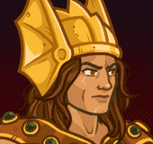
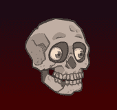

# Idle Champions Spoilers

Just a collection of most of the currently-known spoilers. It is by no means exhaustive. Of course - spoilers are subject to change at any time. Don't plan any major life events around them.

 

I'm not angry that you discuss spoilers in places you shouldn't... I'm just disappointed. Spoilers belong on the {::nomarkdown}<a href="https://discord.gg/idlechampions" target="_blank">official IC Discord</a>{:/nomarkdown} in the `#well_of_spoilers` channel only.

    <input type="checkbox" onClick="changeIndexVersion()" id="sortByEvents">
    <label class="switch" for="eventsVersion">Sort by Event Schedule</label>

{::nomarkdown}

{:/nomarkdown}

# New Event Champions

These are the new event champions that are upcoming and all the information we know about them.

{::nomarkdown}
<a href="caramon.html">
{:/nomarkdown}
    
        
            
        
        
            
                Caramon Majere
            
            
                Human Fighter of Heroes of the Lance (Guess)
            
            
                Highharvestide - 2 September 2026
            
        
        
            
        
        
            New ⭐ Roadmapped 🗺️
        
    
{::nomarkdown}
</a>
{:/nomarkdown}
{::nomarkdown}
<a href="kitiara.html">
{:/nomarkdown}
    
        
            
        
        
            
                Kitiara Uth Matar
            
            
                Human (Guess)
            
            
                Liars' Night - 7 October 2026 (Guess)
            
        
        
            New ⭐
        
    
{::nomarkdown}
</a>
{:/nomarkdown}
{::nomarkdown}
<a href="morte.html">
{:/nomarkdown}
    
        
            
        
        
            
                Mortimer Rictusgrin
            
            
                &nbsp;
            
            
                Feast of the Moon - 4 November 2026
            
        
        
            New ⭐
        
    
{::nomarkdown}
</a>
{:/nomarkdown}

# Reworked & Rebalanced Champions

A list of champions that will be seeing reworks or rebalances in upcoming events.  
Events will have either one rework OR three rebalances.

{::nomarkdown}
<a href="stoki.html">
{:/nomarkdown}
    
        
            
        
        
            
                Stoki
            
            
                Gnome Monk
            
            
                Highharvestide - 2 September 2026
            
        
        
            
        
        
            Rebalance 🛠️ Roadmapped 🗺️
        
    
{::nomarkdown}
</a>
{:/nomarkdown}
{::nomarkdown}
<a href="pwent.html">
{:/nomarkdown}
    
        
            
        
        
            
                Thibbledorf Pwent
            
            
                Dwarf Barbarian
            
            
                Highharvestide - 2 September 2026
            
        
        
            
        
        
            Rebalance 🛠️ Roadmapped 🗺️
        
    
{::nomarkdown}
</a>
{:/nomarkdown}
{::nomarkdown}
<a href="corazon.html">
{:/nomarkdown}
    
        
            
        
        
            
                Corazón de Ballena
            
            
                Human Rogue of Oxventurers Guild
            
            
                Highharvestide - 2 September 2026
            
        
        
            
        
        
            Rebalance 🛠️ Roadmapped 🗺️
        
    
{::nomarkdown}
</a>
{:/nomarkdown}

{::nomarkdown}

{:/nomarkdown}

# Champions

These are the upcoming new and reworked/rebalanced champions and where they'll be found.  
Events will have either one rework OR three rebalances.

## Highharvestide - 2 September 2026

{::nomarkdown}
<a href="caramon.html">
{:/nomarkdown}
    
        
            
        
        
            
                Caramon Majere
            
            
                Human Fighter of Heroes of the Lance (Guess)
            
        
        
            New ⭐ Roadmapped 🗺️
        
        
            
        
    
{::nomarkdown}
</a>
{:/nomarkdown}
{::nomarkdown}
<a href="stoki.html">
{:/nomarkdown}
    
        
            
        
        
            
                Stoki
            
            
                Gnome Monk
            
        
        
            Rebalance 🛠️ Roadmapped 🗺️
        
        
            
        
    
{::nomarkdown}
</a>
{:/nomarkdown}
{::nomarkdown}
<a href="pwent.html">
{:/nomarkdown}
    
        
            
        
        
            
                Thibbledorf Pwent
            
            
                Dwarf Barbarian
            
        
        
            Rebalance 🛠️ Roadmapped 🗺️
        
        
            
        
    
{::nomarkdown}
</a>
{:/nomarkdown}
{::nomarkdown}
<a href="corazon.html">
{:/nomarkdown}
    
        
            
        
        
            
                Corazón de Ballena
            
            
                Human Rogue of Oxventurers Guild
            
        
        
            Rebalance 🛠️ Roadmapped 🗺️
        
        
            
        
    
{::nomarkdown}
</a>
{:/nomarkdown}

## Liars' Night - 7 October 2026 (Guess)

{::nomarkdown}
<a href="kitiara.html">
{:/nomarkdown}
    
        
            
        
        
            
                Kitiara Uth Matar (Guess)
            
            
                Human (Guess)
            
        
        
            New ⭐
        
    
{::nomarkdown}
</a>
{:/nomarkdown}

## Feast of the Moon - 4 November 2026

{::nomarkdown}
<a href="morte.html">
{:/nomarkdown}
    
        
            
        
        
            
                Mortimer Rictusgrin
            
            
                &nbsp;
            
        
        
            New ⭐
        
    
{::nomarkdown}
</a>
{:/nomarkdown}

{::nomarkdown}

{:/nomarkdown}

# Timed Misc

Miscellaneous spoilers with due dates.

* Anniversary Celebration - 2 September 2026
* Emergence 17 - 30 September 2026
* [Bastion](bastion.md) - TBD September 2026
* [Trials & Legendaries](trialsLegs.md) - ???

# Misc

Miscellaneous spoilers.

* [Exclusivity Dates](exclusivitydates.md)
* [Event Roster](event_roster.md)
* [Patron Roster](patron_roster.md)
* [Feats](feats.md)
* [Skins](skins.md)
* [Familiars](familiars.md)
* [Premium Packs and DLC](premium.md)
* [Content Drops](contentdrops.md)
* [Blessings](blessings.md)
* [Weekends](weekends.md)
* [Archive of Old Spoilers](archive.md)

[Back to Top](#top)

*Last Modified: {{ site.time }}*

