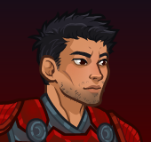
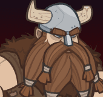

# Idle Champions Spoilers

Just a collection of most of the currently-known spoilers. It is by no means exhaustive. Of course - spoilers are subject to change at any time. Don't plan any major life events around them.

 

I'm not angry that you discuss spoilers in places you shouldn't... I'm just disappointed. Spoilers belong on the {::nomarkdown}<a href="https://discord.gg/idlechampions" target="_blank">official IC Discord</a>{:/nomarkdown} in the `#well_of_spoilers` channel only.

    <input type="checkbox" onClick="changeIndexVersion()" id="sortByEvents">
    <label class="switch" for="eventsVersion">Sort by Event Schedule</label>

{::nomarkdown}

{:/nomarkdown}

# New Event Champions

These are the event champions that are upcoming and all the information we know about them.

{::nomarkdown}
<a href="anson.html">
{:/nomarkdown}
    
        
            
        
        
            
                Anson
            
            
                Human Fighter of The Fallbacks (Guess)
            
            
                Wintershield - 7 January 2026
            
        
        
            
        
    
{::nomarkdown}
</a>
{:/nomarkdown}
{::nomarkdown}
<a href="kyre.html">
{:/nomarkdown}
    
        
            
        
        
            
                Kyre
            
            
                Human Monk
            
            
                Grand Revel - 4 February 2026
            
        
        
            
        
    
{::nomarkdown}
</a>
{:/nomarkdown}
{::nomarkdown}
<a href="raistlin.html">
{:/nomarkdown}
    
        
            
        
        
            
                Raistlin
            
            
                Human Wizard (Guess)
            
            
                Fleetswake - 4 March 2026
            
        
    
{::nomarkdown}
</a>
{:/nomarkdown}

# Reworked Champions

A list of champions that will be seeing reworks in upcoming events.

{::nomarkdown}
<a href="binwin.html">
{:/nomarkdown}
    
        
            
        
        
            
                Binwin Bronzebottom
            
            
                Dwarf (Mountain) Fighter / Barbarian
            
            
                Wintershield - Delayed until 14 January 2026
            
        
        
            
        
    
{::nomarkdown}
</a>
{:/nomarkdown}
{::nomarkdown}
<a href="donaar.html">
{:/nomarkdown}
    
        
            
        
        
            
                Donaar Blit'zen
            
            
                Dragonborn Paladin of Acq Inc "C" Team
            
            
                Grand Revel - Delayed until 11 February 2026
            
        
        
            
        
    
{::nomarkdown}
</a>
{:/nomarkdown}
    
        
            
        
        
            
                Deekin
            
            
                Kobold Bard
            
            
                Fleetswake - Delayed until 11 March 2026
            
        
        
            
        
    

{::nomarkdown}

{:/nomarkdown}

# Champions

These are the upcoming new and reworked champions and where they'll be found.

## Wintershield - 7 January 2026

{::nomarkdown}
<a href="anson.html">
{:/nomarkdown}
    
        
            
        
        
            
                Anson
            
            
                Human Fighter of The Fallbacks (Guess)
            
        
        
            New ⭐
        
        
            
        
    
{::nomarkdown}
</a>
{:/nomarkdown}
{::nomarkdown}
<a href="binwin.html">
{:/nomarkdown}
    
        
            
        
        
            
                Binwin Bronzebottom
            
            
                Dwarf (Mountain) Fighter / Barbarian
            
            
                Delayed until 14 January 2026
            
        
        
            Rework ♻️
        
        
            
        
    
{::nomarkdown}
</a>
{:/nomarkdown}

## Grand Revel - 4 February 2026

{::nomarkdown}
<a href="kyre.html">
{:/nomarkdown}
    
        
            
        
        
            
                Kyre
            
            
                Human Monk
            
        
        
            New ⭐
        
        
            
        
    
{::nomarkdown}
</a>
{:/nomarkdown}
{::nomarkdown}
<a href="donaar.html">
{:/nomarkdown}
    
        
            
        
        
            
                Donaar Blit'zen
            
            
                Dragonborn Paladin of Acq Inc "C" Team
            
            
                Delayed until 11 February 2026
            
        
        
            Rework ♻️
        
        
            
        
    
{::nomarkdown}
</a>
{:/nomarkdown}

## Fleetswake - 4 March 2026

{::nomarkdown}
<a href="raistlin.html">
{:/nomarkdown}
    
        
            
        
        
            
                Raistlin
            
            
                Human Wizard (Guess)
            
        
        
            New ⭐
        
    
{::nomarkdown}
</a>
{:/nomarkdown}
    
        
            
        
        
            
                Deekin
            
            
                Kobold Bard
            
            
                Delayed until 11 March 2026
            
        
        
            Rework ♻️
        
        
            
        
    

{::nomarkdown}

{:/nomarkdown}

# Timed Misc

Miscellaneous spoilers with due dates.

* [Emergence 14](emergence_14.md) - 23 December 2025
* [Bastion](bastion.md) - ???

# Misc

Miscellaneous spoilers.

* [Exclusivity Dates](exclusivitydates.md)
* [Event Roster](event_roster.md)
* [Patron Roster](patron_roster.md)
* [Feats](feats.md)
* [Skins](skins.md)
* [Familiars](familiars.md)
* [Premium Packs and DLC](premium.md)
* [Content Drops](contentdrops.md)
* [Blessings](blessings.md)
* [Weekends](weekends.md)
* [Archive of Old Spoilers](archive.md)

[Back to Top](#top)

*Last Modified: {{ site.time }}*

