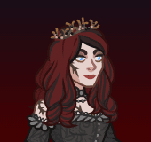
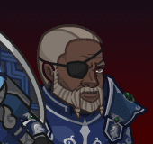

# Idle Champions Spoilers

Just a collection of most of the currently-known spoilers. It is by no means exhaustive. Of course - spoilers are subject to change at any time. Don't plan any major life events around them.

 

I'm not angry that you discuss spoilers in places you shouldn't... I'm just disappointed. Spoilers belong on the {::nomarkdown}<a href="https://discord.gg/idlechampions" target="_blank">official IC Discord</a>{:/nomarkdown} in the `#well_of_spoilers` channel only.

# New Event Champions

These are the event champions that are upcoming and all the information we know about them. Dates are guesstimates based on the normal event schedule.

{::nomarkdown}
<a href="kas.html">
{:/nomarkdown}
    
        
            
        
        
            
                Kas
            
            
                Human / Vampire Fighter (Guess)
            
            
                Liars' Night - 2 October 2024
            
        
        
            
        
    
{::nomarkdown}
</a>
{:/nomarkdown}
{::nomarkdown}
<a href="minthara.html">
{:/nomarkdown}
    
        
            
        
        
            
                Minthara
            
            
                Drow Paladin of Absolute Adversaries (Guess)
            
            
                Feast of the Moon - 6 November 2024
            
        
        
            
        
    
{::nomarkdown}
</a>
{:/nomarkdown}
{::nomarkdown}
<a href="halsin.html">
{:/nomarkdown}
    
        
            
        
        
            
                Halsin
            
            
                Elf (Wood) Druid of Absolute Adversaries (Guess)
            
            
                Simril - 4 December 2024
            
        
    
{::nomarkdown}
</a>
{:/nomarkdown}

# Reworked Champions

A list of champions that will be seeing reworks in upcoming events.

{::nomarkdown}
<a href="voronika.html">
{:/nomarkdown}
    
        
            
        
        
            
                Voronika
            
            
                Eladrin Druid of Black Dice Society
            
            
                Liars' Night - 2 October 2024
            
        
        
            
        
    
{::nomarkdown}
</a>
{:/nomarkdown}
{::nomarkdown}
<a href="sgtknox.html">
{:/nomarkdown}
    
        
            
        
        
            
                Sgt. Knox
            
            
                Human Fighter
            
            
                Feast of the Moon - 6 November 2024
            
        
        
            
        
    
{::nomarkdown}
</a>
{:/nomarkdown}
    
        
            
        
        
            
                Stoki
            
            
                Gnome Monk
            
            
                Simril - 4 December 2024
            
        
        
            
        
    

# Timed Misc

Miscellaneous spoilers with due dates.

* [Emergence 9](emergence_9.md) - 23 October 2024

# Misc

Miscellaneous spoilers.

* [Exclusivity Dates](exclusivitydates.md)
* [Event Roster](event_roster.md)
* [Patron Roster](patron_roster.md)
* [Feats](feats.md)
* [Skins](skins.md)
* [Familiars](familiars.md)
* [Premium Packs and DLC](premium.md)
* [Content Drops](contentdrops.md)
* [Weekends](weekends.md)
* [Archive of Old Spoilers](archive.md)

[Back to Top](#top)

*Last Modified: {{ site.time }}*