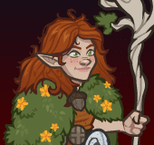

# Idle Champions Spoilers

Just a collection of most of the currently-known spoilers. It is by no means exhaustive. Of course - spoilers are subject to change at any time. Don't plan any major life events around them.

 

I'm not angry that you discuss spoilers in places you shouldn't... I'm just disappointed. Spoilers belong on the {::nomarkdown}<a href="https://discord.gg/idlechampions" target="_blank">official IC Discord</a>{:/nomarkdown} in the `#well_of_spoilers` channel only.

# New Event Champions

These are the event champions that are upcoming and all the information we know about them. Dates are guesstimates based on the normal event schedule.

{::nomarkdown}
<a href="gale.html">
{:/nomarkdown}
    
        
            
        
        
            
                Gale&nbsp;- Human Wizard of Absolute Adversaries
            
            
                Greengrass - 3 April 2024
            
        
    
{::nomarkdown}
</a>
{:/nomarkdown}
{::nomarkdown}
<a href="diana.html">
{:/nomarkdown}
    
        
            
        
        
            
                Diana&nbsp;- Human of Saturday Morning Squad (Guess)
            
            
                The Great Modron March - 1 May 2024 (Guess)
            
        
    
{::nomarkdown}
</a>
{:/nomarkdown}

# Reworked Champions

A list of champions that will be seeing reworks in upcoming events.

{::nomarkdown}
<a href="penelope.html">
{:/nomarkdown}
    
        
            
        
        
            
                Penelope&nbsp;- Halfling Druid / Warlock of Heroes of the Planes
            
            
                Greengrass - 3 April 2024 (Guess)
            
        
    
{::nomarkdown}
</a>
{:/nomarkdown}
{::nomarkdown}
<a href="gromma.html">
{:/nomarkdown}
    
        
            
        
        
            
                Gromma&nbsp;- Tortle Druid
            
            
                The Great Modron March - 1 May 2024 (Guess)
            
        
    
{::nomarkdown}
</a>
{:/nomarkdown}
    
        
            
        
        
            
                Rosie&nbsp;- Halfling Monk of Acq Inc "C" Team
            
            
                Highharvestide - 4 September 2024 (Guess)
            
        
    

# Recurring Events

Not events events - but events. You know?
* Seasons Are Currently Paused
* Emergence 7 - 22 May 2024
* [Exclusivity Dates](exclusivitydates.md)

# Misc

Miscellaneous spoilers.

* [Patron 5: Elminster](patron_5.md) - 3 April 2024 (Guess)
* [New Campaign: Vecna Eve of Ruin](campaign_vecna.md) - 22 May 2024 (Guess)
* [Feats](feats.md)
* [Skins](skins.md)
* [Premium Packs and DLC](premium.md)
* [Content Drops](contentdrops.md)
* [Weekends](weekends.md)
* [Archive of Old Spoilers]({{ site.github.owner_url }}/ic_spoilers/tree/main/docs/archive)

[Back to Top](#top)

*Last Modified: {{ site.time }}*