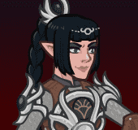

# Idle Champions Spoilers

Just a collection of most of the currently-known spoilers. It is by no means exhaustive. Of course - spoilers are subject to change at any time. Don't plan any major life events around them.

 

I'm not angry that you discuss spoilers in places you shouldn't... I'm just disappointed. They belong on the {::nomarkdown}<a href="https://discord.gg/idlechampions" target="_blank">official IC Discord</a>{:/nomarkdown} in the `#well_of_spoilers` channel only.

# Event Champions

These are the event champions that are upcoming and all the information we know about them. Dates are guesstimates based on the normal event schedule.

{::nomarkdown}
<a href="thellora.html">
{:/nomarkdown}
    
        
            
        
        
            
                Thellora&nbsp;- Centaur Paladin
            
            
                Liars' Night - 18 October 2023
            
        
    
{::nomarkdown}
</a>
{:/nomarkdown}
{::nomarkdown}
<a href="jangsao.html">
{:/nomarkdown}
    
        
            
        
        
            
                Jang Sao&nbsp;- Satyr Druid / Wizard (Guess)
            
            
                Feast of the Moon - 8 November 2023
            
        
    
{::nomarkdown}
</a>
{:/nomarkdown}
{::nomarkdown}
<a href="shadowheart.html">
{:/nomarkdown}
    
        
            
        
        
            
                Shadowheart&nbsp;- Half-Elf Cleric of Absolute Adversaries (Guess)
            
            
                Simril - 29 November 2023
            
        
    
{::nomarkdown}
</a>
{:/nomarkdown}
    
        
            
        
        
            
                Baldur's Gate 3 Champion #4&nbsp;- Unknown
            
            
                Wintershield - 20 December 2023
            
        
    
    
        
            
        
        
            
                Baldur's Gate 3 Champion #5&nbsp;- Unknown
            
            
                Midwinter - 10 January 2024
            
        
    

# Recurring Events

Not events events - but events. You know?

* [Season 6](season_6.md) - 08 November 2023 (Guess)
* [Emergence 4](emergence_4.md) - 22 November 2023
* Season 7 - 17 January 2024 (Guess)
* [Emergence 5](emergence_5.md) - 24 January 2024
* [Recurring Event Exclusivity Dates](postrecurringevent.html)

# Misc

Miscellaneous spoilers.

* [Turn of Fortune's Wheel](campaign_fortuneswheel.md) - 1 November 2023 (Guess)
* [Feats](feats.md)
* [Skins](skins.md)
* [Premium Packs and DLC](premium.md)
* [Content Drops](contentdrops.md)
* [Weekends](weekends.md)
* [Archive of Old Spoilers]({{ site.github.owner_url }}/ic_spoilers/tree/main/docs/archive)

[Back to Top](#top)

*Last Modified: {{ site.time }}*