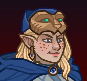

# Idle Champions Spoilers

Just a collection of most of the currently-known spoilers. It is by no means exhaustive. Of course - spoilers are subject to change at any time. Don't plan any major life events around them.

 

I'm not angry that you discuss spoilers in places you shouldn't... I'm just disappointed. Spoilers belong on the {::nomarkdown}<a href="https://discord.gg/idlechampions" target="_blank">official IC Discord</a>{:/nomarkdown} in the `#well_of_spoilers` channel only.

    <input type="checkbox" onClick="changeIndexVersion()" id="sortByEvents">
    <label class="switch" for="eventsVersion">Sort by Event Schedule</label>

{::nomarkdown}

{:/nomarkdown}

# New Event Champions

These are the event champions that are upcoming and all the information we know about them.

{::nomarkdown}
<a href="hank.html">
{:/nomarkdown}
    
        
            
        
        
            
                Hank
            
            
                Human Ranger of Saturday Morning Squad (Guess)
            
            
                Dragondown - 4 June 2025
            
        
        
            
        
    
{::nomarkdown}
</a>
{:/nomarkdown}
{::nomarkdown}
<a href="tess.html">
{:/nomarkdown}
    
        
            
        
        
            
                Tess
            
            
                 Rogue of The Fallbacks (Guess)
            
            
                Founders' Day - 2 July 2025
            
        
        
            
            
        
    
{::nomarkdown}
</a>
{:/nomarkdown}
{::nomarkdown}
<a href="baldric.html">
{:/nomarkdown}
    
        
            
        
        
            
                Baldric
            
            
                 Cleric of The Fallbacks (Guess)
            
            
                Ahghairon's Day - 13 August 2025 (Worst the Wait Augment (Guess))
            
        
    
{::nomarkdown}
</a>
{:/nomarkdown}

# New Evergreen Champion

The upcoming Evergreen champion we're aware of.

{::nomarkdown}
<a href="windfall.html">
{:/nomarkdown}
    
        
            
        
        
            
                Windfall
            
            
                Tiefling Bard (Guess)
            
            
                Vecna 8 - 28 May 2025 (Guess)
            
        
        
            
            
        
    
{::nomarkdown}
</a>
{:/nomarkdown}

# Reworked Champions

A list of champions that will be seeing reworks in upcoming events.

{::nomarkdown}
<a href="yorven.html">
{:/nomarkdown}
    
        
            
        
        
            
                Yorven Springpaw
            
            
                Harengon Barbarian / Druid
            
            
                The Great Modron March - 14 May 2025 (Worst the Wait Augment)
            
        
        
            
        
    
{::nomarkdown}
</a>
{:/nomarkdown}
{::nomarkdown}
<a href="krond.html">
{:/nomarkdown}
    
        
            
        
        
            
                Krond
            
            
                Half-Orc Fighter
            
            
                Dragondown - 11 June 2025 (Worst the Wait Augment)
            
        
        
            
            
        
    
{::nomarkdown}
</a>
{:/nomarkdown}
{::nomarkdown}
<a href="kthriss.html">
{:/nomarkdown}
    
        
            
        
        
            
                K'thriss Drow'b
            
            
                Elf (Drow) Warlock of Acq Inc "C" Team
            
            
                Founders' Day - 09 July 2025 (Worst the Wait Augment (Guess))
            
        
        
            
        
    
{::nomarkdown}
</a>
{:/nomarkdown}

{::nomarkdown}

{:/nomarkdown}

# Champions

These are the upcoming new and reworked champions and where they'll be found.

## The Great Modron March - 7 May 2025

{::nomarkdown}
<a href="yorven.html">
{:/nomarkdown}
    
        
            
        
        
            
                Yorven Springpaw
            
            
                Harengon Barbarian / Druid
            
            
                Delayed 1 week due to the Worst the Wait Augment
            
        
        
            Rework ♻️
        
        
            
        
    
{::nomarkdown}
</a>
{:/nomarkdown}

## Vecna 8 Content Drop - 28 May 2025 (Guess)

{::nomarkdown}
<a href="windfall.html">
{:/nomarkdown}
    
        
            
        
        
            
                Windfall (Guess)
            
            
                Tiefling Bard (Guess)
            
        
        
            Evergreen 🌲
        
        
            
            
        
    
{::nomarkdown}
</a>
{:/nomarkdown}

## Dragondown - 4 June 2025

{::nomarkdown}
<a href="hank.html">
{:/nomarkdown}
    
        
            
        
        
            
                Hank
            
            
                Human Ranger of Saturday Morning Squad (Guess)
            
        
        
            New ⭐
        
        
            
        
    
{::nomarkdown}
</a>
{:/nomarkdown}
{::nomarkdown}
<a href="krond.html">
{:/nomarkdown}
    
        
            
        
        
            
                Krond
            
            
                Half-Orc Fighter
            
            
                Delayed 1 week due to the Worst the Wait Augment
            
        
        
            Rework ♻️
        
        
            
            
        
    
{::nomarkdown}
</a>
{:/nomarkdown}

## Founders' Day - 2 July 2025

{::nomarkdown}
<a href="tess.html">
{:/nomarkdown}
    
        
            
        
        
            
                Tess
            
            
                 Rogue of The Fallbacks (Guess)
            
        
        
            New ⭐
        
        
            
            
        
    
{::nomarkdown}
</a>
{:/nomarkdown}
{::nomarkdown}
<a href="kthriss.html">
{:/nomarkdown}
    
        
            
        
        
            
                K'thriss Drow'b
            
            
                Elf (Drow) Warlock of Acq Inc "C" Team
            
            
                Delayed 1 week due to the Worst the Wait Augment (Guess)
            
        
        
            Rework ♻️
        
        
            
        
    
{::nomarkdown}
</a>
{:/nomarkdown}

## Ahghairon's Day - 6 August 2025

{::nomarkdown}
<a href="baldric.html">
{:/nomarkdown}
    
        
            
        
        
            
                Baldric
            
            
                 Cleric of The Fallbacks (Guess)
            
            
                Delayed 1 week due to the Worst the Wait Augment (Guess)
            
        
        
            New ⭐
        
    
{::nomarkdown}
</a>
{:/nomarkdown}

{::nomarkdown}

{:/nomarkdown}

# Timed Misc

Miscellaneous spoilers with due dates.

* [XBox Exclusive Giveaway](platform_giveaway_604.md) - 4 June 2025
* [Unknown Exclusive Giveaway](platform_giveaway_589.md) - 8 July 2025
* Emergence 12 - 23 July 2025

# Misc

Miscellaneous spoilers.

* [Exclusivity Dates](exclusivitydates.md)
* [Event Roster](event_roster.md)
* [Patron Roster](patron_roster.md)
* [Feats](feats.md)
* [Skins](skins.md)
* [Familiars](familiars.md)
* [Premium Packs and DLC](premium.md)
* [Content Drops](contentdrops.md)
* [Blessings](blessings.md)
* [Weekends](weekends.md)
* [Archive of Old Spoilers](archive.md)

[Back to Top](#top)

*Last Modified: {{ site.time }}*

