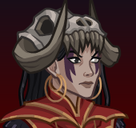
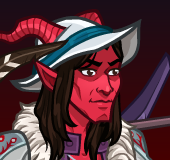
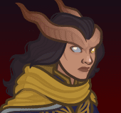

# Idle Champions Spoilers

Just a collection of most of the currently-known spoilers. It is by no means exhaustive. Of course - spoilers are subject to change at any time. Don't plan any major life events around them.

 

I'm not angry that you discuss spoilers in places you shouldn't... I'm just disappointed. Spoilers belong on the {::nomarkdown}<a href="https://discord.gg/idlechampions" target="_blank">official IC Discord</a>{:/nomarkdown} in the `#well_of_spoilers` channel only.

    <input type="checkbox" onClick="changeIndexVersion()" id="sortByEvents">
    <label class="switch" for="eventsVersion">Sort by Event Schedule</label>

{::nomarkdown}

{:/nomarkdown}

# New Event Champions

These are the event champions that are upcoming and all the information we know about them.

{::nomarkdown}
<a href="kingofshadows.html">
{:/nomarkdown}
    
        
            
        
        
            
                King of Shadows
            
            
                Outsider (Guess)
            
            
                Liars' Night - 1 October 2025
            
        
        
            
            
            
        
    
{::nomarkdown}
</a>
{:/nomarkdown}
{::nomarkdown}
<a href="skylla.html">
{:/nomarkdown}
    
        
            
        
        
            
                Skylla
            
            
                Human Warlock (Guess)
            
            
                Feast of the Moon - 5 November 2025
            
        
        
            
            
        
    
{::nomarkdown}
</a>
{:/nomarkdown}
{::nomarkdown}
<a href="lark.html">
{:/nomarkdown}
    
        
            
        
        
            
                Lark
            
            
                Tiefling Bard of The Fallbacks (Guess)
            
            
                Simril - 3 December 2025
            
        
    
{::nomarkdown}
</a>
{:/nomarkdown}

# Reworked Champions

A list of champions that will be seeing reworks in upcoming events.

{::nomarkdown}
<a href="alyndra.html">
{:/nomarkdown}
    
        
            
        
        
            
                Alyndra Sarrbarand
            
            
                Elf (High) Wizard / Cleric of Heroes of the Planes
            
            
                Highharvestide - Delayed until 10 September 2025
            
        
        
            
        
    
{::nomarkdown}
</a>
{:/nomarkdown}
{::nomarkdown}
<a href="farideh.html">
{:/nomarkdown}
    
        
            
        
        
            
                Farideh
            
            
                Tiefling Warlock of Brimstone Angels
            
            
                Liars' Night - Delayed until 08 October 2025
            
        
        
            
        
    
{::nomarkdown}
</a>
{:/nomarkdown}
{::nomarkdown}
<a href="havilar.html">
{:/nomarkdown}
    
        
            
        
        
            
                Havilar
            
            
                Tiefling Fighter of Brimstone Angels
            
            
                Feast of the Moon - Delayed until 12 November 2025
            
        
        
            
        
    
{::nomarkdown}
</a>
{:/nomarkdown}
    
        
            
        
        
            
                Nordom Whistleklik
            
            
                Modron Fighter
            
            
                Simril - Delayed until 10 December 2025 (Guess)
            
        
        
            
        
    

{::nomarkdown}

{:/nomarkdown}

# Champions

These are the upcoming new and reworked champions and where they'll be found.

## Highharvestide - 3 September 2025

{::nomarkdown}
<a href="alyndra.html">
{:/nomarkdown}
    
        
            
        
        
            
                Alyndra Sarrbarand
            
            
                Elf (High) Wizard / Cleric of Heroes of the Planes
            
            
                Delayed until 10 September 2025
            
        
        
            Rework ♻️
        
        
            
        
    
{::nomarkdown}
</a>
{:/nomarkdown}

## Liars' Night - 1 October 2025

{::nomarkdown}
<a href="kingofshadows.html">
{:/nomarkdown}
    
        
            
        
        
            
                King of Shadows
            
            
                Outsider (Guess)
            
        
        
            New ⭐
        
        
            
            
            
        
    
{::nomarkdown}
</a>
{:/nomarkdown}
{::nomarkdown}
<a href="farideh.html">
{:/nomarkdown}
    
        
            
        
        
            
                Farideh
            
            
                Tiefling Warlock of Brimstone Angels
            
            
                Delayed until 08 October 2025
            
        
        
            Rework ♻️
        
        
            
        
    
{::nomarkdown}
</a>
{:/nomarkdown}

## Feast of the Moon - 5 November 2025

{::nomarkdown}
<a href="skylla.html">
{:/nomarkdown}
    
        
            
        
        
            
                Skylla
            
            
                Human Warlock (Guess)
            
        
        
            New ⭐
        
        
            
            
        
    
{::nomarkdown}
</a>
{:/nomarkdown}
{::nomarkdown}
<a href="havilar.html">
{:/nomarkdown}
    
        
            
        
        
            
                Havilar
            
            
                Tiefling Fighter of Brimstone Angels
            
            
                Delayed until 12 November 2025
            
        
        
            Rework ♻️
        
        
            
        
    
{::nomarkdown}
</a>
{:/nomarkdown}

## Simril - 3 December 2025

{::nomarkdown}
<a href="lark.html">
{:/nomarkdown}
    
        
            
        
        
            
                Lark
            
            
                Tiefling Bard of The Fallbacks (Guess)
            
        
        
            New ⭐
        
    
{::nomarkdown}
</a>
{:/nomarkdown}
    
        
            
        
        
            
                Nordom Whistleklik (Guess)
            
            
                Modron Fighter
            
            
                Delayed until 10 December 2025
            
        
        
            Rework ♻️
        
        
            
        
    

{::nomarkdown}

{:/nomarkdown}

# Timed Misc

Miscellaneous spoilers with due dates.

* [Emergence 13](emergence_13.md) - 22 October 2025
* Winterfest Celebration - 3 December 2025
* [Emergence 14](emergence_14.md) - 24 December 2025

# Misc

Miscellaneous spoilers.

* [Exclusivity Dates](exclusivitydates.md)
* [Event Roster](event_roster.md)
* [Patron Roster](patron_roster.md)
* [Feats](feats.md)
* [Skins](skins.md)
* [Familiars](familiars.md)
* [Premium Packs and DLC](premium.md)
* [Content Drops](contentdrops.md)
* [Blessings](blessings.md)
* [Weekends](weekends.md)
* [Archive of Old Spoilers](archive.md)

[Back to Top](#top)

*Last Modified: {{ site.time }}*

