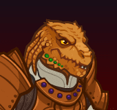

# Idle Champions Spoilers

Just a collection of most of the currently-known spoilers. It is by no means exhaustive. Of course - spoilers are subject to change at any time. Don't plan any major life events around them.

 

I'm not angry that you discuss spoilers in places you shouldn't... I'm just disappointed. Spoilers belong on the {::nomarkdown}<a href="https://discord.gg/idlechampions" target="_blank">official IC Discord</a>{:/nomarkdown} in the `#well_of_spoilers` channel only.

# New Event Champions

These are the event champions that are upcoming and all the information we know about them. Dates are guesstimates based on the normal event schedule.

{::nomarkdown}
<a href="eric.html">
{:/nomarkdown}
    
        
            
        
        
            
                Eric
            
            
                Human Fighter of Saturday Morning Squad (Guess)
            
            
                Wintershield - 1 January 2025
            
        
        
            
        
    
{::nomarkdown}
</a>
{:/nomarkdown}
{::nomarkdown}
<a href="kalix.html">
{:/nomarkdown}
    
        
            
        
        
            
                Kalix
            
            
                Thri-Kreen (Guess)
            
            
                Grand Revel - 5 February 2025
            
        
        
            
        
    
{::nomarkdown}
</a>
{:/nomarkdown}

# Reworked Champions

A list of champions that will be seeing reworks in upcoming events.

{::nomarkdown}
<a href="stoki.html">
{:/nomarkdown}
    
        
            
        
        
            
                Stoki
            
            
                Gnome Monk
            
            
                Simril - 11 December 2024
            
        
        
            
        
    
{::nomarkdown}
</a>
{:/nomarkdown}
{::nomarkdown}
<a href="mehen.html">
{:/nomarkdown}
    
        
            
        
        
            
                Mehen
            
            
                Dragonborn Fighter of Brimstone Angels
            
            
                Wintershield - 8 January 2025
            
        
        
            
        
    
{::nomarkdown}
</a>
{:/nomarkdown}
{::nomarkdown}
<a href="ishi.html">
{:/nomarkdown}
    
        
            
        
        
            
                Ishi
            
            
                Kobold Fighter / Rogue
            
            
                Grand Revel - 5 February 2025
            
        
        
            
        
    
{::nomarkdown}
</a>
{:/nomarkdown}
    
        
            
        
        
            
                Beadle & Grimm
            
            
                Dwarf / Human Rogue / Wizard / Barbarian
            
            
                Fleetswake - 5 March 2025 (Guess)
            
        
        
            
        
    

# Timed Misc

Miscellaneous spoilers with due dates.

* [EGS Exclusive Giveaway](platform_giveaway_517.md) - 12 December 2024
* [Emergence 10](emergence_10.md) - 22 January 2025
* [New Champion Roles](new_champion_roles.md) - ???

# Misc

Miscellaneous spoilers.

* [Exclusivity Dates](exclusivitydates.md)
* [Event Roster](event_roster.md)
* [Patron Roster](patron_roster.md)
* [Feats](feats.md)
* [Skins](skins.md)
* [Familiars](familiars.md)
* [Premium Packs and DLC](premium.md)
* [Content Drops](contentdrops.md)
* [Weekends](weekends.md)
* [Archive of Old Spoilers](archive.md)

[Back to Top](#top)

*Last Modified: {{ site.time }}*