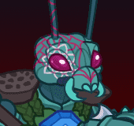

# Idle Champions Spoilers

Just a collection of most of the currently-known spoilers. It is by no means exhaustive. Of course - spoilers are subject to change at any time. Don't plan any major life events around them.

 

I'm not angry that you discuss spoilers in places you shouldn't... I'm just disappointed. Spoilers belong on the {::nomarkdown}<a href="https://discord.gg/idlechampions" target="_blank">official IC Discord</a>{:/nomarkdown} in the `#well_of_spoilers` channel only.

    <input type="checkbox" onClick="changeIndexVersion()" id="sortByEvents">
    <label class="switch" for="eventsVersion">Sort by Event Schedule</label>

{::nomarkdown}

{:/nomarkdown}

# New Event Champions

These are the event champions that are upcoming and all the information we know about them.

{::nomarkdown}
<a href="kalix.html">
{:/nomarkdown}
    
        
            
        
        
            
                Kalix
            
            
                Thri-Kreen Ranger (Guess)
            
            
                Grand Revel - 5 February 2025
            
        
        
            
        
    
{::nomarkdown}
</a>
{:/nomarkdown}
{::nomarkdown}
<a href="volo.html">
{:/nomarkdown}
    
        
            
        
        
            
                Volo
            
            
                Human Wizard (Guess)
            
            
                Fleetswake - 5 March 2025
            
        
        
            
        
    
{::nomarkdown}
</a>
{:/nomarkdown}
{::nomarkdown}
<a href="sheila.html">
{:/nomarkdown}
    
        
            
        
        
            
                Sheila
            
            
                Human Rogue of Saturday Morning Squad (Guess)
            
            
                Fleetswake - 12 March 2025 (Worst the Wait Augment (Guess))
            
        
        
            
        
    
{::nomarkdown}
</a>
{:/nomarkdown}
{::nomarkdown}
<a href="grimm.html">
{:/nomarkdown}
    
        
            
        
        
            
                Grimm
            
            
                Human Barbarian (Guess)
            
            
                Festival of Fools - 2 April 2025
            
        
    
{::nomarkdown}
</a>
{:/nomarkdown}

# Reworked Champions

A list of champions that will be seeing reworks in upcoming events.

{::nomarkdown}
<a href="ishi.html">
{:/nomarkdown}
    
        
            
        
        
            
                Ishi Snaggletooth
            
            
                Kobold Fighter / Rogue
            
            
                Grand Revel - 12 February 2025 (Worst the Wait Augment (Guess))
            
        
        
            
        
    
{::nomarkdown}
</a>
{:/nomarkdown}
{::nomarkdown}
<a href="beadle.html">
{:/nomarkdown}
    
        
            
        
        
            
                Beadle
            
            
                Dwarf Rogue / Wizard
            
            
                Festival of Fools - 2 April 2025 (Guess)
            
        
        
            
            
        
    
{::nomarkdown}
</a>
{:/nomarkdown}

{::nomarkdown}

{:/nomarkdown}

# Champions

These are the upcoming new and reworked champions and where they'll be found.

## Grand Revel - 5 February 2025

{::nomarkdown}
<a href="kalix.html">
{:/nomarkdown}
    
        
            
        
        
            
                Kalix
            
            
                Thri-Kreen Ranger (Guess)
            
        
        
            New ⭐
        
        
            
        
    
{::nomarkdown}
</a>
{:/nomarkdown}
{::nomarkdown}
<a href="ishi.html">
{:/nomarkdown}
    
        
            
        
        
            
                Ishi Snaggletooth
            
            
                Kobold Fighter / Rogue
            
            
                Delayed 1 week due to the Worst the Wait Augment (Guess)
            
        
        
            Rework ♻️
        
        
            
        
    
{::nomarkdown}
</a>
{:/nomarkdown}

## Fleetswake - 5 March 2025

{::nomarkdown}
<a href="volo.html">
{:/nomarkdown}
    
        
            
        
        
            
                Volo
            
            
                Human Wizard (Guess)
            
        
        
            New ⭐
        
        
            
        
    
{::nomarkdown}
</a>
{:/nomarkdown}
{::nomarkdown}
<a href="sheila.html">
{:/nomarkdown}
    
        
            
        
        
            
                Sheila
            
            
                Human Rogue of Saturday Morning Squad (Guess)
            
            
                Delayed 1 week due to the Worst the Wait Augment (Guess)
            
        
        
            New ⭐
        
        
            
        
    
{::nomarkdown}
</a>
{:/nomarkdown}

## Festival of Fools - 2 April 2025

{::nomarkdown}
<a href="grimm.html">
{:/nomarkdown}
    
        
            
        
        
            
                Grimm
            
            
                Human Barbarian (Guess)
            
        
        
            New ⭐
        
    
{::nomarkdown}
</a>
{:/nomarkdown}
{::nomarkdown}
<a href="beadle.html">
{:/nomarkdown}
    
        
            
        
        
            
                Beadle
            
            
                Dwarf Rogue / Wizard
            
        
        
            Rework ♻️
        
        
            
            
        
    
{::nomarkdown}
</a>
{:/nomarkdown}

{::nomarkdown}

{:/nomarkdown}

# Timed Misc

Miscellaneous spoilers with due dates.

* Emergence 11 - 23 April 2025
* [New Champion Roles](new_champion_roles.md) - ???

# Misc

Miscellaneous spoilers.

* [Exclusivity Dates](exclusivitydates.md)
* [Event Roster](event_roster.md)
* [Patron Roster](patron_roster.md)
* [Feats](feats.md)
* [Skins](skins.md)
* [Familiars](familiars.md)
* [Premium Packs and DLC](premium.md)
* [Content Drops](contentdrops.md)
* [Blessings](blessings.md)
* [Weekends](weekends.md)
* [Archive of Old Spoilers](archive.md)

[Back to Top](#top)

*Last Modified: {{ site.time }}*

