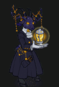
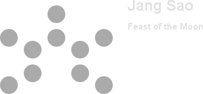
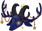
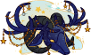
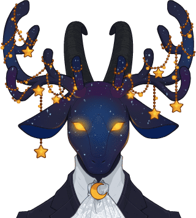
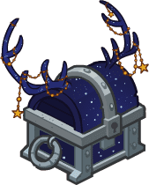

[Back to Main](index.md)

    
        Portait
    
    
        Model
    

# Jang Sao

We currently know very little about this champion. They've been confirmed to be part of the next (and sixth) Idle Champions Presents: `Fatebreaker`. But that's about it.

# Basic Information

Jang Sao will be the new champion in the Feast of the Moon event on 8 November 2023.

    
        
            **Seat**:
        
        
            Unknown
        
    
    
        
            **Race**:
        
        
            Satyr (Guess)
        
    
    
        
            **Class**:
        
        
            Druid / Wizard (Guess)
        
    
    
        
            **Roles**:
        
        
            Support / Healing (Guess)
        
    
    
        
            **Age**:
        
        
            Unknown
        
    
    
        
            **Gender**:
        
        
            Female (Guess)
        
    
    
        
            **Alignment**:
        
        
            Unknown
        
    
    
        
            **Affiliation**:
        
        
            Unknown
        
    

# Formation

    

# Abilities

**Base Attack: Star** (Magic)
> Jang Sao throws a star at the nearest enemy.  
> Cooldown: 4.5s (Cap 1.125s)

<em>Raw Data</em>

<pre>
{
    "description": "Jang Sao throws a star at the nearest enemy.",
    "long_description": "",
    "damage_modifier": 1,
    "damage_types": ["magic"],
    "graphic_id": 0,
    "target": "front",
    "aoe_radius": 0,
    "tags": ["ranged"],
    "num_targets": 1,
    "animations": [{
        "projectile_details": {
            "trail": {
                "scale_lerp": [{
                    "x": 1.5,
                    "y": 1.5
                }],
                "lifespan": 0.3,
                "initial_velocity": {
                    "x": 0,
                    "y": 0
                },
                "alpha_lerp": {
                    "0": 0,
                    "1": 0,
                    "0.1": 0.75
                },
                "particle_graphic_ids": [21159],
                "spawn_rate": 100,
                "velocity_jitter": {
                    "x": 50,
                    "y": 50
                }
            },
            "percent_height_offset": 5,
            "projectile_graphic_id": 21158,
            "projectile_speed": 1300,
            "hash": "f99a3085668ee6718a56877a085d85f6",
            "rotation_speed": 180
        },
        "hit_sound": 133,
        "shoot_offset_x": -25,
        "shoot_sound": 149,
        "type": "ranged_attack",
        "projectile": "pd_generic_projectile",
        "shoot_frame": 20
    }],
    "name": "Star",
    "cooldown": 4.5,
    "id": 698
}
</pre>

**Ultimate Attack: Starry Form**
> Jang Sao transforms into her starry form for 15 seconds and fires shooting stars at her enemies, making them take 100% additional damage for the duration.  
> Cooldown: 180s (Cap 45s)

<em>Raw Data</em>

<pre>
{
    "description": "Jang Sao transforms and shooting stars make her foes take more damage.",
    "long_description": "Jang Sao transforms into her starry form for 15 seconds and fires shooting stars at her enemies, making them take 100% additional damage for the duration.",
    "damage_modifier": 1,
    "damage_types": ["magic"],
    "graphic_id": 21208,
    "target": "random",
    "aoe_radius": 100,
    "tags": [
        "ranged",
        "ultimate"
    ],
    "num_targets": 1,
    "animations": [{
        "ultimate": "jang_sao",
        "type": "ultimate_attack"
    }],
    "name": "Starry Form",
    "cooldown": 180,
    "id": 699
}
</pre>

**The Mysterious Wanderer**
> Jang Sao increases the damage of all Champions in formation slots with 2 or fewer adjacent slots by 400%.

<em>Raw Data</em>

<pre>
{
    "effect_keys": [{
        "off_when_benched": true,
        "max_adj": 2,
        "effect_string": "hero_dps_multiplier_mult,400",
        "targets": [{
            "if_expr": "num_adj_slots<=max_adj",
            "max_adj": 2,
            "type": "slot_if_expr"
        }]
    }],
    "requirements": "",
    "description": {"desc": "Jang Sao increases the damage of all Champions in formation slots with $max_adj or fewer adjacent slots by $(amount)%."},
    "id": 1733,
    "flavour_text": "",
    "graphic_id": 21198,
    "properties": {
        "is_formation_ability": true,
        "owner_use_outgoing_description": true
    }
}
</pre>

**Star Collector**
> Each time an enemy is defeated, there is a 1% chance it drops a star. Jang Sao collects these stars and increases the effect of The Mysterious Wanderer by 0.1% for each star collected over all adventures, stacking additively. Capped at 4000000000 stacks.

<em>Raw Data</em>

<pre>
{
    "effect_keys": [
        {
            "stack_title": "Total Stars",
            "stacks_multiply": false,
            "show_bonus": true,
            "effect_string": "buff_upgrade,0.1,13257",
            "desc_forced_order": 1,
            "max_stacks": 4000000000,
            "stacks_on_trigger": "on_broadcast_stacks,jangsao_star_trigger"
        },
        {
            "off_when_benched": true,
            "effect_string": "jangsao_star_collector,1"
        },
        {
            "is_instanced_stat": false,
            "use_stat_defs": true,
            "effect_string": "stacks_data_binder_safe,0,jangsao_star_collector_stacks"
        },
        {
            "stack_title": "Stars gained this adventure",
            "effect_string": "do_nothing",
            "desc_forced_order": 0,
            "show_stacks": true,
            "stacks_on_trigger": "on_broadcast_stacks,jangsao_star_trigger"
        },
        {
            "is_instanced_stat": true,
            "use_stat_defs": true,
            "effect_string": "stacks_data_binder_safe,3,jangsao_star_collector_stacks_this_run"
        }
    ],
    "requirements": "",
    "description": {"desc": "Each time an enemy is defeated, there is a $(amount___2)% chance it drops a star. Jang Sao collects these stars and increases the effect of The Mysterious Wanderer by $(not_buffed amount)% for each star collected over all adventures, stacking additively. Capped at $max_stacks stacks."},
    "id": 1734,
    "flavour_text": "",
    "graphic_id": 21196,
    "properties": {
        "indexed_effect_properties": true,
        "is_formation_ability": true,
        "default_bonus_index": 0,
        "owner_use_outgoing_description": true,
        "per_effect_index_bonuses": true
    }
}
</pre>

**Stellar Nursery**
> Every 5 seconds, Jang Sao heals the 2 most damaged champions in the formation for 50 health.

<em>Raw Data</em>

<pre>
{
    "effect_keys": [
        {
            "effect_string": "jangsao_stellar_nursery,50",
            "tick_rate": 5
        },
        {"effect_string": "jangsao_stellar_nursery_target_count,2"}
    ],
    "requirements": "",
    "description": {"desc": "Every $(tick_rate) seconds, Jang Sao heals the $(jangsao_stellar_nursery_target_count) most damaged champions in the formation for $(amount) health."},
    "id": 1735,
    "flavour_text": "",
    "graphic_id": 21197,
    "properties": {
        "indexed_effect_properties": true,
        "is_formation_ability": true,
        "default_bonus_index": 0,
        "owner_use_outgoing_description": true,
        "per_effect_index_bonuses": true
    }
}
</pre>

**Painter of Beauty**
> For every Pigment assigned to equipment on Champions in the formation, the effect of The Mysterious Wanderer is increased by 100%, stacking multiplicatively. Pigments can be purchased in the Thayan Enclave Shop and sometimes claimed as Season Rewards.

<em>Raw Data</em>

<pre>
{
    "effect_keys": [{
        "stack_title": "Total Pigments",
        "amount_updated_listeners": ["loot_changed"],
        "stacks_multiply": true,
        "show_bonus": true,
        "amount_func": "mult",
        "stack_func": "per_hero_attribute",
        "per_hero_expr": "num_applied_pigments",
        "effect_string": "buff_upgrade,100,13257"
    }],
    "requirements": "",
    "description": {"desc": "For every Pigment assigned to equipment on Champions in the formation, the effect of The Mysterious Wanderer is increased by $(not_buffed amount)%, stacking multiplicatively. Pigments can be purchased in the Thayan Enclave Shop and sometimes claimed as Season Rewards."},
    "id": 1736,
    "flavour_text": "",
    "graphic_id": 21195,
    "properties": {
        "is_formation_ability": true,
        "owner_use_outgoing_description": true
    }
}
</pre>

# Specialisations

**Specialisation: Wisdom of the Ages** (Guess)
> Jang Sao increases the effect of The Mysterious Wanderer by 100% for each Champion in the formation with a Wisdom of 13+, stacking multiplicatively.

ⓘ *Note: This ability might be prestack.*

<em>Raw Data</em>

<pre>
{
    "effect_keys": [
        {"effect_string": "pre_stack_amount,100"},
        {
            "amount_expr": "upgrade_amount(13261,0)",
            "amount_updated_listeners": [
                "slot_changed",
                "feat_changed"
            ],
            "stacks_multiply": true,
            "off_when_benched": true,
            "show_bonus": true,
            "amount_func": "mult",
            "stack_func": "per_hero_attribute",
            "min_stat_amount": 13,
            "per_hero_expr": "clamp(wis+1-min_stat_amount,0,1)",
            "effect_string": "buff_upgrade,0,13257"
        }
    ],
    "requirements": "",
    "description": {"desc": "Jang Sao increases the effect of The Mysterious Wanderer by $(not_buffed amount)% for each Champion in the formation with a Wisdom of $(min_stat_amount___2)+, stacking multiplicatively."},
    "id": 1737,
    "flavour_text": "",
    "graphic_id": 0,
    "properties": {
        "indexed_effect_properties": true,
        "is_formation_ability": true,
        "spec_option_post_apply_info": "High Wisdom Champions: $num_stacks___2",
        "default_bonus_index": 0,
        "owner_use_outgoing_description": true,
        "type": "upgrade",
        "formation_circle_icon": false,
        "per_effect_index_bonuses": true
    }
}
</pre>

**Specialisation: Speed of Shooting Stars** (Guess)
> Jang Sao increases the effect of The Mysterious Wanderer by 100% for each Champion in the formation with a Dexterity of 15+, stacking multiplicatively.

ⓘ *Note: This ability might be prestack.*

<em>Raw Data</em>

<pre>
{
    "effect_keys": [
        {"effect_string": "pre_stack_amount,100"},
        {
            "amount_expr": "upgrade_amount(13262,0)",
            "amount_updated_listeners": [
                "slot_changed",
                "feat_changed"
            ],
            "stacks_multiply": true,
            "off_when_benched": true,
            "show_bonus": true,
            "amount_func": "mult",
            "stack_func": "per_hero_attribute",
            "min_stat_amount": 15,
            "per_hero_expr": "clamp(dex+1-min_stat_amount,0,1)",
            "effect_string": "buff_upgrade,0,13257"
        }
    ],
    "requirements": "",
    "description": {"desc": "Jang Sao increases the effect of The Mysterious Wanderer by $(not_buffed amount)% for each Champion in the formation with a Dexterity of $(min_stat_amount___2)+, stacking multiplicatively."},
    "id": 1738,
    "flavour_text": "",
    "graphic_id": 0,
    "properties": {
        "indexed_effect_properties": true,
        "is_formation_ability": true,
        "spec_option_post_apply_info": "High Dexterity Champions: $num_stacks___2",
        "default_bonus_index": 0,
        "owner_use_outgoing_description": true,
        "type": "upgrade",
        "formation_circle_icon": false,
        "per_effect_index_bonuses": true
    }
}
</pre>

**Specialisation: Moon Collector** (Guess)
> In addition to collecting stars, Jang Sao collects moons. Each time an enemy is defeated, there is a 0.5% chance it drops a moon. Jang Sao collects these moons for the purpose of Star Collector, and they count as 5 stars.

<em>Raw Data</em>

<pre>
{
    "effect_keys": [{
        "goober_graphic_id": 21156,
        "off_when_benched": true,
        "goober_name": "Projectile_JangSao_Moon",
        "broadcast_trigger_count": 5,
        "effect_string": "jangsao_moon_collector,0.5",
        "goober_graphic_id_large": 21156
    }],
    "requirements": "",
    "description": {"desc": "In addition to collecting stars, Jang Sao collects moons. Each time an enemy is defeated, there is a $(amount)% chance it drops a moon. Jang Sao collects these moons for the purpose of Star Collector, and they count as $(broadcast_trigger_count) stars."},
    "id": 1739,
    "flavour_text": "",
    "graphic_id": 0,
    "properties": {
        "is_formation_ability": true,
        "owner_use_outgoing_description": true
    }
}
</pre>

**Specialisation: Night Runner** (Guess)
> Jang Sao fires 3 more stars from her lantern when she uses her Starry Form ultimate and the ultimate's damage debuff are increased by the number of stars shot out stacking additively.

<em>Raw Data</em>

<pre>
{
    "effect_keys": [{"effect_string": "jangsao_star_caller,3"}],
    "requirements": "",
    "description": {"desc": "Jang Sao fires $(amount) more stars from her lantern when she uses her Starry Form ultimate and the ultimate's damage debuff are increased by the number of stars shot out stacking additively."},
    "id": 1740,
    "flavour_text": "",
    "graphic_id": 0,
    "properties": {
        "is_formation_ability": true,
        "owner_use_outgoing_description": true
    }
}
</pre>

**Specialisation: Star Caller** (Guess)
> Jang Sao increases the effect of Star Collector by a percentage equal to the number of stars she has collected on the current run.

<em>Raw Data</em>

<pre>
{
    "effect_keys": [{
        "stack_title": "Stars gained this adventure",
        "stat": "jangsao_star_collector_stacks_this_run",
        "show_bonus": true,
        "amount_func": "add",
        "instance_stat": true,
        "stack_func": "get_stat",
        "effect_string": "buff_upgrade,1,13257"
    }],
    "requirements": "",
    "description": {"desc": "Jang Sao increases the effect of Star Collector by a percentage equal to the number of stars she has collected on the current run."},
    "id": 1741,
    "flavour_text": "",
    "graphic_id": 0,
    "properties": {
        "is_formation_ability": true,
        "spec_option_post_apply_info": "Stars collected: $num_stacks",
        "owner_use_outgoing_description": true
    }
}
</pre>

# Items

    
        
            **Icons**
        
        
            **Name**
        
    
    
        
            
        
        
            Lantern
        
    
    
        
            
        
        
            Mask
        
    
    
        
            
        
        
            Paintbrushes
        
    
    
        
            
        
        
            Painting
        
    
    
        
            
        
        
            Sextant
        
    
    
        
            
        
        
            Stars
        
    

# Feats

Unknown.

# Legendaries

Unknown.

# Other Champion Images

    
        
            Console Portait
        
    
    
        
            Gold Chest Icon
        
        
            Silver Chest Icon
        
    

[Back to Top](#top)

*Last Modified: {{ site.time }}*