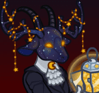

[Back to Main](index.md)

    
        
            
        
        
            Portrait
        
    

# Jang Sao

Jang Sao, a celestial voyager, traveled the Astral Planes for centuries collecting stars and painting galaxies with her cherished companion, Kwin. When Kwin departed, Jang Sao carried on her wishes of painting the cosmos. Now a wonderful artist, she immortalizes the heavens, reality, and most important of all, her friend.

# Changes

Jang Sao will be a reworked champion in the Feast of the Moon event on 4 November 2026.

Only abilities that have seen some changes will be displayed here - and be aware that there's a lot of guesswork involved. Some abilities may not have names - some may have the *wrong* names - or specialisations might not be marked as such - etc.. Focus on the effect data itself.

Please do me a favour and don't get all melodramatic about what you find here. I - and CNE - don't appreciate it. These are spoilers and will almost certainly change before release - likely multiple times. That and we don't have access to any upgrade data prior to release. Making assumptions on how the champions will turn out based on this information would be premature.

# Abilities

**The Mysterious Wanderer** (Guess)
> Jang Sao increases the damage of all Champions in formation slots with 2 or fewer adjacent slots by 400%. This is increased by a further 400% if Jang Sao is in one of those adjacent slots.

<em>Raw Data</em>

<pre>
{
    "id": 2997,
    "flavour_text": "",
    "description": {
        "desc": "Jang Sao increases the damage of all Champions in formation slots with $max_adj or fewer adjacent slots by $(amount)%. This is increased by a further $(amount)% if Jang Sao is in one of those adjacent slots."
    },
    "effect_keys": [
        {
            "off_when_benched": true,
            "effect_string": "hero_dps_multiplier_mult,400",
            "max_adj": 2,
            "targets": [
                {
                    "type": "slot_if_expr",
                    "if_expr": "num_adj_slots<=max_adj",
                    "max_adj": 2
                }
            ]
        },
        {
            "off_when_benched": true,
            "effect_string": "buff_incoming_upgrade,400,21244",
            "optional_effect_index": 0,
            "targets": [
                "adj"
            ],
            "filter_targets": [
                {
                    "type": "affected_by_upgrade",
                    "upgrade_id": 21244
                }
            ],
            "amount_updated_listeners": [
                "slot_changed",
                "attack_changed"
            ],
            "skip_effect_key_desc": true
        }
    ],
    "requirements": "",
    "graphic_id": 21198,
    "large_graphic_id": 0,
    "properties": {
        "is_formation_ability": true,
        "show_owner_incoming": true
    }
}
</pre>

**Star Collector** (Guess)
> Each time an enemy is defeated, there is a $(amount___4)% chance it drops a star. Jang Sao collects these stars and increases the effect of The Mysterious Wanderer by 1% for each star collected over all adventures, stacking additively. For every order of magnitude of stars collected, the base buff is multiplied by 1. Caps at 4000000000 stacks.

<em>Raw Data</em>

<pre>
{
    "id": 2998,
    "flavour_text": "",
    "description": {
        "desc": "Each time an enemy is defeated, there is a $(amount___4)% chance it drops a star. Jang Sao collects these stars and increases the effect of The Mysterious Wanderer by $(amount___2)% for each star collected over all adventures, stacking additively. For every order of magnitude of stars collected, the base buff is multiplied by $order_of_mag_mult___2. Caps at $max_stacks___3 stacks."
    },
    "effect_keys": [
        {
            "effect_string": "buff_upgrade,900,21245",
            "stack_title": "Total Stars Order of Magnitude",
            "stacks_multiply": true,
            "desc_forced_order": 2,
            "show_bonus": true,
            "stacks_on_trigger": "will_stack_manually"
        },
        {
            "effect_string": "pre_stack_(no_not_that_kind),1"
        },
        {
            "effect_string": "buff_upgrade,0,21244",
            "amount_expr": "upgrade_amount(21245,0)",
            "stack_title": "Total Stars",
            "desc_forced_order": 1,
            "max_stacks": 4000000000,
            "stacks_multiply": false,
            "show_bonus": true,
            "stacks_on_trigger": "will_stack_manually"
        },
        {
            "effect_string": "do_nothing",
            "stack_title": "Stars gained this adventure",
            "desc_forced_order": 0,
            "show_stacks": true,
            "stacks_on_trigger": "will_stack_manually"
        },
        {
            "effect_string": "jangsao_star_collector_v2,1",
            "all_time_stacking_index": 2,
            "oom_stacking_index": 0,
            "this_run_stacking_index": 3
        }
    ],
    "requirements": "",
    "graphic_id": 21196,
    "large_graphic_id": 0,
    "properties": {
        "is_formation_ability": true,
        "owner_use_outgoing_description": true,
        "indexed_effect_properties": true,
        "per_effect_index_bonuses": true,
        "default_bonus_index": 2
    }
}
</pre>

**Painter of Beauty** (Guess)
> For every Pigment assigned to equipment on Champions (even ones not in the formation), the effect of The Mysterious Wanderer is increased by 10%, stacking multiplicatively. Pigments can be purchased in the Thayan Enclave Shop and sometimes claimed as Event Rewards.

<em>Raw Data</em>

<pre>
{
    "id": 2999,
    "flavour_text": "",
    "description": {
        "desc": "For every Pigment assigned to equipment on Champions (even ones not in the formation), the effect of The Mysterious Wanderer is increased by $(not_buffed amount)%, stacking multiplicatively. Pigments can be purchased in the Thayan Enclave Shop and sometimes claimed as Event Rewards."
    },
    "effect_keys": [
        {
            "effect_string": "buff_upgrade,10,13257",
            "stack_title": "Total Pigments",
            "amount_func": "mult",
            "stacks_multiply": true,
            "show_bonus": true,
            "stack_func": "per_owned_pigment",
            "amount_updated_listeners": [
                "loot_changed"
            ]
        }
    ],
    "requirements": "",
    "graphic_id": 21195,
    "large_graphic_id": 0,
    "properties": {
        "is_formation_ability": true,
        "owner_use_outgoing_description": true
    }
}
</pre>

# Specialisations

**Specialisation: Wisdom of the Ages** (Guess)
> Jang Sao increases the effect of The Mysterious Wanderer by 100% for each Champion in the formation with a Wisdom of 13+, stacking multiplicatively.

ⓘ *Note: This ability is prestack.*

<em>Raw Data</em>

<pre>
{
    "id": 3000,
    "flavour_text": "",
    "description": {
        "desc": "Jang Sao increases the effect of The Mysterious Wanderer by $(amount)% for each Champion in the formation with a Wisdom of $(min_stat_amount___2)+, stacking multiplicatively."
    },
    "effect_keys": [
        {
            "effect_string": "pre_stack_amount,100"
        },
        {
            "off_when_benched": true,
            "effect_string": "buff_upgrade,0,21244",
            "amount_expr": "upgrade_amount(21248,0)",
            "amount_func": "mult",
            "stacks_multiply": true,
            "show_bonus": true,
            "stack_func": "per_hero_attribute",
            "per_hero_expr": "clamp(wis+1-min_stat_amount,0,1)",
            "min_stat_amount": 13,
            "amount_updated_listeners": [
                "slot_changed",
                "feat_changed"
            ]
        }
    ],
    "requirements": "",
    "graphic_id": 0,
    "large_graphic_id": 0,
    "properties": {
        "is_formation_ability": true,
        "owner_use_outgoing_description": true,
        "type": "upgrade",
        "indexed_effect_properties": true,
        "per_effect_index_bonuses": true,
        "default_bonus_index": 0,
        "formation_circle_icon": false,
        "spec_option_post_apply_info": "High Wisdom Champions: $num_stacks___2"
    }
}
</pre>

**Specialisation: Speed of Shooting Stars** (Guess)
> Jang Sao increases the effect of The Mysterious Wanderer by 100% for each Champion in the formation with a Dexterity of 15+, stacking multiplicatively.

ⓘ *Note: This ability is prestack.*

<em>Raw Data</em>

<pre>
{
    "id": 3001,
    "flavour_text": "",
    "description": {
        "desc": "Jang Sao increases the effect of The Mysterious Wanderer by $(amount)% for each Champion in the formation with a Dexterity of $(min_stat_amount___2)+, stacking multiplicatively."
    },
    "effect_keys": [
        {
            "effect_string": "pre_stack_amount,100"
        },
        {
            "off_when_benched": true,
            "effect_string": "buff_upgrade,0,21244",
            "amount_expr": "upgrade_amount(21249,0)",
            "amount_func": "mult",
            "stacks_multiply": true,
            "show_bonus": true,
            "stack_func": "per_hero_attribute",
            "per_hero_expr": "clamp(dex+1-min_stat_amount,0,1)",
            "min_stat_amount": 15,
            "amount_updated_listeners": [
                "slot_changed",
                "feat_changed"
            ]
        }
    ],
    "requirements": "",
    "graphic_id": 0,
    "large_graphic_id": 0,
    "properties": {
        "is_formation_ability": true,
        "owner_use_outgoing_description": true,
        "type": "upgrade",
        "indexed_effect_properties": true,
        "per_effect_index_bonuses": true,
        "default_bonus_index": 0,
        "formation_circle_icon": false,
        "spec_option_post_apply_info": "High Dexterity Champions: $num_stacks___2"
    }
}
</pre>

**Specialisation: Moon Collector** (Guess)
> In addition to collecting stars, Jang Sao collects moons. Each time an enemy is defeated, there is a 0.5% chance it drops a moon. Jang Sao collects these moons for the purpose of Star Collector, and they count as 25 stars.

<em>Raw Data</em>

<pre>
{
    "id": 3002,
    "flavour_text": "",
    "description": {
        "desc": "In addition to collecting stars, Jang Sao collects moons. Each time an enemy is defeated, there is a $(amount)% chance it drops a moon. Jang Sao collects these moons for the purpose of Star Collector, and they count as $(broadcast_trigger_count) stars."
    },
    "effect_keys": [
        {
            "off_when_benched": true,
            "effect_string": "jangsao_moon_collector,0.5",
            "goober_name": "Projectile_JangSao_Moon",
            "goober_graphic_id": 21156,
            "goober_graphic_id_large": 21156,
            "broadcast_trigger_count": 25
        }
    ],
    "requirements": "",
    "graphic_id": 0,
    "large_graphic_id": 0,
    "properties": {
        "is_formation_ability": true,
        "owner_use_outgoing_description": true,
        "formation_circle_icon": false
    }
}
</pre>

**Specialisation: Night Runner** (Guess)
> Jang Sao increases the effect of Star Collector by a percentage equal to the number of stars she has collected on the current run.

<em>Raw Data</em>

<pre>
{
    "id": 3003,
    "flavour_text": "",
    "description": {
        "desc": "Jang Sao increases the effect of Star Collector by a percentage equal to the number of stars she has collected on the current run."
    },
    "effect_keys": [
        {
            "effect_string": "buff_upgrade,1,21245",
            "amount_func": "add",
            "stack_title": "Stars gained this adventure",
            "show_bonus": true,
            "stack_func": "get_stat",
            "instance_stat": true,
            "stat": "jangsao_star_collector_stacks_this_run"
        }
    ],
    "requirements": "",
    "graphic_id": 0,
    "large_graphic_id": 0,
    "properties": {
        "is_formation_ability": true,
        "owner_use_outgoing_description": true,
        "formation_circle_icon": false,
        "spec_option_post_apply_info": "Stars collected: $num_stacks"
    }
}
</pre>

# Adventures and Variants

**Unlock Adventure: The Crypt of Legends (Jang Sao)** (Complete Area 50)
> Pay respects to the heroes of olde during the Feast of the Moon.

 **Variant 1: The Circle of Stars** (Complete Area 75)
> Jang Sao joins the formation. She can't be moved or removed.  
> Only Champions in formation slots with 2 or fewer adjacent slots can deal damage.  
> Getting to Know Jang Sao: Jang Sao increases the damage of Champions in formation slots with 2 or fewer neighboring slots. Place your Champions to take advantage of this!

 **Variant 2: Wise and Otherwise** (Complete Area 125)
> Jang Sao joins the formation. She can be moved, but not removed.  
> You may only use Champions with a DEX of 15+ or a WIS of 13+.  
> Getting to Know Jang Sao: Jang Sao's specialization choice encourages you to build a formation with high DEX or high WIS. Build your best formation with these restrictions!

 **Variant 3: Stars and Moons** (Complete Area 175)
> Jang Sao joins the formation. She can be moved, but not removed.  
> 2-3 Astral Elves spawn with each wave. They don't drop gold, nor do they count towards quest progress.  
> A Star and Moon each fill a slot in the formation.  
> Getting to Know Jang Sao: Jang Sao travels the cosmos collecting stars. Her star collection persists between adventures, strengthening her powers the more she journeys!

# Formation

    <svg xmlns="http://www.w3.org/2000/svg" id="Jang Sao" fill="#aaa" data-formationName="Jang Sao" data-campaignName="Feast of the Moon" width="338" height="160"><circle cx="175" cy="65" r="15"/><circle cx="175" cy="145" r="15"/><circle cx="135" cy="85" r="15"/><circle cx="135" cy="125" r="15"/><circle cx="95" cy="25" r="15"/><circle cx="95" cy="65" r="15"/><circle cx="55" cy="85" r="15"/><circle cx="55" cy="125" r="15"/><circle cx="15" cy="65" r="15"/><circle cx="15" cy="145" r="15"/><text x="205" y="25" fill="#dcdcdc" font-size="25" font-family="Arial" font-weight="bold">Jang Sao</text><text x="205" y="65" fill="#dcdcdc" font-size="15" font-family="Arial" font-weight="bold">Feast of the Moon</text></svg>

[Back to Top](#top)

*Last Modified: {{ site.time }}*