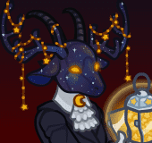
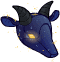
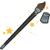
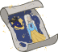

[Back to Main](index.md)

    
        Portait
    
    
        Model
    

# Jang Sao

Jang Sao, a celestial voyager, traveled the Astral Planes for centuries collecting stars and painting galaxies with her cherished companion, Kwin. When Kwin departed, Jang Sao carried on her wishes of painting the cosmos. Now a wonderful artist, she immortalizes the heavens, reality, and most important of all, her friend.

# Basic Information

Jang Sao will be the new champion in the Feast of the Moon event on 8 November 2023.

    
        
            **Seat**:
        
        
            8
        
        
            **Stat**
        
        
            **Value**
        
        
            **Day 1 Trials**
        
        
            **Patrons**
        
    
    
        
            **Race**:
        
        
            Satyr
        
        
            **Strength**:
        
        
            8
        
        
            -
        
        
            -
        
    
    
        
            **Class**:
        
        
            Druid / Wizard
        
        
            **Dexterity**:
        
        
            15
        
        
            Yes
        
        
            -
        
    
    
        
            **Roles**:
        
        
            Support / Healing
        
        
            **Constitution**:
        
        
            10
        
        
            -
        
        
            Strahd
        
    
    
        
            **Age**:
        
        
            888
        
        
            **Intelligence**:
        
        
            14
        
        
            Yes
        
        
            -
        
    
    
        
            **Gender**:
        
        
            Female
        
        
            **Wisdom**:
        
        
            20
        
        
            Yes
        
        
            &nbsp;
        
    
    
        
            **Alignment**:
        
        
            Neutral
        
        
            **Charisma**:
        
        
            10
        
        
            -
        
        
            &nbsp;
        
    
    
        
            **Affiliation**:
        
        
            -
        
        
            **Total**:
        
        
            77
        
        
            Champion ID:
        
        
            140
        
    

# Formation

    

# Abilities

 **Base Attack: Star** (Ranged)
> Jang Sao throws a star at the nearest enemy.  
> Cooldown: 4.5s (Cap 1.125s)

<em>Raw Data</em>

<pre>
{
    "description": "Jang Sao throws a star at the nearest enemy.",
    "long_description": "",
    "damage_modifier": 1,
    "damage_types": ["ranged"],
    "graphic_id": 0,
    "target": "front",
    "aoe_radius": 0,
    "tags": ["ranged"],
    "num_targets": 1,
    "animations": [{
        "projectile_details": {
            "trail": {
                "scale_lerp": [{
                    "x": 1.5,
                    "y": 1.5
                }],
                "lifespan": 0.3,
                "initial_velocity": {
                    "x": 0,
                    "y": 0
                },
                "alpha_lerp": {
                    "0": 0,
                    "1": 0,
                    "0.1": 0.75
                },
                "particle_graphic_ids": [21159],
                "spawn_rate": 100,
                "velocity_jitter": {
                    "x": 50,
                    "y": 50
                }
            },
            "percent_height_offset": 5,
            "projectile_graphic_id": 21158,
            "projectile_speed": 1300,
            "hash": "f99a3085668ee6718a56877a085d85f6",
            "rotation_speed": 180
        },
        "hit_sound": 133,
        "shoot_offset_x": -25,
        "shoot_sound": 149,
        "type": "ranged_attack",
        "projectile": "pd_generic_projectile",
        "shoot_frame": 20
    }],
    "name": "Star",
    "cooldown": 4.5,
    "id": 698
}
</pre>

 **Ultimate Attack: Starry Form** (Level: 35)
> Jang Sao transforms into her starry form for 15 seconds and fires shooting stars at her enemies, making them take 100% additional damage for the duration.  
> Cooldown: 180s (Cap 45s)

<em>Raw Data</em>

<pre>
{
    "description": "Jang Sao transforms and shooting stars make her foes take more damage.",
    "long_description": "Jang Sao transforms into her starry form for 15 seconds and fires shooting stars at her enemies, making them take 100% additional damage for the duration.",
    "damage_modifier": 0.03,
    "damage_types": ["magic"],
    "graphic_id": 21208,
    "target": "random",
    "aoe_radius": 100,
    "tags": [
        "ranged",
        "ultimate"
    ],
    "num_targets": 1,
    "animations": [{
        "ultimate": "jang_sao",
        "type": "ultimate_attack"
    }],
    "name": "Starry Form",
    "cooldown": 180,
    "id": 699
}
</pre>

 **The Mysterious Wanderer** (Level: 5)
> Jang Sao increases the damage of all Champions in formation slots with 2 or fewer adjacent slots by 400%.

<em>Upgrade Data</em>

<pre>
Upgrades:
       40: 100%

    Total Upgrade Bonus: 100%
</pre>

<em>Raw Data</em>

<pre>
{
    "static_dps_mult": null,
    "required_level": 5,
    "effect": "effect_def,1733",
    "tip_text": "Jang Sao increases the damage of all Champions in formation slots with 2 or fewer adjacent slots.",
    "name": "The Mysterious Wanderer",
    "id": 13257,
    "hero_id": 140,
    "upgrade_type": "unlock_ability",
    "default_enabled": 1,
    "required_upgrade_id": 0
}
{
    "effect_keys": [{
        "off_when_benched": true,
        "max_adj": 2,
        "effect_string": "hero_dps_multiplier_mult,400",
        "targets": [{
            "if_expr": "num_adj_slots<=max_adj",
            "max_adj": 2,
            "type": "slot_if_expr"
        }]
    }],
    "requirements": "",
    "description": {"desc": "Jang Sao increases the damage of all Champions in formation slots with $max_adj or fewer adjacent slots by $(amount)%."},
    "id": 1733,
    "flavour_text": "",
    "graphic_id": 21198,
    "properties": {
        "is_formation_ability": true,
        "owner_use_outgoing_description": true
    }
}
</pre>

 **Star Collector** (Level: 10)
> Each time an enemy is defeated, there is a 1% chance it drops a star. Jang Sao collects these stars and increases the effect of The Mysterious Wanderer by 0.1% for each star collected over all adventures, stacking additively. Caps at 4000000000 stacks.

<em>Upgrade Data</em>

<pre>
Upgrades:
       50: 100%

    Total Upgrade Bonus: 100%
</pre>

<em>Raw Data</em>

<pre>
{
    "static_dps_mult": null,
    "required_level": 10,
    "effect": "effect_def,1734",
    "tip_text": "Jang Sao has a slim chance of collecting a star each time a monster is defeated, permanently increasing her damage buff.",
    "name": "Star Collector",
    "id": 13258,
    "hero_id": 140,
    "upgrade_type": "unlock_ability",
    "default_enabled": 1,
    "required_upgrade_id": 0
}
{
    "effect_keys": [
        {
            "stack_title": "Total Stars",
            "stacks_multiply": false,
            "show_bonus": true,
            "effect_string": "buff_upgrade,0.1,13257",
            "desc_forced_order": 1,
            "max_stacks": 4000000000,
            "stacks_on_trigger": "on_broadcast_stacks,jangsao_star_trigger"
        },
        {
            "off_when_benched": true,
            "effect_string": "jangsao_star_collector,1"
        },
        {
            "is_instanced_stat": false,
            "use_stat_defs": true,
            "effect_string": "stacks_data_binder_safe,0,jangsao_star_collector_stacks"
        },
        {
            "stack_title": "Stars gained this adventure",
            "effect_string": "do_nothing",
            "desc_forced_order": 0,
            "show_stacks": true,
            "stacks_on_trigger": "on_broadcast_stacks,jangsao_star_trigger"
        },
        {
            "is_instanced_stat": true,
            "use_stat_defs": true,
            "effect_string": "stacks_data_binder_safe,3,jangsao_star_collector_stacks_this_run"
        }
    ],
    "requirements": "",
    "description": {"desc": "Each time an enemy is defeated, there is a $(amount___2)% chance it drops a star. Jang Sao collects these stars and increases the effect of The Mysterious Wanderer by $(not_buffed amount)% for each star collected over all adventures, stacking additively. Caps at $max_stacks stacks."},
    "id": 1734,
    "flavour_text": "",
    "graphic_id": 21196,
    "properties": {
        "indexed_effect_properties": true,
        "is_formation_ability": true,
        "default_bonus_index": 0,
        "owner_use_outgoing_description": true,
        "per_effect_index_bonuses": true
    }
}
</pre>

 **Stellar Nursery** (Level: 15)
> Every 5 seconds, Jang Sao heals the 2 most damaged Champions in the formation for 50 health.

<em>Upgrade Data</em>

<pre>
Upgrades:
       55: 100%

    Total Upgrade Bonus: 100%
</pre>

<em>Raw Data</em>

<pre>
{
    "static_dps_mult": null,
    "required_level": 15,
    "effect": "effect_def,1735",
    "name": "Stellar Nursery",
    "id": 13259,
    "hero_id": 140,
    "upgrade_type": "unlock_ability",
    "default_enabled": 1,
    "required_upgrade_id": 0
}
{
    "effect_keys": [
        {
            "effect_string": "jangsao_stellar_nursery,50",
            "tick_rate": 5
        },
        {"effect_string": "jangsao_stellar_nursery_target_count,2"}
    ],
    "requirements": "",
    "description": {"desc": "Every $(tick_rate) seconds, Jang Sao heals the $(jangsao_stellar_nursery_target_count) most damaged Champions in the formation for $(amount) health."},
    "id": 1735,
    "flavour_text": "",
    "graphic_id": 21197,
    "properties": {
        "indexed_effect_properties": true,
        "is_formation_ability": true,
        "default_bonus_index": 0,
        "owner_use_outgoing_description": true,
        "per_effect_index_bonuses": true
    }
}
</pre>

 **Painter of Beauty** (Level: 20)
> For every Pigment assigned to equipment on Champions in the formation, the effect of The Mysterious Wanderer is increased by 100%, stacking multiplicatively. Pigments can be purchased in the Thayan Enclave Shop and sometimes claimed as Season Rewards.

<em>Upgrade Data</em>

<pre>
Upgrades:
       60: 100%

    Total Upgrade Bonus: 100%
</pre>

<em>Raw Data</em>

<pre>
{
    "static_dps_mult": null,
    "required_level": 20,
    "effect": "effect_def,1736",
    "name": "Painter of Beauty",
    "id": 13260,
    "hero_id": 140,
    "upgrade_type": "unlock_ability",
    "default_enabled": 1,
    "required_upgrade_id": 0
}
{
    "effect_keys": [{
        "stack_title": "Total Pigments",
        "amount_updated_listeners": [
            "slot_changed",
            "loot_changed"
        ],
        "stacks_multiply": true,
        "show_bonus": true,
        "amount_func": "mult",
        "stack_func": "per_hero_attribute",
        "per_hero_expr": "num_applied_pigments",
        "effect_string": "buff_upgrade,100,13257"
    }],
    "requirements": "",
    "description": {"desc": "For every Pigment assigned to equipment on Champions in the formation, the effect of The Mysterious Wanderer is increased by $(not_buffed amount)%, stacking multiplicatively. Pigments can be purchased in the Thayan Enclave Shop and sometimes claimed as Season Rewards."},
    "id": 1736,
    "flavour_text": "",
    "graphic_id": 21195,
    "properties": {
        "is_formation_ability": true,
        "owner_use_outgoing_description": true
    }
}
</pre>

# Specialisations

 **Speed of Shooting Stars** (Level: 25)
> Jang Sao increases the effect of The Mysterious Wanderer by 100% for each Champion in the formation with a Dexterity of 15+, stacking multiplicatively.

<em>Upgrade Data</em>

<pre>
Upgrades:
       65: 100%

    Total Upgrade Bonus: 100%
</pre>

ⓘ *Note: This ability might be prestack.*

<em>Raw Data</em>

<pre>
{
    "static_dps_mult": null,
    "specialization_name": "Speed of Shooting Stars",
    "required_level": 25,
    "effect": "effect_def,1738",
    "name": "Speed of Shooting Stars",
    "specialization_graphic_id": 21205,
    "id": 13262,
    "hero_id": 140,
    "upgrade_type": "unlock_ability",
    "default_enabled": 1,
    "required_upgrade_id": 0,
    "specialization_description": "Jang Sao prefers the company of those that are quick."
}
{
    "effect_keys": [
        {"effect_string": "pre_stack_amount,100"},
        {
            "amount_expr": "upgrade_amount(13262,0)",
            "amount_updated_listeners": [
                "slot_changed",
                "feat_changed"
            ],
            "stacks_multiply": true,
            "off_when_benched": true,
            "show_bonus": true,
            "amount_func": "mult",
            "stack_func": "per_hero_attribute",
            "min_stat_amount": 15,
            "per_hero_expr": "clamp(dex+1-min_stat_amount,0,1)",
            "effect_string": "buff_upgrade,0,13257"
        }
    ],
    "requirements": "",
    "description": {"desc": "Jang Sao increases the effect of The Mysterious Wanderer by $(not_buffed amount)% for each Champion in the formation with a Dexterity of $(min_stat_amount___2)+, stacking multiplicatively."},
    "id": 1738,
    "flavour_text": "",
    "graphic_id": 0,
    "properties": {
        "indexed_effect_properties": true,
        "is_formation_ability": true,
        "spec_option_post_apply_info": "High Dexterity Champions: $num_stacks___2",
        "default_bonus_index": 0,
        "owner_use_outgoing_description": true,
        "type": "upgrade",
        "formation_circle_icon": false,
        "per_effect_index_bonuses": true
    }
}
</pre>

 **Wisdom of the Ages** (Level: 25)
> Jang Sao increases the effect of The Mysterious Wanderer by 100% for each Champion in the formation with a Wisdom of 13+, stacking multiplicatively.

<em>Upgrade Data</em>

<pre>
Upgrades:
       65: 100%

    Total Upgrade Bonus: 100%
</pre>

ⓘ *Note: This ability might be prestack.*

<em>Raw Data</em>

<pre>
{
    "static_dps_mult": null,
    "specialization_name": "Wisdom of the Ages",
    "required_level": 25,
    "effect": "effect_def,1737",
    "name": "Wisdom of the Ages",
    "specialization_graphic_id": 21207,
    "id": 13261,
    "hero_id": 140,
    "upgrade_type": "unlock_ability",
    "default_enabled": 1,
    "required_upgrade_id": 0,
    "specialization_description": "Jang Sao prefers the company of those that are wise."
}
{
    "effect_keys": [
        {"effect_string": "pre_stack_amount,100"},
        {
            "amount_expr": "upgrade_amount(13261,0)",
            "amount_updated_listeners": [
                "slot_changed",
                "feat_changed"
            ],
            "stacks_multiply": true,
            "off_when_benched": true,
            "show_bonus": true,
            "amount_func": "mult",
            "stack_func": "per_hero_attribute",
            "min_stat_amount": 13,
            "per_hero_expr": "clamp(wis+1-min_stat_amount,0,1)",
            "effect_string": "buff_upgrade,0,13257"
        }
    ],
    "requirements": "",
    "description": {"desc": "Jang Sao increases the effect of The Mysterious Wanderer by $(not_buffed amount)% for each Champion in the formation with a Wisdom of $(min_stat_amount___2)+, stacking multiplicatively."},
    "id": 1737,
    "flavour_text": "",
    "graphic_id": 0,
    "properties": {
        "indexed_effect_properties": true,
        "is_formation_ability": true,
        "spec_option_post_apply_info": "High Wisdom Champions: $num_stacks___2",
        "default_bonus_index": 0,
        "owner_use_outgoing_description": true,
        "type": "upgrade",
        "formation_circle_icon": false,
        "per_effect_index_bonuses": true
    }
}
</pre>

 **Moon Collector** (Level: 30)
> In addition to collecting stars, Jang Sao collects moons. Each time an enemy is defeated, there is a 0.5% chance it drops a moon. Jang Sao collects these moons for the purpose of Star Collector, and they count as 5 stars.

<em>Raw Data</em>

<pre>
{
    "static_dps_mult": null,
    "specialization_name": "Moon Collector",
    "required_level": 30,
    "effect": "effect_def,1739",
    "name": "Moon Collector",
    "specialization_graphic_id": 21203,
    "id": 13263,
    "hero_id": 140,
    "upgrade_type": "unlock_ability",
    "default_enabled": 1,
    "required_upgrade_id": 0,
    "specialization_description": "Jang Sao increases the chance of finding astronomical beauty by seeking out moons in addition to stars."
}
{
    "effect_keys": [{
        "goober_graphic_id": 21156,
        "off_when_benched": true,
        "goober_name": "Projectile_JangSao_Moon",
        "broadcast_trigger_count": 5,
        "effect_string": "jangsao_moon_collector,0.5",
        "goober_graphic_id_large": 21156
    }],
    "requirements": "",
    "description": {"desc": "In addition to collecting stars, Jang Sao collects moons. Each time an enemy is defeated, there is a $(amount)% chance it drops a moon. Jang Sao collects these moons for the purpose of Star Collector, and they count as $(broadcast_trigger_count) stars."},
    "id": 1739,
    "flavour_text": "",
    "graphic_id": 0,
    "properties": {
        "is_formation_ability": true,
        "owner_use_outgoing_description": true,
        "formation_circle_icon": false
    }
}
</pre>

 **Night Runner** (Level: 30)
> Jang Sao increases the effect of Star Collector by a percentage equal to the number of stars she has collected on the current run.

<em>Raw Data</em>

<pre>
{
    "static_dps_mult": null,
    "specialization_name": "Night Runner",
    "required_level": 30,
    "effect": "effect_def,1741",
    "name": "Night Runner",
    "specialization_graphic_id": 21204,
    "id": 13265,
    "hero_id": 140,
    "upgrade_type": "unlock_ability",
    "default_enabled": 1,
    "required_upgrade_id": 0,
    "specialization_description": "Jang Sao increases her support abilities by the number of stars she has collected in the current adventure."
}
{
    "effect_keys": [{
        "stack_title": "Stars gained this adventure",
        "stat": "jangsao_star_collector_stacks_this_run",
        "show_bonus": true,
        "amount_func": "add",
        "instance_stat": true,
        "stack_func": "get_stat",
        "effect_string": "buff_upgrade,1,13258"
    }],
    "requirements": "",
    "description": {"desc": "Jang Sao increases the effect of Star Collector by a percentage equal to the number of stars she has collected on the current run."},
    "id": 1741,
    "flavour_text": "",
    "graphic_id": 0,
    "properties": {
        "is_formation_ability": true,
        "spec_option_post_apply_info": "Stars collected: $num_stacks",
        "owner_use_outgoing_description": true,
        "formation_circle_icon": false
    }
}
</pre>

 **Star Caller** (Level: 30)
> Jang Sao fires 3 more stars from her lantern when she uses her Starry Form ultimate and the ultimate's damage debuff is multiplied by the number of stars fired, stacking additively.

<em>Raw Data</em>

<pre>
{
    "static_dps_mult": null,
    "specialization_name": "Star Caller",
    "required_level": 30,
    "effect": "effect_def,1740",
    "name": "Star Caller",
    "specialization_graphic_id": 21206,
    "id": 13264,
    "hero_id": 140,
    "upgrade_type": "unlock_ability",
    "default_enabled": 1,
    "required_upgrade_id": 0,
    "specialization_description": "Jang Sao increases the number of stars she launches when using her ultimate."
}
{
    "effect_keys": [{"effect_string": "jangsao_star_caller,3"}],
    "requirements": "",
    "description": {"desc": "Jang Sao fires $(amount) more stars from her lantern when she uses her Starry Form ultimate and the ultimate's damage debuff is multiplied by the number of stars fired, stacking additively."},
    "id": 1740,
    "flavour_text": "",
    "graphic_id": 0,
    "properties": {
        "is_formation_ability": true,
        "owner_use_outgoing_description": true,
        "formation_circle_icon": false
    }
}
</pre>

# Items

    
        
            **Icons**
        
        
            **Slot**
        
        
            **Epic Name**
        
        
            **Effect**
        
    
    
        
            &nbsp;
        
        
            1
        
        
            Adornment of the Cosmos
        
        
            The Mysterious Wanderer
        
    
    
        
            
        
        
            2
        
        
            Nebula of Dreams
        
        
            Star Collector
        
    
    
        
            
        
        
            3
        
        
            Celestial Orrery
        
        
            Stellar Nursery
        
    
    
        
            
        
        
            4
        
        
            Marvelous Pigments
        
        
            Painter of Beauty
        
    
    
        
            
        
        
            5
        
        
            Lunation
        
        
            All First Specialisations
        
    
    
        
            
        
        
            6
        
        
            Night Scatterer
        
        
            Ultimate Cooldown Reduction Cap: 501 dull / 251 shiny / 126 golden.
        
    

<em>Item Names and Descriptions</em>

<pre>
Slot 1:
      Dawning Existence: I exist for a purpose I do not fully understand yet.
          Cosmic Effigy: This is not just of the cosmos. It is the cosmos.
         Exquisite Mask: Some say the tinkling of my star chains can be heard across the
                         planes.
Adornment of the Cosmos: I understand now. I am ready.

Slot 2:
             Nightlight: If only Kwin were here.
               Starlock: The stars will guide you...
          A Divine Gift: The fuller the lamp gets, the farther hope spreads.
       Nebula of Dreams: I will never lose my way with this, and neither shall others.

Slot 3:
       Path to Creation: We did not go where we simply wanted to. But where we needed to.
            Star Mender: 'Of pathways and stars' is etched on the index.
         Star Navigator: I hope it leads me back to you.
       Celestial Orrery: Some art I display in frames. Most can only be displayed like this.

Slot 4:
     Tool of the Artist: From canvas to celestial void.
     Everpainting Brush: Never needing to be dipped, I can work for as long as it takes.
     Cosmological Brush: Plucked from the void itself and given form by the astral plane.
     Marvelous Pigments: From simple flowers on a canvas to light-giving stars in the night
                         sky.

Slot 5:
   Sketches Out of Time: The paint still looks fresh.
       Entwined Eclipse: The Moon whispered to the Star...
          Star Freckles: This means something. One day, I will understand it.
               Lunation: All of time and space, within your imagination

Slot 6:
               Everdust: I've dreamt of moons and stars for as long as I've existed.
              Star Drop: Fragile but mighty.
         Gorgeous Giant: In another life, this could have been a star. But its beauty is still
                         unmatched.
        Night Scatterer: By Kwin's grace.
</pre>

# Feats

This list will only show feats that are going to be available on the release of this champion. The separate [Feats](feats.md) page may show others that could be available later if they exist.

    
        
            **Feat**
        
        
            **Effect**
        
        
            **Source**
        
    
    
        
            Selflessness
        
        
            10% All Champion Damage
        
        
            Free
        
    
    
        
            Inspiring Leader
        
        
            25% All Champion Damage
        
        
            Gold Chest
        
    
    
        
            The Astral Path
        
        
            20% The Mysterious Wanderer
        
        
            Free
        
    
    
        
            Pathway to the Stars
        
        
            40% The Mysterious Wanderer
        
        
            12,500 Gems
        
    
    
        
            The Greater Journey
        
        
            The Mysterious Wanderer 2->3 Slots
        
        
            50,000 Gems
        
    
    
        
            Mystra's Star Circle
        
        
            20% Star Collector
        
        
            Free
        
    
    
        
            Amaunator's Belt
        
        
            40% Star Collector
        
        
            Gold Chest
        
    
    
        
            Purple Worm Nebula
        
        
            20% Stellar Nursery
        
        
            Free
        
    
    
        
            Dragon Nebula
        
        
            40% Stellar Nursery
        
        
            Gold Chest
        
    
    
        
            Fresh Paint
        
        
            40% Painter of Beauty
        
        
            12,500 Gems
        
    
    
        
            Time and Space
        
        
            40% All First Specialisations
        
        
            Gold Chest
        
    
    
        
            Emerging Artist
        
        
            40% All Champion Damage per Pigment on Jang Sao (Additive)
        
        
            12,500 Gems
        
    

# Legendaries

* Increases the damage of all Champions by 100%.
* Increases the damage of all Male Champions by 125%.
* Increases the damage of all Champions by 100%.
* Increases the damage of all Champions with a WIS score of 13 or higher by 150%.
* Increases the damage of all Champions with a DEX score of 15 or higher by 200%.
* Increases the damage of all Ranged Champions by 150%.

<em>DPS Applicable</em>

<pre>
     Arkhan: 3 / 6
    Artemis: 5 / 6
    Asharra: 3 / 6
      Azaka: 2 / 6
     Binwin: 3 / 6
   Birdsong: 3 / 6
Black Viper: 3 / 6
 Catti-brie: 4 / 6
     D'hani: 4 / 6
    Dhadius: 3 / 6
     Drizzt: 5 / 6
    Farideh: 3 / 6
        Fen: 2 / 6
     Gromma: 3 / 6
       Ishi: 4 / 6
    Jaheira: 3 / 6
    Jamilah: 3 / 6
   Jarlaxle: 4 / 6
        Jim: 3 / 6
       Kent: 4 / 6
      Krond: 4 / 6
       Krux: 4 / 6
    Lae'zel: 2 / 6
     Lucius: 4 / 6
      Makos: 3 / 6
      Minsc: 3 / 6
      NERDS: 2 / 6
     Nahara: 4 / 6
      Nixie: 2 / 6
     Orisha: 3 / 6
   Prudence: 2 / 6
      Rosie: 4 / 6
      Strix: 2 / 6
    Torogar: 4 / 6
     Warden: 3 / 6
     Yorven: 4 / 6
      Zorbu: 6 / 6
</pre>

<em>Non-DPS Applicable</em>

<pre>
          Aila: 4 / 6
       Alyndra: 3 / 6
       Antrius: 3 / 6
      Astarion: 6 / 6
         Avren: 4 / 6
          BBEG: 4 / 6
       Baeloth: 3 / 6
      Barrowin: 3 / 6
       Blooshi: 2 / 6
          Brig: 5 / 6
          Briv: 3 / 6
       Bruenor: 4 / 6
      Calliope: 3 / 6
       Celeste: 3 / 6
     Certainty: 3 / 6
        Deekin: 4 / 6
       Desmond: 4 / 6
           Dob: 5 / 6
        Donaar: 3 / 6
    Dragonbait: 4 / 6
Dungeon Master: 5 / 6
        Egbert: 4 / 6
      Ellywick: 3 / 6
       Evandra: 2 / 6
        Evelyn: 2 / 6
     Ezmerelda: 3 / 6
        Freely: 4 / 6
       Gazrick: 4 / 6
       Havilar: 3 / 6
         Imoen: 4 / 6
      Jang Sao: 5 / 6
      K'thriss: 4 / 6
         Korth: 5 / 6
         Krull: 4 / 6
        Krydle: 4 / 6
       Lazaapz: 3 / 6
         Mehen: 3 / 6
          Melf: 4 / 6
      Merilwen: 4 / 6
         Miria: 4 / 6
        Môrgæn: 5 / 6
        Nayeli: 2 / 6
         Nerys: 3 / 6
        Nordom: 4 / 6
          Nova: 3 / 6
          Omin: 4 / 6
        Orkira: 3 / 6
       Paultin: 5 / 6
      Penelope: 4 / 6
         Pwent: 3 / 6
        Qillek: 5 / 6
         Regis: 4 / 6
          Reya: 2 / 6
          Rust: 4 / 6
        Selise: 3 / 6
        Sentry: 3 / 6
     Sgt. Knox: 3 / 6
         Shaka: 5 / 6
       Shandie: 4 / 6
      Sisaspia: 3 / 6
        Solaak: 6 / 6
         Spurt: 5 / 6
         Stoki: 4 / 6
   Strongheart: 4 / 6
         Talin: 5 / 6
      Thellora: 2 / 6
        Turiel: 4 / 6
         Tyril: 5 / 6
       Ulkoria: 3 / 6
         Uriah: 4 / 6
     Valentine: 3 / 6
            Vi: 4 / 6
       Viconia: 5 / 6
      Vin Ursa: 5 / 6
        Virgil: 3 / 6
      Voronika: 4 / 6
        Widdle: 3 / 6
       Wulfgar: 3 / 6
        Xander: 5 / 6
      Xerophon: 4 / 6
</pre>

 

# Other Champion Images

    
        
            Console Portait
        
    
    
        
            Gold Chest Icon
        
        
            Silver Chest Icon
        
    

[Back to Top](#top)

*Last Modified: {{ site.time }}*